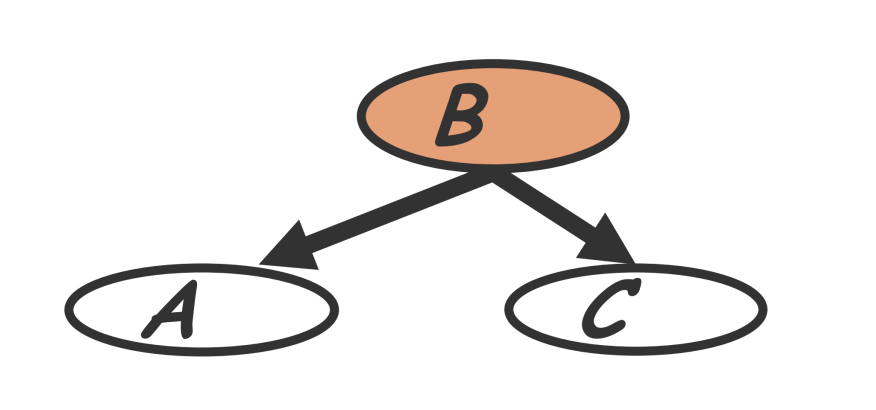
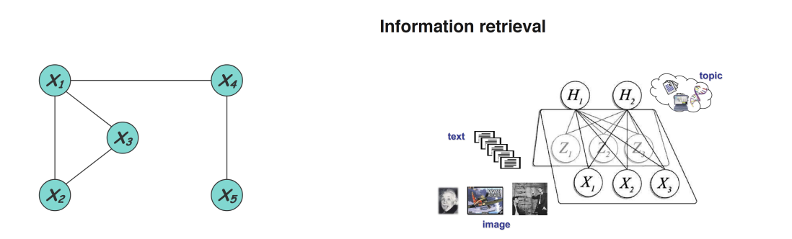
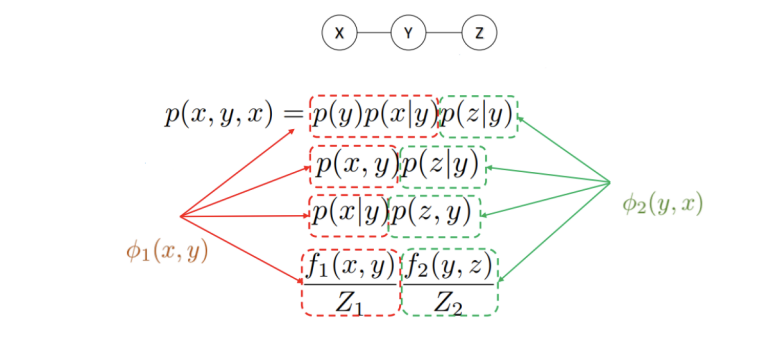
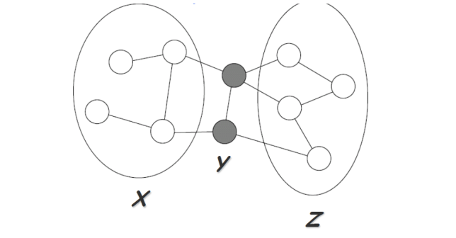

# CMU10-708PGM03：Directed Graph Model

> CMU10-708的Lecture2和3，主要内容是介绍概率图模型中的有向图模型Directed Graph Model和无向图模型Undirected Graph Model

## 有向概率图模型(DGM)

### 定义

有向概率图模型是一种概率图模型，也叫做**贝叶斯网络(Bayesian Networks)**，在有向概率图模型(后面都用DGM来指代)中，图的结点代表随机变量，并使用有向的边进行连接，边表示结点之间的条件和因果关系(比如A会导致B的发生)

- 上面这个图就是一个有向概率图模型，通过有向概率图，我们可以将8个事件X全部发生的概率表示成一系列条件概率的乘积

### 一些例子

专家系统(Expert System)就是一种比较经典的DGM，专家系统将领域内的专家知识表示成了一系列图中的结点和边，并且可以用这些专家知识进行推理。下图是一个ALARM药学知识专家系统

- 实际上知识图谱是一种现代化的专家系统，依然属于符号学派对于人工智能的尝试

## 贝叶斯网络(Bayesian Network)

事实上贝叶斯网络的定义似乎比DGM**更加严格**，一般来说贝叶斯网络是指结点表示随机变量而边表示两个随机变量之间的有向影响的概率图模型，贝叶斯网络提供了一种系统的**描述联合概率分布的框架**，实际上是将一个复杂的联合分布分解成了一系列条件独立的假设(即网络中的各条边)

我们可以将概率图看成是一个生成采样过程，并且图中的每个变量都是根据只依赖于它的父结点的条件概率分布生成的，也就是说每个变量都是其父变量的随机函数

### 贝叶斯网络的分解

一个贝叶斯网络(也即无向图模型)往往可以用一下形式表示：
$$
P(\mathbf{X})=\prod_{i=1}^{d} P\left(X_{i} \mid \mathbf{X}_{\pi_{i}}\right)
$$
这里的$$X_{\pi_i}$$表示结点i的父节点构成的集合，并且可以是空集，这种表示方式用条件概率的等价转换很容易可以推算出，实际上就是将联合概率分布转化成了一系列条件概率分布的乘积。

### 局部结构和独立性

判断变量的条件独立性是有向图模型中需要解决的一个大问题，比如给定三个随机变量ABC，如果在A给定的情况下，BC是互相独立的，那么就称BC相对于A条件独立。判断条件独立的方法很多，具体的可以看概率论相关的内容。我们首先来介绍几种有向图模型中常见的条件独立的局部结构。

#### 共同父节点

如果A和C结点有共同的父节点B，那么在给定B的条件下A和C是独立的，也叫做B**解耦**了A和C，即：
$$
P(A,C|B)=P(A|B)P(C|B)
$$

#### 级联性

实际上就是一个链状的结构，条件概率不断向下传递：
$$
P(A,B,C)=P(A)P(B|A)P(C|B)
$$

#### V型结构

一个结点有多个

$$
P(A, B) = P(A)P(B)P(A, B|C)
$$

### 条件独立的解释与贝叶斯球算法

#### 条件独立的解释

Jordan的书《Introduce to PGM》中将有向图模型对条件独立的表示解释为图中的边的存在性，这本书上认为，一个有向图模型中，如果图中的两个随机变量代表的点之间**有边将其连接**，那么就说明它们之间不是互相独立的(这里的边可以是一条路径，不一定是相邻节点之间相连的边)，如果不存在，那么就说明这两个随机变量是互相独立的。

同时，条件独立判断的时候，给定的随机变量可以认为是将图中的变量所代表的点和对应的边删除了，然后再看要判断的变量是不是独立，上面说的几种条件独立的基本结构其实都可以通过这种方式进行判断。

这就是概率图模型的神奇之处，它将概率论(条件独立性)和图论中的点、边等东西结合到了一起。

#### 贝叶斯球算法

这本书中还讲到了一种判断条件独立的算法，称为贝叶斯球Beyasian Ball，这个算法实际上就是对上面这种解释的具体实现。书中将这个算法口述为：如果我们要判断BC是否关于A条件独立，那么我们就假设有一个球从B出发，并且沿着概率图模型中的边进行滚动，如果这个球的所有路线中，有能够滚到C点的，那么就说明BC不是条件独立的，而给定A则代表将图中的A点进行block，即这个点不能通过。这个算法就可以用来判断变量的条件独立性。

## 无向图模型 (UGM)

### 基本概念

概率图模型可以分成有向图模型和无向图模型两种，这一节内容主要关注无向图模型的表示，在无向图模型中，图的结点表示各种各样的随机变量，而边则用来表示成对的关系，可以用$$P(X,\theta_G)$$来表示一个无向概率图模型，即变量X的概率分布被图G所确定。

而在计算机视觉和信息检索领域可以举出很多具体的概率图模型的例子，比如在物体识别的时候我们可以将判断物体的过程表示成一个根据概率推断的过程，并将图像分割成若干个网格(也叫做patch)，各个网格之间存在一定的关联，这就构成了一个无向图模型，而判断某个网格中的像素是不是某个物体，就要求出其条件概率分布。在信息检索领域，我们可以将文本和图像看成是概率图模型中的点，它们可能拥有共同的主题，这些主题也作为结点在图中表示，并且用边来表示待检索的文档/图片和主题之间的关系。

### 无向图模型的表示

一个无向图模型实际上就是在表示一个由图H定义的概率分布$$P(X_1,X_2,\dots, X_n)$$，这个概率分布可以被表示为一系列势能函数的组合：
$$
P\left(x_{1}, x_{1}, x_{2}, \ldots \ldots, x_{n}\right)=\frac{1}{Z} \prod_{c \in C} \Psi_{c}\left(X_{c}\right)
$$
并且：
$$
Z=\sum_{x_{1}, x_{2}, \ldots, x_{n}} \prod_{c \in C} \Psi_{c}\left(X_{c}\right)
$$
看到这里我也傻了，怎么突然抛出了一个莫名其妙的公式，而在结合《机器学习》和《统计学习方法》这两本书中的内容之后，我逐渐有点明白了这些公式的含义——事实上这个表示是根据图中的**极大团**得到的。

#### 团和极大团

团(Clique)和极大团(Maximal Clique)是图论中的两个概念，图论中把所有结点都互相连通的子图称为一个团，而如果一个团中不能再加入任何其他结点使其构成一个更大的团，那么这个团就是一个极大团。

而在概率图模型中，一个团意味着**团中的结点所代表的随机变量都是互相依赖**(不独立)的，可以将这个团看成一个整体来进行研究，同时需要定义合适的势能函数来表示概率分布，而Z起到标准化，保证所得的结果是一个概率分布，这样的表示方式也叫做**吉布斯分布**。

#### 如何解释无向图的极大团表示

团势能是预概率的、偶然性的函数，提供了恢复或指定对随机变量配置偏差的方法。在无向图模型中，一个联合分布可以被分解成一系列团的势能函数的乘积(可以是边际概率也可以是条件概率)，比如下面的这个图：

这里的联合概率都可以进行一定的分解从而得到一系列和团相关的势能函数，并且这个势能函数可以根据实际情况来决定。

#### 势能函数的选取

通常我们需要保证势能函数是严格正的，因此往往采用指数函数的形式：
$$
\Psi_{c}\left(X_{c}\right)=\exp(-E(X_c))
$$

这样一来势能函数求乘积的时候也可以转化成指数的和，比较方便(当然这还牵涉到玻尔兹曼机的概念，这里就不深入了解了)

### I-Map

I-Map提供了一套形式化的语言来表示一个概率无向图H和概率分布P的关系，首先我们用$$I(P)$$表示一个定义在X伤的概率分布P的所有形如$$X\perp Z|Y$$的依赖关系(其实就是条件独立依赖关系)构成的集合。

对于图H也有类似的定义$$I(H)$$，如果$$I(H)\subseteq I(P)$$，那么就称$$I(H)$$ 是$$I(P)$$的I-Map，这就表示一个无向概率图可以不包含P中所有的条件独立依赖关系。I-Map实际上提供了一套语言框架来说明概率图模型和复杂的概率分布是等价的，当然H也可以只是P的一个子集，当H和P完全等价的时候，就说H是P的一个完美I-Map

### UGM的性质

UGM表示的随机变量之间存在着成对马尔可夫性，局部马尔可夫性和全局马尔可夫性等多种性质，并且这三种性质是互相等价的。

#### 全局马尔可夫性

全局马尔可夫性Global Markov properties是指，假设一个无向图模型G中A和B两个部分被C所分割，那么A和B对应的随机变量组在给定C的随机变量组的情况下是独立的，即
$$
P(X_A,X_B|X_C)=P(X_A|X_C)P(X_B|X_C)
$$

这也可以表示成
$$
I(H)=\{(X \perp Z \mid Y): \mathrm{sep}(X ; Z \mid Y)\}
$$

#### 局部马尔可夫性

局部马尔可夫性是说，假设v是图中一个结点，W是和v响铃的所有节点构成的集合，O是剩余所有节点构成的集合，那么在给定W的条件下v和O对应的随机变量是互相独立的，即
$$
P(X_v,X_O|X_W)=P(X_v|X_W)P(X_O|X_W)\rightarrow P(X_v|X_W)=P(X_v|X_W,X_O)
$$
用I-Map的语言来表示也就是：
$$
I_{l}(H)=\left\{X_{i} \perp V-\left\{X_{i}\right\}-M B_{X_{i}} \mid M B_{X_{i}}: \forall i\right\}
$$
这里和MB指的是马尔可夫毯(Malkov Blanket)，这个概念实际上指的就是和X相邻的所有结点构成的集合。

