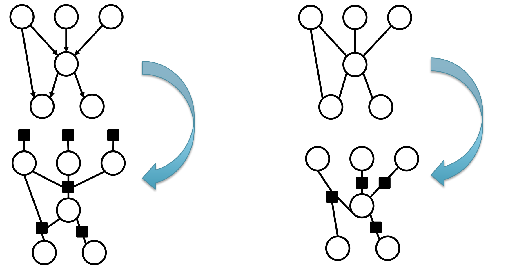
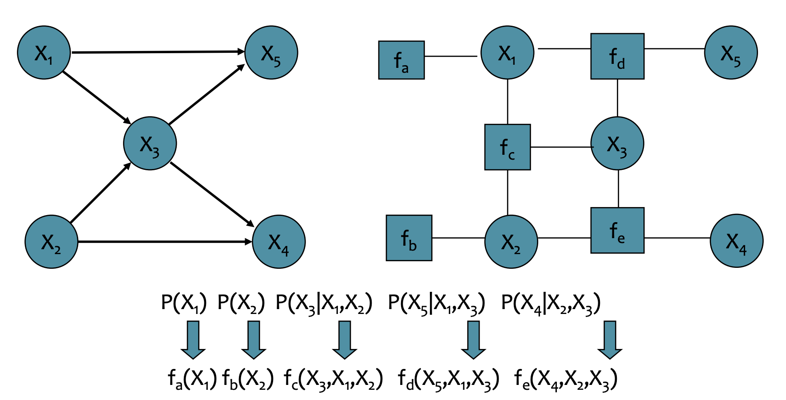
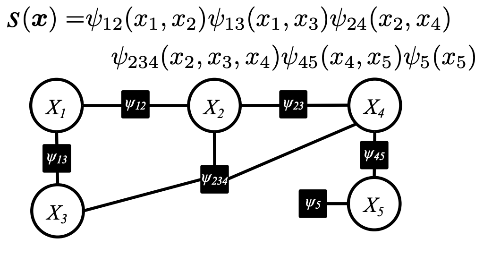
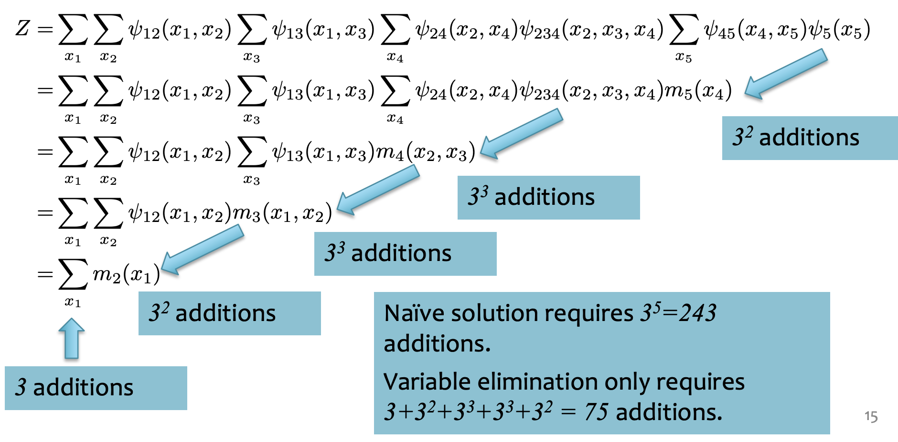
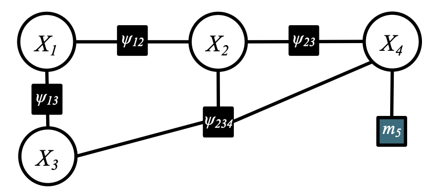
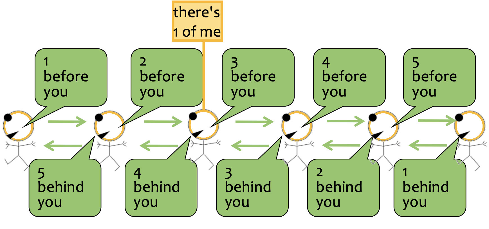
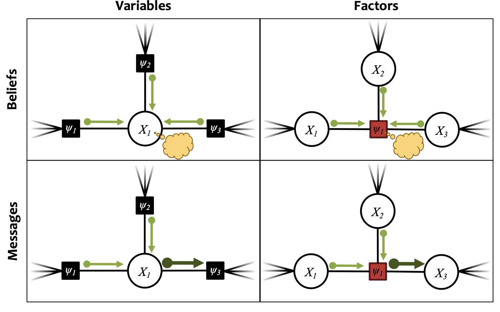

# CMU10-708PGM03：Exact Inference

> CMU10-708的Lecture3，主要内容是介绍概率图模型中的因子图和精确推理等内容

## 因子图Factor Graph

因子图提供了一种同时可以用来表示有向图模型和无向图模型的方法，它将概率图模型中不同变量之间的**联合分布转化成因子的势能函数之间的乘积**。它可以用在马尔可夫随机场(无向图模型)，条件随机场和贝叶斯网络(有向图模型)等多种不同的概率图中，非常General

因子图的生成方式如下图所示，对于有向图模型，我们可以将图模型中所有的联合概率分布转换成对应的因子，同时入度为0的节点(即不受其他点的概率分布的约束)还有自己对应的因子，因为这些节点自己就是一个边缘分布，而在**无向图模型**中，**所有的最大团**可以转换成一个对应的因子。

我们可以将一系列因子表示为$\psi_i$，最终整个图模型的联合概率分布可以被转化成：
$$
p(\boldsymbol{x})=\frac{1}{Z} \prod_{\alpha} \psi_{\alpha}\left(\boldsymbol{x}_{\boldsymbol{\alpha}}\right)
$$
这里的Z是归一系数。我们可以先通过一些例子来看因子图的转化。

例子1如下图所示，这是一个有向图模型，再转化成因子图之后，原本的联合分布中一定会出现的条件概率分布就可以转化成因子对应的势能函数

因子图的一个好处是可以把原本绕来绕去的图结构转化成了树形结构，无向图模型对应一个无向树(需要我们自己选择根节点)，而有向图模型对应一个有向树。有向树的联合分布可以进一步表示成：
$$
p(x)=p\left(x_{r}\right) \prod_{(i, j) \in E} p\left(x_{j} \mid x_{i}\right)
$$
而无向树模型的变量联合分布可以表示为：
$$
p(x)=\frac{1}{Z}\left(\prod_{i \in V} \psi\left(x_{i}\right) \prod_{(i, j) \in E} \psi\left(x_{i}, x_{j}\right)\right)
$$
这两种表示实际上是等价的，这也表明因子图可以将有向图模型和无向图模型转化成等价的形式，我们可以进一步用因子图来进行推理。

## MRF和CRF的区别

MRF是马尔可夫随机场，它就代表了一个变量y的概率分布，在因子图表示中，势能函数以及配分函数都是概率图模型参数的函数，即：
$$
p_{\boldsymbol{\theta}}(\mathbf{y})=\frac{1}{Z(\theta)} \prod_{\alpha} \psi_{\alpha}\left(\mathbf{y}_{\alpha} ; \theta\right)
$$
而条件随机场CRF是在MRF的基础上，增加一些**已经观测到的变量x**，这个时候，这些函数的参数不仅仅是模型参数本身，还包括了这些已经观测到的变量x
$$
p_{\boldsymbol{\theta}}(\mathbf{y} \mid \mathbf{x})=\frac{1}{Z(\mathbf{x} ; \theta)} \prod_{\alpha} \psi_{\alpha}\left(\mathbf{y}_{\alpha}, \mathbf{x} ; \theta\right)
$$

## Exact Inference

下面我们来考虑如何在概率图模型上进行Exact Inference，即精确地计算某个变量的概率分布情况。我们首先从最简单的方法开始。

### Naive Inference

我们用一个简单例子，如下图所示，概率图中一共有5个变量，我们要精确地计算某个变量的概率分布，就需要知道Partition Function(配分函数)的值，即上面说的Z函数。

我们在计算这个概率图模型的配分函数的时候，就需要计算：
$$
Z=\sum_{x_{1}} \sum_{x_{2}} \sum_{x_{3}} \sum_{x_{4}} \sum_{x_{5}} s(\boldsymbol{x})
$$
我们假设每个变量$x_i$有三种取值，分别是012，那么我们在计算Z的时候就需要进行$3^5$次计算，这种方法显然是非常Naive的，一旦变量的数量和取值范围变大，它的计算量会出现指数级增长。

### 变量消去法

变量消去法(Variable Elimination)是一种Exact Inference的简化算法，对于上面这个例子，使用变量消去法的计算过程如下：

我个人的理解是变量消去法是通过对Z的求和表达式进行变形，将每个变量对应的Factor进行组合，然后一边计算一边化简表达式的过程，比如上面这个例子中，变量消去法首先合并了$x_5$相关的因子，然后进行一次求和，把结果表示成$x_4$的因子，然后并入$x_4$中继续进行计算。这样一来，计算Z时候的重复计算就大量减少了。

实际上，变量消去对应到概率图中，就是将一个变量和与它有关的因子构成的子图，用一个新的因子来替换，比如上面的例子中，完成第一步$x_5$的消去之后，模型就会变成这样：

### 信任传播法

信任传播法(Belief Propagation)是另一种用在Exact Inference上的方法。它依赖一种被称为消息传递(Message Passing)的机制，消息传递机制可以用下面的图来表示：

我们发现，如果3号节点想要知道全局的信息，只需要通过24发送给他的消息，再加上自己就可以得出，即2+3+1=6，可以推测出一共有6个点，对于其他点来说，也是类似的。

概率图模型也上也可以进行更复杂的消息传播，比如下面这个例子：

在概率图模型中，消息传递的内容是变量/Factor的概率分布，如果一个变量X周围有几个因子，那么就可以把这几个Factor传递过来的消息的乘积作为X处的**belief**，这个过程叫做Sum-Product Belief Propagation

Belief和Message的区别在于，Belief是概率图中的一个点/因子聚合了周围所有传递过来的消息计算出的，而Message的计算过程中不包括目标节点，如下表所示：

变量的Belief可以表示为：
$$
b_{i}\left(x_{i}\right)=\prod_{\alpha \in \mathcal{N}(i)} \mu_{\alpha \rightarrow i}\left(x_{i}\right)
$$
变量的Message计算过程可以表示为：
$$
\mu_{i \rightarrow \alpha}\left(x_{i}\right)=\prod_{\alpha \in \mathcal{N}(i) \backslash \alpha} \mu_{\alpha \rightarrow i}\left(x_{i}\right)
$$
因子的Belief的计算过程可以表示为：
$$
b_{\alpha}\left(\boldsymbol{x}_{\boldsymbol{\alpha}}\right)=\psi_{\alpha}\left(\boldsymbol{x}_{\boldsymbol{\alpha}}\right) \prod_{i \in \mathcal{N}(\alpha)} \mu_{i \rightarrow \alpha}\left(\boldsymbol{x}_{\boldsymbol{\alpha}}[i]\right)
$$
因子的Message计算过程可以表示为：
$$
\mu_{\alpha \rightarrow i}\left(x_{i}\right)=\sum_{\boldsymbol{x}_{\boldsymbol{\alpha}}: \boldsymbol{x}_{\boldsymbol{\alpha}}[i]=x_{i}} \psi_{\alpha}\left(\boldsymbol{x}_{\boldsymbol{\alpha}}\right) \prod_{j \in \mathcal{N}(\alpha) \backslash i} \mu_{j \rightarrow \alpha}\left(\boldsymbol{x}_{\boldsymbol{\alpha}}[i]\right)
$$
信任传播机制中变量和因子的消息传递和信任计算的过程大概就是这样，我们在实际计算的时候，需要先选择一个根结点，然后不断进行双向的消息传递和信任计算，最后讲计算的信任进行归一化之后，就可以得到概率图中每个变量和因子的边缘概率分布(因为此时每个变量和因子都知道了其他变量的情况，所以可以计算出自己的边缘概率分布)

### 总结

变量消去和信任传播两种Exact Inference方法的总结如下：

| 方法     | 变量消去                                                     | 信任传播                                                     |
| -------- | ------------------------------------------------------------ | ------------------------------------------------------------ |
| 使用场景 | 计算任何概率图模型的配分函数Z，计算任何概率图模型中的一个变量的边缘概率分布 | 计算任何**无环**概率图模型的配分函数，对于一个无环概率图模型，可以一次性计算所有变量的边缘概率分布 |
| 使用限制 | 计算边缘概率的时候一次只能计算一个，消去的顺序会影响运行所需要的时间 | 只能用在无环图上面，消息传递的顺序会影响运行时间             |

