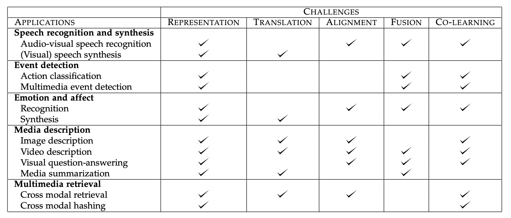
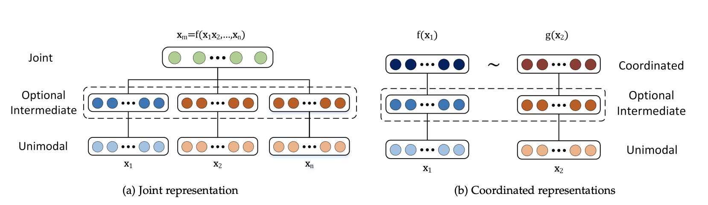
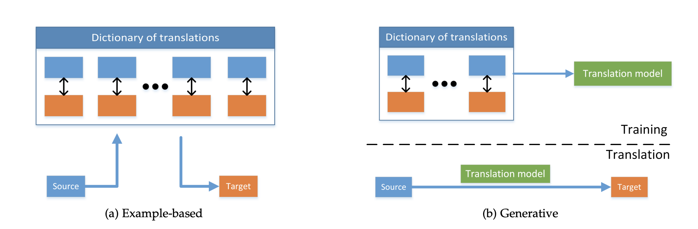
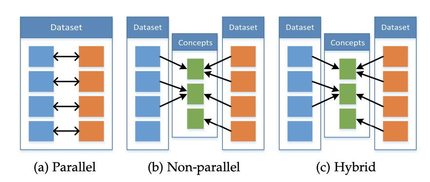

# CMU 11-877-AMML：Week1-Introduction  to Multi-modal Learning

> CMU的公开课程11-775《**A**dvanced **T**opics in **M**ulti**M**odal **M**achine **L**earning(AMML)》课程的学习笔记，这门课程以读各种各样的论文为主，没有什么平时作业。第一周主要阅读两篇综述论文，分别是表示学习的综述[《Representation Learning: A Review and New Perspectives》](https://arxiv.org/abs/1206.5538)和多模态机器学习的综述[《Multimodal Machine Learning: A Survey and Taxonomy》](https://arxiv.org/abs/1705.09406)，不过因为是综述，所以我没有特别仔细阅读，主要就是了解个大概。

## 表示学习Representation Learning

表示学习(Representation Learning)是机器学习领域的经典话题，它的目的是通过学习到的模型，将输入的数据转化成一个对应的表示(可以是向量，这种向量也叫做数据的嵌入Embedding)，这种方法在机器学习的很多领域都得到了比较广泛的应用。

这是因为机器学习模型实际上只能处理数值的运算，而模型的输入可能是图像、文本、语音、视频等各种形式的数据，模型是不能直接对这些数据进行计算的，我们需要将这些数据先转换成一个对应的表示，然后将这个数值化的表示输入到模型里面去计算，这样才能完成各种机器学习的任务，而将数据转化为表示的过程，也就是表示学习。

表示学习在计算机视觉，自然语言处理，语音处理等领域都有广泛的应用，它可以利用一些**先验知识来编码各种各样的数据**。大部分时候，我们都用一个向量来表示一条输入的数据，这个向量叫做表示向量，也可以叫做嵌入向量，常见的有词向量(Word Embeddings)，词向量就是根据单词在文本中的位置关系来对单词进行编码的，而不同的单词在不同的位置出现的情况就是一种先验的知识。这篇综述论文提出，一个好的表示学习方法学到的数据表示应该具有如下几个特征：

- 平滑性Smoothness，如果两个输入数据x和y非常相似，那么它们的表示也应该非常相似，比如两个图像描述的内容都是鲸鱼🐳，那么它们对应的表示比起鲸鱼和鲨鱼的表示应该更接近
- 多重解释因素：数据产生的分布是由不同的基本因素产生的，在大多数情况下，一个人对一个因素的了解可以在许多因素中得到推广
- 解释因素的分层组织：表示可以有层级化的架构，从具象逐渐变得抽象，并且较抽象的概念是由较不抽象的概念来定义的，比如在深度学习模型中，我们通常会将数据输入到一个非常深层次的网络架构中，实际上每一层网络都会计算出一个数据的表示，后一层的表示是根据前一层的表示计算出来的，也就是表示的表示，随着网络层级的加深，得到的表示会越来越抽象，但是仍然可以反应输入数据的某些性质。
- 不同的任务之间有可以共享的因素，即一个数据对应的表示中包含了某些在不同任务中都能起到一定作用的表示，这也是多任务学习，迁移学习和域适应能够成立的关键
- 流形分布Manifolds：数据的概率质量会集中在比原始空间维度小得多的区域附近(具体我也不懂)
- 自然聚类：不同类别的数据会在表示空间中呈现出聚类，即同一类的数据会比较接近，不同类对应的数据会远离
- 稀疏性：对于一个数据x，特征表示空间中只有很少一部分因素与之相关，对于表示来说，就是一个数据的表示大部分时候可能都接近于0

总之，表示学习非常重要，研究领域也非常多，不过这篇综述后面就不细看了，因为讲了不少东西和这门课程本身没有多大的关系，阅读这篇论文主要是引入表示学习这个概念。

## 多模态机器学习Multimodal Machine Learning

多模态机器学习(Multimodal Machine Learning)是机器学习研究中的一个热点，它主要有研究如何使用多种模态(Modal, 可以包括图像，文本，语音，视频等各种数据类型)来完成各种机器学习任务。论文中将多模态机器学习的**主要挑战**分成了五种类型，表示，映射，对齐，融合和共同学习，它们各自的特点如下：

| 任务类型 | 任务目标                                                     |
| -------- | ------------------------------------------------------------ |
| 表示     | 对异构的多模态数据进行表示，并用到具体的任务中               |
| 转化     | 学习如何将一个模态的数据映射到另一个模态                     |
| 对齐     | 对不同模态之间的信息进行直接判断，比如判断它们是不是指代的同一事物 |
| 融合     | 将不同模态的信息融合到一起，并作出预测或者生成               |
| 共同学习 | 对模态之间的知识进行迁移，用一个模态的知识来辅助另一个模态的任务 |

论文总结了常见的多模态机器学习任务涉及到的挑战：

接下来论文将主要介绍多模态机器学习的研究给出的面对各个挑战的解决方案，以及它们适用的场景。

### 多模态表示

多模态表示是指对多模态数据进行表示学习，学到高质量的多模态表示向量，而好的表示应该遵循上面提到的一些基本特点，多模态表示的难点就在于，需要结合多个模态的信息所反映的数据的性质来得到数据的表示，一般来说，多模态表示的研究方向主要有两个大类：

- 联合表示：将多个模态的信息放到一个模型中一起学习，并得到最终表示，这种表示方式可以形式化地表述为$x_m=f(x_1,x_2,\dots,x_n)$ 这种方式学到的模态特征会被投影到同一个表示空间下
- 协调(Coordinated)表示：将多个模态的信息分别在不同的表示空间进行学习，然后通过一定的方式来**约束**这些学习到的表示，这种约束方式可以表示为：$f\left(x_1\right) \sim g\left(x_2\right)$ 常见的约束方式有相似度和结构协调空间约束等等
  - 相似度约束就是计算不同模态表示的相似度，并且目标是让同一数据的不同模态特征尽可能相似，而不同数据之间应该不相似，常用的方法有基于神经网络、基于概率图模型和序列模型三种大的类别
  - 结构协调空间约束在跨模态Hash中很常见，它要求同一数据不同模态信息的Hash值要相似，并且这个表示空间需要是相似度保留(similarity-preserving)的，还有一类协调空间约束是Order Embedding，它要求不同模态信息的表示结果遵循一定的偏序大小关系

### 多模态转化

多模态转化的目标是学习模态信息之间的映射关系，使得模型可以将一个模态的信息转换成另一个模态的信息，常见的任务包括图像注释，多媒体检索，可视语音生成，视频描述等等，这些任务的方法可以分成基于样例的检索和多模态的生成两个大类。

- 基于样例的检索是直接通过一个模态的信息检索已经存在的另一个模态信息，然后生成这个结果
- 多模态的生成则是根据一个模态的信息来生成另一个模态的信息，而不是直接检索，常见的有基于语法的生成、Encoder-Decoder架构的生成以及连续生成

二者的区别如下图所示：

### 多模态对齐

多模态的对齐指的是发现不同模态信息之间的对应关系，比如判断一张图片和一段文字是不是对应的，论文中将多模态对齐分成了显式的对齐和隐式的对齐两种类型，显式对齐就是需要在任务中直接判断几个模态信息是否对齐，而隐式对齐没有一个明显的判断过程，往往作为某些任务的中间步骤，比如跨模态的检索。

多模态对齐所面临的难点在于：

- 有标注的数据集很少，大部分时候只能使用无监督的方法
- 设计模态信息之间的相似度评价指标很难
- 模态之间的对齐不是一对一的，可能会有一对多，多对一和多对多

### 多模态融合

多模态融合是将多个模态的信息融合到一起来完成特定的任务，多模态融合的方法有模型无关和基于模型的两大类。模型无关的方法将模态信息的融合分成了早融合、晚融合和混合融合三种，它们的区别在于将多模态信息进行混合的时间不同。而基于模型的方法需要用一个具体的模型，常见的有Kernel SVM, 概率图模型和神经网络。多模态融合主要用在情绪识别，多模态事件检测和语音-文本转换等任务上。

而多模态融合所面临的困难主要有：

- 模态信息可能并没有实现时序上的对齐，比如给定视频和语音信息，它们也许并不完全同步
- 很难建立模型来利用补充信息
- 每个模态之间可能存在着不同形式和不同程度的噪声

### 多模态共同学习

共同学习是让多个模态的数据一起进行某项任务，**允许一个模态的信息影响另一个模态的学习**，并由让其他模态的数据信息来辅助某个模态的任务学习，即通过模态信息的增强，让原本单个模态的任务学习的更好。共同学习可以分成三种不同的情景，分别是Parallel, Non-Parallel和Hybrid，如下图所示：

Parallel类型的共同学习中，模态信息都是来自于同一个数据集，因此模态信息是具有一定的对应关系的，而Non-Parallel中，模态信息来自于不同的数据集，没有直接的对应关系，只有隐含的对应关系(比如可能指的是同一个概念)，而Hybrid则是两者的混合。

- Parallel情境下，常用的方法有共同训练和迁移学习，共同训练指的是让多个模态的数据一起参与训练，而迁移学习则利用模型的可迁移性来实现共同学习
- Non-Parallel情境下的常用方法包括迁移学习，concept grounding和零样本学习。其中，零样本学习指的是模型在训练过程中从没见过某个概念，需要我们利用多模态信息中暗含的知识让模型拥有能够“领悟”到没见过的新概念(比如将图像分类成一个没见过的类型)的能力。

以上就是AMML Week1的论文阅读和学习总结，论文读的比较粗糙，只能了解个大概。

