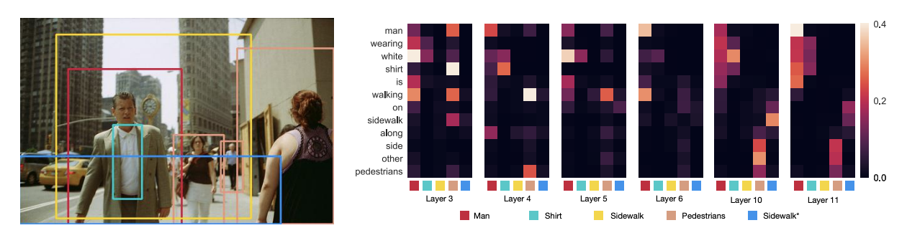
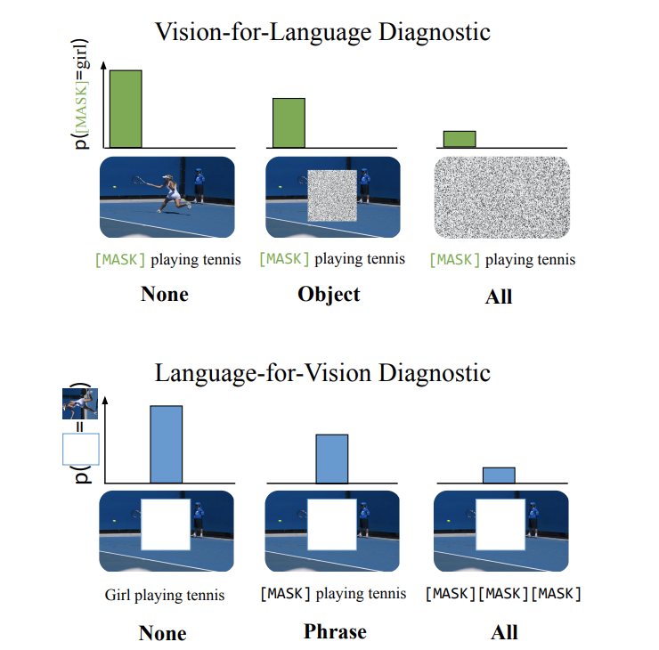

# CMU 11-877-AMML：Week2  Multi-modal Interaction

> CMU的公开课程11-877《**A**dvanced **T**opics in **M**ulti**M**odal **M**achine **L**earning(AMML)》课程的学习笔记，这门课程以读各种各样的论文为主，没有什么平时作业。第二周要读的论文主要是几片研究多模态模型的可解释性的(个人理解，这几篇论文都在研究多模态模型是否真的学到了模态的交互信息)

## 如何判断多模态模型的模态交互能力

第一篇论文是发表在EMNLP2020上的《[Does my multimodal model learn cross-modal interactions?  It’s harder to tell than you might think!](https://aclanthology.org/2020.emnlp-main.62.pdf)》这篇论文提出了一种通用的检验多模态机器学习模型是否学到了跨模态交互能力的方法。

论文提出，多模态的机器学习模型可以分成两类，一类是模态相加式的模型，这类模型我们可以将它统一表示为：
$$
f(t, v)=f_{T}(t)+f_{V}(v)
$$
这里的t和v分别代码数据的文本特征和图像特征(假设只有文本和图像两个模态)，这种模型对数据的不同模态特征分别单独进行编码。

而另一类模型是有模态交互的模型，这类模型会对数据不同模态的特征进行共同编码，并且模态之间会相互影响，这种模型就难以直接用上面类似的形式来表示。

论文关注的问题非常简单：第二类多模态机器学习模型是不是真的学到了跨模态的交互信息(即模态信息之间是否真的会相互影响)，针对这个问题，作者提出了一种方法EMAP(Empirical Multimodally-Additive Projection)，EMAP可以将多模态机器学习模型**转换成第一类模态相加式模型**，并且比较转换之后模型的性能损失，通过这种方式来判断模型是否真的具有学习跨模态交互信息的能力。

这种方法的底层逻辑是，如果一个模型能够学习到跨模态的信息，那么将这个模型降解成一个模态相加模型之后，模型的性能会出现大幅度的下降，因为关键的模态交互信息在降解的过程中消失了，而如果一个模型没有学习到这些信息，那么它本身就是一个模态相加式的模型，或者只能学到很弱的模态交互信息，对其进行降解不会带来太大的性能损失。

下面来看一下EMAP的具体方法，EMAP希望将具有跨模态信息的模型转换成成下面的形式：
$$
\tilde{f}(t, v)=\underbrace{\mathbb{E}[f(t, v)]}_{f_{T}(t)}+\underbrace{\mathbb{E}[f(t, v)]}_{f_{V}(v)}-\underbrace{\underset{t, v}{\mathbb{E}}[f(t, v)]}_{\mu}
$$
然后这里的$f_T(t)$的形式如下：
$$
\hat{f}_{T}\left(t_{i}\right)=\frac{1}{N} \sum_{j=1}^{N} f\left(t_{i}, v_{j}\right)
$$
原本模型里，通过模态交互计算出来的表示结果应该是$f(t_i, v_i)$，而EMAP通过让$t_i$和所有的图像信息$v_j$进行共同表示，来抵消模态交互带来的效果，大家都一起交互等于大家都没有交互，所以最后模型中模态信息的交互就被抵消了。

最终EMAP将模型变成了如下形式：
$$
\hat{f}\left(t_{i}, v_{i}\right)=\hat{f}_{T}\left(t_{i}\right)+\hat{f}_{V}\left(v_{i}\right)+\hat{\mu}
$$
然后就可以通过实验来比较新模型和原模型之间的性能差距来反映模型对模态交互信息的学习能力。

## 多模态BERT是否学到了模态交互能力

后面两篇论文分别是发表在ACL2020上的《[What Does BERT with Vision Look At?](https://aclanthology.org/2020.acl-main.469.pdf)》和发表在EMNLP2021上的[《Vision-and-Language or Vision-for-Language? On Cross-Modal Influence in Multimodal Transformers》](https://aclanthology.org/2021.emnlp-main.775.pdf) ，这两篇文章都在探究多模态的预训练Transformer模型(以VisualBERT等模型为代表)是否真的学到了模态交互的知识。

ACL的这篇论文以VisualBERT为例，探究了多模态Transformer预训练模型中的grounding现象，文章认为，VisualBERT中的文本和图像模态的信息有两种交互方式，我们用下面这个图像-文本对为例

- Entity Grounding: 图像中的实体和对应的文本之间的注意力会特别高，可以起到辅助文本描述的作用
- Syntactic Grounding: 文本中一些关键但并非实体的词语可以帮助模型识别图像中正确的实体，比如上面这句文本中的wearing代表了man和shirt之间的关系，这就会让模型感知到红框和翡翠色的框所指向的东西具有一定的关联性(人身上穿的是衬衫)

这篇文章就针对这两个问题进行了探究。而另一片EMNLP上的论文则通过另一种方法来研究多模态Transformer模型中的模态信息交互，它提出的问题是，多模态Transformer模型究竟是一个Vision-and-Language模型还是一个Vision-for-Language模型，Vision-for-Language模型的意思是，图像信息对文本表示的学习影响很大，而图像信息受文本信息的影响不大，类似的有Language-for-Vision模型，而Vision-and-Language模型代表的则是多模态模型学习的理想情况，即文本和图像二者在学习过程中相互影响。

这篇论文采用的实验方式是对一个模态的信息进行Mask，然后输入模型中，观察模型预测被Mask了的数据的能力，论文将这一过程称为Cross-modal Input Ablation，如下图所示：

论文通过这种方式探究了各种多模态Transformer模型的模态交互能力，结果惊奇的发现多模态Transformer模型基本都是Vision-for-Text的类型。