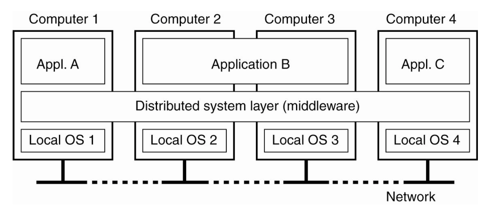
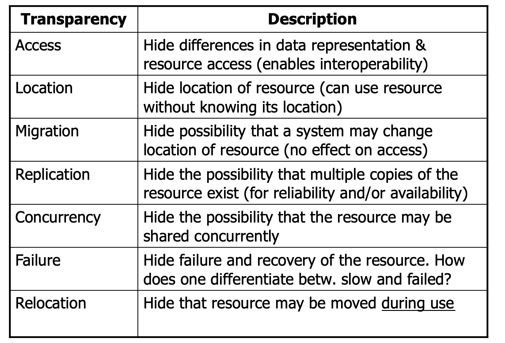
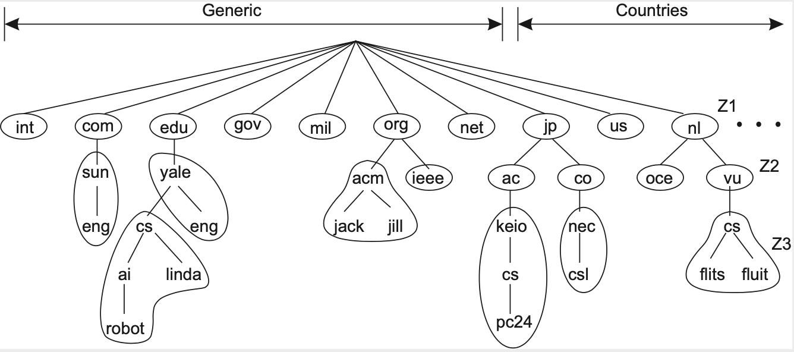

# CMU-15/440 Distributed Systems 1: Introduction

> CMU的15/440是一门分布式系统的入门课程，我一直对这个领域有点兴趣，想通过公开课来学习，不过MIT的6.824似乎难度较大，对我这种菜鸡不太友好，所以先找了一门听说比6.824容易一点的课来学一学。

## 什么是分布式系统？

分布式系统是什么？这门课程给出的定义如下：

> A collection of independent computers that appears to its users as a single coherent system

也就是说，分布式系统是一个由多台独立的计算机构成的系统，这些计算机从用户的角度来看是单个系统。并且，分布式系统具有这样几个重要的**特征**：

- 没有共享内存，不同的计算机之间通过消息进行交流通信
- 每个计算机在它本地的操作系统上运行
- 系统计算机之间具有异构性

但同时，分布式系统会隐藏内部的各台计算机的组织架构和通信方式，对外的表现就像是单台计算机一样，并提供通用的接口供外部调用。同时，分布式系统具有较好的可扩展性和故障恢复能力，可以自由地增加/减少计算机的数量并且在其中的某一台计算机出现故障的时候用其他的计算机替补。

## 分布式系统的目标

第二个问题就是，我们为什么要构建一个分布式的系统？换句话说，我们希望分布式系统能够实现哪些目标？Introduction中主要介绍了这样几个：

- 资源的可获得性。分布式系统需要支持用户远程访问资源，并且这些资源需要被公平地共享。对于一些成本高的资源(比如GPU)，应该要注意系统的经济性。同时，通过这种远程服务的形式提高系统的性能
- 透明性问题。分布式系统隐藏了系统内部的具体细节并向用户和应用提供服务，用户要能向访问本地资源一样来访问分布式系统中的资源，总的来说，透明性还可以具体分成这样几个维度(实际上就是对系统的封装性提出了要求)：

- 开放性问题。一个开放的分布式系统根据描述这些服务的语法和语义的标准规则来提供服务。也就是说，系统的接口是明确规定的，并且可以免费使用。这就需要分布式系统具有良好的接口定义和编程规范，同时，一个开放的系统应该具有：
  - 互操作性**Interoperability**，允许两个不同的系统或者应用同时进行工作
  - 可移植性**Portability**，一个设计了要运行分布式系统的应用，在使用另一个实现了等效接口的分布式系统中依然可以正常运行
  - 可扩展性**Extensibility**，系统应该允许方便地添加新的组建和特征
- 规模化问题。当系统的规模扩大的时候，也要能正常工作。

后面还举了个DNS的例子，用来说明分布式系统的复杂性，这里就不细说了。

