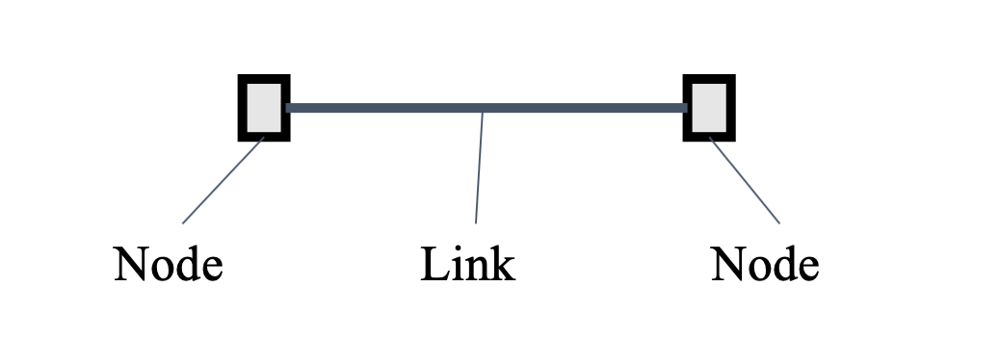
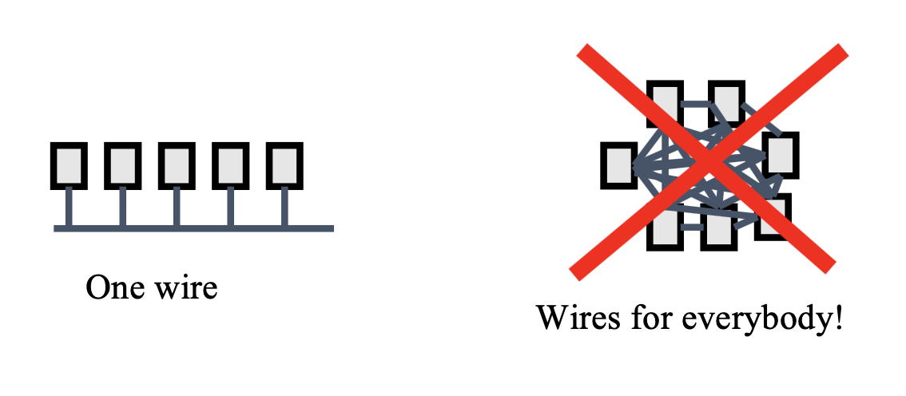
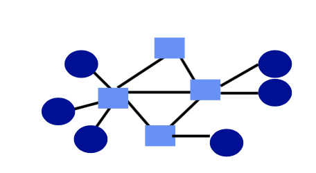
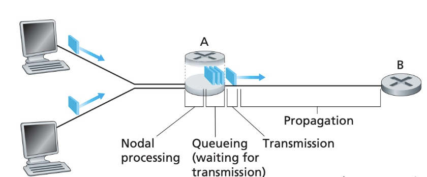
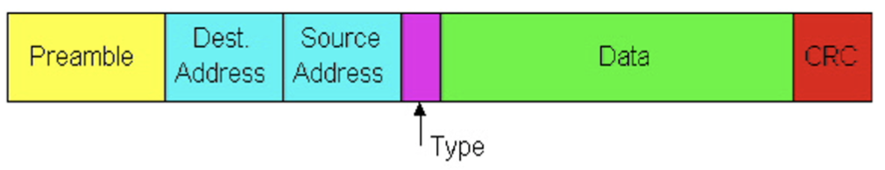
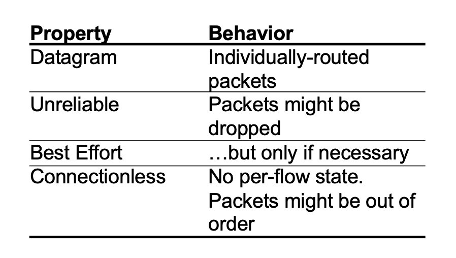

# CMU-15/440 Distributed Systems 2: Networking Communication

> 分布式系统课程15-440学习笔记2，这一节主要讲网络通信相关的内容。

进程之间的交互是分布式系统中的核心，不研究位于不同机器上的进程之间的通信的分布式系统研究是没有意义的。

## 网络链接Network Links

**网络链接**是网络通信中的基本组成单位，节点指的就是一台计算机(当然有的时候一台计算机上会分出多个虚拟节点)

如果我们需要组建更复杂的网络，就需要用更复杂的组网方式，通过网线将多台计算机连接成网络。

复用Multiplexing是计算机网络中一种很常见的技术，即多个链接共享同一个信道进行通信，交换机在这个过程中起到了很重要的作用。

包交换(Packet Switching)是最常见的通信方式，一个自包含(关于自包含，我的理解是可以通过数据包本身的设定来读取里面所有的内容)的数据包从起始点发出，在网络中独立地进行传播，直到抵达目的地。

但是在信道被复用的情况下，通过同一个信道传输多个不同的包可能会导致网络过载，这个时候就需要通过缓冲区和冲突控制的设计来解决问题。当缓冲区也溢出的时候，需要丢弃掉一些数据包。

## 通信信道模型

### 常见的评价指标

对于一个通信信道，我们需要关注它的这样几个指标：

- 延迟Latency，即从起始点到终点所需要的时间
- 容量(吞吐量)Capacity，即网络中最多能容纳的字节数，也就是网络的带宽
- 抖动Jitter，代表了延迟的变化
- 丢包率，也可以认为是可信度

其中，数据包的延迟可以具体分成四个部分，分别是**传播延迟，发送延迟，处理延迟和队列延迟**，四种延迟产生的原因如下图所示。

### 最基本的Stop&Wait协议

Stop&Wait是一种最基本的通信协议，它的工作方式就是，发送方发出一个包给接收方，并等待接收方发送确认(ACK)，下一个包需要等收到接收方的确认之后才可以发出。如果接收方在一个规定的时间内没有发回ACK，那么发送方就会紧凑型超时重传。

### 数据包具体长啥样？

Slides里面给了一个具体的例子。这是一个**Ethernet Packet** 

一般来说一个数据包会包括起始地址和目标地址，以及一些关键的标记位，以及具体的数据，这里的数据可能会是更上一层的数据包。

### 关于因特网的小知识

因特网Internet的定义是a network of networks. 它将不同的网络组合到了一起成为了世界性的网络。它有着非常强的**异构性**，每个网络里面的地址形式、网络性能、网络协议的定义、路由的算法、具体使用的网络技术等内容都有可能不同，将这些复杂的网络组合成为一个通用的大网络，其难度也可想而知。

因特网通过Naming、Routing以及多种服务模型实现了计算机之间的互联。

