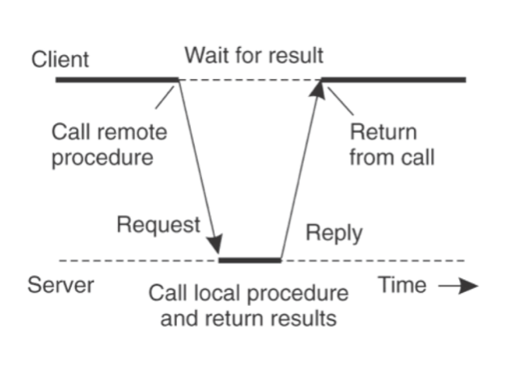
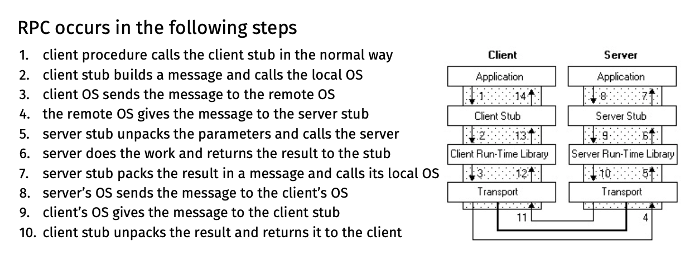
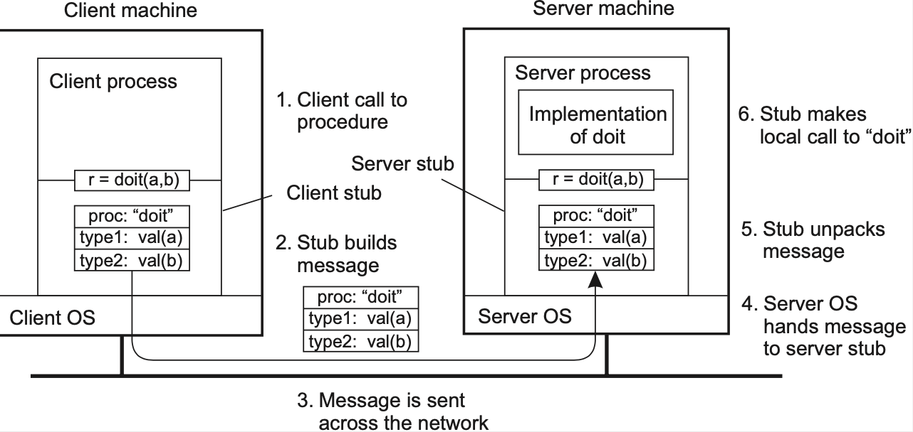
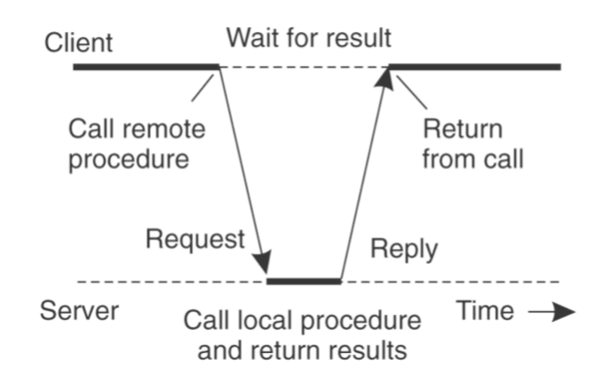
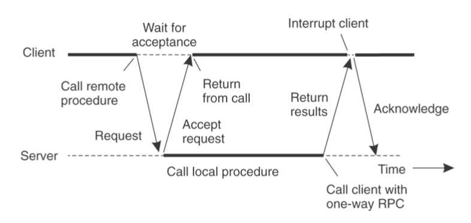

# CMU-15/440 Distributed Systems 5: RPC

> 分布式系统课程15-440学习笔记5，这一节主要讲远程过程调用RPC的内容。本笔记部分内容参考了该课程的推荐教材Distributed Systems

## Introduction

很多时候，分布式系统的通过进程之间显式的通信来实现各种功能，但是这样的设计完全没有隐藏通信的细节，这就导致系统的访问透明性存在问题。这个问题可以用远程过程调用**(Remote precedure call, RPC)**来解决。

> 所谓的透明性(**Transparency**)指的是本来是存在的事物或属性，从某种角度看好像不存在，比如说对于写Python的人而言，计算机底层汇编语言的运行情况他是不知道的，这个时候，汇编程序对这个人来说就是透明的，他不需要知道汇编的运行方式也可以写出能跑的Python代码。

RPC的原理实际上非常简单，它可以让一个程序调用位于其他机器上的procedure，当机器A上的进程调用了机器B上的procedure，那么A上的这个进程就会被挂起，并且被调用的procedure在B上开始执行，得到的结果再返回给A上的进程。这个过程中，A上的进程用调用函数的方式传递所需的参数，然后这些参数被传输到B上的procedure并进行处理。因此，具体的消息细节开发者是看不到的，这就相当于对远程机器上的API做了一层封装，不再需要用显式的message再去获取对应的服务。

## RPC的idea

RPC的设计理念就是，让分布式系统中**需要远程调用的服务和功能尽可能看起来像是在本地调用(Local Procedure Call)一样**。RPC的设计采用了一种被称为客户端存根(Client Stub)的设计，举个例子，比如机器A上的进程要调用机器B的F函数，那么A就是一个客户端，对应的client stub就是在A机器上的F函数(看起来是A上的函数，实际上会从B机器上获得运行结果)，它会执行一个send的过程，将参数打包(Marshaling)发给服务端B，然后A上的stub就会进入阻塞状态并等待结果返回。服务端B上也有对等的服务器存根(Server Stub)，它会解包(Unmarshaling)发送过来的参数并处理，将结果返回给客户端。

- Marshaling和Unmarshaling需要能处理各种类型的数据(不管是最简单的int, float还是复杂的类的对象)，可以采用类似于序列化的处理
- RPC过程中，参数的传递可以用下图来表示：

## RPC的实现和故障处理

### 不同编程语言的实现

各种编程语言中，用不同的方式实现了RPC，常见的实现方式可以分成两类：

- 浅层集成，即我们在调用RPC的时候需要调用很多库函数，还要自己组织数据的格式，总之就是很麻烦
- 深度集成，啥都给你安排好了，调用一下就成

Go语言的RPC属于深度集成。

### 如何应对Failure

在单机上运行的程序，如果碰到了机器崩溃，那么这个程序也就崩溃了，而分布式系统中的程序，如果一台机器崩溃了，整个程序中只有一部分发生了崩溃，我们要做的就是让这种崩溃被及时发现，并让每个活着的客户端感知到。

而在RPC中，对崩溃的处理需要考虑这样几个方面：

- 通信故障，比如消息丢失，链接被重置
- 机器崩溃，比如客户端和服务器本身崩溃了，并且要考虑是在处理请求之前崩溃的还是之后崩溃的，不同的情况需要执行的操作各不相同
- 在崩溃的种类可能无法分辨

#### **Strawman Solution**

最简单的解决办法是，让使远程行为与本地行为相同，即

- 每一个部分失败都会导致完全失败
- 重新启动整个系统
- 耐心地等待系统修复

但是这样的做法过于简单粗暴，首先，在大的分布式系统中，崩溃时不时都在发生，并且崩溃的客户端可能无法修复，如果采取了这种策略，会带来很多问题，就好像检测出一个Covid阳性就立马封城一样。

#### **Real Solution: Break Transparency**

这部分没看懂PPT在讲什么

## 异步RPC

传统的RPC的工作过程如下图所示：

在传统的RPC中，客户端需要等待服务端的回复，否则就一直处于阻塞状态。但是在异步的RPC中，客户端向服务端发出RPC请求之后，服务端会立马发送一个消息表示收到了请求，然后客户端继续工作，在服务端得到结果之后，再次给客户端发送消息，这个时候客户端会发生中断并回复客户端一个ACK消息，整个过程如下图所示：

