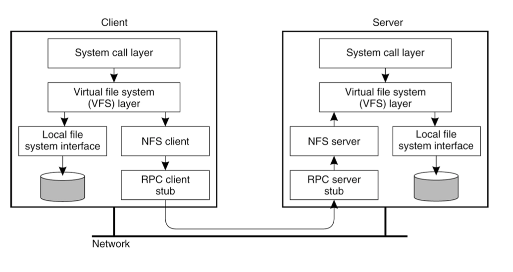
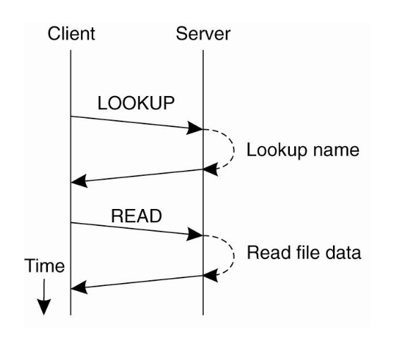
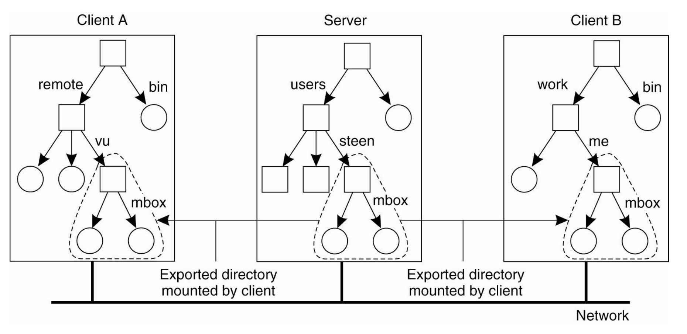

# CMU-15/440 Distributed Systems 6: DFS

> 分布式系统课程15-440学习笔记6，这一部分内容主要讲了分布式文件系统的内容。

## Introduction

分布式文件系统(Distributed File System, DFS)是指部署在分布式系统中的文件系统，我们可以通过DFS提供的文件系统接口来访问存储在服务器(是一个分布式系统)上的文件。

**文件系统接口**提供的操作主要包括：

- 文件的打开和关闭，文件统计信息的读取
- 从文件中读/写数据
- 给文件上锁
- 删除/重命名文件/目录
- 查询目录下的文件列表

那么为什么要设计成DFS？

- 可以在多个用户之间共享数据
- 用户的移动性
- 文件位置的透明度
- 备份和中心化的管理

分布式文件系统面临的主要挑战有：

- 异构性，分布式系统中有大量不同的计算机设备和用户
- 规模化问题，如何扩大系统的规模
- 安全性，文件和数据的安全性
- 容错，对系统崩溃的处理方法
- 系统的并发性能

虽然分布式文件系统有这么多目标，但是我们在实际开发/工作/研究DFS的过程中，应该要定下优先的目标，即应该先解决哪个挑战。DFS的设计和开发过程中，有很多这样的trade-off，我们不能一次性实现所有的目标，就慢慢一个个实现。

## DFS的实现

### Naive Approach

上图是一个简单的DFS实现方式，在这个实现里面，客户端和服务端通过虚拟文件系统(VFS)和远程过程调用(RPC)来实现文件的各种操作，RPC的过程如下：

这样设计的好处是，如果客户端和服务端运行在同一个本地文件系统中，它们的性能表现会比较好，但是这样的设计性能可能很差，因为访问远程服务器的延迟往往比访问本地内存的延迟高得多。

> 我们可以从中得到的启示是，如果为了每一个细节都去重新请求一次服务器，那么系统的效率会非常低

针对这样的问题，我们有这样几种改进策略。

### 改进1：Caching

#### Caching V1

为了提高系统的效率，减少客户端请求服务端的次数，可以使用Client-side caching，即在客户端的机器上保留一份数据的拷贝。AFS(Andrew File System)文件系统就使用了这种机制，它有这样几个假设：

- 客户端都有磁盘(废话)，可以长时间的保留一些文件的全部内容
- 大部分文件只会被一个用户更新，不会出现write/write(两个用户同时写一个文件)或者write/read(两个用户分别读写同一个文件)的交互

同时，我们可以进行按需缓存(on-demand caching)，即有需要的时候才去cache，也可以进行预先缓存(pre-fetching)，即提前缓存好一定的文件数据。

但是caching机制在系统的一致性上是有问题的，正如AFS的假设那样，如果文件都是read-only的，那caching没啥问题，但是如果有多台机器同时访问某个文件，并且会修改其中的内容，那系统的一致性就会出现问题，这被称为cache staleness，是一个很经典的问题，常见的一些解决方案有：

- **Broadcast invalidations**，当有文件被更新的时候，要通知每个cache了这个文件的客户端更新cache中的内容，这个方法简单并且能保证严格的一致性，但是会带来很多无效的网络通信，不够scalable
- **Check on use**，客户端在使用某些数据之前先在服务端进行确认，但它和上面的方法一样不够有效率
- **Callbacks**，回调，客户端需要在服务端进行注册，表明我有一份文件的拷贝，当服务端通知客户端这份文件无效的时候，这个拷贝就失效了，这种方法以服务端的形式维持系统的一致性，但是如果服务端崩溃了，就会失去之前的所有回调信息，这时候可以**依靠客户端来重建服务端的回调信息**。如果客户端崩溃了，就必须重新验证它所使用的任何cache，因为它可能有错过了回调。AFS实际上用的是这一种方案
- **Leases**，租约，对每个cache file设定一个有效期限(相当于从服务端租来了这个文件)，当时间到期了之后，客户端就需要向服务端要求更新缓存的数据。同时，这里的租约还可以分为**读租约和写租约**，为了保证系统的一致性，可以同时有多个客户端获得读租约，但是只有一个客户端才能获得写租约。

#### Caching V2

一种对于Cache策略的改进是同时cache干净的数据和脏数据，以及他们对应的文件属性，并且给文件设置一个60s的有效期，当有效期结束之后客户端就会去确认文件是否需要更新，这样一来，在一台机器上进行的更改可能需要60秒才能反映到另一台机器上。

#### 故障处理：无状态服务器

无状态服务器是说，服务器在向客户端发送文件的时候，不会保存额外的状态信息，比如维护一个列表记录每个文件都被哪些客户端使用了。这样的设计使得服务器在遇到系统崩溃需要重启的时候，没有pending transactions，而是让每个客户端主动告知服务器，自己保存了哪些文件

### 改进2：Naming

在NFS中，客户端可以将服务端发送过来的文件存储在任何合适的地方。

而在AFS中，各个客户端的文件命名空间需要保持一致，每一个文件会用一个file id来表示，具体的形式是`<vol_id, vnode #, unique identifier>` ，并且AFS的服务器上会存储一个vol_id到server_ip的哈希表，方便查询。

从透明度(transparency)来看，NFS的透明度比较差，如果一个目录从一个服务器移动到了另一个，那么NFS系统必须重新挂载文件。而对于AFS来说，如果一个volume被移动到了另一个服务器，只需要修改服务器上的哈希表就可以了。