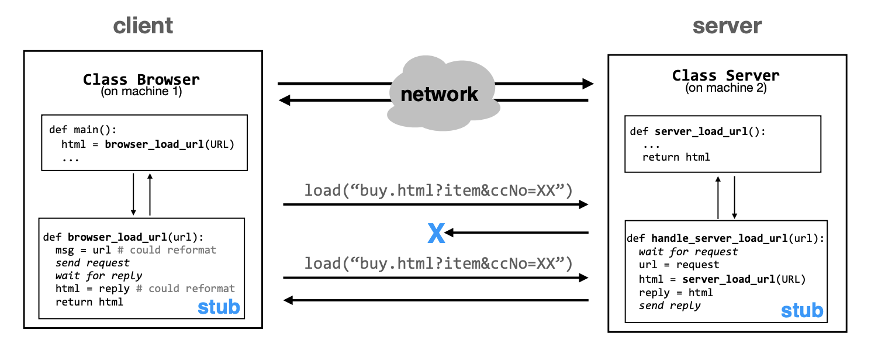
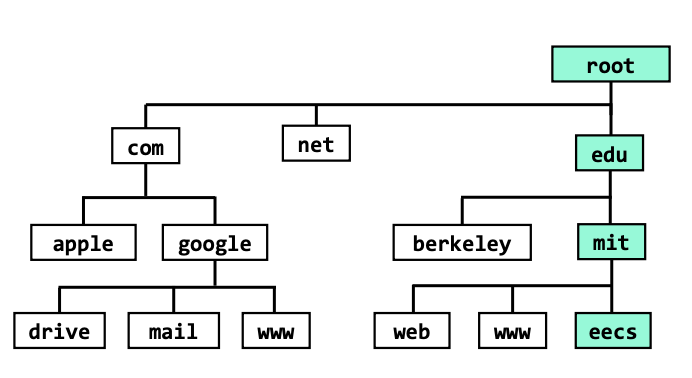
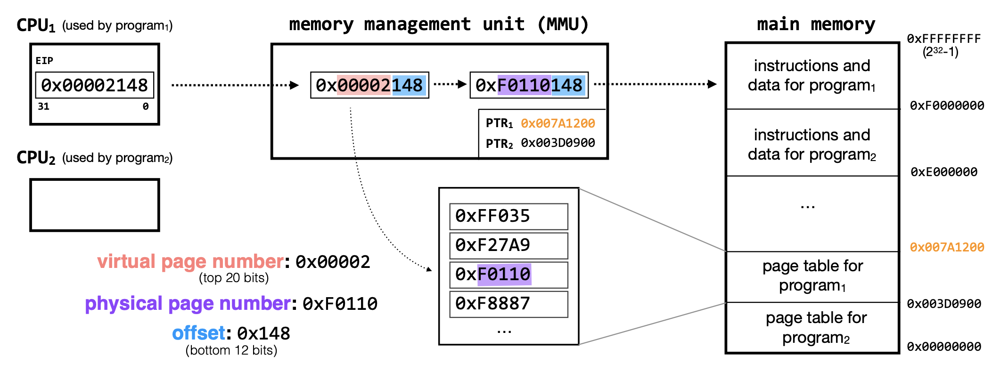
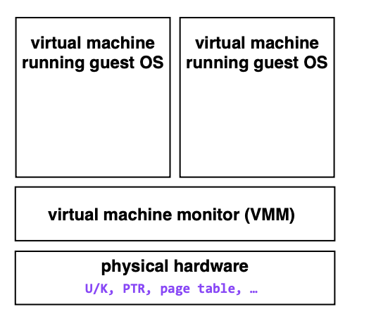

# MIT6.033系统设计1：导言与操作系统层面的设计

> MIT6.033这门课程的主题是Computer  System Engineering，即计算机系统工程，这门课程主要教授计算机系统设计相关的知识，内容涵盖了操作系统、计算机网络和分布式系统等多个计算机系统的子方向，内容比较全面。虽然这门课没有公开的作业，但还是值得一学，由于每节课的PPT内容较少，我们将内容按照操作系统、计算机网络和分布式系统三个大块进行记录。

## 引言：系统设计中的复杂性，模块化和抽象

这门课讲述的内容是系统设计(主要指的是计算机系统)，我们就首先需要搞清楚一个问题——什么是系统？对此，6.033这门课程给出的定义是：

> a set of interconnected components that has an expected behavior observed at the interface with its environment

这门课认为系统是由一系列内部相关联的组件构成的集合，并且可以在某种合适的环境下，通过它提供的接口可以观察到某种期望的表现。而搭建一个系统的难点就在于，系统的复杂性。系统的复杂性限制了我们的设计。

而解决系统的复杂性的方法就在于坚持一些重要的设计原则，比如模块化(Modularity)和抽象(Abstraction)

模块化和抽象说白了是一起的，我们需要将整个系统的不同功能组件进行划分，将其抽象成若干个较为独立的模块，分别实现，然后再搭建起完整的系统。比如常见的Client-Server体系(即C/S体系)就是将一个系统中提供交互功能的部分抽象称为客户端模块，将实现具体服务抽象成服务端，并对外进行封装，然后通过网络链接来实现客户端和服务端的交互(网络链接实际上也是一种非常重要的抽象)

在系统设计的过程中，我们需要考虑这样几个重要的问题：

- 可扩展性：随着机器数量的增加，如何提高整个系统的可扩展性
- 安全性：如何防御有目的的攻击
- 容错和可信：系统如何面对各种可能出现的故障，比如系统崩溃和网络连接中断
- 性能：如何定义系统的性能，并解决系统的性能瓶颈，提高系统对计算机资源的利用率

这门课程将围绕有一定规模的系统设计展开，从单台机器上的系统开始，逐渐讲到多台机器上的系统的设计，再将大规模分布式情况下的各种系统设计原则和具体方法，因此课程的内容也涵盖了操作系统(单机)，计算机网络(多机)和分布式系统等计算机系统领域的核心课程。

## 命名Naming

### 什么是命名

命名Naming是指给系统中的各种东西定义一个合适的名字，比如给系统的用户分配一个合适的ID是命名，网络系统中的IP地址和DNS(域名系统，将主机名和IP地址进行对应)也是命名，命名的作用是方便系统去访问某些资源和模块，比如通过用户的ID快速查询某些信息，促进模块之间的交流，并且通过合适的命名，我们可以区分不同的模块和其对应的功能。

通过命名，我们在调用系统中特定功能的时候，可以不需要关注它的具体实现，而是通过命名系统和其他组件完成交互，将不重要的过程隐藏并封装起来。比如在一个用户管理系统中，我想要知道用户的某些信息，直接通过设计好的用户ID去存储系统里查询就可以，不需要知道具体的存储系统的设计以及用户信息如何被存储。

### 如何命名

常见的命名机制由两个部分组成，一个是name/value，另一个是查阅算法，name/value即我们给某个value定义的name，查询算法就是name和value之间的转换函数。因此Naming实际上就是在系统内设计数据的转换机制，方便进行数据查询。

以DNS域名系统为例，它的功能是实现主机名称和IP地址的互相转换，因此name和value分别就是IP和主机名，它设计了一种层级化的查询架构，可以很好地实现层级化、可扩展以及去中心化。

## 虚拟内存Virtual Memory

为了将一个大型系统在单台机器上进行模块化的设计，我们需要复习一些常见的操作系统的知识。为了在单机上实现模块化，我们应该让编写的程序具有这样几个特点：

- 程序之间不能访问到别人的内存，需要相互隔离
- 程序之间可以通过某种方式进行互相交流
- 程序之间需要共享单台机器上的CPU(最简单的情况就是一个)

而Lecture3的内容就是为了解决第一个问题，如何让程序之间互相隔离，不访问到其他人的内存，这需要依靠虚拟化的技术。虚拟化是操作系统中允许我们进行模块化设计的最重要因素。

虚拟化的技术在存储上的具体表现就是虚拟内存，虚拟内存将物理地址转换成了虚拟地址，用来隔绝不同的程序，每个程序都在各自独立的虚拟地址空间中运行。这个过程如下图所示：

同时，虚拟内存并不完全使用内存，磁盘等外部存储器中也有一小部分会被拿来作为内存，在需要的时候可以和内存中的页进行交换。因此，虚拟内存也扩大了计算机实际可以使用的内存。

页表在虚拟内存中发挥了很重要的作用，它将物理地址转化成对应的虚拟地址，如果在查询页表出现对应的页没有加载进内存中，那么就是触发Page Fault引起操作系统中断，操作系统的内核会做出反应并从外存中装载对应的页。

## 有限缓冲区与锁Bounded Buffer and Lock

Lecture4讲的内容针对操作系统层面的必要设计点2——即实现程序之间的相互沟通，虚拟内存实现了不同程序之间的隔离，而程序之间的相互沟通可以通过有限边界的**缓冲区和锁机制**来实现。缓冲区Buffer实际上是一种**虚拟化的通信链接**。

有限缓冲区分成Sender和Receiver两个部分，分别负责对消息进行发送和接收，程序通过访问缓冲区来给其他程序发消息或者接收来自于其他程序的消息。但是在有多个Sender的情况下，会出现Race Condition，即多个Sender竞争缓冲区的写入权限。这时候就可以使用锁来实现并发访问的控制。

锁的作用是创建一系列Atomic Action(原子操作)，常见的锁分成Acquire和Release两种，分别对应发送和接收操作，一个进程只有获取Acquire锁之后才能写入Buffer，只有获取Release锁之后才能读取Buffer，而且在相应的操作完成之后，需要及时释放申请到的锁。

但是如果出现两个进程同时申请锁，那该怎么办？这就需要对锁的申请/释放逻辑进行进一步的优化，但是要注意防止死锁等情况的出现。

## 线程Threads

单机系统设计的第三个特点需要我们在单机上实现多个程序之间的CPU共享，而线程就是实现这个想法的最关键设计，基于已有的操作系统知识，我们知道线程是操作系统中调度的最小单位，可以被CPU线程实质上是对CPU的虚拟化。CPU可以通过时间切片轮转等方式，让多个线程共享CPU.

同时，一个线程可以被挂起Suspend，也可以被恢复Resume，可以通过条件变量的设定，让线程等待某个事件，通过wait+notify的模式，使用wait方法后的线程会被挂起，这个时候线程锁会被释放，直到满足某种条件之后触发notify才会重新获取锁并继续运行。

## 虚拟机Virtual Machine

操作系统通过虚拟化技术实现了单个机器上的模块化系统设计，比如虚拟内存是对内存的虚拟化，缓冲区是对交流通信的虚拟化，而线程是对CPU的虚拟化，通过这些虚拟化操作，我们可以将操作系统能掌握的计算机资源分成多个模块分别设计并编程实现。而虚拟机可以让我们实现在单台机器上同时运行多个操作系统，

虚拟机的实现方法大致如图，虚拟机通过VMM将计算机的物理硬件资源进行虚拟化，而其上的Guest OS(虚拟机操作系统)则以用户态运行，由VMM为其分配相应的资源，这个时候Guest OS中的特权指令就会引发中断(原本需要在内核态下运行，但现在是用户态)，然后VMM截获这一中断，并通过仿真操作帮Guest OS实现这个功能，并返回结果。

VMM中运行的Guest OS在运行程序的时候，首先有一个Guest OS上的虚拟地址，并通过VMM分配的虚拟硬件转化成Guest OS上的物理地址，然后再通过VMM将虚拟机上的物理地址转化成宿主机上的物理地址，并执行对应的程序。这个过程中共需要经过3个页表的转换。

## 系统性能/存储Storage

评价一个系统性能，关键在于设计合理的评估方案找出系统的瓶颈在哪里。系统的性能有三个常见的指标可以用于评估，一个是延迟latency，一个是吞吐量throughput，一个是利用率utilization，三者的衡量标准如下：

- 延迟：完成单个请求的事件是多少
- 吞吐量：系统每个单位时间能够完成多少请求
- 利用率：系统在处理请求时候的资源利用量

在对系统进行优化的时候，我们需要找到系统的瓶颈所在，并通过针对性的优化(如设置Cache，将系统并行化等等)来提高系统的性能。

以文件读写为例，磁盘的读写往往导致文件读写性能的瓶颈，磁盘可以分成硬盘驱动器(HDD)和固态硬盘(SSD)，HDD可以分成磁盘、磁道和扇区，而SSD分成块、页和区等单位，在HDD中，寻道需要消耗大量的时间，会导致读写的性能瓶颈，因此我们可以通过减少随机访问的方式，优化系统在HDD上的性能。而SSD不需要寻道，读取速度比HDD要快，但是对写操作非常敏感，因此SSD更适合用在读操作密集的场景中。

计算机中的文件系统实际上就是对读写操作的抽象，文件系统将硬盘中的存储空间划分成一个个的文件，并通过block-level control等方式对文件进行管理。

以上我们复习了一些操作系统的基本知识，并了解了它们在系统设计中各自起到的作用。