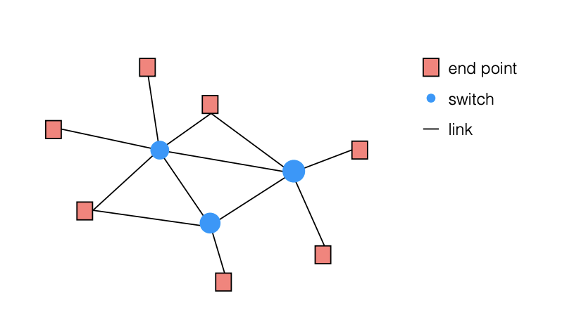
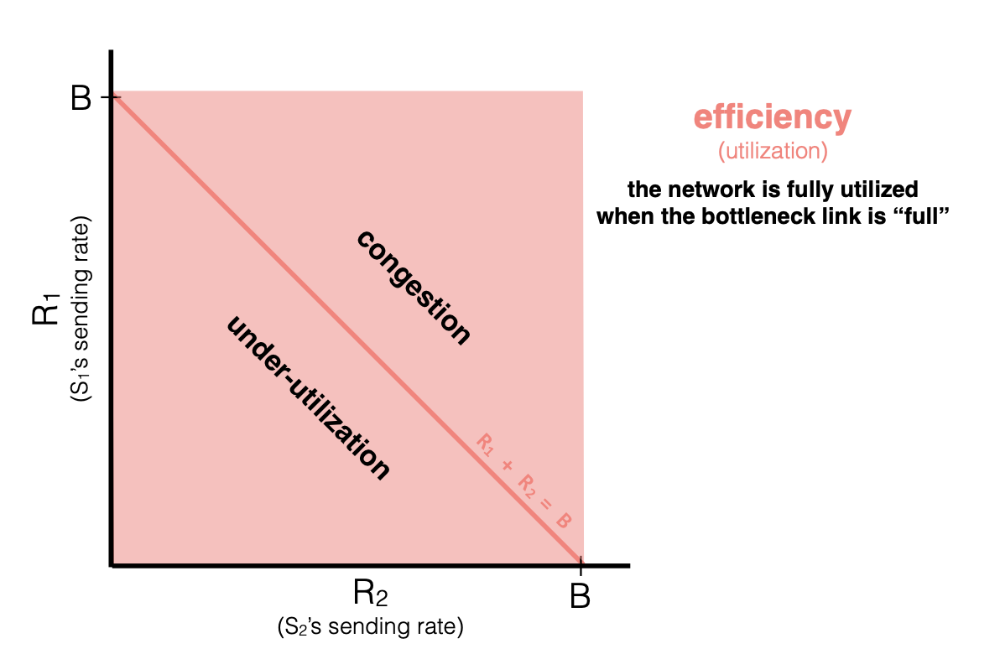
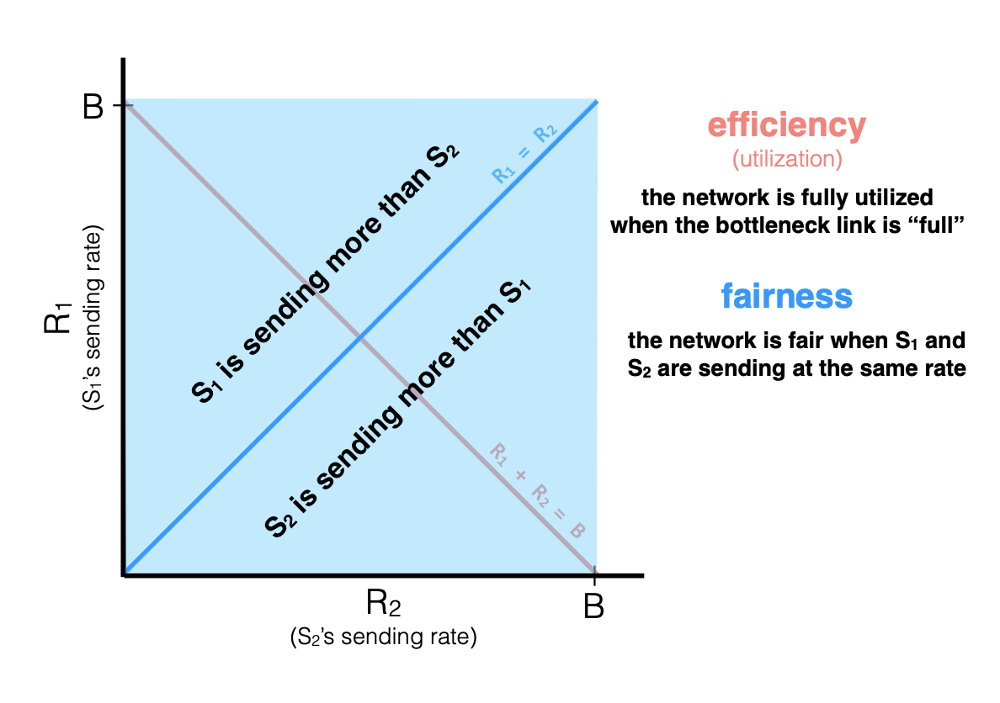
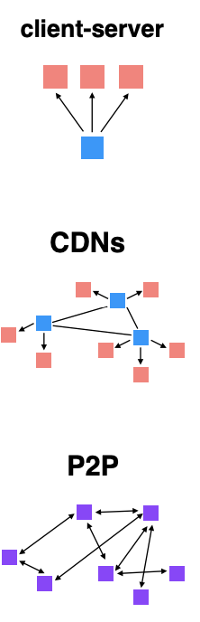

# MIT6.033系统设计2：计算机网络

>  MIT6.033这门课程的主题是Computer  System Engineering，即计算机系统工程，这门课程主要教授计算机系统设计相关的知识，内容涵盖了操作系统、计算机网络和分布式系统等多个计算机系统的子方向，内容比较全面。虽然这门课没有公开的作业，但还是值得一学，由于每节课的PPT内容较少，我们将内容按照操作系统、计算机网络和分布式系统三个大块进行记录。现在是第二部分计算机网络的内容。

## 网络的层级结构

很多时候，一台机器承载不了一个完成的系统，这时候我们需要将一个系统部署在多台机器上，而计算机网络中的各种通信协议就是为了完成机器 之间的交流而设置的。

网络是对计算机之间连接的一种抽象，网络由一系列端点(即计算机设备)和交换机通过一系列的网络链接组成。网络系统中，各种各样的网络协议在机器通信时起到非常关键的作用，并且各种各样的网络协议被分成了若干层，自上而下依次有应用层、传输层、网络层和链接层(相当于OSI七层体系中的下四层，在TCP/IP体系中也叫做网络接口层)，每个层都是对网络协议具体功能的抽象，并且有特定的网络协议在每一层起作用。

下面的一些内容会按照网络协议栈的分层来逐一介绍(实际上是复习一些)

## 网络层：路由管理

首先是网络层，网络层的作用主要有三个，没别事Naming，Addressing和Routing，Naming和Addressing是指给网络中的每一台设备分配名字和IP地址，而Routing则是让交换机感知网络中的拓扑结构和交换机到网络中各个节点的距离，便于在交换的过程中做出最优的决策，这个过程实际上就是路由。

一般来说，网络中的每个节点会各自维护一个路由表，通过定期向周围邻居发送HELLO协议来感知邻居和自己的距离，再通过广告的方式得知自己到网络中其他节点的距离，然后做出代价最小的决策，并将消息转发出去。这些过程会在网络中定期发生，每个节点上的路由表也会不断更新，同时，路由表是分布式的，节点需要通过各种路由算法实现路由决策。常见的路由算法有链接状态算法和距离向量算法，具体的就不多说了，链接状态算法需要保存完整的网络拓扑信息，然后用最短路径算法进行路由规划，距离向量算法通过维护当前的cost信息，并使用邻居信息不断更新cost表来实现路由决策，相比于链接状态算法，这种方法不需要全局拓扑结构信息。

根据不同的算法有诞生了不同的路由协议，如BGP，OSPF等等，这些协议可以负责一个局域网内、跨局域网等场景下的路由，最终将路由扩展到整个互联网上。

## 传输层：TCP协议

网络层的更上面一层是传输层，传输层的作用是分享网络层的流量，提供可信或者不可信的网络传输，而TCP就是最经典的可信传输协议。

TCP协议往往基于滑动窗口，通过seqno, ack, timeout等参数来控制滑动窗口的大小，并且有超时重传，拥塞控制等机制。TCP在拥塞控制的时候需要兼顾效率和公平，首先要提高效率，最小化传输数据drop的次数和延迟，提高网络带宽的利用率，其次还要保证公平，在有限的网络负载下，通过分割贷款提高利用率。

如上图所示，两个程序同时进行数据传输，网络的总负载量是B，也就是对应了红线，红线的下侧网络带宽利用率不高，而红线上侧会产生网络拥塞，要保证较高的利用率，应该将网络的负载控制在红线左右。再看下面这幅图，蓝线代表了两个程序公平地使用网络带宽，蓝线上下侧分别表示S1和S2两个程序分别占用了较多的带宽，TCP为了兼顾效率和公平，应该让两个程序的传输速度保持在红蓝线的交点附近。

## 网络中的资源管理

TCP的拥塞控制都是在事后进行的，也就是网络中发生了拥塞，TCP协议才会去出手进行控制，那么有没有什么方法可以让发送端提前预估网络的情况，保证拥塞不会产生呢？答案是肯定的，这些方法被统称为In-network Resource Management，主要有这样几种：

- Queue Management，通过队列存储并管理数据，控制drop的数量
- Delay-based Scheduling，使用优先队列，根据待传输数据的延迟敏感性控制传输数据的顺序，优先传输延迟较高的数据
- Bandwidth-based Scheduling

## 应用层

应用层包含了网络系统中真实发生的各种操作，以数据的分发传播为例，在应用层我们有以下三种常见的数据传输和分发的方式：

- C/S体系，通过中心化的服务器存储数据文件并提供分发服务，客户端可以访问服务器来获取数据，系统的scale-up能力比较差，但是实现起来非常简单
- CDN，即内容分发网络，使用多个分布式的服务器管理数据和内容的分发，在客户端访问的时候才去就近服务，不过需要对边缘服务器进行良好的管理
- P2P模式，去中心化的模式，每台计算机既可以是客户端，也需要对外提供数据下载服务，P2P模式的难点在于需要更好的内容组织，并且每个Peer需要能发现附近的Peer，同时需要鼓励用户自发上传数据，系统的scale-up的能力取决于用户的数量

