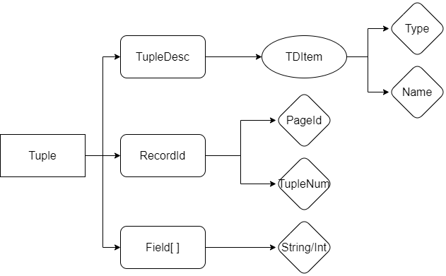

# MIT6.830-lab1：SimpleDB Overview

> 这是MIT6.830Database Systems课程的Project实现记录，这门课的内容和常见的数据系统课程基本一致，而课程Project是用Java实现一个名为SimpleDB的简单数据库系统，一共有6个lab

## Overview

和CMU15-445类似，MIT6.830也有一个课程Project需要自己实现一个数据库系统SimpleDB中的关键部分，和15-445的Bustub类似，SimpleDB也被分成了若干个模块，包括

- 通用的数据库管理模块，如Catalog和Database，复杂管理整个数据库中的信息
- 数据的存储模块，从底层开始实现了数据库的基本单位tuple的存储
- 查询的执行模块和优化模块
- 索引模块，主要实现了B+树索引来加速查询
- 事务处理模块，实现了数据库的事务的抽象

而我们要在6个lab中实现的东西有：

- lab1，对整个SimpleDB有大致的了解，并且实现其中数据存储相关的类，然后还有一些其他东西比如Catalog和SeqScan
- lab2，实现查询处理中的各种算子
- lab3，实现查询的优化相关的功能
- lab4，实现事务处理的相关功能
- lab5，实现B+树索引
- lab6，实现回滚和恢复等功能

下面我们就要正式开始lab1的内容


## SimpleDB存储模块的架构

lab1的前几个任务需要我们实现SimpleDB中存储模块的关键内容，我们可以先根据实验指导和源代码来分析一下SimpleDB存储模块的结构。我们知道数据库中的数据表是用页(Page)为单位进行存储的，每个页中包含了若干个元组(Tuple)，同一个数据表中的元组具有相同的定义(即一条数据包括哪些属性)，我们先来分析一下SimpleDB里的元组是什么设计的。

### Tuple元组



SimpleDB中的一个元组主要有三个部分组成，TupleDesc负责描述元组每一栏数据的名称和类型，RecordId是元组的ID，通过页号PageId和元组在页内的偏移量TupleNum生成，Field数组负责存储具体的数据，顺着这个思路，我们可以实现下面几个文件中的内容

+ src/java/simpledb/storage/TupleDesc.java
+ src/java/simpledb/storage/Tuple.java
+ src/java/simpledb/storage/RecordId.java

比较简单就不贴代码了。

### Catalog/Buffer目录和缓冲区

Catalog类起到的作用相当于数据库的目录，记录了数据库中有哪些数据表，每个数据表对应的ID、数据文件、主键是什么东西，并定义了一系列增删查的方法，同时Database类中会有一个`Database.getCatalog()`的静态方法来访问整个数据库的Catalog，一个数据表要加入Catalog的时候，参数包括数据表的文件(可以获得数据表的id)，表名以及主键的名字，因此可以设置下面这样4个HashMap方便进行数据表元信息的查询：

```java
public class Catalog {
    private ConcurrentHashMap<Integer, DbFile> tableMap;
    private ConcurrentHashMap<Integer, String> idMap;
    private ConcurrentHashMap<String, Integer> nameMap;
    private ConcurrentHashMap<Integer, String> keyMap;
}
```

另一个很重要的类是BufferPool，它负责管理SimpleDB保存在内存中的页的信息，因为内存不可能无限大，所以我们需要在一个指定大小的Buffer中保存一定数量的数据页，并在Buffer容量达到上限的时候进行页的置换，不过lab1不需要我们管这些，我们要做的就是实现一个方法`getPage()`，它的实现逻辑也非常简单，就是根据输入的页号在buffer存储页的HashMap中进行查询，如果这个页不存在就调用`Database.getCatalog().getDatabaseFile`这个方法把对应的页去读出来，这一段的代码如下：

```Java
	public Page getPage(TransactionId tid, PageId pid, Permissions perm)
        throws TransactionAbortedException, DbException {
        // some code goes here
        if (!this.buffer.containsKey(pid.hashCode())) {
            // find the right page in DBFiles
            DbFile dbFile = Database.getCatalog().getDatabaseFile(pid.getTableId());
            Page page = dbFile.readPage(pid);
            if (buffer.size() > numPages) {
                evictPage();
            }
            buffer.put(pid.hashCode(), page);
        }
        return this.buffer.get(pid.hashCode());
    }
```


### HeapFile堆文件

SimpleDB中的数据有两种组织方式，一种是堆文件Heap File，即无序存放，另一种是B+树，是有序的索引，我们首先要来实现Heap File的存放方式，在SimpleDB中，一个Heap File包括了一系列页，称为Heap Page，而每个页能存储的数据量是**固定的**(默认设定为4096KB)，在磁盘中这些Heap File就以无顺序的方式存放，需要用的时候以页为单位读入内存中就行。

同时Heap Page中除了要正常存放元组的数据，还要用一些位置来标注每一条记录是不是有效的，这种方式称为Bit Map，每个元组对应1bit的位置，因此1B的位置可以标注8个元组，因此每个Heap Page中能存放的页的数量需要通过下面的方式计算：

- `tuples per page = floor((page size * 8) / (tuple size * 8 + 1))`

同时用来标记页中每条记录是否有效的Bit Map被称为页的头部，因此页头需要的字节数量就是`ceiling(tups per page/8)` ，我们可以根据这些要求来实现下面三个文件中的代码：

* src/java/simpledb/storage/HeapPageId.java
* src/java/simpledb/storage/RecordId.java
* src/java/simpledb/storage/HeapPage.java

其中HeapPage有个方法`isSlotUsed()`要根据给定的下标判断一个元组是否有效，这时候就要通过位运算取出页头中对应位置的标记，然后判断是不是1(通过和1作And操作可以实现)

在实现了Heap Page的结构之后，我们进一步需要实现Heap File的结构，Heap File中直接保存了File形式的数据文件和元组的元信息TupleDesc，其中一个关键的方法就是根据给定的页号来读取File中对应的Page，这需要通过Java提供的**文件随机访问**API实现

- 补充一点操作系统的知识，文件的两种访问方式是**随机访问和顺序访问**，随机访问就是可以从文件的任何一个字节开始向下读取，而顺序访问就是必须从文件头开始读
- 这里的readPage方法的实现代码如下：

```Java
	public Page readPage(PageId pid) {
        // some code goes here
        byte[] data = new byte[BufferPool.getPageSize()];
        int startPosition = pid.getPageNumber() * BufferPool.getPageSize();
        try {
            RandomAccessFile randomAccessFile = new RandomAccessFile(this.file, "r");
            randomAccessFile.seek(startPosition);
            randomAccessFile.read(data, 0, data.length);
            return new HeapPage((HeapPageId) pid, data                                               );
        } catch (FileNotFoundException e) {
            e.printStackTrace();
        } catch (IOException e) {
            e.printStackTrace();
        }
        return null;
    }
```

另一个很重要的需要我们实现的东西叫做Heap File的迭代器，我们在实现Heap Page的时候就已经实现了Heap Page的迭代器，这个迭代器会遍历页内的每一个元组，而Heap File的迭代器需要能够遍历整个数据表文件中所有的页的所有元组，我们的实现策略是：

- 对于每一个特定的页，调用Heap Page的迭代器来完成任务
- Heap File中维护的迭代器会在访问完一整个页之后自动切换到下一个页，这样就可以实现一页一页的访问

因此在实现的时候，我定义了一个方法`getTupleIterator`来实现Page Iterator的更新。


### SeqScan

lab1的最后，我们要实现一个顺序扫描的运算符，实际上就是要实现一个能够实现顺序扫描的迭代器，我们上面实现的Heap File迭代器就可以直接调用，在SeqScan这个类中再封装一层就行，其他的没什么东西，无非就是多加了一些其他的属性以及get方法。

