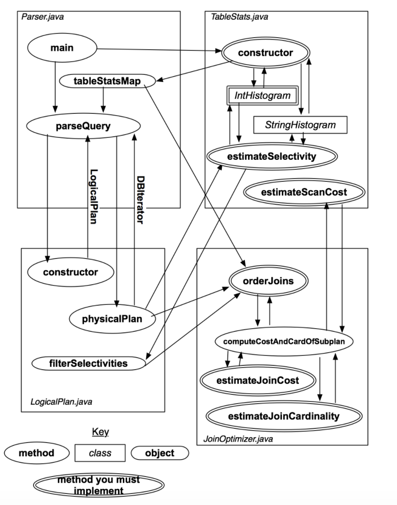
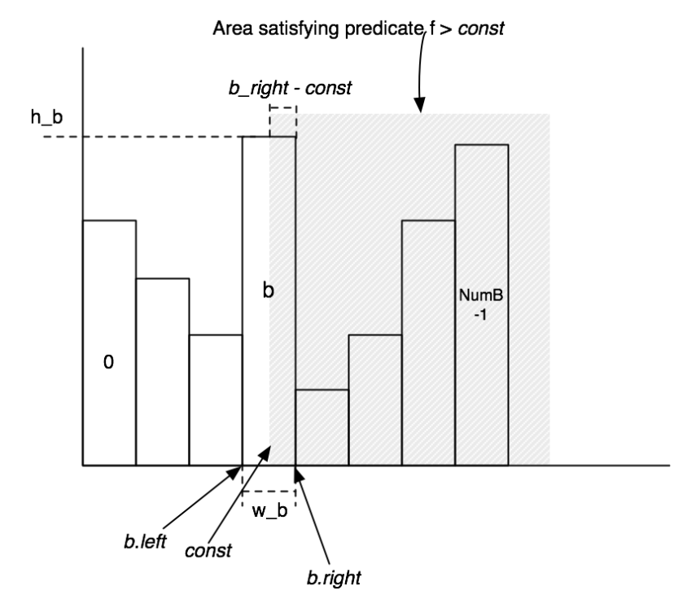

# MIT6.830-lab3：Query Optimizer

> MIT6.830 Database Systems课程Project的第三部分，我们需要实现一些数据库系统中的查询优化的功能，使用数据库提供的统计信息来对嵌套的Join操作进行优化

## Overview

MIT6.830的lab3中，我们主要需要实现一个基于cost的查询优化模块，这个模块的主要作用是在SimpleDB处理Join等SQL语句的时候可以对输入的SQL查询进行优化，并且我们这里实现的是最简单的基于cost的查询优化模块，这里的cost会根据SimpleDB中数据表的统计信息计算出来，而这种统计信息就来自于之前实现的存储模块。

SimpleDB中，整个查询优化模块的架构如下图所示：



在这个lab中，我们首先要实现TableStats这个类来计算每个表的统计信息，然后进一步实现Join操作的查询估计和嵌套Join的优化这两个核心功能，下面就让我们进入正题。

## 数据表的统计信息

我们首先要来实现统计一个直方图类**IntHistogram**和**StringHistogram**，用来统计一个表的一列的数据分布情况，然后用每个列对应的这个统计表来组成整个数据表的统计信息TableStats

### 直方图类

直方图类的实现方式其实非常朴素，我们首先假设一个数据表的某个属性(也可以叫做Field)的值是离散分布的，然后就可以统计出这个Field的每个值对应的元组个数，并形成下面这样一张直方图：




然后，我们在执行Join操作的时候往往需要用到Filter操作对元组进行过滤，而Filter又可以分为等于，不等于，大于，大于等于，小于和小于等于这样几种，并且它们是两两互补的(即每两个一对，占总数据的比例加起来等于1)，实际上我们只要实现其中一半的Filter就可以了。

而计算Filter的结果主要是需要我们计算过滤后得到的元组数量占全部的比例，这个时候就可以用直方图对应区域的面积来表示这部分元组所占的比例，我们在代码实现中只要想个办法来估算直方图中的面积就可以了。同时要注意的是，每种Filter的占比对应的面积是不同的，比如大于是分界点右边的面积，小于则是左边的面积，而等于则是在分界点所在的这一块里面用平均值来估算，比如我有一段对应的值有3,4,5三个，而这一段区域对应的元组数是30，那么在估计该Field值为4的元组数量的时候，就是30/3=10个

然后我们只需要花时间来实现一下`public double estimateSelectivity(Predicate.Op op, int v)` 这个方法就可以了，对每种不同的Op算子都计算对应的结果。我在实现的时候只具体实现了等于，大于和小于三种，剩下的三种操作就用前面三种组合而成。

### 数据表的统计信息类

接下来我们需要进一步实现数据表的统计信息类TableStats，这个类说白了就是给每一个Field都建立一个直方图，然后用一定的方式来维护这些信息。我在实现的时候使用了两个HashMap分别维护Int类型和String类型Field的直方图，类中的定义如下：

```java
static final int NUM_HIST_BINS = 100;

private int tableId, ioCostPerPage;

private int numPages, numTuples;

private TupleDesc tupleDesc;

private int[] maxValues, minValues;

private HashMap<Integer, IntHistogram> intHistograms;

private HashMap<Integer, StringHistogram> stringHistograms;

private DbFile file;
```

剩下的主要是一些重复性的劳动，比如先根据TulpeDesc来初始化一系列直方图，然后调用Heap File的Iterator对整个表进行遍历，在直方图中填充数据，最后实现一些对外的接口来调用不同的直方图获取信息就可以。

## Join的估计

下面我们就需要来实现Join操作的估计，主要分为两个部分，一个是Join的Cost估计，一个是对嵌套的Join操作进行优化并重新排序。

### Cost的估计

这一部分我们先来实现计算每次Join的Cost和这次Join产生的元组数量，分别对应两个方法`estimateJoinCost`和`estimateJoinCardinality` 

- `estimateJoinCost`用来估计一次Join操作所需要的Cost，我们给定一个Join操作左右两边参与的元组数量以及每次操作的cost，来计算整个Join执行一次所需要的cost，并且我们采用最Naive的嵌套循环的方式来实现Join
- `estimateJoinCardinality` 则被用来估计Join操作产生的元组数量，这个方法实际上和我们前面实现的数据表统计信息有关，但是相关的调用已经给出了，我们不需要自己写

### Join的优化

最后我们要实现Join的优化，这个方法的定义如下：

```java
List<LogicalJoinNode> orderJoins(Map<String, TableStats> stats, 
                   Map<String, Double> filterSelectivities,  
                   boolean explain)
```

而我们采用的实现方式也非常简单，就是暴力遍历所有可能的Join排列，然后分别估计它们的总的Cost，然后选出总Cost最小的一组作为查询优化的结果。事实上SimpleDB已经给我们提供了一个方法`enumerateSubsets`来帮助我们实现子集的搜索，我们只要调用这个方法，就不用自己再写一个对Join进行搜索的过程。

在搜索的过程中，我们要用一个提供的类PlanCache来存储搜索过程中的中间数据，PlanCache会自动排序找出最优的Join顺序，我们只需要在最后调用它的接口返回正确结果就可以了。


