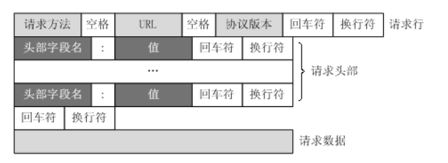

# CS144-ComputerNetworking-Lab0

> 开了新坑CS144计算机网络课程，这门课的授课内容是根据《计算机网络自顶向下方法》来的，但是听说授课质量比较一般，我也没具体看过Lecture，这门课价值最大的地方在于它的Project, 一共包含8个lab, 可以实现一套自己的简易TCP/IP协议栈，使用C++完成。因为我本科期间计网这门课学的不是很好，所以打算再做一做CS144的lab补一补，希望能坚持做完这些lab

## 前言

CS144 Introduction to Computer Networking的Project 共分为8个lab，每个lab都需要实现简单的TCP/IP协议栈(课程称之为Sponge) 的一个关键部分。首先是lab0 Warm Up，在lab0中我们需要尝试运行一些计算机网络相关指令(这一部分略去)，尝试**Linux环境下的网络编程**，以及动手实现一个基本的数据结构：ByteStream作为TCP通信过程中的**可信字节流**对象。

项目提供了初始代码，但是需要自己配置开发环境，我选择了按照课程网站中的指示，下载了VirtualBox并安装了课程指定的虚拟机镜像，然后通过VSCode便捷的SSH连接来写代码

> 这里提一句，在Linux虚拟机上写代码我一开始尝试了一下感觉非常不方便，后来听说VSCode的SSH功能做的非常强大，我就尝试用VSCode通过SSH连接本地的虚拟机来写lab的代码，果然非常方便。
>
> VSCode连接VirtualBox虚拟机可以参考网上的教程，先设置端口映射，然后就可以用SSH连接了。

做好了准备工作之后就可以开始lab的代码部分了。

## 关于C++

lab0的实验指导书里对编程实验的C++代码风格提出了一定的要求，指导书建议整个Project使用C++11标准完成(当然我不知道什么是C++11)，整个实验过程中基本的原则是保证每个对象拥有最小的可能公共接口，同时在内部进行足够数量的安全检查使得这个类不容易被误用，并且要在使用结束之后自行清除。

实验希望可以避免成对的操作，比如malloc和free，或者new和delete，因为这些操作必须要成对使用才能保证内存不出现泄露，但是因为程序在实际执行过程中，会有各种可能的问题出现导致成对的操作不能都执行，这就会导致**内存泄漏**(C++没有垃圾回收机制，因此要自己进行内存管理，对于我这样的初学者来说，指不定哪里就出问题了)，实验希望能够采用RAII模式进行代码编写，RAII即Resource Acquisition Is Initialization，即在创建对象的时候就对其完成初始化。实验提出了这样一些C++的代码风格建议：

- 不要使用malloc和free两个函数
- 不要使用new和delete两个关键字
- 不要使用裸的指针，而是使用智能指针，并且尽量减少指针的使用，只在必要的时候使用指针
- 不要使用模板，线程，锁和虚函数等语法特性
- 不要使用C语言风格的字符串(即`char* str`)和`string.h`头文件中带的字符串函数，而是使用C++标准库中的string
- 不要使用C语言风格的类型转换，而是使用C++中的`static_cast`
- 多使用const类型进行函数参数的传递，对于不需要改变的变量，将其类型设置为const，对于不改变对象状态的函数，也将其设置为const函数
- 避免使用全局变量，并且尽可能缩小每个变量的作用范围

到这里我其实有点晕了，因为这和我之前写的C++要求完全不同，比如不能用new，不能用模板和虚函数，不能使用C语言风格的类型转换等等，感觉自己C++是真的白学了。


## Webget-Linux下的Socket编程

### TCPSocket类

lab0的第一部分需要使用Linux系统提供的Socket API来编写简单的程序，初始代码中已经给我们提供了一个TCPSocket类，这个类继承自Socket类，而Socket类又继承自FileDescriptor这个类，采用这种设计是因为**Linux系统将所有的操作视作文件读写**，Socket的连接和消息传递也不例外，所以**Socket连接也可以视作一种特殊的文件描述符**。

- 文件描述符对应着一个打开的文件，来描述一个打开的文件的基本信息，因此TCPSocket作为一种特殊的文件描述符，也对应了一个TCP连接所包含的基本信息，包括连接的端口等等，同时可以执行TCP消息发送等操作(这个过程也就对应了文件的读写)

同时初始代码中提供了一个Address类用来包装IP地址，新建一个TCPSocket对象之后，用connect函数可以连接Address对应的设备，然后通过write函数输入TCP通信的内容。

### HTTP协议

HTTP协议分为请求和回复两种格式，对于HTTP请求来说，它的基本格式要求如下：



具体的八股文知识这里也不多讲，只讲和做这个lab有关的内容，要注意的是，HTTP协议的每一行结尾包括一个回车符和一个换行符，即`\r\n`，不是只有一个换行符，另外头部字段结束之后还有一个空行，这一行只有`\r\n`

其他的也没啥，这个lab并不关注HTTP的细节，只要我们把一个HTTP请求用字符

### 代码实现

而我们的具体任务就是实现一个webget函数，和指定的服务器建立连接，并且发送HTTP协议并接收返回的消息，具体的实现代码如下：

```C++
void get_URL(const string &host, const string &path) {
    // Your code here.
    TCPSocket socket;
    Address address(host, "http");
    socket.connect(address);
    string request = "GET " + path + " HTTP/1.1\r\nHost: " + host + "\r\nConnection: close\r\n\r\n";
    cout << request << endl;
    socket.write(request);
    while (!socket.eof()) {
        string content = socket.read();
        printf("%s", content.c_str());
    }
}
```

## 可信字节流ByteStream

### 基本要求

整个lab需要实现一个TCP/IP协议栈，而lab0需要实现其中最重要的抽象之一，可信字节流。我们知道建立的通信连接可能是不可靠的，在通信连接上发送的数据包在发送过程中可能出现丢失，重复，延迟的情况。

而TCP是一个reliable的传输协议，这就需要我们实现一个可信的数据流类，这个类要保证存储在其中的字节都是可信的，并且可以从输入端输入新的字节，从输出端读取已有的字节，当输入流读取到末尾的时候，字节流就会进入EOF的状态并且不能再被读取。

同时，字节流需要进行流控制来避免内存的过度消耗，ByteStream对象会使用一个capacity初始化，这个参数代表了ByteStream中**能够存放的字节的最大数量**，即对写入操作有一定的限制，当前能写入的字节数量不能超过ByteStream的剩余容量。为了简单处理，ByteStream运行在单线程的环境中，不需要担心并发的问题。

- 比如ByteStream的容量设定为了1，而我们的输入有10字节，那么ByteStream中每次只能write 1字节的内容，然后ByteStream的读取1字节，之后才能继续写入。但是这10个字节的数据流是可以存在的，因为ByteStream的容量限制的是它自己对输入数据流的读取，而不会限制输入数据流的长度

### 代码实现

我们需要实现这样几个关键的函数：

```c++
class ByteStream {
  public:
    //! Construct a stream with room for `capacity` bytes.
    ByteStream(const size_t capacity);

    //! Write a string of bytes into the stream. Write as many
    //! as will fit, and return how many were written.
    //! \returns the number of bytes accepted into the stream
    size_t write(const std::string &data);

    //! \returns the number of additional bytes that the stream has space for
    size_t remaining_capacity() const;

    //! Signal that the byte stream has reached its ending
    void end_input();

    //! Indicate that the stream suffered an error.
    void set_error() { _error = true; }
    //!@}
    
    //! Peek at next "len" bytes of the stream
    //! \returns a string
    std::string peek_output(const size_t len) const;

    //! Remove bytes from the buffer
    void pop_output(const size_t len);

    //! Read (i.e., copy and then pop) the next "len" bytes of the stream
    //! \returns a string
    std::string read(const size_t len);

    //! \returns `true` if the stream input has ended
    bool input_ended() const;

    //! \returns `true` if the stream has suffered an error
    bool error() const { return _error; }

    //! \returns the maximum amount that can currently be read from the stream
    size_t buffer_size() const;

    //! \returns `true` if the buffer is empty
    bool buffer_empty() const;

    //! \returns `true` if the output has reached the ending
    bool eof() const;
    //!@}
    //! Total number of bytes written
    size_t bytes_written() const;

    //! Total number of bytes popped
    size_t bytes_read() const;
    //!@}
};
```

要实现的内容里有很大一部分是`Get/Set`类型的函数，最关键的几个函数是`write ` 和`read`, 分别对应了对ByteStream的写和读取等操作。同时我们还需要自己设计一些类内变量，来实现ByteStream的功能。

根据ByteStream一头进一头出的要求，使用STL中的双端队列可以满足要求，所以这个类的一些类内变量定义如下：

```C++
class ByteStream {
  private:
    // Your code here -- add private members as necessary.
    std::deque<char> buffer;
    int capacity;
    bool is_end_input;
    size_t num_read;
    size_t num_write;
}
```

- 这里的write主要操作就是限制写入数据的长度，而read分成读取字节和移除读的字节两个部分，具体实现如下：

```c++
size_t ByteStream::write(const string &data) {
    size_t len = min(remaining_capacity(), data.length());
    for (size_t i = 0; i < len; i ++) {
        buffer.push_back(data[i]);
    }
    num_write += len;
    return len;
}

//! \param[in] len bytes will be copied from the output side of the buffer
string ByteStream::peek_output(const size_t len) const {
    std::string result = "";
    for (size_t i = 0; i < len; i ++) {
        result += buffer.at(i);
    }
    return result;
}

//! \param[in] len bytes will be removed from the output side of the buffer
void ByteStream::pop_output(const size_t len) {
    for (size_t i = 0; i < len; i ++) {
        buffer.pop_front();
    }
    num_read += len;
}

//! Read (i.e., copy and then pop) the next "len" bytes of the stream
//! \param[in] len bytes will be popped and returned
//! \returns a string
std::string ByteStream::read(const size_t len) {
    string res = peek_output(len);
    pop_output(len);
    return res;
}
```

- 写完代码之后编译运行`make check_lab0` 全部测试点都通过了，这里比较坑的地方是，统计read的字节数量需要在pop_ouput的时候就更新，而不是read的时候更新。一开始因为这个有好几个测试点没过。

