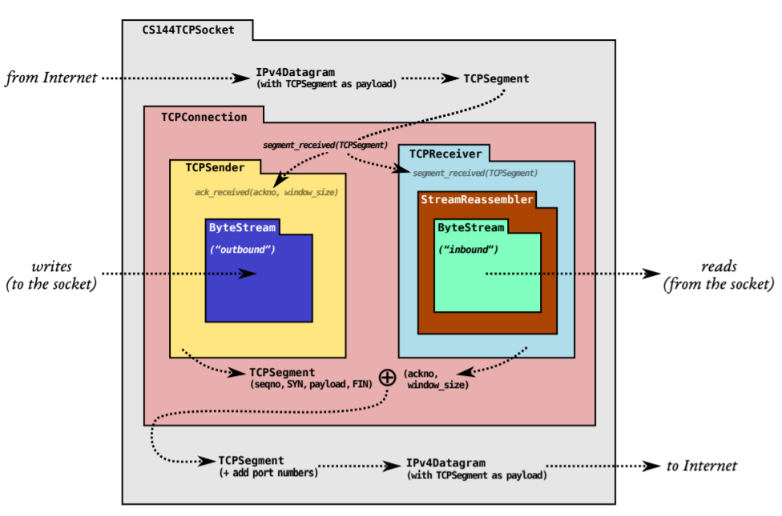
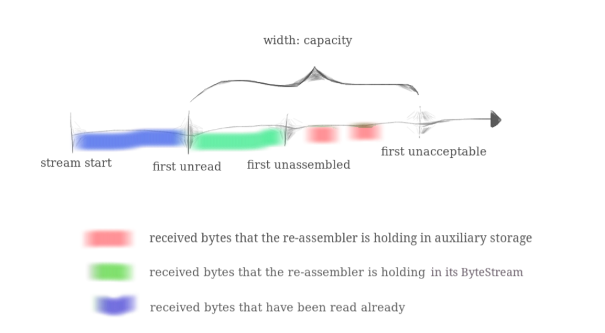

# CS144-ComputerNetworking-Lab1

> Stanford CS144 Introduction to Computer Network课程Project的lab1，这个lab需要我们实现一个流重组器(Stream Assembler)对分段的字符串进行重组，这个结构在后续的lab中非常重要

## Overview

在lab0中，我们实现了一个可信的顺序字节流数据结构，然而，网络通信可能是best-effort的，发送的数据段也会出现丢失，重复，被改写，被打乱等情况，这个时候，我们就需要在收发两端对收到的数据段进行整理和重组，从一系列杂乱的数据段中恢复出完整的数据报，并存储在lab0实现的`ByteStream`中，实现这个功能的数据结构被称为流重组器，因此lab1就需要我们实现这个**流重组器**`StreamReassembler`

## Sponge的架构



实验里提供了一个Sponge的架构图帮助我们更清晰的认识我们要实现的TCP/IP协议栈的基本架构，实验里IP相关的协议都是建立在TCP的基础上的，通过IPv4的格式从应用层传递到TCP对应的传输层，并以Segment作为单位进行收和发。

而TCP协议的实现被分成了Sender/Receiver/Connection三个重要的部分，其中Sender和Receiver是对TCP连接的发送方和接收方的抽象，Sender和Receiver中都维护了一个ByteStream用来存储TCP连接中产生的可信的信息，而TCP的Receiver中还有一个StreamReassembler接收发送过来的数据段，并将完整的部分写到ByteStream中去。而Connection是对TCP连接的一个总体抽象，它需要通过三次握手建立TCP连接，并且通过四次挥手关闭TCP连接，然后在Sender和Receiver之间建立起可信的传输通道并进行消息的收发。这几个部分需要在接下来的lab中逐一实现。

## 流重组器

### 功能描述

前面已经说过，TCPSender会把一个报文拆分成若干个数据段发送出来，但是发送的过程中，数据段(segment)可能会出现丢失、重复、覆盖、打乱顺序等多种异常情况，而Receiver需要做的就是在接收到这些零散的segment之后，将它们拼回原本的数据，并且将拼好的段存储在一个ByteStream中，同时，流重组器接收到的segment中的每一个字节都有其对应的index，而具体的实现中只给出当前segment的第一个字节的index，并根据偏移量计算整个segment中各个字节的index，同时，index是从0开始。

同时，流重组器在初始化的时候会使用一个capacity同时用作：

- ByteStream的容量，这个在lab0里重点提过，超过容量的字节不会被保存下来，这是为了保证TCP协议使用有限的内存，不会因为超规格输入而无限制地占用内存
- 未整流的字节的容量上限，我们需要暂时保存一些未整流到ByteStream对象中的segment，但是这些未完成整流的segment的总长度不能超过capability，多余的一样要舍弃

总的来说，ByteStream存储的内容和未整流的segment的关系如下图所示：



### 代码实现

首先我们需要在类中定义一些变量来实现StreamReassembler的功能，最关键的其实就是如何保存没有整流的数据，而网上很多公开的实现自己定义了一个类Segment并定义了每个Segment的开始index和结束index，然后用一个set来存储这些segment，虽然很合理但是也有点麻烦，我们这里采用了一个string直接来存储没有整流的字节，然后用一个bool类型的数组filled来标注这个临时string每个位置上的使用情况，用一个ByteStream来存储最终输出的结果。然后再定义一些其他变量，比如剩余的字节数量`_left_bytes`，还有流重组器每次整理的开始位置的标志`_start` 和EOF的标志等等。

```c++
class StreamReassembler {
  private:
    // Your code here -- add private members as necessary.
    ByteStream _output;  //!< The reassembled in-order byte stream
    size_t _capacity;    //!< The maximum number of bytes
    std::string _buffer;
    uint64_t _start, _start_index;
    uint64_t _left_bytes;
    bool _eof;
    std::unique_ptr<bool[]> _filled{};
}
```

我们要实现的方法有以下几个:

```c++
class StreamReassembler {
  public:
    StreamReassembler(const size_t capacity);
    void push_substring(const std::string &data, const uint64_t index, const bool eof);
    const ByteStream &stream_out() const { return _output; }
    ByteStream &stream_out() { return _output; }
    size_t unassembled_bytes() const;
    bool empty() const;
};
```

其中最麻烦的就是`push_substring`，其他的都是构造函数和Get类型的函数，没有什么难度，我们的主要工作量就是处理`push_substring`这个函数的逻辑，具体的代码如下：

```c++
void StreamReassembler::push_substring(const string &data, const size_t index, const bool eof) {
    uint64_t from = 0;
    if (index < _start_index) {
        from = _start_index - index;
    }
    uint64_t size = std::min(data.size(), _capacity - _output.buffer_size() - index + _start_index);
    for (uint64_t i = from; i < size; i ++) {
        uint64_t j = (i + _start + index - _start_index) % _capacity;
        _buffer[j] = data[i];
        _left_bytes += !_filled[j];
        _filled[j] = true;
    }
    uint64_t i = 0;
    std::stringstream segment;
    while (true) {
        uint64_t j = (_start + i) % _capacity;
        if (!_filled[j]) {
            break;
        }
        _filled[j] = false;
        _left_bytes --;
        segment << _buffer[j];
        i ++;
    }
    _start = (_start + i) % _capacity;
    _start_index = _start_index + i;
    _output.write(segment.str());
    // 判断是否达到了eof状态
    _eof |= (eof && size == data.size());
    if (_eof && _left_bytes == 0) {
        _output.end_input();
    }
}
```

- 总体的思路是先把传入的一个segment存放在临时buffer中，然后从ByteStream末尾的索引(就是start)开始找一个连续的字符串并存放到ByteStream对象中去
- 值得注意的是，判断EOF的时候不是简单的只判断输入的eof参数是不是true，还要注意写入临时buffer中的数据量是不是刚好能到输入data的末尾，因为data的末尾才代表了EOF，而buffer的容量有限，如果最后一个byte没有写入，那么实际上这个输入流就还没有到EOF的状态，所以这个时候还不能EOF，然后判断ByteStream也不仅要满足EOF，还要剩余的未处理的字节数量为0

$$
f=\sum_{i=1}^na_i
$$

