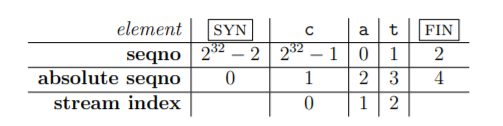
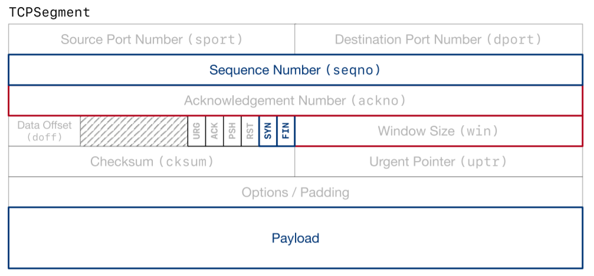

# CS144-ComputerNetworking-Lab2

> Stanford CS144 Introduction to Computer Network课程Project的lab2，这个lab主要任务是实现一个TCP的接收端TCPReceiver

## Overview

上一个lab中，我们实现了一个TCP接收端的流重组器，接下来的lab3就要我们实现整个TCP接收端的东西，相比于流重组器，TCP的接收端还要处理一些接收到的TCP报文段中的信息，并将数据交给流重组器进行处理，每个TCPReceiver实际上管理了一个流重组器。

同时接收端还需要告诉发送端一些重要的信息并以报文的形式返回，包括：

- 第一个没有进行整流的字节的索引，也被叫做`ackno`，这是接收端期望从发送端收到的第一个字节
- 第一个没有进行整流和第一个没有收到的索引之间的距离，这个距离也就是TCP的窗口大小，这是告诉发送端，发送出来的东西的大小不要超过窗口的大小。

上一次实验中给的一张图可以很好的表示这几个不同的索引之间的关系：


同时，`ackno`和窗口大小共同描述了接收端的窗口信息，告诉了发送方哪些东西是允许被发送的，通过这个窗口，接收端可以控制输入数据流的大小，并且让发送端控制发送的数据量，`ackno`实际上就是窗口的左端即开始的位置，而`ackno+window size`则是窗口的右端。下面我们开始具体的TCPReceiver的实现。

## 序列号格式的转换

首先我们要做的一件工作是进行序列号在64位格式和32位格式之间的转换，我们之前实现的流重组器中的每个字节拥有的index是64位的，而在TCP协议中，index则是用32位来表示的(对应TCP中的序列号seqno，每个报文的seqno代表了该报文中发送的第一个字节的index)，所以我们需要先实现32位index和64位的序列号之间的格式转换。

### 序列号的特点

虽然TCP协议中，序列号只有32位，最多能表示$2^{32}$字节，也就是4GB，但是TCP中的数据部分是没有长度限制的，所以如果一个字节的32位序列号到达了$2^{32}-1$，那么下一个字节的序列号就是变成0

同时序列号是从一个随机数字开始的，这是为了保证TCP协议在数据传输过程中的安全性，并且可以不受两个端点之前已经建立的TCP通信的影响(因为每次TCP连接建立之后，发送的数据的开始序列号都是一个随机数，如果都是从0开始，可能几个TCP之间会互相搞混)，我们将TCP中开始的第一个序列号称为Initial Sequence Number(ISN)，后面的字节的序列号也就依次往后+1并且要模$2^{32}$(这个操作称为wrapping)

而在TCP中，整个数据流的开始和结束位置上还各有一个特殊的字节分别表示数据流的开始(SYN)和结束(FIN)，同时TCP中保留了专门的几个位置来记录这些特殊的字节。

这个lab中，我们要做的第一个工作就是实现stream index和seqno之间的转换,stream index是每个字节在数据流中对应的64位索引，代表了数据流中有效字节的相对位置，而seqno是TCP中的32位索引，从SYN开始，另外有一个概念叫做绝对序列号Absolute Sequence Number，代表了每个字节相对于数据流头部SYN的位置(很奇怪不是吗，相对位置被称为绝对序列号)，我们可以结合一个例子来看，假设一个TCP报文包含了cat这3个字符，而且其SYN是$2^{32}-2$，那么这个报文对应的数据流中每个字节的seqno，absolute seqno和stream index分别是：



从中我们可以归纳出三种index的区别：

| 索引类型         | seqno              | absolute seqno       | stream index         |
| ---------------- | ------------------ | -------------------- | -------------------- |
| 起始点           | ISN                | 从0开始              | 从0开始              |
| 是否包含SYN和FIN | 包含               | 包含                 | 不包含               |
| 长度             | 32位，需要wrapping | 64位，不需要wrapping | 64位，不需要wrapping |

### 代码实现

我们要实现的其实就是两个函数wrap和unwrap，其中wrap是将64位的absolute seqno转化成为32位的seqno，而unwrap则反之。wrap实际上就是根据ISN的值转换成32位的seqno，不过值得注意的是，在unwrap的过程中，32位转换成64位可能不止一个结果，因为64位数字中只有最低的32位是确定的，而高位的32位是不能确定的，满足条件的数字可能有多个(以$2^{32}$为倍数再往上不断累加就可以)，因此，sponge中设定了一个64位的数字checkpoint作为监督，题目要求生成的seqno必须是所有可能结果中最接近checkpoint的那个。

wrap的实现非常简单，而unwrap就需要稍微注意一下，因为需要考虑checkpoint，我们可以采用如下方式快速计算离checkpoint最近的seqno——考虑到最接近checkpoint的结果应该有两个候选答案，分别是checkpoint左右侧离checkpoint最近的那个seqno，我们只要根据简单的小学数学知识找到左边那个，然后加上$2^{32}$就可以找到右边那个，然后比较一下哪个更合适就可以。最终代码如下：

```c++
WrappingInt32 wrap(uint64_t n, WrappingInt32 isn) {
    // uint64 to uint32
    uint32_t offset = n & 0xFFFFFFFF;
    return WrappingInt32{isn + offset};
}

uint64_t unwrap(WrappingInt32 n, WrappingInt32 isn, uint64_t checkpoint) {
    // change the checkpoint to a seqno
    uint32_t offset = n - isn; // the absolute seqno
    if (checkpoint <= offset) {
        return offset;
    }
    // find the closest offset t checkpoint
    uint64_t overflow_part = (checkpoint - offset) / (1ul << 32);
    uint64_t left_closest = offset + overflow_part * (1ul << 32);
    uint64_t right_closest = left_closest + (1ul << 32);
    if (checkpoint - left_closest < right_closest - checkpoint) {
        return left_closest;
    }
    return right_closest;
}

```


## TCPReceiver

TCPReceiver的主要功能是接收Sender发送的TCP报文段(TCP报文的格式可以见下图)，并进行对应的处理，Sponge中实现了TCPSegment类来表示TCP的一个报文段，我们需要重点关注的部分包括seqno，SYN/FIN标记等等。



我们需要重点关注的函数有这样几个：

```c++
class TCPReceiver {
    //! Our data structure for re-assembling bytes.
    StreamReassembler _reassembler;
    std::unique_ptr<WrappingInt32> _isn;

    //! The maximum number of bytes we'll store.
    size_t _capacity;

  public:
    std::optional<WrappingInt32> ackno() const;
    size_t window_size() const;
    //! \brief number of bytes stored but not yet reassembled
    size_t unassembled_bytes() const { return _reassembler.unassembled_bytes(); }
    std::optional<WrappingInt32> ackno() const;
    //! \brief handle an inbound segment
    void segment_received(const TCPSegment &seg);
};
```

其中`segment_received`函数主要用来处理收到的TCP段，这里主要依赖我们之前实现的流重组器，而`ackno`函数表示要Receiver期望收到的ackno，`window_size`表示当前Receiver的窗口大小的上限。

### ackno和window_size

这个方法需要我们返回Receiver的ackno，前面说过ackno代表的就是第一个没有收到的字节的index，并且要用TCP能接受的32位格式，同时，如果ISN还没有被设置(即Receiver还没有收到包含SYN的报文)时，这个函数要返回空指针，所以它的具体实现如下：

```c++
optional<WrappingInt32> TCPReceiver::ackno() const {
    if (_isn == nullptr) {
        return nullopt;
    } else {
        uint64_t n = _reassembler.stream_out().bytes_written() + 1;
        n += static_cast<uint64_t>(_reassembler.stream_out().input_ended());
        return wrap(n, *_isn);
    }
}
```

这里其实就是找到流重组器没有写入的第一个字节的下标并转化成32位格式。

而window_size这个函数只需要计算当前Receiver的窗口大小，即第一个没有整流的字节到第一个没有收到的字节的下标之差。

```c++
size_t TCPReceiver::window_size() const {
    return _capacity - _reassembler.stream_out().buffer_size();
}
```

### segment_received

而segment_received方法则麻烦一点，它的主要作用有两个：

- 在必要的时候设置ISN，ISN时TCP连接中需要传输的数据的第一个字节的index，我们需要关注发送过来的报文是不是有SYN标记为True的，有SYN=True的报文才是逻辑上的第一个报文，这个时候它的seqno就要被拿来当作ISN
- 将收到的数据放到流重组器中进行整流，同时要注意报文中的FIN标记，如果发现了FIN=True表明这个报文的最后一个字节就是整个TCP数据流的结束，这个时候要通知流重组器结束TCP报文的整流。

在ISN被设定好之前，Receiver会**丢弃收到的其他报文**(其实就是不做对应的处理)

```c++
void TCPReceiver::segment_received(const TCPSegment &seg) {
    WrappingInt32 seqno = seg.header().seqno;
    if (_isn == nullptr) {
        if (seg.header().syn == true) {
            WrappingInt32 seq(seqno);
            _isn.reset(new WrappingInt32(seq));
            _reassembler.push_substring(string(seg.payload().str()), 0, seg.header().fin);
        }
    } else {
        uint64_t abs_seqno = unwrap(seqno, *_isn, _reassembler.stream_out().bytes_written() + 1);
        if (abs_seqno == 0) {
            return;
        }
        uint64_t index = abs_seqno - 1;
        string data = string(seg.payload().str());
        _reassembler.push_substring(data, index, seg.header().fin);
    }
}
```

因此我们首先要从TCP报文段中获得seqno，然后等待SYN报文到了来设置ISN，之后每次收到报文，先计算它的**绝对seqno，如果是0表示重复的SYN报文**，这个时候就不需要再进行处理了，然后关注一下TCP段的fin标签并且将东西都一股脑倒入reassembler中即可。