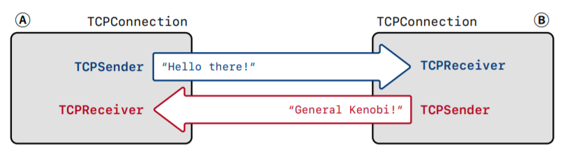

# CS144-ComputerNetworking-Lab4

> Stanford CS144 Introduction to Computer Network课程Project的lab4，这个lab主要任务是整合之前的Sender和Receiver，组合成TCP Connection，这个实验结束后，这门课就先暂告一段落了。

## Overview

在CS144之前的lab中，我们实现了TCP的Sender和Receiver，分别用来收发TCP报文，而在这个lab中，我们需要实现的是CS144的整个用户态TCP协议Sponge的最后一个部分，即TCP的连接，连接(Connection)是网络通信协议中最重要的一个抽象，它需要整合TCP连接中位于一头的一对发送端和接收端，来实现在两个端点之间建立可靠有效的TCP连接的目的。

我们之前在lab中所说的，TCP的每个端点有一对处于流量控制下的字节流，分别就是Sender和Receiver，而这个lab要实现的TCP Connection，就相当于TCP连接中的一个端点，也叫做Peer，如下图所示：



## TCP Connection

TCP的Connection需要满足这样一些基本的功能和需求。

### 接收报文段

TCP Connection在收到来自互联网的TCP报文的时候，会调用`segment_received`这个函数，当这个方法被调用的时候，TCP Connection需要执行的操作分成如下几个步骤：

- 如果报文中有RST标记，表明整个TCP发生故障，需要立即断开连接并将Sender和Receiver的状态都改成error
- 否则就将这个报文段发送给Receiver并让它进行处理，并重点关注报文的seqno，payload和SYN/FIN两个标签
- 如果报文中有ACK标记，那么就需要通知Sender来发送当前所需的ackno和窗口大小
- 如果报文有数据并且占用了seqno，那么Connection保证至少要有一个报文被发出去作为回复
- 另外还有一种特殊的情况，就是TCP Connection需要回答一些查询keep-alive状态的报文段，这个时候的报文段会使用无效的seqno来检测当前的Connection是不是依然处于alive的状态，这个时候也需要用空的报文段作为回复。

### 发送报文段

TCP Connection会通过互联网不断向外发送TCP段，发送报文段的步骤可以概括为：

- TCP Sender要负责将发送的报文段push到输出队列中，并且要填写好seqno和payload以及SYN/FIN等关键信息
- 在发送一个报文段之前，TCP Connection会询问Receiver发送相关的信息，包括ackno和窗口大小，如果有ackno那么就会在报文段的ACK标识处进行标记，上一次我们的实现的Sender其实已经实现了这个功能，现在只需要让Connection调用这个功能就可以

### 时间管理

TCP Connection中也有一个tick函数会定期被调用，当这个函数被调用的时候，需要做的事情包括：

- 通知Sender当前已经通过的时间，调用Sender的tick函数
- 如果发现连续重传的次数超过了一个上界，就断开TCP连接，表示这个时候网络不稳定，报文传输不出去
- 在必要的时候关闭当前的连接，这个时候的关闭被称为clean shutdown具体的可以看下一节

## TCP连接的结束

这个lab中需要实现的很重要一项功能是判断TCP连接在什么时候会结束。在TCP连接结束的时候也需要进行一系列的操作，比如停止发送ackno和将active状态改成false

一般来说连接关闭的情况有两种，一种是unclean的，即发送/接收的TCP报文中，这种情况下管理输入输出的字节流都应该设置成error状态，并且将active设置成false，另一种是clean shutdown，是在没有error的情况下结束当前的连接，这时候需要保证TCP连接的两端都能确认对面已经知道了连接要结束的信息，并在一个合适的时间关闭TCP连接，整个过程可以概括为下面几步：

- 输入字节流已经被全部整流并且收到了EOF
- 输出流已经被本地应用关闭并且全部发送给了另一个端点
- 输出流中的报文已经全部被另一个端点收到并确认了
- 本端点的TCP连接可以知道**另一个端点已经满足了前面三个条件**

这个归结起来其实就是TCP连接关闭的时候需要进行“四次握手”，只不过这里没有显式的提出这个概念，而是将四次握手拆分成了两个端点各自的要求。

## 代码实现

### 类定义

首先定义几个要用到的类变量以及代码实现中需要多次使用的函数

```c++
class TCPConnection {
  private:
    TCPConfig _cfg;
    TCPReceiver _receiver{_cfg.recv_capacity};
    TCPSender _sender{_cfg.send_capacity, _cfg.rt_timeout, _cfg.fixed_isn};

    //! outbound queue of segments that the TCPConnection wants sent
    std::queue<TCPSegment> _segments_out{};

    //! Should the TCPConnection stay active (and keep ACKing)
    //! for 10 * _cfg.rt_timeout milliseconds after both streams have ended,
    //! in case the remote TCPConnection doesn't know we've received its whole stream?
    bool _linger_after_streams_finish{true};
    bool _is_active = true, _fin_sent = false,_fin_sent_and_acked = false;
    uint64_t _segment_received_ms = 0, _ms = 0;

    void send_reset();

    void send_segment(const TCPSegment &segment);

    void send_all_segments();
}
```

然后我们先来实现这几个自己定义的常用函数，函数的功能从它的函数签名就可以读出来：

```c++
void TCPConnection::send_all_segments() {
    while (!_sender.segments_out().empty()) {
        send_segment(_sender.segments_out().front());
        _sender.segments_out().pop();
    }
}

void TCPConnection::send_segment(const TCPSegment &segment) {
    TCPSegment seg = segment;
    if (_receiver.ackno() != std::nullopt) {
        seg.header().ack = true;
        seg.header().ackno = *_receiver.ackno();
    }
    seg.header().win = _receiver.window_size();
    _fin_sent |= seg.header().fin;
    _segments_out.push(seg);
}

void TCPConnection::send_reset() {
    while (!_sender.segments_out().empty()) {
        _sender.segments_out().pop();
    }
    _sender.send_empty_segment();
    auto segment = _sender.segments_out().front();
    _sender.segments_out().pop();

    segment.header().rst = true;

    send_segment(segment);
    _is_active = false;
    _receiver.stream_out().set_error();
    _sender.stream_in().set_error();
}
```


### 建立与中止连接

建立连接实际上就是让Sender填满窗口大小之后发送出所有对应的TCP段，而关闭连接的时候则是先让Sender将输入流关闭然后把所有的TCP段发送出去

```c++
void TCPConnection::end_input_stream() {
    _sender.stream_in().end_input();
    _sender.fill_window();
    send_all_segments();
}

void TCPConnection::connect() {
    _sender.fill_window();
    send_all_segments();
} 
```

### tick

Connection的tick方法主要是调用Sender的tick然后判断一下重传的次数是不是超过上限了，如果没有就正常发送，如果超过上限就关闭连接。

```c++
void TCPConnection::tick(const size_t ms_since_last_tick) {
    _ms += ms_since_last_tick;
    _sender.tick(ms_since_last_tick);
    if (time_since_last_segment_received() >= 10 * _cfg.rt_timeout) {
        if (_fin_sent_and_acked && _receiver.stream_out().input_ended()) {
            _is_active = false;
        }
    }
    if (_sender.consecutive_retransmissions() <= TCPConfig::MAX_RETX_ATTEMPTS) {
        send_all_segments();
    } else {
        send_reset();
    }
}
```

### segment_received

Connection用来处理收到的TCP报文段的函数，需要根据SYN/FIN/RST来做出不同的操作。

```c++
void TCPConnection::segment_received(const TCPSegment &seg) {
    _segment_received_ms = _ms;
    if (seg.header().rst) {
        _is_active = false;
        _sender.stream_in().set_error();
        _receiver.stream_out().set_error();
    } else {
        _receiver.segment_received(seg);
        if (seg.header().ack) {
            _sender.ack_received(seg.header().ackno, seg.header().win);
        }
        if (_fin_sent) {
            if (seg.header().ackno == _sender.next_seqno()) {
                _fin_sent_and_acked = true;
                if (!_linger_after_streams_finish) {
                    _is_active = false;
                }
            }
        }
        if (_receiver.stream_out().input_ended() && !_fin_sent) {
            _linger_after_streams_finish = false;
        }
        if (_receiver.ackno() != std::nullopt) {
            _sender.fill_window();
            if (_sender.segments_out().empty() && seg.length_in_sequence_space() >= 1) {
                _sender.send_empty_segment();
            }
            send_all_segments();
        }
    }
}
```

## 总结

到这里为止，CS144这门课的TCP实现就差不多结束了，回过头来看这样写一个非常Naive的用户态TCP协议确实挺有意思，一路过来的收获也不少，那么我们下一门课见。