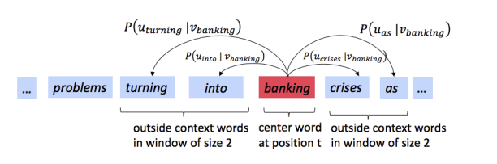
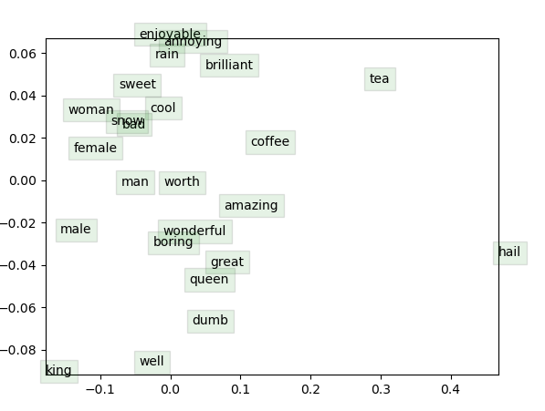

# Stanford-CS224N-Assignment1&2札记：词向量的推导和实现

> 做Stanford CS224N Deep Learning for NLP课程的作业的一些笔记，第一部分是Assignment1和Assignment2，这两个作业和起来完成了从滑动窗口和同现矩阵开始到Word2Vec模型的公式推导和代码实现，并在简单的数据集上进行了实验，以下是具体的实现步骤

## Assignment1：Word Vectors

这是CS224N的作业1，主要对词向量进行了一定的探索，属于非常基础的编程作业。

### 基于计数的词向量

基于计数的词向量通过构建共现矩阵并进行SVD分解来提取单词的特征，下面是具体的步骤。

#### 计算不同的单词的出现情况

首先我们需要统计语料库中不同的单词的出现情况，每种单词只能计算一次，并且要另外考虑两个token `<start>,<end>`分别表示句子的开头和结尾。说白了就是用set来统计不同单词的数量。

```python
def distinct_words(corpus):
    """ Determine a list of distinct words for the corpus.
        Params:
            corpus (list of list of strings): corpus of documents
        Return:
            corpus_words (list of strings): sorted list of distinct words across the corpus
            num_corpus_words (integer): number of distinct words across the corpus
    """
    corpus_words = ['<END>', '<START>']
    num_corpus_words = -1
    
    # ------------------
    # Write your implementation here.
    word_set = set()
    for i in corpus:
        for j in i:
            if j != '<END>' and j != '<START>':
                word_set.add(j)
    corpus_words += list(word_set)
    num_corpus_words = len(corpus_words)
    # ------------------

    return sorted(corpus_words), num_corpus_words
```


#### 构建Co-occurence矩阵

首先探究词向量的第一步是构建语料库的共现矩阵，同时要构建一个单词-索引的映射关系，用**数字形式的索引**来表示单词，并将单词共同出现的情况统计到矩阵中，形成如下图所示的矩阵：


```python
def compute_co_occurrence_matrix(corpus, window_size=4):
    words, num_words = distinct_words(corpus)
    M = np.zeros((num_words, num_words))
    word2ind = {}
    
    # ------------------
    # Write your implementation here.
    for i in range(num_words):
        word2ind[words[i]] = i
    for i in corpus:
        for j in range(len(i)):
            for k in range(-window_size, window_size):
                if j + k >= 0 and j + k < len(i) and k != 0:
                    M[word2ind[i[j]]][word2ind[i[j + k]]] += 1
                    M[word2ind[i[j + k]]][word2ind[i[j]]] += 1
    # ------------------

    return M, word2ind
```

#### 进行SVD分解

然后将得到的共生矩阵进行SVD分解得到每个单词的表示向量(至于可解释性这里先不考虑)，SVD分解的示意图如下：


- 这里的SVD直接调用scipy库函数就可以

```python
def reduce_to_k_dim(M, k=2):
    n_iters = 10     # Use this parameter in your call to `TruncatedSVD`
    print("Running Truncated SVD over %i words..." % (M.shape[0]))
    
        # ------------------
        # Write your implementation here.
    svd = TruncatedSVD(n_components=k, n_iter=n_iters)
    svd.fit(M)
    M_reduced = svd.transform(M)
        # ------------------

    print("Done.")
    return M_reduced
```

#### 对词向量进行可视化

调用matplotlib对生成的词向量进行可视化，为了方便这里已经采用了二维的词向量，最终得到的词向量在二维平面中的可视化结果如下：


- 分析可以发现类似的单词容易相聚在一起，即他们的词向量是相似的，比如油和能源，石油和工业，都是有一定内在逻辑联系的。

### 基于预测的词向量

基于预测的词向量相比于基于计数的词向量更能够学到单词之间的逻辑联系，因为基于计数的方法只统计了指定中心单词的滑动窗口范围内出现的单词情况，而**没有具体考虑这个窗口内的单词相对于中心词的距离**，基于预测的词向量则是用中心单词来预测附近各个位置上可能出现的单词的概率分布(也可以用两遍出现的单词来预测中间词出现的情况)，这里我们依然选择了和上面一样的几个单词，并使用PCA对已经训练好的GLOVE词向量进行降维和可视化，得到的结果是：


- 可以发现单词之间的相对位置和上面用共现矩阵+SVD分解得到的结果基本保持一致
- 下面有一些探索单词相似性的任务，这里就不多说了，直接快进到第二部分推导和实现Word2Vec


## Assignment2：Word2Vec

Assignment2的主要目标是实现一个skip-gram形式的Word2Vec，skip-gram实际上就是要用中心词来预测滑动窗口内各个位置上的上下文单词，即：



同时Word2Vec根据损失函数和目标的不同可以分成Naive-Softmax和负采样两种不同的实现方式

### Naive-Softmax形式

我们给每个单词定义了两个词向量，记作$$u_c, v_c$$，分别用来表示这个单词作为上下文和中心词时候的词向量，并用向量的点积和softmax定义指定中心词c的条件下单词o出现在上下文的概率分布，即：
$$
P(O=o \mid C=c)=\frac{\exp \left(\boldsymbol{u}_{o}^{\top} \boldsymbol{v}_{c}\right)}{\sum_{w \in \operatorname{Vocab}} \exp \left(\boldsymbol{u}_{w}^{\top} \boldsymbol{v}_{c}\right)}
$$
我们将词向量按列进行排序构成两个矩阵U和V，这些矩阵的每一列都对应了一个词向量，并且定义损失函数：
$$
\boldsymbol{J}_{\text {naive-softmax }}\left(\boldsymbol{v}_{c}, o, \boldsymbol{U}\right)=-\log P(O=o \mid C=c)
$$
这个形式的损失函数被称为Naive-Softmax形式的损失函数，我们用$$y, \hat y$$分别表示正确的结果和模型预测出的结果，其中正确的结果是一个**one-hot向量**，因为出现的单词是确定的，而预测出的结果是一个概率分布，概率大小表示每个单词在当前位置上出现的概率，两个向量的维度都和词汇表的大小一样。我们可以证明$$y, \hat y$$的交叉熵和Naive-Softmax损失函数是等价的。

#### 损失函数和交叉熵的等价性证明

根据交叉熵和$$y, \hat y$$的定义，我们可以推算出：
$$
-\sum_{w \in V o c a b} y_{w} \log \left(\hat{y}_{w}\right)=-\log \left(\hat{y}_{o}\right)=-\log P(O=o,C=c)
$$

#### 梯度的计算

在这个作业中我们需要手动实现Word2Vec算法的所有步骤，因此也需要进行梯度的计算和更新，首先我们来推导Naive-Softmax损失函数对于U，V的梯度。
$$
\begin{aligned}
\frac{\partial J(v_c,o,U)}{\partial v_c}&=\frac{\partial \log\sum_{w\in Vocab}\exp(u_w^Tv_c)}{\partial v_c}-u_o\\
&=\frac{\partial \sum_{w\in Vocab}u_w\exp(u_w^Tv_c)}{\partial \sum_{w\in Vocab}\exp(u_w^Tv_c)}-u_o\\
&=\sum_{w\in Vocab}u_w\hat y_w-u_o\\&=(\hat y- y)U^T
\end{aligned}
$$
而对于$$u$$ 我们需要分成两种情况，首先是$$u=u_o$$的情况
$$
\begin{aligned}
\frac{\partial J(v_c,o,U)}{\partial u_o}&=\frac{\exp(u_o^Tv_c)v_c}{\sum_{w\in Vocab}\exp(u_w^Tv_c)}-v_c=(P(o|c)-1)v_c=(\hat y_o-y_o)^Tv_c
\end{aligned}
$$
接着是$$u\not= u_o$$的情况
$$
\begin{aligned}
\frac{\partial J(v_c,o,U)}{\partial u_w}&=\frac{\exp(u_w^Tv_c)v_c}{\sum_{w\in Vocab}\exp(u_w^Tv_c)}=P(w|c)v_c=(\hat y_w-y_w)^Tv_c
\end{aligned}
$$

- 综合上面两种情况，我们可以得到：

$$
\frac{\partial J(v_c,o,U)}{\partial U}=(\hat y-y)^Tv_c
$$


### 负采样形式

#### sigmoid函数

sigmoid损失函数是一种非常常见的激活函数，负采样中就使用了sigmoid函数作为激活函数，其形式是：
$$
\sigma(x)=\frac{1}{1+e^{-x}}=\frac{e^x}{1+e^x}
$$
sigmoid一个非常重要的性质是其关于x的梯度可以表示成sigmoid函数本身的一些四则运算，即：
$$
\sigma'(x)=\frac{e^x}{(1+e^x)^2}=\sigma(x)(1-\sigma(x))
$$
这样一来就有：
$$
[\log \sigma(x)]'=\frac{\sigma'(x)}{\sigma(x)}=1-\sigma(x)
$$

- 这个性质在下面的梯度计算中非常有用

#### 损失函数与梯度计算

基于负采样的模型将训练的目标变成了让模型具有**分辨某个词是不是应该出现在某个位置的能力**，为了学习到这种分辨能力，**采用了负样本和正样本形成对比**，增强模型的表达能力，负样本就是在语料库中随机选择的一个单词，大部分时候放在指定中心词的上下文中是不能构成具有实际意义的句子的，模型通过将正负样本进行对比学习出对单词的表示能力。

- 当然这是我个人的理解

因此基于负采样的训练方式提出的损失函数是下面这种形式的：
$$
\boldsymbol{J}_{\text {neg-sample }}\left(\boldsymbol{v}_{c}, o, \boldsymbol{U}\right)=-\log \left(\sigma\left(\boldsymbol{u}_{o}^{\top} \boldsymbol{v}_{c}\right)\right)-\sum_{k=1}^{K} \log \left(\sigma\left(-\boldsymbol{u}_{k}^{\top} \boldsymbol{v}_{c}\right)\right)
$$
这里的K是负样本的个数，从这个损失函数中我们也可以发现，负采样方法的计算量是比Softmax法小的，因为Softmax每次都需要计算整个Vocabulary的概率值，而负采样只需要关注K个采集到的负样本就可以了。

下面来计算负样本的梯度：
$$
\frac{\partial J}{\partial u_o}=\frac{\partial -\log(\sigma(u_o^Tv_c))}{\partial u_o}=(\sigma(u_o^Tv_c)-1)v_c
$$

$$
\frac{\partial J}{\partial u_w}=(1-\sigma(-u_w^Tv_c))v_c
$$

$$
\frac{\partial J}{\partial v_c}=\sum_{k=1}^K(1-\sigma(-u_w^Tv_c))u_k-(1-\sigma(u_o^Tv_c))u_o
$$


#### 考虑重复情况

上面的梯度推导基于一个假设，那就是采集到的负样本是互不相同的，但是随机采样如果得到了相同的负样本的话，梯度的计算实际上会有所区别，因为重复的样本在分别计算梯度的时候也需要考虑进去(属于同一个单词，重复了M次，这部分梯度就要扩大M倍)

### 滑动窗口

在推导完单个上下文单词和中心词的位置关系之后，我们需要考虑整个滑动窗口中的所有上下文单词，不过不管是Softmax还是负采样，都只需要将一次的结果累加若干次就可以，即：
$$
J_{\text {skip-gram }}\left(\boldsymbol{v}_{c}, w_{t-m}, \ldots w_{t+m}, \boldsymbol{U}\right)=\sum_{-m \leq j \leq m \atop j \neq 0} \boldsymbol{J}\left(\boldsymbol{v}_{c}, w_{t+j}, \boldsymbol{U}\right)
$$

- 到此为止，Word2Vec中的skip-gram模型的公式就推导完成了

## 代码实现

最后一步就是具体的代码实践了，事实上，大部分代码框架已经给出，我们只需要实现核心的几个函数就可以，写完之后发现实际的代码也就几十行，大部分都是对着上面的推导完成数值计算而已。

要实现的代码中包含几个关键的变量，如`centerWordVec` 表示中心单词向量，`outsideVectors`表示上下文中的向量

### Softmax的Loss和梯度

- 按要求实现Softmax损失函数和梯度的计算

```python
def naiveSoftmaxLossAndGradient(
        centerWordVec,
        outsideWordIdx,
        outsideVectors,
        dataset
):
    """ Naive Softmax loss & gradient function for word2vec models

    Implement the naive softmax loss and gradients between a center word's 
    embedding and an outside word's embedding. This will be the building block
    for our word2vec models. For those unfamiliar with numpy notation, note 
    that a numpy ndarray with a shape of (x, ) is a one-dimensional array, which
    you can effectively treat as a vector with length x.

    Arguments:
    centerWordVec -- numpy ndarray, center word's embedding
                    in shape (v_c, )
    outsideWordIdx -- integer, the index of the outside word
    outsideVectors -- outside vectors is
                    in shape (n, v_c)
                    for all words in vocab (transpose of U in the pdf handout)
    dataset -- needed for negative sampling, unused here.
    """
    # Please use the provided softmax function (imported earlier in this file)
    # This numerically stable implementation helps you avoid issues pertaining
    # to integer overflow.
    y_hat = softmax(np.matmul(outsideVectors, centerWordVec))
    loss = -np.log(y_hat[outsideWordIdx])
    y_hat[outsideWordIdx] -= 1.0
    gradCenterVec = np.matmul(y_hat, outsideVectors)  # (n, ) * (n, v_c) --> (v_c, )
    gradOutsideVecs = np.matmul(y_hat.reshape(-1, 1), centerWordVec.reshape(1, -1))
    return loss, gradCenterVec, gradOutsideVecs
```

### 负采样的Loss和梯度

- 按照上面的推导实现负采样下的损失函数和梯度即可

```python
def negSamplingLossAndGradient(
        centerWordVec,
        outsideWordIdx,
        outsideVectors,
        dataset,
        K=10
):

    # Negative sampling of words is done for you. Do not modify this if you
    # wish to match the autograder and receive points!
    negSampleWordIndices = getNegativeSamples(outsideWordIdx, dataset, K)
    indices = [outsideWordIdx] + negSampleWordIndices
    gradCenterVec = np.zeros_like(centerWordVec)
    gradOutsideVecs = np.zeros_like(outsideVectors)
    # loss function
    loss = -np.log(sigmoid(outsideVectors[outsideWordIdx].dot(centerWordVec)))
    for idx in negSampleWordIndices:
        loss -= np.log(sigmoid(-outsideVectors[idx].dot(centerWordVec)))
    # gradient
    gradCenterVec -= (1 - sigmoid(centerWordVec.dot(outsideVectors[outsideWordIdx]))) * outsideVectors[outsideWordIdx]
    for k in negSampleWordIndices:
        gradCenterVec += (1 - sigmoid(-centerWordVec.dot(outsideVectors[k]))) * outsideVectors[k]
    gradOutsideVecs[outsideWordIdx] = -(
            1 - sigmoid(centerWordVec.dot(outsideVectors[outsideWordIdx]))) * centerWordVec
    for k in negSampleWordIndices:
        gradOutsideVecs[k] += (1 - sigmoid(-centerWordVec.dot(outsideVectors[k]))) * centerWordVec
    return loss, gradCenterVec, gradOutsideVecs
```


### 包装成skip-gram模型

这一步实际上就是对一个滑动窗口里的所有上下文单词都计算一次loss和梯度并将结果进行汇总，具体的代码如下：

```python
def skipgram(currentCenterWord, windowSize, outsideWords, word2Ind,
             centerWordVectors, outsideVectors, dataset,
             word2vecLossAndGradient=naiveSoftmaxLossAndGradient):
    """ Skip-gram model in word2vec

    Implement the skip-gram model in this function.

    Arguments:
    currentCenterWord -- a string of the current center word
    windowSize -- integer, context window size
    word2Ind -- a dictionary that maps words to their indices in
              the word vector list
    word2vecLossAndGradient -- the loss and gradient function for
                               a prediction vector given the outsideWordIdx
                               word vectors, could be one of the two
                               loss functions you implemented above.
    """

    loss = 0.0
    gradCenterVecs = np.zeros(centerWordVectors.shape)
    gradOutsideVectors = np.zeros(outsideVectors.shape)

    currentCenterIdx = word2Ind[currentCenterWord]
    for word in outsideWords:
        loss_w, grad_cv, grad_ov = word2vecLossAndGradient(
            centerWordVectors[currentCenterIdx],
            word2Ind[word],
            outsideVectors,
            dataset
        )
        loss += loss_w
        gradCenterVecs[currentCenterIdx] += grad_cv
        gradOutsideVectors += grad_ov
    return loss, gradCenterVecs, gradOutsideVectors

```

### 训练和结果

上面的每一步系统中都给出了测试代码帮助我们完成coding工作，在实现了上面这些函数之后，我们还需要实现一个简单的SGD优化器，不过这个比较简单，只有两行代码，就不多说了，之后我们需要用作业提供的数据集和运行代码来进行训练，并将得到的结果进行二维平面上的可视化，最终在经历20000次迭代之后得到的结果是：



- 可以发现训练的结果还行，很多意义相近的单词的词向量都比较相似并且聚到了一起
- 到这里为止，CS224N的前两个作业就做完了，我们尝试了调用现有的词向量进行探索，也从头到尾自己实现了一个word2vec模型


