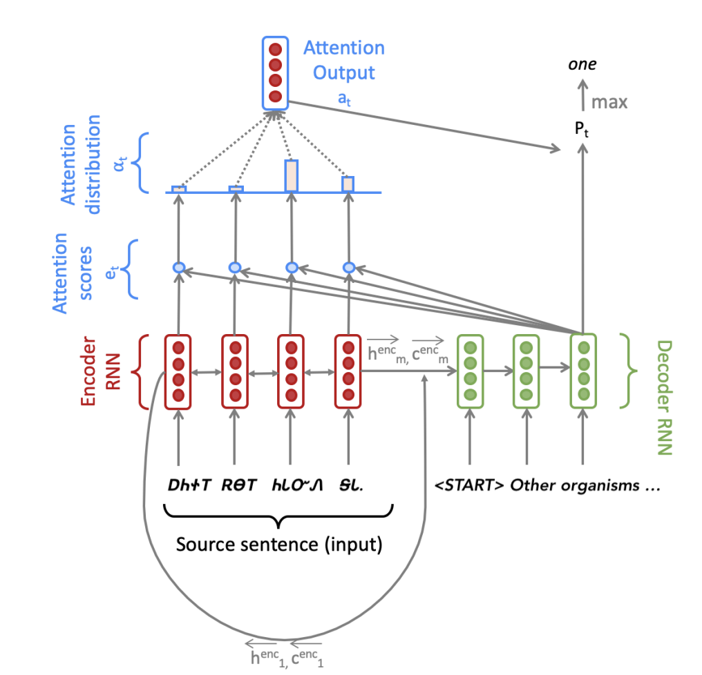

# Stanford-CS224N-Assignment4札记：Attention-Seq2Seq模型

> 做Stanford CS224N Deep Learning for NLP课程的作业的一些笔记，第三部分是Assignment4，这个作业实现了一个基于Attention机制的Seq2Seq模型用于实现机器翻译。

## 模型概览

这次的作业是利用PyTorch框架实现一个有注意力机制的Seq2Seq模型，并用于翻译任务。要实现的模型的总体架构如下图所示：



很明显模型被分成了Encoder和Decoder两个部分，作业首先比较详细的介绍了模型的基本架构。

### Encoder部分

Encoder部分主要是一个双向的LSTM模型，我们假设输入的句子是一个长度为m的单词序列，每个单词的嵌入表示都是e维的，我们首先需要将这个输入序列送到**双向LSTM中**得到hidden和cell的状态：
$$
\begin{aligned}
\mathbf{h}_{i}^{\text {enc }} &=\left[\overleftarrow{\mathbf{h}_{i}^{\text {enc }}} ; \overrightarrow{\mathbf{h}_{i}^{\text {enc }}}\right] \text { where } \mathbf{h}_{i}^{\text {enc }} \in \mathbb{R}^{2 h \times 1}, \overleftarrow{\mathbf{h}_{i}^{\text {enc }}}, \overrightarrow{\mathbf{h}_{i}^{\text {enc }}} \in \mathbb{R}^{h \times 1} \\
\mathbf{c}_{i}^{\text {enc }} &=\left[\overleftarrow{\mathbf{c}_{i}^{\text {enc }}} ; \overline{\mathbf{c}_{i}^{\operatorname{enc}}}\right] \text { where } \mathbf{c}_{i}^{\text {enc }} \in \mathbb{R}^{2 h \times 1}, \overleftarrow{\mathbf{c}_{i}^{\text {enc }}}, \overline{\mathbf{c}_{i}^{\text {enc }}} \in \mathbb{R}^{h \times 1}
\end{aligned}
$$
同时Encoder输出的结果不仅有hidden和cell的状态，还包括了Decoder的初始状态，在Seq2Seq模型中，Decoder的初始输入要用Encoder的最终输出状态进行投影来得到，又因为是双向LSTM，所以需要将两个方向的最终输出合并之后进行投影：
$$
\begin{array}{l}
\mathbf{h}_{0}^{\mathrm{dec}}=\mathbf{W}_{h}\left[\overleftarrow{\mathbf{h}_{1}^{\text {enc }}} ; \overrightarrow{\mathbf{h}_{m}^{\text {ent }}}\right] \text { where } \mathbf{h}_{0}^{\mathrm{dec}} \in \mathbb{R}^{h \times 1}, \mathbf{W}_{h} \in \mathbb{R}^{h \times 2 h}\\
\mathbf{c}_{0}^{\text {dec }}=\mathbf{W}_{c}\left[\overleftarrow{\mathbf{c}_{1}^{\text {encc }}} ; \mathbf{c _ { m } ^ { \text { enc } }}\right] \text { where } \mathbf{c}_{0}^{\text {dec }} \in \mathbb{R}^{h \times 1}, \mathbf{W}_{c} \in \mathbb{R}^{h \times 2 h}
\end{array}
$$

### Decoder部分

当Decoder有了初始状态之后，我们需要给Decoder输入一个目标句子，在第t步的时候，我们会查阅嵌入向量表来找到第t个位置对应的单词$$y_t$$ 并和**前面若干个步骤中的联合输出向量**(combined-output vector)$$o_{t-1}$$进行合并(这个向量初始化的时候是一个zero-vector)，得到一个维度为e+h的向量$$\bar y_t$$并输入到Decoder中，得到当前这一步的隐状态：
$$
\mathbf{h}_{t}^{\mathrm{dec}}, \mathbf{c}_{t}^{\mathrm{dec}}=\operatorname{Decoder}\left(\overline{\mathbf{y}_{t}}, \mathbf{h}_{t-1}^{\mathrm{dec}}, \mathbf{c}_{t-1}^{\mathrm{dec}}\right) \text { where } \mathbf{h}_{t}^{\mathrm{dec}} \in \mathbb{R}^{h \times 1}, \mathbf{c}_{t}^{\mathrm{dec}} \in \mathbb{R}^{h \times 1}
$$
然后我们可以用Decoder的结果来计算下一次的$$o_t$$，这里的做法就是结合encoder中的隐状态来做注意力的计算，具体的方法是：
$$
\begin{array}{c}
\mathbf{e}_{t, i}=\left(\mathbf{h}_{t}^{\mathrm{dec}}\right)^{T} \mathbf{W}_{\text {attProj }} \mathbf{h}_{i}^{\text {enc }} \text { where } \mathbf{e}_{t} \in \mathbb{R}^{m \times 1}, \mathbf{W}_{\text {attProj }} \in \mathbb{R}^{h \times 2 h} \\
\alpha_{t}=\operatorname{softmax}\left(\mathbf{e}_{t}\right) \text { where } \alpha_{t} \in \mathbb{R}^{m \times 1} \\
\mathbf{a}_{t}=\sum_{i=1}^{m} \alpha_{t, i} \mathbf{h}_{i}^{\text {enc }} \text { where } \mathbf{a}_{t} \in \mathbb{R}^{2 h \times 1}
\end{array}
$$
然后通过下面这样一串复杂的运算得到下一个联合输出向量：
$$
\begin{array}{r}
\mathbf{u}_{t}=\left[\mathbf{a}_{t} ; \mathbf{h}_{t}^{\mathrm{dec}}\right] \text { where } \mathbf{u}_{t} \in \mathbb{R}^{3 h \times 1} \\
\mathbf{v}_{t}=\mathbf{W}_{u} \mathbf{u}_{t} \text { where } \mathbf{v}_{t} \in \mathbb{R}^{h \times 1}, \mathbf{W}_{u} \in \mathbb{R}^{h \times 3 h} \\
\mathbf{o}_{t}=\operatorname{dropout}\left(\tanh \left(\mathbf{v}_{t}\right)\right) \text { where } \mathbf{o}_{t} \in \mathbb{R}^{h \times 1}
\end{array}
$$
然后我们就可以得到一个第t个步骤的所有可能的单词结果的概率分布，我们对其做softmax并用**交叉熵计算**损失函数就可以了。

老实说看完之后我都惊呆了，我不知道是谁想出来的这么复杂的策略，但事实证明这一套好像确实有效。

## 代码实现

虽然说总体的思路就和上面所说的内容差不太多了，但是具体的实现过程中还包含了一些trick

### Padding操作

Seq2Seq模型为了更好的进行批处理，需要统一每个批次中输入数据的长度，方法是将所有输入的句子扩展到和最长的句子一样长，空的位置用一个padding token填充，我们需要实现这一操作，代码比较简单：

```python
def pad_sents(sents, pad_token):
    """ Pad list of sentences according to the longest sentence in the batch.
        The paddings should be at the end of each sentence.
    @param sents (list[list[str]]): list of sentences, where each sentence
                                    is represented as a list of words
    @param pad_token (str): padding token
    @returns sents_padded (list[list[str]]): list of sentences where sentences shorter
        than the max length sentence are padded out with the pad_token, such that
        each sentences in the batch now has equal length.
    """
    sents_padded = []
    length = max([len(sentence) for sentence in sents])
    for sent in sents:
        sents_padded.append(sent + [pad_token] * (length - len(sent)))
    return sents_padded
```

### 词汇表和Embedding

我们需要建立两个词汇表，分别对应source和targrt两种语言的不同词汇，并需要加入padding token，这一步比较简单，直接使用`nn.Embedding()` 就可以了

### 模型的初始化

这一部分需要我们在`__init__`方法中定义若干关键的神经网络层，这一部分其实没啥好说的，就是对好输入输出的维度就可以了，特别要注意的一点是，`torch.nn.Linear()`是一个实现$$y=xW^T+b$$操作的层(对应W，如果有bias的话还包括b)，因此要注意观察任务中具体的输入和输出维度，**这个维度和模型中的参数维度是反过来的**，因为第一部分的模型中这个参数矩阵在前面，我一开始写的时候搞反了。

### 实现Encoder

虽然在模型中看起来实现一个Encoder只需要将输入数据丢进一个双向LSTM里就可以，但是实际上这里还有各种各样的操作要做：

1. 首先输入的是一系列经过填充的token，我们需要先得到这些token的embedding
2. 然后将其打包构成双向LSTM的输入X
3. 在输入encoder之后得到所有的隐层状态和最后一个位置的hidden和cell
4. 然后调用`pa d_packed_sequence`，并计算decoder中的初始状态作为结果。

- 这里的`pack_padded_sequence`和`pad_packed_sequence`两个方法的作用分别是将填充后的数据进行压缩，将压缩后的数据恢复成原本的状态，这是PyTorch提供给RNN以及LSTM等结构使用的，用来阻止填充用的token进入RNN或者LSTM，因为这些token是无效的，还会浪费算力，因此使用这样一对函数可以起到现将padding后的数据压缩投入网络中，然后再将结果重新填充得到输出结果

```python
def encode(self, source_padded: torch.Tensor, source_lengths: List[int]) -> Tuple[
        torch.Tensor, Tuple[torch.Tensor, torch.Tensor]]:
        """ 
        Apply the encoder to source sentences to obtain encoder hidden states.
        """
        embeddings = self.model_embeddings.source(source_padded)
        X = pack_padded_sequence(embeddings, source_lengths)
        enc_hiddens, (last_hidden, last_cell) = self.encoder(X)
        enc_hiddens, _ = pad_packed_sequence(sequence=enc_hiddens)
        enc_hiddens = enc_hiddens.permute(1, 0, 2)
        init_decoder_hidden = self.h_projection(torch.squeeze(torch.cat((last_hidden[0], last_hidden[1]), dim=-1)))
        init_decoder_cell = self.c_projection(torch.squeeze(torch.cat((last_cell[0], last_cell[1]), dim=-1)))
        dec_init_state = (init_decoder_hidden, init_decoder_cell)
        return enc_hiddens, dec_init_state
```

### 实现Decoder的总体逻辑

接下来我们需要实现decoder的基本逻辑，这里主要是实现decoder的循环操作，即得到通过decoder中的LSTM一步步得到联合输出向量并更新，输出下一步结果，最后将所有的联合输出向量返回，而每一步的隐状态和联合输出向量的计算则交给step这个函数完成。

```python
def decode(self, enc_hiddens: torch.Tensor,
               enc_masks: torch.Tensor,
               dec_init_state: Tuple[torch.Tensor, torch.Tensor],
               target_padded: torch.Tensor) -> torch.Tensor:
        """
        Compute combined output vectors for a batch.
        """
        # Chop of the <END> token for max length sentences.
        target_padded = target_padded[:-1]

        # Initialize the decoder state (hidden and cell)
        dec_state = dec_init_state

        # Initialize previous combined output vector o_{t-1} as zero
        batch_size = enc_hiddens.size(0)
        o_prev = torch.zeros(batch_size, self.hidden_size, device=self.device)
        combined_outputs = []
        enc_hiddens_proj = self.att_projection(enc_hiddens)
        Y = self.model_embeddings.target(target_padded)
        ys = torch.split(Y, 1, dim=0)
        for y in ys:
            Y_t = torch.squeeze(y)
            Y_bar_t = torch.cat((Y_t, o_prev), dim=-1)
            dec_state, combined_output, e_t = self.step(Y_bar_t, dec_state, enc_hiddens, enc_hiddens_proj, enc_masks)
            # append o_t to combined_outputs
            combined_outputs.append(combined_output.tolist())
            # update o_prev
            o_prev = combined_output
        combined_outputs = torch.tensor(combined_outputs)
        return combined_outputs
```


### 实现Decoder的逐步操作

这一步我们主要来实现step函数，这个函数的作用是实现decoder中需要进行循环的一些核心操作，包括将上一个hidden和cell状态输入decoder，然后对得到的结果做注意力计算，然后通过一系列莫名其妙的复杂运算得到当前步骤的联合输出向量并返回

```python
def step(self, Ybar_t: torch.Tensor,
             dec_state: Tuple[torch.Tensor, torch.Tensor],
             enc_hiddens: torch.Tensor,
             enc_hiddens_proj: torch.Tensor,
             enc_masks: torch.Tensor) -> Tuple[Tuple, torch.Tensor, torch.Tensor]:
        """ Compute one forward step of the LSTM decoder, including the attention computation.
        """

        combined_output = None
        dec_hidden, dec_cell = self.decoder(Ybar_t, dec_state)
        dec_state = (dec_hidden, dec_cell)
        e_t = torch.squeeze(torch.bmm(enc_hiddens_proj, torch.unsqueeze(dec_hidden, dim=2)), dim=-1)

        # Set e_t to -inf where enc_masks has 1
        if enc_masks is not None:
            e_t.data.masked_fill_(enc_masks.bool(), -float('inf'))
            
        # (b, src_len)
        alpha_t = F.softmax(e_t, dim=-1)
        a_t = torch.squeeze(torch.bmm(enc_hiddens.permute(0, 2, 1), torch.unsqueeze(alpha_t, dim=2)), dim=-1)
        U_t = torch.cat((a_t, dec_hidden), dim=-1)
        V_t = self.combined_output_projection(U_t)
        O_t = self.dropout(torch.tanh(V_t))
        combined_output = O_t
        return dec_state, combined_output, e_t
```

- Decoder中多处使用了squeeze和unsqueeze函数，主要作用就是对张量进行维度压缩或者增加(squeeze可以去掉张量中大小为1的维度，而unsqueeze则可以给张量增加一个大小为1的新维度)

## 模型训练

因为做这个作业的时候手里还没有GPU，因此就没有在GPU上进行训练和测试(如果是Stanford的学生按照guidance可以使用免费的Azure VM)，简单在本地试运行了一下发现可以跑起来，loss也在缓慢下降，就当作这次实验成功了吧。