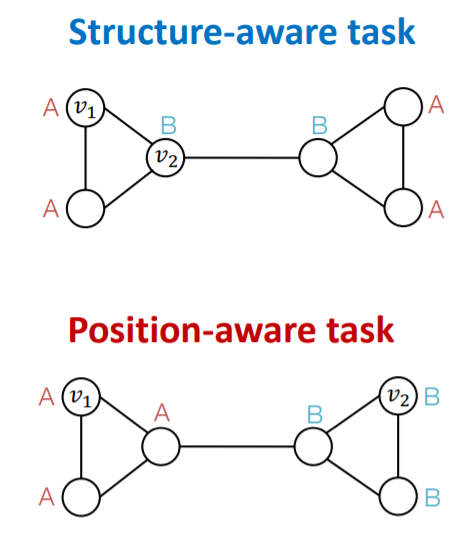
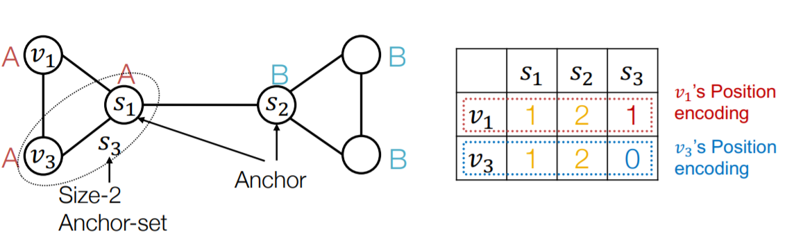
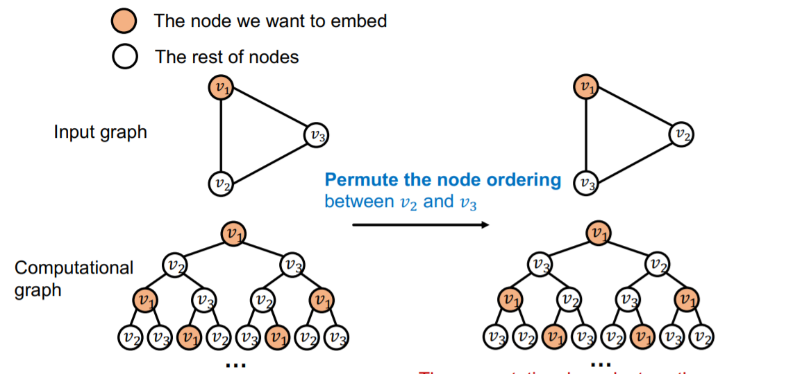
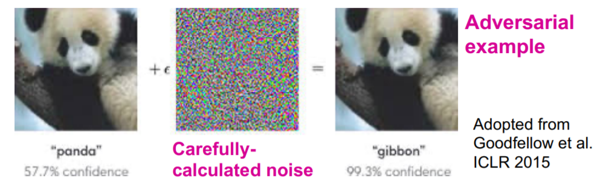
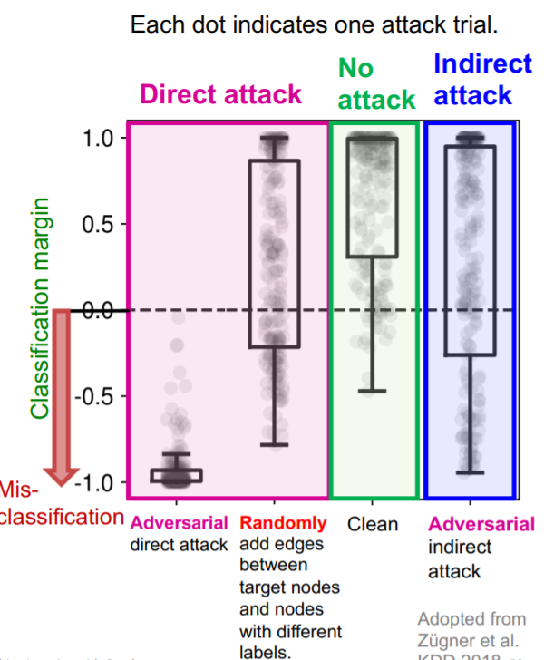

# CS224W：图机器学习10

## GNN前沿话题

​		本章内容继续回到图神经网络，来讨论一些GNN的高级话题，同时也是整个课程的结束部分。

### GNN的局限性

​		一个完美的GNN应该建立一个邻居结构到节点嵌入的单射，也就是一个邻居结构对应一个特定的单射，因此一个图中结构相同的节点的嵌入是一样的，结构不同的点的嵌入是不一样的

​		而问题就在于，就算是两个邻居结构相同的点，我们有的时候可能也希望它们的嵌入表示不同，这类任务被称为是Position-aware tasks，因此就算是一个完美的GNN也会在网格图等场景下失效。此外，基于消息传递机制的GNN不能学习出回路的长度，这就导致两个结构不同的节点学到的嵌入表示也可能是相同的(前面已经说过)

解决这两个问题的办法分别是：

- 问题1的解决方法是基于节点的position来生成节点的嵌入，经典案例是:Position-aware GNNs
- 问题2的解决方法是使用更好的消息传递方式，比如 Identity-aware GNNs

对于这些问题，一个很naive的解决方式是使用one-hot编码，但是这种方式的可扩展性很差，因为嵌入的维度是$O(N)$级别的

### Position-aware GNN

​		图中往往有两类任务，一类是基于结构的，一类是基于位置的，基于结构的任务需要考虑的关键是节点的结构，而基于位置的任务需要考虑的关键是节点在图中的“位置”，其区别就在于邻居结构是一种相对位置。GNN往往在基于结构的任务中表现比较好而在基于位置的任务中表现不好。

​		一个常见的解决方法是选用锚点，然后用相对于锚点的距离来对点进行分类，在这个过程中锚点充当了一个坐标轴，当然锚点可以有多个，更多的锚点就好像使用了更多的坐标轴去刻画点的位置。同时可以用这种方法对图中的节点进行位置编码。

​		要解决Position-aware的任务我们就必须使用跟position有关的信息，而是使用这些位置信息的方法有：

- Naive的方法：使用位置编码作为额外的节点特征，值得注意的是位置编码向量的每一个维度是可以任意排序的，因为每个锚点的选取顺序不影响节点的位置特征
- Rigorous的方法：使用一个神经网络来维护位置编码的任意排序中存在的不变信息

### Identity-aware GNN

​		我们已经知道GNN在Position-aware的任务中表现不好，那么GNN在Structure-aware的任务中表现如何呢？事实上表现依然不好，在多个层级(节点，边和图)的Structure-aware中依然表现不好，不同的输入仍然可能导致相同的计算图，这就无法区分不同的Structure

​		一种解决办法是，我们可以给每一个需要embedding的节点标上一个颜色，这样一来生成的计算图中也会有带颜色的节点，就可以区分出不同的节点，并且这种颜色不会随着节点顺序的变化而变化。

有了颜色之后，我们可以用颜色来区分计算图，这样一来之前会failure的例子也可以work了，这种方法在图分类任务中也可以使用。

​		而Identity-aware GNN正是使用了这种染色机制，并且使用了**异构的消息传递**，不同的节点之间的消息传递方式不同。一个ID-GNN中不同颜色之间消息传递的方式不同。因此ID-GNN可以挖掘出图中的环的信息，可以通过计算图来计算各种长度的环的个数。

ID-GNN的一个简化版本是ID-GNN-Fast，这种模型会统计计算图中各种长度的环的个数，并将其作为一个额外的节点特征，而ID-GNN实际上是一个“插件”，可以被添加到任意一种基于消息传递机制的GNN中，并被实验证明是非常有效的。

### GNN的鲁棒性

​		神经网络已经在很多领域取得了一定的应用，但一个很现实的问题是，这些模型真的能被用到现实生活中吗？事实上神经网络容易遭到对抗攻击，比如CNN

​		深度模型往往缺少鲁棒性，很容易被一些伪造的样本攻击导致性能极度下降，那么图神经网络的鲁棒性究竟如何呢？为了研究这个问题，我们假定问题是半监督的节点分类(只有少量的)，而模型是GCN

#### 问题的描述

​		我们可以将节点分为目标节点t和可攻击节点集合S，攻击的方式可以分为直接攻击和间接攻击。

- 直接攻击是指，可以攻击的节点就是目标节点的情况。间接攻击是可以攻击的节点不是目标节点的情况
- 攻击的方式主要有两种，可以直接给目标节点改变特征，也可以增减攻击节点的边

#### 问题的形式化

​		我们可以用形式化的数学语言来描述GNN对抗攻击这个问题，我们的目标是在尽可能少地改变图结构的情况下，尽可能改变目标节点预测的结果，这是因为如果把图改动的太离谱了，很容易就会被发现这是伪造的数据，因此要尽可能减少对图的修改。

​		我们假设图的邻接矩阵是$A$，图节点的特征矩阵是$X$，改变后的邻接矩阵和特征矩阵分别是$A',X'$，且要求$(A',X')\approx (A,X)$，并且假设需要预测的节点是v，从原始的图中GCN已经学习到了模型参数为：
$$
\boldsymbol{\theta}^{*}=\operatorname{argmin}_{\boldsymbol{\theta}} \mathcal{L}_{\text {train }}(\boldsymbol{\theta} ; \boldsymbol{A}, \boldsymbol{X})
$$
原始的label预测结果为：
$$
c_{v}^{*}=\operatorname{argmax}_{c} f_{\theta^{*}}(A, X)_{v, c}
$$
而GCN在新的伪造图上学习到的模型为：
$$
\boldsymbol{\theta}^{* \prime}=\operatorname{argmin}_{\boldsymbol{\theta}} \mathcal{L}_{\text {train }}\left(\boldsymbol{\theta} ; \boldsymbol{A}^{\prime}, \boldsymbol{X}^{\prime}\right)
$$
而新图上节点v的预测结果是
$$
C_{v}^{* \prime}=\operatorname{argmax}_{c} f_{\theta^{* \prime}}\left(A^{\prime}, X^{\prime}\right)_{v, c}
$$
我们的目标是$C_{v}\not= C_{v}^{*}$，为了让两个结果相差的尽可能大，我们可以把目标函数定义为：
$$
\Delta(v,A',X')=\log f_{\boldsymbol{\theta}^{* \prime}}\left(\boldsymbol{A}^{\prime}, \boldsymbol{X}^{\prime}\right)_{v, c_{v}^{* \prime}}-\log f_{\boldsymbol{\theta}^{* \prime}}\left(\boldsymbol{A}^{\prime}, \boldsymbol{X}^{\prime}\right)_{v, c_{v}^{*}}
$$
接下来就需要针对这个目标进行优化，然而邻接矩阵$A'$是一个离散的对象，不能使用基于梯度的优化方法，因此我们需要采用一定的优化策略选择好参数$A',X'$之后重新训练一个GCN来验证结果的好坏，现有的方法都是对这个优化目标的近似解，具体的这门课上也没有深入讲下去，需要阅读相关论文来深入学习。

#### 实验结果和结论

​		Slides里面举了一篇KDD18的论文作为例子，这篇论文中采用了直接攻击，间接攻击和不攻击三种策略，并在直接攻击中使用了随机攻击作为对照，得到的实验结果是：

​		我们发现GCN对抗直接攻击的能力比较差(对直接对抗攻击不鲁棒)，但是可以应付间接攻击和随机攻击。