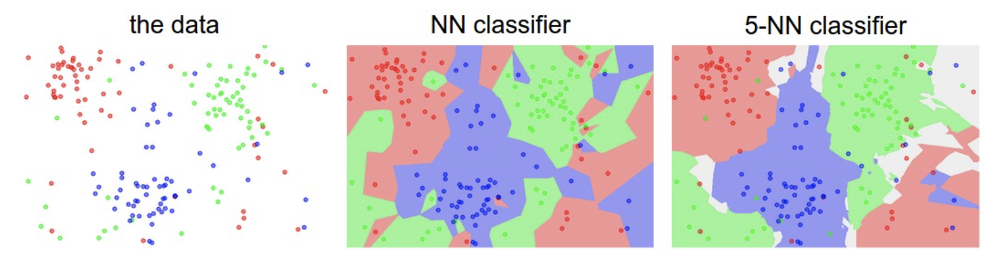
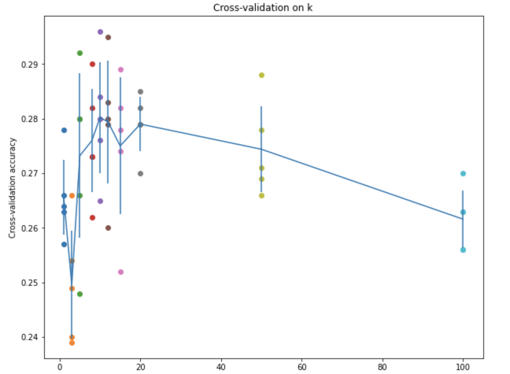
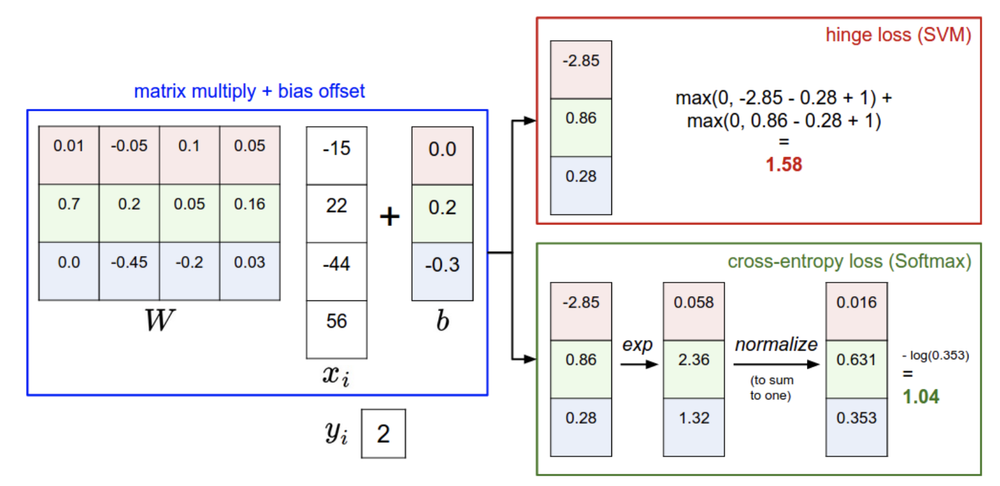

# Stanford-CS231N-Assignment札记1：kNN和线性分类器


> Stanford2021年春季课程CS231N:Convolutional Neural Networks for Visual Recognition的一些作业笔记，这门课的作业围绕视觉相关的任务，需要从底层手动实现一大批经典机器学习算法和神经网络模型，本文是作业的第一部分，包含了kNN和多种线性分类器的实现。

## 图像分类任务

### 图像分类任务简介

对图像的识别和感知是贯穿整个CS231N课程的核心任务，而在第一个阶段，我们的主要任务就是图像分类，并围绕这个任务学习，动手实现一系列相关的机器学习模型和神经网络算法。

首先要明确的是计算机看到的图像和人类肉眼看到的图像是不同的，我们所看到的彩色图像在电脑中实际上只是存储了RGB三个信道的像素值的数据结构，每个信道都包含一个像素矩阵，三个信道的像素矩阵组合起来才是我们看到的彩色图像。

同时图片分类任务中，图片往往有一个标签(Label)表明图片的性质，比如下面这个图片的标签就是cat，我们对图像进行分类实际上也就是要找到输入的图像所对应的标签。

<center><center/>

但是图像分类可能会面临以下挑战：


计算机没有人类的视觉，因此各种各样的情况都会导致对图片的识别能力下降，我们的任务就是找到效果好的图像分类器。


### 本课程的作业中使用的数据集

本课程的作业使用的图像分类数据集是非常经典的CIFAR-10数据集，这个数据集包含10个类别的标注好的图像，其中训练集有50000张图像而测试集有10000张，每张图像都是3信道32*32大小，图片主要被分成了下面10个不同的类别：


## kNN算法与向量化操作

关于kNN(k近邻)算法的具体介绍可以看我之前的一篇统计机器学习中的[文章](https://zhang-each.github.io/2021/08/22/ml6/) 简而言之，kNN就是将数据看成高维空间中的点，并且用距离目标点最近的k个点的标签来预测目标点的标签(所谓**近朱者赤近墨者黑**)，一般就是采用极大似然的思想，用k个邻居中出现次数最多的标签作为当前节点的标签。

- 因此我们首先需要将数据，也就是图片看成高维空间中的点，具体的操作是将图片的三个信道和像素矩阵拉平，成为一个3072维的向量(3*32\*32=3072)，这个操作被称为flatten，这样一来所有的图像就可以对应到3072维空间中的点
- 然后我们需要定义什么是“最靠近”，这实际上就是定义点和点之间的距离，这里我们使用的是L2的距离

因此，实际上kNN的训练过程就是记忆所有训练集的数据，然后在测试阶段，计算每个测试集输入对已知的N个点的距离(这里可以构成一个距离矩阵)，并在其中找出最小的k个。



### 计算距离矩阵：向量化的好处

写代码的第一步，我们需要计算输入的点和训练集中的点之间的L2距离，我们假设训练集是$N\times D$维度的，即N个数据，每个数据都是D维度，而测试集是$M\times D$的，我们需要计算的就是一个$M\times N$的距离矩阵。

我们首先用最naive的方式——二层for循环来实现距离的计算，具体的代码如下图所示：

```python
    def compute_distances_two_loops(self, X):
        num_test = X.shape[0]
        num_train = self.X_train.shape[0]
        dists = np.zeros((num_test, num_train))
        for i in range(num_test):
            for j in range(num_train):
      					dists[i][j] = np.sqrt(np.sum((X[i] - self.X_train[j]) ** 2))
        return dists
```

使用这个二层循环在jupyter notebook中进行测试，设置k=1发现最后的分类准确率大约是27.4%，不是很高，并且计算速度很慢，这是因为Python中处理for循环非常耗时，我们应该尝试使用更多numpy提供的api直接快速计算出整个距离矩阵而不依赖于for循环，这样就可以加快代码运行的速度，这个过程就是向量化——不是按照索引对数据一个个进行处理，而是**利用api和广播机制**，直接对所有输入数据一起进行操作，使用一个循环和不使用循环的kNN距离矩阵计算的代码实现如下：

```python
    def compute_distances_one_loop(self, X):
        num_test = X.shape[0]
        num_train = self.X_train.shape[0]
        dists = np.zeros((num_test, num_train))
        for i in range(num_test):
            dists[i, :] = np.sqrt(np.sum((X[i] - self.X_train) ** 2, axis=-1))
        return dists

    def compute_distances_no_loops(self, X):
        num_test = X.shape[0]
        num_train = self.X_train.shape[0]
        dists = np.zeros((num_test, num_train))
        dists = np.sqrt(
            np.sum(X ** 2, axis=-1).reshape(-1, 1) + np.sum(self.X_train ** 2, axis=-1) - 2 * np.matmul(X, self.X_train.T)
        )
        return dists
```

- 完全向量化的这段代码实现其实就是把$d=\sqrt{|X_{test}-X_{train}|^2}$ 进行展开之后得到的结果，值得注意的是训练集和测试集对应的两个矩阵在计算自己的模长的要对列进行求和
- notebook中提供了一个简单的运行时间比较，在10000条测试数据上三个向量化程度不同的算法的时间消耗分别是：

| 向量化程度  | 两层循环 | 一层循环 | 完全向量化 |
| ----------- | -------- | -------- | ---------- |
| 运行时间(s) | 35.7     | 25.6     | 0.17       |

可以看到向量化在数据量大的时候真的可以带来非常显著的性能提升。

### 实现kNN的预测过程

然后我们来实现kNN的决策过程，这里其实就是根据输入的$M\times N$的矩阵，对于每一行N个距离，选出下标最小的k个，并根据下标找到他们的标签并统计，然后用出现次数最多的作为结果就可以。

```python
    def predict_labels(self, dists, k=1):
        num_test = dists.shape[0]
        y_pred = np.zeros(num_test)
        for i in range(num_test):
            # A list of length k storing the labels of the k nearest neighbors to
            # the ith test point.
            closest_y = []
            # 找到k个最近的点
            closest_k = np.argsort(dists[i])[0: k]
            # 找到k个点对应的标签
            closest_y = self.y_train[closest_k]
            # 统计出现次数并得到预测结果
            y_pred[i] = np.bincount(closest_y).argmax()

        return y_pred
```

### kNN分类器的交叉验证

最后我们需要进行模型的交叉验证，这里将训练集分成了5折，交叉验证的方式可以用下面这张图来解释：


- 训练集被分成5份，每次训练选择4份作为训练集，1份作为验证集来调整超参数，测试集依然负责测试

同时选用不同的k值进行训练，最终得到的准确率曲线如下图所示：



- kNN的算法实现到这里就结束了，我们发现不管怎么搞，算法的准确率都不是很高


## 线性分类器

### 基本模型

线性分类器也是一种简单的分类器，其基本的原理是将一个输入$x_i$通过线性变换投影到新的空间中，即：
$$
f(x_i, W, b) = Wx_i + b 
$$
这里的$x_i$是D维的向量，而W是$K\times D$维的矩阵，b是K维的偏置bias，通过这个操作实际上就把D维空间中的向量x投影到了新的K维空间中，而实际代码实现过程中，x往往是有N个D维样本的矩阵，因此实际情况往往是：
$$
f(X,W,b)=XW+b
$$
这里的X和W的维度分别变成了$(N\times D),(D\times K)$这是为了方便矩阵的计算，b依然是$(K\times 1)$维度的向量，通过广播机制加在XW的所有行上面。

- 这里的D依然是3072，我们还是采用了将输入彩色图片拉直成一个向量的操作
- 因为要用做分类，所以实际上这里的K就是图片的类别，也就是10，我们将每个D维度的输入投影成K维的输出，这K维分别就**代表了输入的图片属于这个类别的可能性**，称为score

下面这张图可以解释线性分类器的工作原理：


#### Bias trick

同时我们可以使用一个简单的trick来简化模型的计算：直接把b合并在矩阵W中，并给X扩增一列，这一列中的每个特征的值都是1，这样一来X和W的维度就分别变成了$N\times( D+1),(D+1)\times K$ 而参数b就被融合进W里面了。这个过程可以用下面这张图来解释。


#### 预测过程

如果我们通过模型训练得到了模型的参数，那么模型就可以被用来预测新的输入图片的类别，我们将输入的测试集通过模型运算得到每个图片在每个类别上的score，然后对于每个图片的K个score选择其中最大的score对应的类别作为结果即可。

```python
    def predict(self, X):
        y_pred = np.zeros(X.shape[0])
        scores = X.dot(self.W)
        y_pred = np.argmax(scores, axis=-1)
        return y_pred
```

### 模型的训练：损失函数，梯度优化和正则项

我们知道模型的训练还需要定义一个经验损失函数，计算模型训练过程中的损失并进行参数的梯度更新，而且为了减少模型的过拟合，可以在损失函数上加上**正则项(regularization)**，本课程的作业中主要使用的损失函数，分别是SVM损失函数和Softmax损失函数。

#### SVM损失函数

支持向量机SVM的具体介绍可以看[这篇博文](https://zhang-each.github.io/2021/08/22/ml5/)，这是一种可解释性非常强并且效果很好的线性分类器，而这里使用的损失函数被称为多分类SVM损失，我们假设对于一个输入的$x_i$，其真实的标签是$y_i$，而模型输出的score是K维度的$s$，那么损失函数被定义为：
$$
L_{i}=\sum_{j \neq y_{i}} \max  \left(0, s_{j}-s_{y_{i}}+\Delta\right)=\sum_{j \neq y_{i}} \max \left(0, w_j^Tx_i-w_{y_i}^Tx_i+\Delta\right)
$$
这个损失函数的意思是：输出的score中真实标签对应的score是$s_{y_i}$ 如果其他错误标签对应的score超过了一定的阈值(即超过了$s_{y_i}-\Delta$)，就需要累加到损失函数上面，因为我们总是希望正确标签的score大而错误标签的score比较小，因此设置了一个阈值(一般选择1作为阈值)作为判断错误标签的score是否过大的依据，这个过程可以用下面这张图来表示：


- 这个损失函数也被称为基于margin的损失，$s_{j}-s_{y_{i}}+\Delta$就是margin

最后的损失函数需要将所有训练集样本造成的损失相加并求平均值，然后还需要加上正则项：
$$
L=\frac 1N\sum_{i=1}^NL_{i}+\lambda ||W||^2=\sum_{i=1}^N\sum_{j \neq y_{i}} \max \left(0, s_{j}-s_{y_{i}}+\Delta\right)+\lambda ||W||^2
$$

- 这里使用的是L2正则项，根据奥卡姆剃刀原则，在多个性能相近的模型竞争的时候，越简单的模型越好

到这里为止应该说还可以接受，大致上是可以理解的，这个作业真正的问题在于需要我们手动实现梯度的计算，也就是要计算损失函数对于参数W的梯度。

首先我们把求梯度的任务分解到每个样本的损失函数$L_i$上，这是因为每个**输入的样本x都完整使用了W中的所有参数**，我们计算每个样本上的梯度更新最后求个平均就可以了(另外还需要考虑正则项)

而对于每个样本的损失函数L，我们可以这样推导它的梯度：

- 首先梯度要根据K个score逐一进行累加(除了正确标签的)
- 然后因为损失函数是基于margin的，所以如果margin小于0，那么这一部分造成的损失函数就是0，下面我们只需要考虑margin大于0的情况，然后这里的margin用到的参数只有W中的一小部分，即$w_{j},w_{y_i}$ 因此**每个margin只会对W中的这两个部分**造成梯度的更新，我们记$margin=w_j^Tx_i-w_{y_i}^Tx_i+\Delta$ 那么它对这两个部分的参数造成的梯度就是：

$$
\frac{\partial margin}{\partial w_j}=x_j,\quad \frac{\partial margin}{\partial w_{y_i}}=-x_i
$$

这样以来对于整个$L_i$就有：
$$
\frac{\partial L_i}{\partial w_j}=\frac {\partial \sum_{j\not=y_i}\max(0, margin)}{\partial w_j}=x_i
$$

$$
\frac{\partial L_i}{\partial w_j}=\frac {\partial \sum_{j\not=y_i}\max(0, margin)}{\partial w_j}=-\sum_{j\not=y_i}x_i=-(K-1)x_i
$$

总的梯度只要累加起来就可以了，另外还要记得加上正则项带来的梯度，不过这一部分比较好求，就是$2\lambda W$

最后我们可以用一个naive的方式来实现上面推导的loss以及梯度计算，注意每一行代码和推导的一一对应：

```python
def svm_loss_naive(W, X, y, reg):
    dW = np.zeros(W.shape)  # initialize the gradient as zero

    # compute the loss and the gradient
    num_classes = W.shape[1]
    num_train = X.shape[0]
    loss = 0.0
    for i in range(num_train):
        scores = X[i].dot(W)
        correct_class_score = scores[y[i]]  # 1 * C
        for j in range(num_classes):
            if j == y[i]:
                continue
            margin = scores[j] - correct_class_score + 1  # note delta = 1
            if margin > 0:
                loss += margin
                dW[:, j] += X[i]
                dW[:, y[i]] -= X[i]

    # Right now the loss is a sum over all training examples, but we want it
    # to be an average instead so we divide by num_train.
    loss /= num_train

    # Add regularization to the loss.
    loss += reg * np.sum(W * W)
    dW /= num_train
    dW += 2 * reg * W

    return loss, dW
```

- 这个过程也可以用向量化的方式实现，只不过比起naive的实现还需要进一步的推导，我们暂且止步于此。

#### SGD优化器的实现

为了让模型能够完成训练，我们还需要实现一个梯度优化器，这里我们使用的是比较简单的随机梯度下降SGD算法，SGD通过每次随机采样一个小批量的数据计算其梯度并对参数进行优化和更新，实现起来也非常简单，代码如下：

```python
def sgd(w, dw, config=None):
    if config is None:
        config = {}
    config.setdefault("learning_rate", 1e-2)
    lr = config.get("learning_rate")
    w -= dw * lr
    return w, config
```


#### 基于SVM损失的模型训练

我们实现了上面这些东西之后可以使用SVM损失训练一个图片分类器，在训练的过程中可以观察到损失函数的平滑下降并趋于收敛：

<center></center>

最终在调整超参数的过程中，得到的结果是：


- 我们发现最好的结果比起kNN算法好了差不多10个百分点，在验证集上的准确率是39.5，在测试集上的准确率大约是36.3

#### SoftMax损失函数

SoftMax损失函数是另一种常见的损失函数的形式，它的定义是：
$$
L_i=-\log \mathrm{SoftMax}(f(x_i,W,b))=-\log\frac{\exp ^{f_{y_i}}}{\sum_{j=1}^K\exp^{f_j}}=\log\sum_{j=1}^K\exp^{f_j}-f_{y_i}
$$

- 即我们将所有的score使用softmax函数生成其概率分布，然后用正确标签的概率的相反数作为loss
- 在统计机器学习的逻辑回归这一部分，我们用到的sigmoid函数实际上也是Softmax的一种变体

为了保证**数值计算的稳定性**，我们可以在计算softmax函数的时候采用下面的trick
$$
f(s_k)=\frac{\exp(s_k)}{\sum_{i=1}^M \exp(s_i)}=\frac{C\times \exp(s_k)}{C\times \sum_{i=1}^M \exp(s_i)}=\frac{\exp(s_k+\log C)}{\sum_{i=1}^M \exp(s_i+\log C)}
$$
为了防止过拟合，可以给softmax损失函数加上正则项，这里一般用L2正则项，而加上正则化项之后的总体损失函数就变成了：
$$
L=-\frac 1 N\sum_{i=1}^N \log (y_i)+\lambda||W||_2^2
$$

$$
\frac{\partial L}{\partial W_{j}}=\sum_i\frac{\partial L}{\partial L_i}\times \frac{\partial\hat L_i}{\partial s_j}\times \frac{\partial s_j}{\partial W_{j}}
$$

下面我们分别来计算每个部分的梯度，首先：
$$
\frac{\partial L}{\partial y_i}=-\frac 1N
$$
而softmax的求导需要分成两部分来讨论，当$i$和$j$不相等的时候：
$$
\frac{\partial y_i}{\partial s_j}=- y_i y_j
$$
而当$i=j$的时候梯度就变成了：
$$
\frac{\partial  y_i}{\partial s_i}=\hat y_i(1- y_i) = y_i- y_i^2
$$
实际上就是比两个下标不相等的时候多了一个$\hat y_i$，又因为$s=XW$，所以
$$
\frac{\partial L}{\partial W_{j}}=-\frac 1N\sum_{i=1}^Nx_i^T(\hat y_i-y_i)+2\lambda W_j
$$
因此最终SoftMax函数的损失函数和梯度计算的实现代码如下：

```python
def softmax_loss_naive(W, X, y, reg):
    # Initialize the loss and gradient to zero.
    loss = 0.0
    dW = np.zeros_like(W)
    num_train = X.shape[0]
    num_classes = W.shape[1]
    # Softmax Loss
    scores = X.dot(W)
    for i in range(num_train):
        f = scores[i] - np.max(scores[i])  # avoid numerical instability
        softmax = np.exp(f) / np.sum(np.exp(f))
        loss += -np.log(softmax[y[i]])
        # Weight Gradients
        for j in range(num_classes):
            dW[:, j] += softmax[j] * X[i]
        dW[:, y[i]] -= X[i]
    loss /= num_train
    dW /= num_train
    loss += reg * np.sum(W * W)
    dW += 2 * reg * W
    # *****END OF YOUR CODE (DO NOT DELETE/MODIFY THIS LINE)*****

    return loss, dW
```

我们依然可以采用类似的交叉验证来训练一个比较好的基于SoftMax的线性分类：


最后得到的结果是在验证集上的准确率约为39.1，而这个模型在测试集上的准确率约为37.6

#### 结果的比较

我们发现在基于CIFAR-10的图片分类任务中，SoftMax损失函数比SVM损失函数表现稍为好一点，这可能是因为SoftMax损失和交叉熵是等价的，对于少量数据集的多分类任务的表现可能更好一点，相比于SVM只计算score的未校准性，SoftMax损失函数计算了所有标签的概率分布，

下面这张图总结了SVM和SoftMax的区别：



- CS231N的第一部分作业就先做到这里。