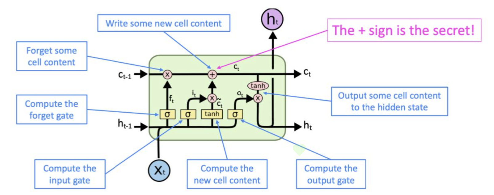
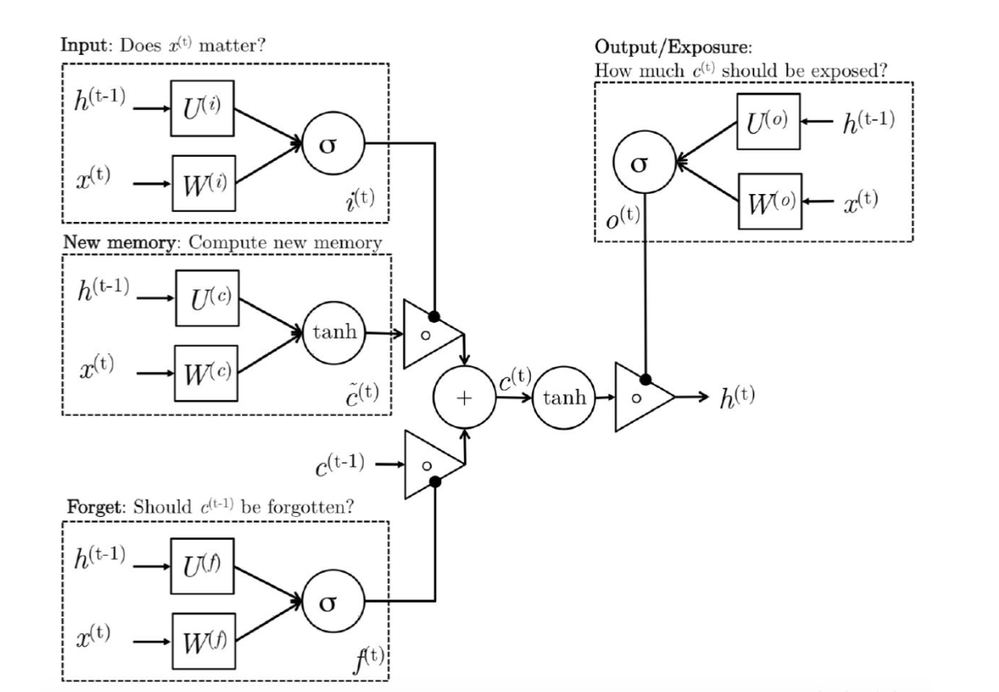

# 手写神经网络12：LSTM

> 这个系列是我在完成斯坦福公开课CS231N的作业时候所做的一些记录，这门课程是公认的深度学习入门的神课，其作业也非常硬核，需要从底层实现各种神经网络模型，包括前馈神经网络、卷积神经网络和循环神经网络，LSTM等等。
>
> 作业不仅要求掌握numpy等python库的api用法，更要对神经网络的数学理论和公式推导有非常深的理解，实现起来难度比较大，因此我也将在这个系列的博客中记录自己推导和coding的过程
>
> 限于个人水平实在有限，我尽量减少参考网上代码的次数

## 1.LSTM的基本架构

- LSTM是`Long Short Term Memory`(长短期记忆模型)，是一种加入了门控单元的RNN，具有更长的“记忆能力”，可以捕捉到序列化输入中的**长距离依赖关系**(比如一个文本中距离很远的两个单词的某种特定关系)
- LSTM的组成单元是在RNN的组成单元的基础上加上了若干个控制单元(也叫做门)对整个单元进行控制，有输入门，输出门，遗忘门等等，同时又有一系列`memory cell`作为“**长期记忆单元**”，这些cell也要传递到下一个隐层中，用于保存当前输入的长期记忆，其基本组成单元的架构如下图所示：



## 2.LSTM的计算过程

- 三个门控单元的结果计算

$$
i,f,o=\mathrm{sigmoid}(W_hh_{t-1}+W_xx_t)\quad \text{Three gates}
$$

- 生成新的记忆单元

$$
g=\tanh(W_hh_{t-1}+W_xx_t))
$$

- 按照门控单元的内容来控制输出结果，生成新的

$$
c_{t} =f \odot c_{t-1}+i \odot g
$$

- 生成最终的隐状态：

$$
h_{t} =o \odot \tanh \left(c_{t}\right)
$$

- 这里的三个**门控单元和记忆单元**分别起到如下作用：
  - 记忆单元：暂时生成一个当前输入内容的记忆
  - 输入门：评估**当前的序列输入$x_t$的重要程度**，将其加权反映到最终记忆单元中
  - 遗忘门：评估**上一个单元输入的记忆单元的重要程度**，将其加权反映到最终记忆单元中
  - 输出门：将最终的记忆单元和隐状态区分开，因为最终记忆单元中的很多序列信息是**没有必要暴露到隐藏状态**中的，输出门就是来评估**有多少信息可以从最终记忆单元传递到隐状态中**
- 整个计算过程可以用一张图来表示：



## 3.LSTM的前向传播实现

- 我们发现跟RNN相比，LSTM还多了三个门控单元和一个记忆单元需要处理，并且这些组件的值都需要用输入的$x_t$和$h_{t-1}$用类似的方法计算，非常麻烦，因此CS231N的assignment3里面采取了这样的trick来解决计算太麻烦的问题：
  - 将用来处理$x_t,h_{t-1}$的权重矩阵的列数扩大四倍，再将结果$A$按照列进行四等分，分别用sigmoid和tanh函数处理之后生成三个门$i，f，o$以及新的记忆单元$g$，然后按公式分别计算并合并
  - 求梯度的时候分别求出$i，f，o$和$g$的梯度然后合并成$A$的梯度
- 因此LSTM单元的前向传播可以用下面这个函数`lstm_step_forward`来实现：

```python
def lstm_step_forward(x, prev_h, prev_c, Wx, Wh, b):
    """
    Forward pass for a single time step of an LSTM.
    Inputs:
    - x: Input data, of shape (N, D)
    - prev_h: Previous hidden state, of shape (N, H)
    - prev_c: previous cell state, of shape (N, H)
    - Wx: Input-to-hidden weights, of shape (D, 4H)
    - Wh: Hidden-to-hidden weights, of shape (H, 4H)
    - b: Biases, of shape (4H,)

    Returns a tuple of:
    - next_h: Next hidden state, of shape (N, H)
    - next_c: Next cell state, of shape (N, H)
    - cache: Tuple of values needed for backward pass.
    """
    next_h, next_c, cache = None, None, None
    N, H = prev_h.shape
    A = np.matmul(x, Wx) + np.matmul(prev_h, Wh) + b.reshape(1, b.shape[0])
    # 分割成四等份，每一份的size都是N * H
    ai, af, ao, ag = A[:, 0: H], A[:, H: 2 * H], A[:, 2 * H: 3 * H], A[:, 3 * H: 4 * H]
    i, f, o, g = sigmoid(ai), sigmoid(af), sigmoid(ao), np.tanh(ag)
    # 按公式一步步进行计算
    next_c = f * prev_c + i * g
    next_h = o * np.tanh(next_c)
    cache = (next_c, g, o, f, i, A, prev_c, prev_h, Wh, Wx, x)
    return next_h, next_c, cache

```

- 而LSTM整体的前向传播和普通的RNN没有什么区别，这里就不重复了。

## 4. LSTM的反向传播的实现

- LSTM的反向传播过程中，依然遵循RNN的反向传播的基本形式，即时间反向传播，在计算梯度的时候需要考虑后一个隐状态传递回来的梯度，并且需要对$i,o,f,g$分别求梯度然后拼成一个完整的A的梯度，再对A下属的几个参数矩阵进行求导进行反向传播，最终实现LSTM反向传播的代码如下(这里的公式推导和RNN没有本质区别，难点在于把四个梯度矩阵拼接成一个，其他地方的导数还是很好求的)：

```python
def lstm_step_backward(dnext_h, dnext_c, cache):
    """Backward pass for a single time step of an LSTM.
    Inputs:
    - dnext_h: Gradients of next hidden state, of shape (N, H)
    - dnext_c: Gradients of next cell state, of shape (N, H)
    - cache: Values from the forward pass
    Returns a tuple of:
    - dx: Gradient of input data, of shape (N, D)
    - dprev_h: Gradient of previous hidden state, of shape (N, H)
    - dprev_c: Gradient of previous cell state, of shape (N, H)
    - dWx: Gradient of input-to-hidden weights, of shape (D, 4H)
    - dWh: Gradient of hidden-to-hidden weights, of shape (H, 4H)
    - db: Gradient of biases, of shape (4H,)
    """
    next_c, g, o, f, i, A, prev_c, prev_h, Wh, Wx, x = cache
    dnext_c += dnext_h * (1 - np.tanh(next_c) ** 2) * o
    dprev_c = np.multiply(dnext_c, f)
    # 分别求出四部分的梯度然后进行合并
    df = dnext_c * prev_c * (1 - f) * f
    di = dnext_c * g * (1 - i) * i
    dg = dnext_c * i * (1 - g ** 2)
    do = dnext_h * np.tanh(next_c) * (1 - o) * o
    dA = np.hstack((di, df, do, dg))  # 得到一个 N * 4H的梯度矩阵
    dWx = np.matmul(x.T, dA)
    dx = np.matmul(dA, Wx.T)
    dWh = np.matmul(prev_h.T, dA)
    dprev_h = np.matmul(dA, Wh.T)
    db = np.sum(dA, axis=0)
    return dx, dprev_h, dprev_c, dWx, dWh, db
```

- LSTM的整个序列的反向传播和RNN也类似，这里就不放基本重复的代码了，至此我们完成了RNN和LSTM的基本单元的前向传播和反向传播的底层代码的实现。