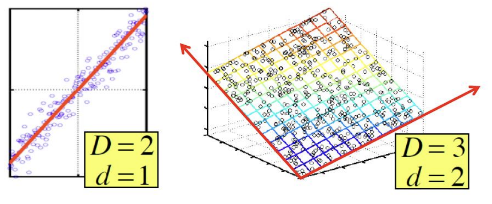

# 聚类和降维

> 聚类在别的机器学习课程中已经学过了，主要就是Kmeans那些算法，这里就跳过了，主要记录一下降维部分的内容，降维的这节课上主要讲了SVD和CUR两个算法。

## SVD分解

通常来说我们在数据挖掘中遇到的算法可以表示成一个$m\times n$的矩阵，并且这个矩阵可以用若干个矩阵的乘积来表示，矩阵中的往往存在一些潜在的维度和因素没有被挖掘出来，而通过矩阵分解的方式我们可以挖掘出这些潜在的信息，比如下面这张图中的情况就是一个很好的例子。

SVD就是一种非常常见的降维方法，可以把一个$m\times n$的矩阵A分解成大小为$m\times r,r\times r,r\times n$三个矩阵的乘积，同时这里的r有多种选择，并不是唯一的，我们可以选择合适的r让矩阵的重构损失达到最小，即：
$$
A\approx U\Sigma V^T=\sum_{i}\sigma_iu_i\circ v_i^T
$$

- 这时候的矩阵U称为左奇异矩阵，而V称为右奇异矩阵，中间的$\Sigma$被称为矩阵的奇异值矩阵，并且是一个对角的矩阵
- 奇异值还有另一种写法是将矩阵分解成$m\times m, m\times n, n\times n$三个矩阵的乘积

SVD分解也存在一些缺点，比如：

- 可解释性的问题：每个奇异向量表示输入所有行列的一个线性组合，但是缺少可解释性
- 奇异值分解得到的结果比较稠密，不够稀疏，因此存储消耗比较大

## CUR分解

CUR分解的目标是将矩阵分解成三个矩阵CUR的乘积，并且使得$||A-CUR||_F$尽可能小，并且满足：

- C和R是一个大而稀疏的矩阵
- U是一个稠密的小矩阵

- 不过这一部分的内容感觉讲的不是很清楚，因此就不多深入探究了，只要知道有这么个东西就行。

