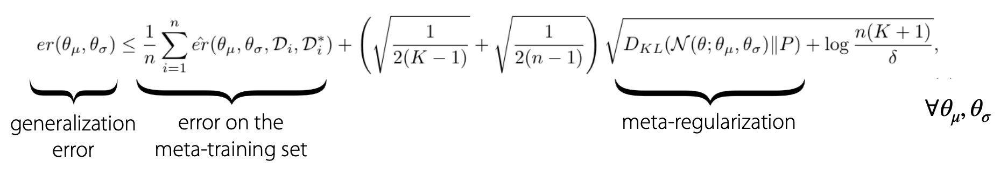
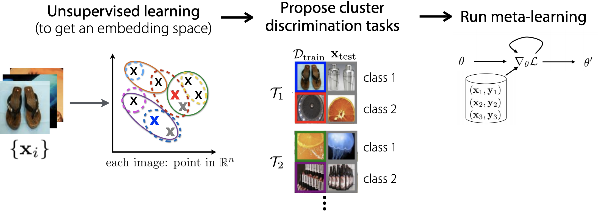

# CS330：多任务学习和元学习4

> 这一部分笔记对应CS330课程中的Lecture7，主题是Advanced Meta Learning，主要讲了元学习中一些比较高级的topic

## 元学习中的Memorization

### 如何处理互斥的任务

先回忆了一下元学习中几种已有的模型，包括黑盒模型，优化模型和非参数化的模型。我们在元学习的过程中要对数据集进行适当的划分，将已有的样本和标签划分成若干个任务并进行训练，如果划分出的若干个任务是非互斥的，那么可以用一个函数“解决”所有的任务，而如果这些任务中存在一些互斥的任务，这个时候只用一个函数就不能解决所有的任务了，元学习模型训练的效果也会受到影响。

现在有两种解决办法，我们假设其中一个和其他任务互斥的任务的数据集是$D_i^{tr}$，两种可选的解决方案是：

- 让模型“记住”这个任务中所有的结果和模式，然后忽略这个数据集$D_i^{tr}$，实际上这种方式是让模型对这个互斥数据集**过拟合**
- 将$D_i^{tr}$分离出来单独训练模型，不把这个任务放到总体的元学习模型训练中，而是单独训练一个模型

选用哪种方法实际上取决于信息的流动情况

### 元正则化

元学习模型也可以进行正则化，我们假设训练元学习的目标是：
$$
\max I(\hat t_{ts},D_i^{tr}|x_{ts})
$$
那么将目标函数加上正则项之后可以写成：
$$
L(\theta, D_{tr})+\beta D_{KL}(Q(\theta, \theta_{\mu},\theta_{\sigma})||p(\theta))
$$
使用正则项之后训练出来的元模型会获得更好的繁华性能，因为理论上可以证明：

- 这个东西太抽象我就不管了先，反正PPT上也就放了个公式

## 无监督元学习

到目前为止讲的内容都是自带了数据集和label的有监督元学习，而现实世界中很多时候数据集是没有标注的，这时候就需要我们对数据集进行一定的预处理然后尝试将这些数据集用于元学习模型的训练中。

我们需要从无标注的数据中找到足够的任务，并用这些任务构建元学习模型，而找任务就需要有标准的数据，同时我们希望构造出的任务是多样化并且结构化的，这样一来可以让少样本学习得以实现。

### 未标注的图片

以图片为例，我们可以先使用无监督学习算法讲图片嵌入到一个表示空间中，然后使用聚类等方法将图片进行分类，并且人工打上标签，用已经有标签的数据进行划分，得到多个任务，然后用于训练元学习模型。

### 未标注的文本

对于未标准的文本也可以使用类似的手段，我们有两种选择，一种是将无标注的文本学习任务归结成语言模型的问题，将一切问题转化成语言模型的训练，GPT-3就是一个很成功的例子；另一种方式是使用给单词加上mask，并将学习的任务定为预测被遮盖的单词，常见的像BERT灯模型都采用了这种学习策略。

### 时间序列数据

时间序列问题也是非常常见的一类无监督元学习问题，这类任务往往给定了一系列没有进行分割的时间序列，这个时候可以使用贝叶斯在线突变点检测(BOCPD)算法和在线突变点分析(MOCA)等方法，这些就等下节课再讲。