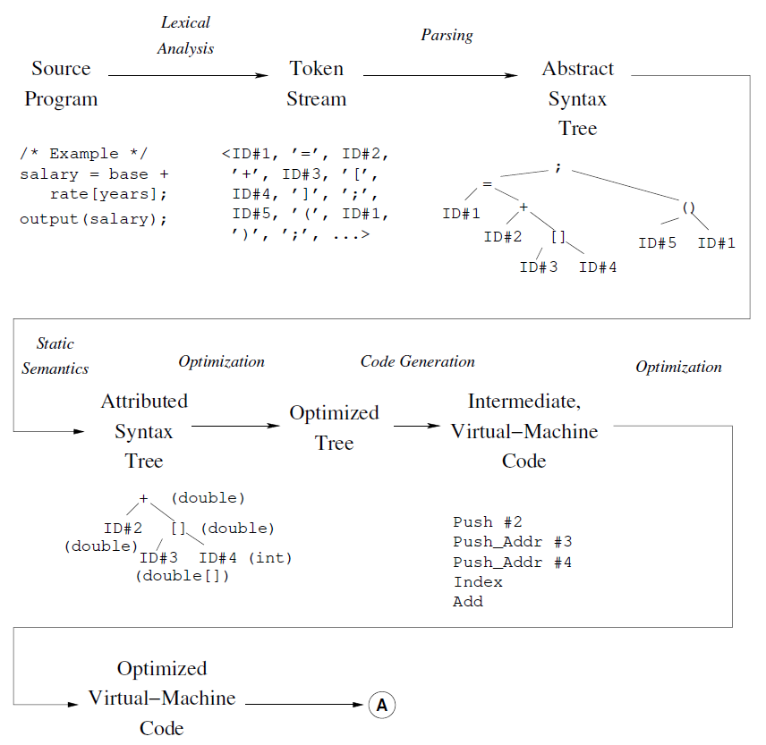
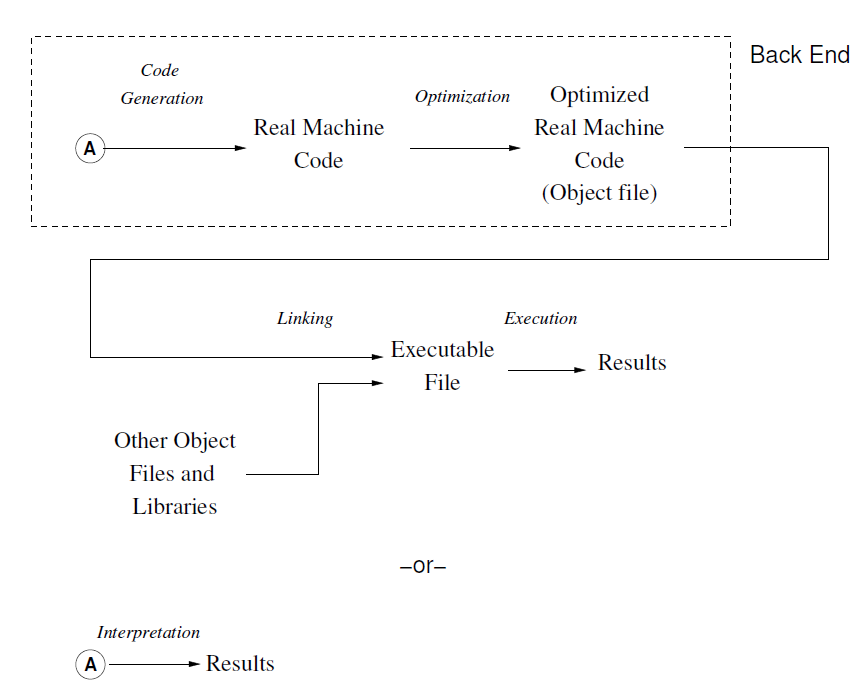
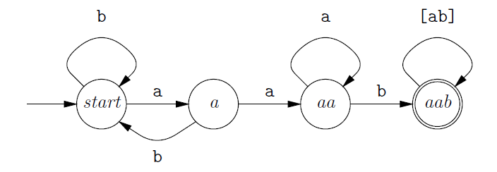
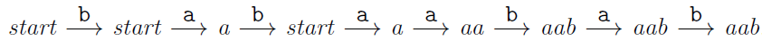
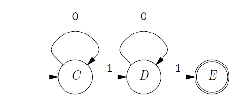
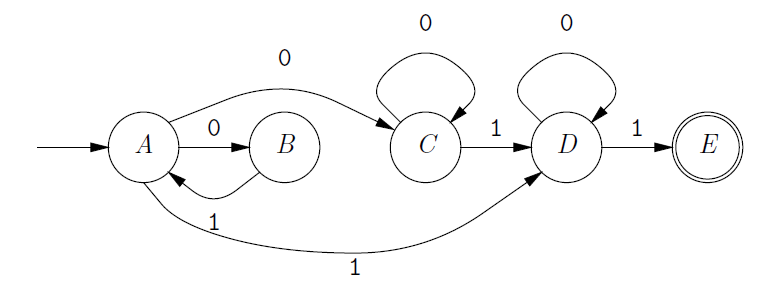
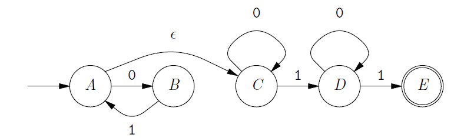
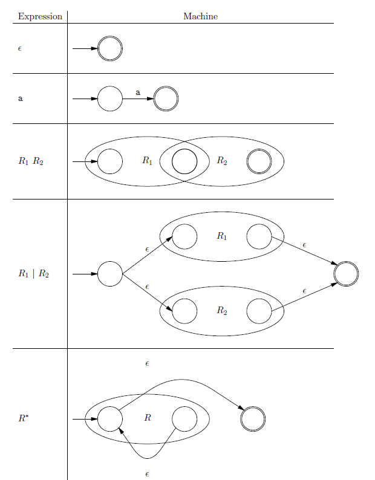

# UCB-CS164-Compiler1-Introduction&Lexical

> 本科阶段一直没学过编译原理，因此找到一门UCB的课程CS164——Programming Language&Compilers来学习一下编译原理的基本内容。第一节主要讲的是整个课程的Introduction和词法分析。

## Introduction

我们平时常用的高级编程语言可以分成两种，一种是编译型语言，另一种是解释型语言，它们的区别在于，编译型语言将源代码**转换成机器语言**并执行，而解释型语言则有一个语言虚拟机，源代码会先被**转换成虚拟机中能执行的语言**(比如Python代码会被转换成字节码)

这门课的研究对象是编译器，也就是将“一种语言(通常为高级语言)”翻译为“另一种语言(通常为低级语言)”的程序，而这个低级语言可以是机器语言，也可以是虚拟机的语言。

一个理想化的编译器一般分成前端和后端，并且会在中途生成一些中间代码(IR, Intermediate Representation)作为过渡。编译器前端的工作可以用下面的图来表示：



源代码首先要经过**词法分析**生成token流，然后通过**解析**生成抽象语法树并加入静态的语义分析和优化，然后通过**代码生成和优化**来得到可以被虚拟机执行的代码，这里的代码实际上就是中间代码IR。

而编译器的后端的工作流程包括：对于编译型的语言，中间代码需要通过代码生成和优化得到机器码，然后通过链接得到可执行文件并执行，而对于解释型语言，中间代码可以直接被执行。



这门课侧重于编译器的前端，并将按照上面的顺序对编译器中的关键内容逐一展开讲解。


## 词法分析Lexical Analysis

词法分析是这门课程的正式内容中的第一部分，词法分析的主要目标是对源代码进行分析并保证它在语法上是well-formed的，同时还要将源代码去掉一些不必要的信息之后转换成一个token流交给后面的步骤进行下一步处理。词法分析需要用到的知识包括：

- 正则表达式，可以用正则表达式对一类语言进行表示
- 有限状态自动机(FSA)，一种可以用来表示语言的抽象机器
- 确定性有限状态机(DFA)，是FSA的子集

词法分析可以通过建立起正则表达式——FSA——DFA之间的联系，将某种特定编程语言的词法分析过程**转换成程序代码**，让代码程序自动完成词法分析。

### 什么是token

Token是对编程语言中最小功能单元的一种抽象，一个token表示构成代码的一个最小单元，比如代码中的变量名，运算符和关键字都可以作为一个token(NLP中也有类似的做法，将文本转换成一个**token的序列**，这里的token就代表了文本中最小的语义单元，比如一个词，一个子词或者一个字节对都可以作为文本的token，而在编程语言源代码中，token也具有类似的含义)

将整个程序都转换成token就可以得到一个token流，我们需要先把代码文件转换成字符序列，比如下面这个例子：

```Java
源代码
if(i== j)
	z = 0; /* No work needed */
else
	z= 1;

字符序列
\tif(i== j)\n\t\tz = 0; /* No work needed */\n\telse\n\t\tz= 1;
```

字符序列要去掉代码中多余的空格，并将转义字符(如换行\n和切分\t)，而它转换成token流之后的结果是：

```pseudocode
IF, LPAR, ID("i"), EQUALS, ID("j"), RPAR, ID("z"), ASSIGN,
INTLIT("0"), SEMI, ELSE, ID("z"), ASSIGN, INTLIT("1"), SEMI
```

这里个token流中大写的标识符代表了每个token的语法类别(Syntactic Categories)，将在后面的解析步骤中被使用。这些标识符在真正的编译器中一般会使用数字来代替而不是一串大写字母，它将程序中的每个token的语法类别和真正的值(括号中的内容，也叫做lexical value)分离开，并且标定程序中每个位置出现了什么类型的东西，并通过这种方法来判断程序是否符合语法规范。

而至于具体的值，在词法分析和解析阶段实际上并不重要，这两个阶段也不会关注每个变量类型的token所代表的真实值，因此这个时候将它们分开也无妨。

但实际上现代的编译器还会对程序中的错误**进行追踪**，如果哪里不符合语法规范了，编译器会提醒里某文件某行某处的代码有问题，这实际上是在词法分析的过程中还额外保留了每个token的位置信息，在语法检查的过程中，一旦发现哪里报错，就可以立即定位到错误代码的位置

### 正则表达式

我们首先需要来学习一下正则表达式的用法，正则表达式在词法分析的过程中可以用来匹配各式各样的token，不过这似乎涉及到一点理论计算机的相关知识。

在形式化语言(理论计算机中的一个方向)的理论中，一种语言Language实质上是若干字符串构成的集合，即这个语言所有合法的单词，短语和句子所构成的集合就代表了这个语言。而编程语言也是一种语言，由各种关键、操作符、变量名构成的源代码就是一门编程语言的组成部分。而词法分析实际上就是要我们写一个程序来发现和提取程序源代码中的关键token，那么我们应该把程序写成什么样才能实现词法分析的功能呢？传统的做法可以是用一长串的if-else语句，并将源代码作为长字符串一个个进行处理，但是随着程序复杂度加深会变得非常麻烦，有没有一种方式可以直接描述我们想要找的token的形式，并且让程序直接自动地对输入的源代码进行匹配呢，答案是肯定的，这就是这一节要学的正则表达式。

#### 正则表达式的基本形式

我们可以用R来表示一个正则表达式，而这个正则表达式R所能描述的语言被记为$L(R)$，并遵循下面的递归定义：

- 空的字符串是一个正则表达式，并且空字符串对应的语言只包含一个空字符串
- 任何单个字符都是一个正则表达式，并且它对应的语言只包含这个字符串本身
- Concatenation，如果R1和R2是两个正则表达式，那么`R1R2`也是一个正则表达式，`R1R2`对应的语言就是将R1和R2两个表达式对应的语言拼接起来构成的
- Union，如果R1和R2是两个正则表达式，那么`R1 | R2`也是一个正则表达式，并且有$L(R_1|R_2)=L(R_1)\or L(R_2)$
- Closure，如果R是一个正则表达式，那么R\*也是一个正则表达式，\*的意思是R可以出现任意多次，因此R\*所对应的语言就是$L(R*)=\or_{k=0}^{\infin} L(R_k)$

关于正则表达式，一些常见的符号和表示方式总结如下：

| 表达式    | 代表的含义                                                   |
| --------- | ------------------------------------------------------------ |
| R+        | R至少要出现一次                                              |
| R?        | 可以是R或者空字符                                            |
| [R1R2R3]  | 可以在R1R2R3中选择，有一个出现就行                           |
| [^R1R2R3] | R1R2R3不能出现                                               |
| .(一个点) | 可以表示所有换行符以外的一个字符                             |
| R{m}      | 表示R需要刚好出现m次                                         |
| R{m,n}    | 表示R需要出现m-n次，mn可以省略一个，默认值分别是0和无穷多次  |
| \d \s \S  | 分别表示任何单个数字，任何单个空白字符，任何单个非空白字符，空白字符就是那些不会显示出来的字符，比如\t和\n |
| \k        | k大于1并且是个位数                                           |
| ^和$      | 分别用来匹配一行开始位置和结束位置                           |


#### 高级用法和扩展

正则表达式中的一些特殊符号会有自己的匹配规则，比如：

- `*, +, {}, ？`这几个符号遵循**贪婪匹配**的原则，他们会在能满足后续表达式要求的前提下，匹配尽可能多的字符。但是如果出现形如`R*?`的正则表达式，就会尽可能少的匹配R，这是因为外层的？贪婪了，所以内层的`R*`应该尽量少出现，这种情况叫做懒匹配。
- 当一个字符串同时可以匹配表达式`R1 | R2`的时候，会优先匹配R1

我们可以来通过几个具体的正则表达式的例子来看看它到底应该怎么使用：

| 表达式                   | 代表的含义                                                   |
| ------------------------ | ------------------------------------------------------------ |
| //.*                     | 可以匹配所有用//开头的注释语句                               |
| [1-9]\[0-9]*             | 可以匹配所有的正整数(不能用0开头)                            |
| [<>]=? \| ? =            | 可以匹配常见的编程语言中所有的比较运算符，包括>= <= > < 以及!=，前面四种可以归到一类，而不等号需要另外再写一个 |
| [+-*/^\\% \| &]=         | 可以匹配所有的自操作运算符，比如+=, *=等等                   |
| [a-zA-Z_]\[a-zA-Z0-9\_]* | 可以匹配常见编程语言的所有变量名，一般来说变量名只能用字母和下划线开头，而后面则可以是字母数字下划线 |
| [-=/*;,:()^&%\|@\[\]]    | 可以匹配编程语言中所有常见的单字符的操作符                   |


### FSA/DFA/NFA

#### FSA和DFA

有限状态机Finite State Automata(也叫Finite State Machine)是一种计算机科学理论中的计算模型，也可以用来描述程序代码的结构并进行词法分析。

FSA最简单的形式是确定性有限状态机(Deterministic Finite-State Machine)的组成部分包括：

- 一个状态集合S，里面包含了系统所有可能的状态
- 一个初始状态$s_0$和最终状态集合F，F是S的自己，所有的结束状态在画图的时候会使用两个同心圆来表示
- 一个有限的操作集合(也叫做alphabet)，记为$\Sigma$
- 一个状态转移函数$f: S\times \Sigma\rightarrow S$，对于每个状态和当前状态下发生的动作，函数f可以给出系统的下一个状态

一个DFA可以记为$M=(S,\Sigma,s_0,f,F)$，DFA会从初始状态开始，经过一系列动作，每次动作会让DFA的状态转移到下一个确定的状态中。并且并且DFA也可以叫做一个recognizer，因为它可以描述一种语言，并且DFA可以用来识别一个字符串是否符合某种语言的定义标准，所起到的功能和正则表达式是一样的，我们可以用$L(M)$来表示一个DFA所能表示的语言。

比如下面的这个例子，我们要识别所有包含aab的字符串，就可以构造出下面这个DFA：



这里的状态就包括了start和a, aa, aab四种，根据这个DFA，我们如果对一个有限长度的字符串进行扫描，那么除非字符串中连续出现aab三个字符，否则扫描结束的时候DFA不会处于最终状态aab处，而中间的状态迁移根据扫描的时候读取到了什么新的字符来进行更新。比如我们输入一个字符串babaabab，那么DFA的状态转移过程就可以表示为：



如果把aab换成其他正则表达式，那么构造出的DFA可能会更复杂，但是也会按照类似的逻辑进行运行。

#### 不确定有限状态机NFA

如果我们碰到了一个更复杂的正则表达式，比如`(01)*0*10*1`，我们准备把它转化成对应的FSA，但是乍一看很麻烦，于是我们想到了一个办法，可以把它拆成`(01)*` `0*10*1`两个部分，然后再想办法拼起来。这两个拆分后的正则表达式分别对应的FSA是：




下面我们想办法把两个FSA拼接到一起，组成完整的FSA，我们发现前一个FSA的结束状态一定是A，而A既可以转移到C，也可以跳过C直接转移到D状态(因为0*不一定要出现)，那么二者的连接方式应该如下图所示：



这时候我们发现，A点不是最终状态了，FSA也不再是DFA了，因为A点出发的状态转移是不确定的，在下一个字符是0的时候，A既可以转移到B，也可以转移到C点，这种状态转移函数的结果不是唯一确定的(即FSA对应的图中可能有多种路径)就叫做不确定性有限状态机(NFA)，但是和DFA一样，NFA也可以用来判断一个字符串是否匹配某种模式，只要扫描完字符串之后位于最终状态的点上就可以。

我们可以对NFA进行一定的化简，并引入一种被称为$\epsilon$转移的新边，它代表了状态机可能会以一定的概率无视输入的内容，直接通过$\epsilon$转移来进行状态的转换。这个时候NFA的图要画成下面的形式：



这个时候FSA的alphabet就会增加一个新的元素$\epsilon$，并且状态转移函数f可能会产生多种不同的结果，可以记为：
$$
f: S\times \Sigma\cup \epsilon\rightarrow 2^S
$$
这里的函数结果变成了S的幂集，回忆一下离散数学中的基本知识，幂集就是当前集合所有子集构成的集合，这样就可以表示函数f的结果不一定只有一个状态，而是多个状态构成的集合。


#### 状态机到程序的转换

我们可以用程序来模拟状态机的状态切换，对于DFA来说，要用程序实现非常简单，只需要用一个循环+若干if-else或者switch语句进行状态的切换就可以了，为了表示方便可以用int类型来表示不同的状态。

而NFA写成程序就稍微麻烦一点，因为NFA的状态转移函数可能会返回多个状态而不是DFA的一个，如何将这个过程写成代码就是一个很大的问题，课程中提到可以用位运算来解决，即返回结果依然是一个int类型代表状态，我们将不同的状态编码到int类型结果的二进制表示下不同位置上，比如一共有3个状态，而当前状态转移函数要返回其中的第1和第3个，那么返回的结果就是二进制的101也就是5，其他情况同理可以推算，用位运算的方式可以很容易地将多个结果状态存储在一个int类型的变量中。比如我们可以来看下面这段代码：

```Java
enum State { A = 0, B, C, D, E, NUM_STATES } state;
typedef int SetOfStates;
static const SetOfStates epsilonClosures[NUM_STATES] = {
	1<<A, 1<<B, 1<<C, 1<<D, 1<<E
};
static const SetOfStates FINAL_STATES = 1<<E;
static const SetOfStates transitions[][2] = {
    /* ’0’ ’1’ */
    { 1<<B | 1<<C, 1<<D }, /* A */
    { 0, 1<<A }, /* B */
    { 1<<C, 1<<D }, /* C */
    { 1<<D, 1<<E }, /* D */
    { 0, 0 } /* E */
};
bool recognize3 (string& s) {
    SetOfStates states;
    states = epsilonClosures[A];
    for (int i = 0; i < s.size (); i += 1) {
        int c;
        SetOfStates newStates;
        newStates = 0;
        switch (s[i]) {
            case ’0’: c = 0; break;
            case ’1’: c = 1; break;
            default: return false;
    	}
    for (State p = A; p != NUM_STATES; p = (State) (p+1))
    	if (states & 1<<p)
    		newStates |= transitions[p][c];
    for (State p = A; p != NUM_STATES; p = (State) (p+1))
    	if (newStates & 1<<p)
        	newStates |= epsilonClosures[p];
       states = newStates;
    }
    return (states & FINAL_STATES) != 0;
}
```

这段代码就是对上面NFA那个例子的一种简单实现，不过这个程序的实现里没有用$\epsilon$转移。

我们发现，NFA的代码实现中，返回的状态依然是一个数字，只不过数字的种类可能会比状态多，因为可能会有多个状态组合而成的集合作为结果，但是这些集合依然和状态集合S中的所有状态一样，可以用数字来表示，因此我们可以将这些状态集合也看成是一种新的状态，这样一来，我们就可以把一个NFA转换成一个DFA，因为多个状态可以用一个代表状态的数字来表示，这种方式称为子集构建(Subset Construction)，可以用来将NFA转换成DFA，比如上面这个例子通过子集构建之后可以得到：

```c++
static const int transition[][2] = {
    /* ’0’ ’1’ */
    { 0, 0 }, /* 0: { } */
    { 6, 8 }, /* 1: { A } */
    ...
    { 4, 9 }, /* 6: { B, C } */
    ...
    { 14, 24 }, /* 9: { D, A } */
}
```


#### 正则表达式到FSA的转换

前面我们已经展示过简单的正则表达式可以转换成对应的FSA并画出它的状态转换图。对于更复杂的正则表达式，我们可以将其分割成若干个基本单元，然后分别画出每个单元的FSA，最后再通过单元之间的关系将它们连接到一起组成整体的FSA，常见的一些组合构建方式如下表：



这样一来，我们就实现了正则表达式到FSA的转换，而FSA不管是DFA还是NFA最后都可以归结到DFA，并且可以转换成相应的程序代码，因此我们就可以实现从正则表达式到程序代码的转换，而这个过程中，我们用这种代表了编程语言源代码各种关键字、变量名、操作符以及其他东西的正则表达式对编程语言进行扫描和匹配，就可以分析出源代码中各种东西的成分，并构建出源代码文件的token流，实现词法分析的目的。