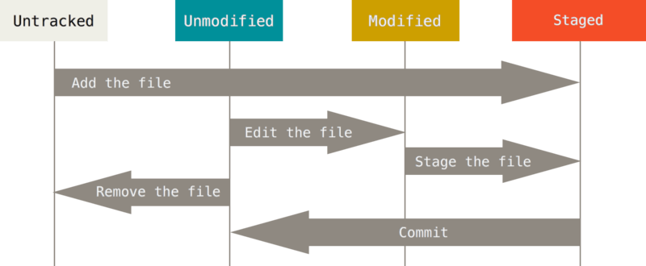

# UCB-LinuxSysAdminDecal学习记录

> UCB的Linux System Admin Decal是一门Linux系统使用的入门课程，介绍了一些最基本的Linux使用知识，从Shell脚本到操作系统和计算机网络，再到版本控制和虚拟化。总的来说可以作为了解性的课程粗略地学习一下

## Shell Script

### 一些比较神奇的shell指令

- `!!`表示重新显示上一条执行的命令
  - `!:1`这样的用法可以从上一条命令中获取对应位置的参数
- `!`表示pipeline，可以连续执行命令，并且上一条的输出结果作为下一条的输入
- `>` `<`表示输入输出的重定向

### Bash编程的基本规则

- Bash脚本中用定义好了变量之后可以用`$变量名`的方式来引入变量，比如我们定义`a="ls"`，然后下一行输入`$a`，那么这一行的输出就是ls的执行结果，我们要**以文本的形式查看变量**里的内容需要用`echo`来输出，否则会被当成命令来执行
- Bash脚本中的变量没有类型，比如我定义`a=1`，那么`$a+1`得到的结果不是2而是字符串`1+1`，我们可以用`expr`命令来实现表达式的计算，`expr $a+1`的结果就是2
- 在Bash脚本的条件判断中，0表示true而1表示false，并且用中括号来表示一个条件判断，if语句的形式是if-then-elif-else-fi
- Bash中循环有for和while两种，用do--done来表示每次循环中执行的语句
- 总的来说这部分内容要靠练习而不是看PPT

## Package Management

- 这一部分好像在讲如何在Linux环境下安装各种软件，最麻烦的是从源代码开始编译然后安装，也可以用apt-get命令之类的工具进行安装
- Advanced课程中还介绍了如何从零开始安装并配置一台Linux机器，包括下面这些步骤：
  - Booting the Installation Media
  - **Initial Setup**
  - Partitioning
  - Setting up Filesystems
  - Encrypting your Filesystem
  - Mounting your Filesystems
  - Installation (pacstrap)
  - Configuring the System

这些我们就不去深究了。

## Networking

这一部分简单介绍了计算机网络中最基本的知识，让我们可以对计算机网络以及Linux系统上常用的网络指令有一定的了解，主要内容有：

- **Media access control ** 即MAC地址，是计算机的物理地址，长度是48bits，用来作为计算机接入网络的唯一标识符，但是MAC地址一般只在局域网内有用，全局的网络通信需要IP地址
- IP地址是互联网中每台主机所具有的唯一标识符，IPv4地址的长度是32bit，但是32bit能表示的主机数量已经无法满足当今时代的需求，所以新一代的IPv6标准的地址长度是128bit，**NAT(Network Address Translation)**是另一种解决IP冲突的方法。
- 有了IP地址，互联网中的主机就可以互相进行访问，这个过程需要各种路由算法来实现
- **Transmission Control Protocol **，即TCP协议，在IP层的基础上提供了可信的端到端传输
- Domain Name System，即DNS域名系统，可以实现IP地址和“网址”(实际上是**人类可读的域名**)之前的转换，处于应用层，是非常重要的互联网基础设施

Linux中常用的网络相关指令有这样一些：

- hostname: 获取主机名
- host: 获取主机信息
- ping: 查看能否某台主机
- trace route: 查看路由的过程
- arp: 匹配IP和MAC
- dig: 检查DNS记录
- curl/wget: 通过HTTP/FTP进行文件的下载

## 进程与服务

- 进程部分主要就介绍了一下最基本的那些概念，内容相当于操作系统讲进程的第一节课的前半部分内容
- 服务(Service)是程序提供对外交互的一种方式，可以长时间运行，并且可以被多个用户共享，并且用户可以定义自己的服务，当然这不是服务的确切定义。
  - 之后介绍了一些Linux系统里的经典案例，比如**Systemd**提供了Linux系统中管理服务和进程的功能，systemctl指令可以控制服务的启动、停止和状态检查，journalctl可以查看systemd的日志
  - 后面介绍了一个用配置文件启动Nginx服务的具体例子

## 安全基础

这一节主要讲了使用Linux系统过程中如何保证信息安全。首先，信息的安全可以分成以下几个部分：

- 保密性Confidentiality：确保只有获得批准的人可以读取数据
  - 注意信息的加密
- 完整性Integrity：确保数据没有被篡改过
  - 用哈希算法来检测数据是否被篡改
- 验证性Authentication：证明数据的作者/来源
- 可用性Availability：确保服务的正常运行时间

然后介绍了Linux系统中所有权的概念，Linux中的身份分成User、Group和Other三种，每种身份对应文件的3种权限：读、写、执行。可以用chmod和chown指令来改变文件的权限

## 版本控制和备份

第一部分介绍版本控制系统(Version Control Systems, VCS)，其实主要就是git，并介绍了git的一些特性，git是一个**分布式**的版本控制系统，它把一个项目的变化过程用有向无环图来表示，并且git的总体运行逻辑如下：

但git使用的真正难点在于多个branch的协作开发以及代码合并，`git branch`用于创建一个新的分支，`git checkout`用于分支之间的切换，`git merge`用于分支的合并，这些东西还是要靠实践才能掌握。

- 当合并的过程中有冲突的时候，冲突部分的代码不会被merge到最新的结果中，需要通过进一步操作来完成冲突代码的检查和合并
- git中的remote表示不在本地的仓库备份，默认的名字是origin，我们可以用`git fetch`来获取远程的新增内容并更新到本地的仓库中(注意不是工作目录)

这节课的另一部分内容是备份，介绍了数据备份的3-2-1法则，即：

- 3代表数据至少要存储3份
- 2代表数据至少要存储在2台以上的设备中
- 1代表至少有1份数据存储在离线环境下

后面还介绍了一下备份用的各种指令。

## 云、容器和配置管理

虚拟机是一种运行在电脑上的电脑，它是对物理硬件的软件仿真，可以将自己和宿主机的物理环境隔离开来，这个过程也被称为虚拟化，虚拟机具有较好的安全性。

而容器通过和宿主机共享硬件和库函数来实现更轻量级的虚拟化，相比于虚拟机，它可以更快地启动。

- 然后简单地介绍了一下docker
- 配置管理是什么我也不知道