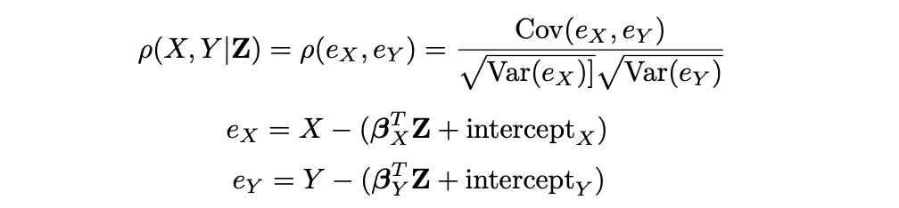

# CMU10-708PGM01：Introduction

> 这是CMU的一门研究生课程，主要讲概率图模型及其相关的各种应用，看起来课程内容非常不错，因此来学一学这门课的内容。我一开始看的是2020Spring的Eric Xing的Lecture，发现不太能get到PPT里的点，所以后来改成了2021Spring由[Matt Gormley](http://www.cs.cmu.edu/~mgormley/)主讲。

## Introduction

这是一门讲概率图模型的入门课程，讲的内容包括：图模型的设计，图模型的推理和学习，近似推理，深度学习和深度生成模型，结构和因果推理，强化学习和图模型的内在联系，非参数化贝叶斯，图模型的应用系统设计等等，总的来看课程内容非常饱满，不知道具体学起来效果如何。

> 注：第一部分是2020Spring Eric Xing的课程的第一节课，而后面的第二部分是Matt的第一节课的内容，两个老师的第一节课内容差别很大，所以分别记录一下。

### 什么是图模型

图模型(Graphical Model)实际上就是**用图结构来表示随机变量之间关系的模型**，随机变量构成图中的一个个结点，而随机变量之间的关系构成图中的边。这些关系可以是相关，独立，不独立，条件独立，因果等等。

### 随机变量相关性

GM中一个基本的问题就是怎么表示随机变量之间的关系，也就是说变量之间的相关性，通常这一性质会用一个具体的数值指标来判断，常见的有：

- Pearson’s correlation 皮尔逊相关系数
- Mutual information 互信息
- Hilbert-Schmidt Independence Criterion (HSIC)
- Partial correlation

通过研究相关性的表示，我们可以更好地理解概率图模型中的

#### 皮尔逊相关系数

两个变量之间的皮尔逊相关系数定义为两个变量之间的协方差和标准差的商，即：
$$
\rho(X, Y)=\frac{\mathrm{Cov}(X, Y)}{\sqrt{\mathrm{Var}(X)} \sqrt{\mathrm{Var}(Y)}}=\frac{E[(X-\mu_X)(Y-\mu_Y)]}{\sqrt{\mathrm{Var}(X)} \sqrt{\mathrm{Var}(Y)}}\in [-1,1]
$$
实际上皮尔逊相关系数可以看成是一种标准化了的协方差，并且计算结果应该在-1到1之间，这种相关系数可以捕捉到随机变量X和Y的**线性相关性**，当X和Y无关的时候，皮尔逊系数的值就是0，但是皮尔逊系数为0的时候不能推出X和Y无关。

#### 互信息

皮尔逊系数是用来描述两个随机变量之间的相关性的，那么有没有统计量是用来描述两个随机变量之间的独立性的呢？我们需要重点考虑的是两个随机变量的非线性相关性，一种常见的评价独立性的方法是：

- 如果X和Y独立，那么$$P(XY)=P(X)P(Y)$$

- 我们可以计算$$P(XY)$$和$$P(X)P(Y)$$之间的距离，这样一来X和Y两个随机变量独立的时候距离就为0，距离为0的时候两个变量也一定互相独立
- 然后我们就可以使用距离作为判断两个变量相关性的标准

KL散度(Kullback–Leibler divergence)就提供了这样一种**计算两个概率分布的独立性**的方式：
$$
\mathrm{KL}(P, Q)=\int_{x \in \mathcal{X}} P(x) \log \frac{P(x)}{Q(x)} d x
$$
而信息论中的互信息就是用KL散度来计算$$P(XY)$$和$$P(X)P(Y)$$的独立性，即：
$$
I(X, Y)=\mathrm{KL}\left(P_{X Y}, P_{X} P_{Y}\right)
$$
这时候X和Y独立当且仅当它们的互信息是0

HSIC这个指标就不提了，设计的非常复杂

#### 偏相关

偏相关性(Partial correlation)可以计算在给定Z的情况下，X和Y的相关性，计算方式如下：

实际上就是计算了X和Y在受到了Z的线性影响之后的相关度。我们在构建图模型的时候除了用相关性的信息来构建边际依赖图(Marginal correlation/dependency graph)之外，还可以加入偏相关信息构建偏相关图。

偏相关指数等于0**当且仅当X和Y在给定Z的条件下互相独立**。

#### 总结

- 总结一下到目前为止提到过的关联性估计模型

- 然后这节课就差不多结束了，后面主要在介绍这门课程要讲的内容，最后还讲了概率图模型的优越性。

### 概率图模型的优势

概率图模型是一种用来交流，计算和开发的“语言”，结合了概率论和图论，并且：

- 概率论提供了如何构建图，并让模型和数据进行交互的方式
- 图论提供了适合人类理解的建模方式(也就是图数据结构，用图来建模数据)
- 很多经典的多元概率系统比如统计学，系统工程和信息论其实都是特殊情况下的概率图模型

同时，在使用概率图的情况下，我们可以：

- 在模型中融入领域知识和推理结构
- 将异构的数据/模型进行模块化的组合，达到数据融合的目的
- 在模型中引入贝叶斯学派的理论

## 结构化预测问题

概率图模型想解决的一个问题叫做**结构化预测问题**。

### 结构化数据和非结构化数据

首先要搞清楚的一个概念是，什么是结构化数据，常见的结构化数据包括：

- 数据库中的条目
- 知识图谱
- 交易信息transactional information
- 维基百科中的的信息框
- 各种层次结构的数据

他们都是按照一定的结构组织起来的，比如知识图谱就是遵循(head, relation, tail)这样的模式，而数据库中的条目则受到数据库Schema的制约。非结构化的数据就不具有这些特点，常见的文本，图像，视频，音频等等都是非结构化的数据。

### 结构化预测问题

而结构化预测问题就是要预测一个结构，我们之前接触到的机器学习很多都是分类和回归问题，其范式就是对于给定的数据$x=(x_1,x_2,\dots,x_n)$要预测结果y，对于分类问题，y是一个离散的值代表了x的标签，对于回归问题y就是是连续空间上的一个值，而在结构化预测问题中，我们**要预测的结果也是一个结构**$y=(y_1,y_2,\dots,y_m)$ 

- 很多分类和回归问题也可以从数据的隐式结构中受益

我们可以用下面的表格来总结结构化预测问题和分类/回归问题的共同点和区别：

|                | 分类/回归问题                    | 结构化预测问题                                       |
| -------------- | -------------------------------- | ---------------------------------------------------- |
| 输入数据       | 可以是结构化/半结构化/非结构数据 | 可以是结构化/半结构化/非结构数据                     |
| 输出结果       | 是一个单独的数字                 | 输出一串能够表示结构的数字                           |
| 输出空间的大小 | 输出空间很小                     | 输出空间相对于输入空间可以是指数级别的               |
| 推理阶段       | 推理阶段是trivial的              | 推理阶段是NP-hard活着#P-hard的，并且很多时候需要近似 |

常见的结构化预测问题有：

- Part-of-speech (POS) tagging
- Handwriting recognition
- Speech recognition
- Object detection
- Scene understanding
- Machine translation
- Protein sequencing