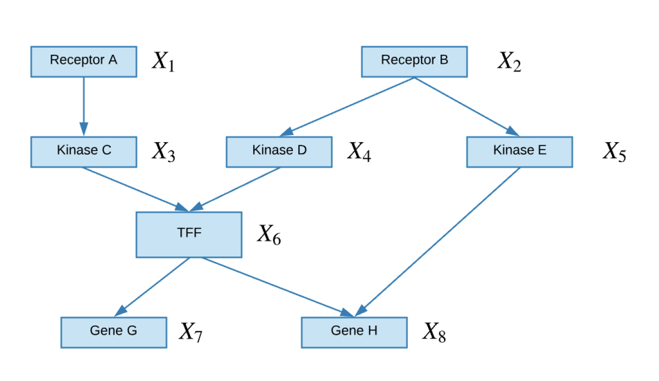
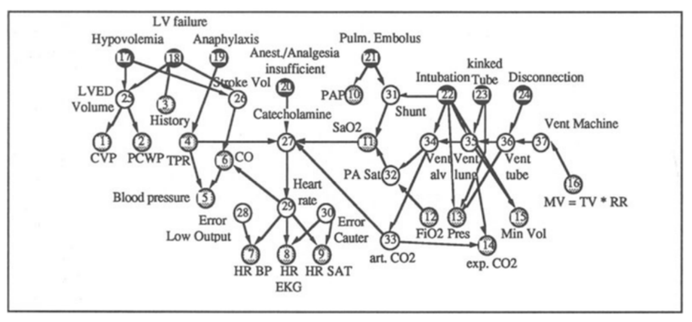

# CMU10-708PGM03：Directed Graph Model

> CMU10-708的Lecture3，Directed Graph Model

## 有向概率图模型(DGM)

### 定义

有向概率图模型是另一种概率图模型，也叫做**贝叶斯网络(Bayesian Networks)**，在有向概率图模型(后面都用DGM来指代)中，图的结点代表随机变量，并使用有向的边进行连接，边表示结点之间的条件和因果关系(比如A会导致B的发生)

- 上面这个图就是一个有向概率图模型，通过有向概率图，我们可以将8个事件X全部发生的概率表示成一系列条件概率的乘积

### 一些例子

专家系统(Expert System)就是一种比较经典的DGM，专家系统将领域内的专家知识表示成了一系列图中的结点和边，并且可以用这些专家知识进行推理。下图是一个ALARM药学知识专家系统

- 实际上知识图谱是一种现代化的专家系统，依然属于符号学派对于人工智能的尝试

## 贝叶斯网络(Bayesian Network)

事实上贝叶斯网络的定义似乎比DGM**更加严格**，一般来说贝叶斯网络是指结点表示随机变量而边表示两个随机变量之间的有向影响的概率图模型，贝叶斯网络提供了一种系统的描述联合概率分布的框架，实际上是将一个复杂的联合分布分解成了一系列条件独立的假设(即网络中的各条边)

我们可以将概率图看成是一个生成采样过程，并且图中的每个变量都是根据只依赖于它的父结点的条件概率分布生成的，也就是说每个变量都是其父变量的随机函数

### 贝叶斯网络分解

一个贝叶斯网络往往可以用一下形式表示：
$$
P(\mathbf{X})=\prod_{i=1}^{d} P\left(X_{i} \mid \mathbf{X}_{\pi_{i}}\right)
$$
这里的$$X_{\pi_i}$$表示结点i的父节点，实际上就是将联合概率分布转化成了一系列条件概率分布的乘积

### 局部结构和独立性

#### 共同父节点

如果A和C结点有共同的父节点B，那么在给定B的条件下A和C是独立的，也叫做B解耦了A和C，即：
$$
P(A,C|B)=P(A|B)P(C|B)
$$

#### 级联性

实际上就是一个链状的结构，条件概率不断向下传递：
$$
P(A,B,C)=P(A)P(B|A)P(C|B)
$$

#### V型结构

一个结点有多个

$$
P(A, B) = P(A)P(B)P(A, B|C)
$$

### I-Map

有向图模型也有一套I-Map语言体系来表明有向图和概率分布是可以对应起来的，同时也有对应的局部马尔可夫假设和全局的马尔可夫假设，这里就不再赘述了，因为感觉看了也白看
