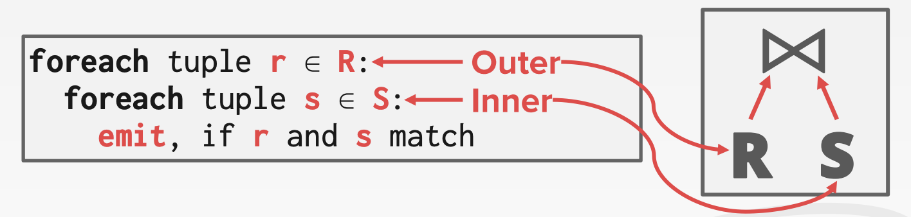
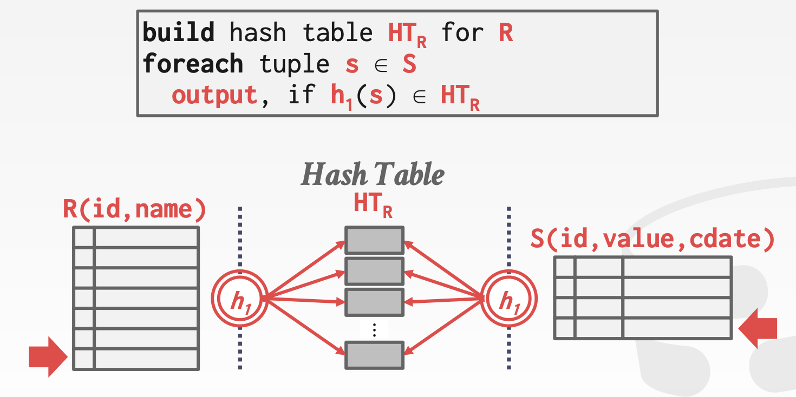
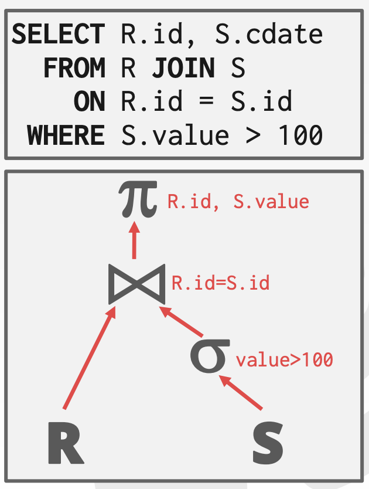
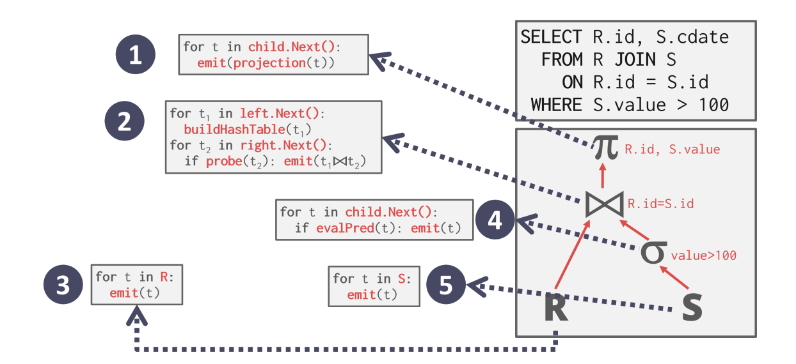
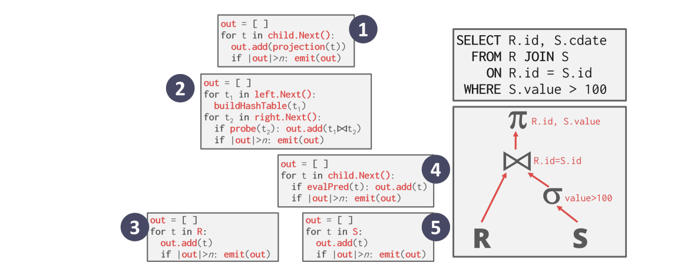
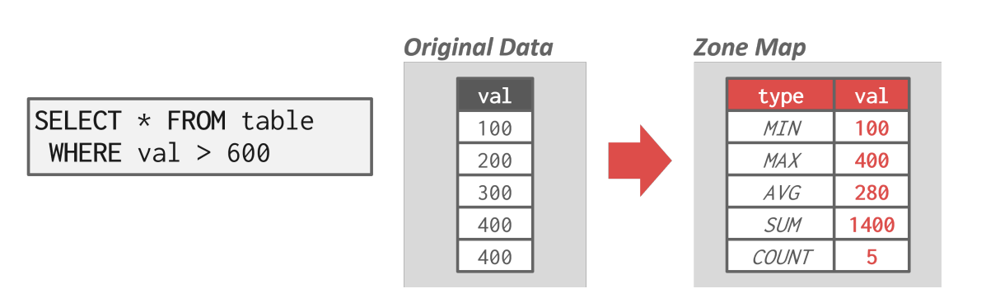
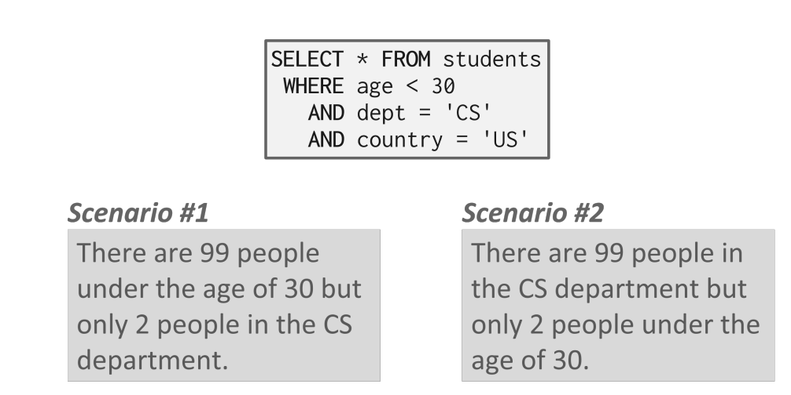
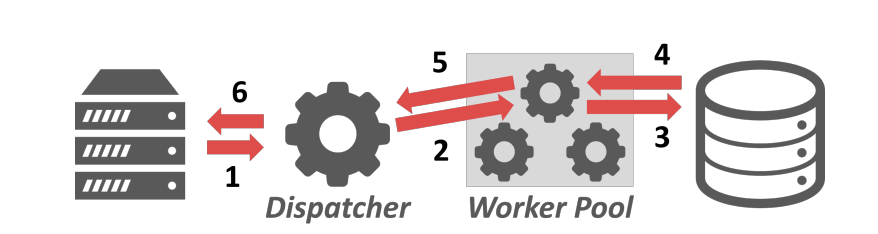
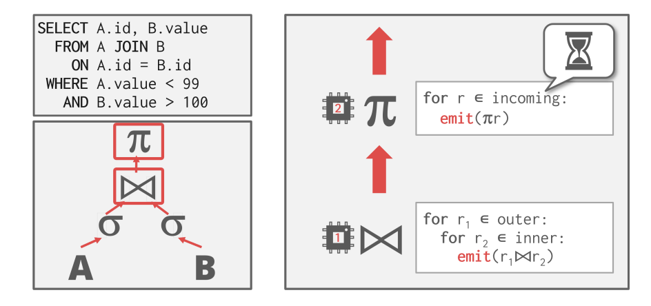
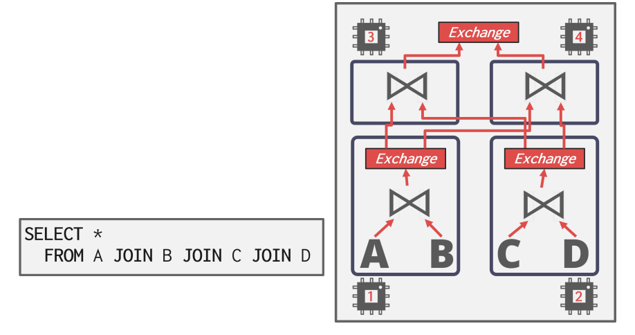

# CMU15-445-03：查询处理

> 这是CMU数据库课程15-445的第二个大的部分，主要讲数据库中的索引相关的内容，在2021秋的课程里应该对应Lecture09-Lecture12

数据库系统处理查询的时候经常需要进行的操作有排序，聚合和连接(Join)，下面先简单说一下每一种操作的不同实现方式。

## 常见的查询操作

### 排序

数据库系统往往需要对数据元组进行排序，而比如面临ORDER BY，GROUP BY等查询指令的时候，如果内存中能放得下所有的数据那自然就最好了，这样排序就可以直接在内存中进行，但是往往数据量一大起来之后这种美好的设想就无法实现了，而数据库系统中采取的解决方案是：采用**外部归并排序**(External Merge Sort)来完成对大量元组数据的排序。外部归并排序需要同时使用磁盘和内存，具体操作可以分成以下两个步骤：

- 排序：外部归并排序首先需要在小的chunk(块)中对内部的所有数据进行排序，要保证块的大小可以被内存接受，写完之后再写回磁盘中
- 归并：然后将磁盘中各个块内已经排序的块进行归并，得到总体的排序结果

同时，归并的方式最简单的是二路归并排序，这个应该在数据结构中学过，具体的就不讲了，也有更复杂的K路归并排序，二路归并需要三份buffer，而K路归并排序可以使用若干个buffer提高两个阶段的效率。

外部排序有两种常见的优化方式：

- 双倍缓冲区：即一个缓冲区用来执行归并排序的同时，另一个缓冲区用来加载磁盘中待操作的数据，这种方法可以减少I/O所需的等待时间
- 使用B+树来排序

### 聚合

聚合操作是在查询的过程中，将一些数据按照一定的规则聚合成一个结果并返回，常见的实现聚合操作的方法有两种：

- 排序：可以通过对要聚合的条件进行排序，然后筛选出需要聚合的元组完成聚合操作，内存够用就用内存，内存不够就上外部排序
- Hash：通过Hash操作将应该聚合在一起的元组映射到同一个结果中，然后进行聚合，但是如果表太大就可以进行划分，有两种策略：Partition和Rehash

### 连接Join

Join是SQL高级语法中非常重要的操作，一般数据表为了节约存储空间，会选择最小化表之间的信息重复，因此一个大表可能会被拆分成很多小的表进行存储，而join操作可以将跨表的信息进行连接，重新构建出大表中的详细信息。这门课程里讲的join主要就是inner equijoin，即针对**相同的key进行连接**

#### Join操作的定义

我们假设表R中的元组r和表S中的元组s的连接属性相等，那么连接操作就会将r和s组合成一个新的输出元组，事实上Join操作的实现方式有两种，

- 一种是直接合并数据，直接合并元组的数据得到新的元组并进行存储
- 一种是加入记录的id，不直接将属性值合并，而是在r后面加上s元组的id，等到需要用到s中特有的属性的时候再根据id去表S中查询，这种方式叫做materialization(实体化？)这么做可以减少存储空间，但是可能会导致查询效率的下降

Join操作有各种不同的实现方式，而评估Join操作的度量方式就是磁盘I/O次数，因为相比于I/O所需的时间，具体的计算和合并等操作消耗的时间数量级要小很多，因此我们下面分析不同算法的性能的时候主要考虑的就是磁盘I/O所需的次数。

我们不妨假设外部表R有M个页，一共有m个元组，内部表S一共有N个页和n个元组，下面我们来探究不同的Join算法的特点和性能

#### 嵌套循环Join

基于多层循环的Join操作顾名思义就是通过两个for循环来实现Join操作，对于每一个外部表R中的元组r，查询S的所有元组并找到可以join的元组，处理后存放到结果中，这样一来这种算法的复杂度就是
$$
M+(m\times N)
$$

- 两个for循环，首先需要读M个外部表的页需要M次I/O，然后对于其中的m个元组，每次都要读N个内部页
- 很明显我们希望能够选一个小的表作为外部页，这样可以减少I/O的次数

这是最简单的嵌套循环形式的Join，一个优化后的版本是使用基于块的嵌套循环Join，即对于每个外部表的每个块都遍历内部表的每个块来实现join，这样一来算法的复杂度被优化成了：
$$
M+M\times N
$$

如果数据库系统有B个buffer可以使用，那么有B-2个Buffer可以被用来扫描外部表，一个buffer用来扫描内部表，另一个buffer用来存放输出结果，这样一来复杂度就降低为了：
$$
M+[\frac{M}{B-2}]\times N
$$

如果数据库已经针对要查找的属性建立好了索引，那么就可以用索引加速join操作，这个时候一般外部表不使用索引而内部表使用索引。

#### 归并排序Join

另一种思路是可以对两个表按照要join的**属性进行归并排序**，这样一来属性值相同的元组就会被排在一起，然后就可以进行join了。

#### Hash Join

使用hash进行join的思路也是通过hash对不同的元组进行映射，将拥有相同join属性值(也就是key)的元组映射到同一个小的chunk中，这样就可以减少两个表之间的互相搜索的次数。基本的步骤包括建表和搜索两个部分，并且可以针对特定的情况做hash上的优化，比如说在已知外部表大小的情况下使用静态表，或者使用Bloom Filter

#### 总结

几种不同Join方法的总结如下：

## 查询处理

在处理具体的SQL查询语句的时候，需要将一个SQL语句解析成一个处理树，并且数据流是从树的叶节点流向树的根节点，并且从根节点输出这个查询语句的结果，通常来说**一个查询语句可以有多种不同的执行方式**

一般来说每个操作符都是binary的，即有1-2个子节点。

### 处理的方向

对于一个查询树，处理方向可以分成两种：

- 自顶向下：从根节点开始处理，并且不断从子节点向父节点“拉取”数据，元组通过函数调用来传递
- 自底向上：从叶节点开始向上“推动”数据，允许在pipeline中进行更严格的控制

### 处理模型

处理模型定义了数据库系统如何处理一个查询计划，处理模型指定了查询处理的方向，数据传递的方式等要素，并且常见的处理模型有3种，分别在不同的工作负载上进行了trade-off，它们是：

- Iterator Model
- Materialization Model
- Vectorized / Batch Model

#### 迭代模型Iterator Model

Iterator Model(IM)也被称为Volcano/Pipeline Model(火山/流水线模型)，是最常见的一种处理模型，这种模型中给每个算子实现了一个关键的`Next()`，处理树中的每一个节点都会调用这个方法来获取子节点的信息直到达到叶节点为止

这个方法可以让子节点给它的父节点**提交下一个需要进行处理的元组**，同时每个元组在下一个元组被检索上来之前尽可能的向上传播并进行处理，这种处理模型对于基于磁盘的系统很有用，因为可以让每个进入内存的元组在下一个元组或者页被调入内存之间，都得到充分的使用，这个过程可以用下面的这张图来表示：

Next方法的实现方式和主要作用是：

- 每次调用Next都会返回一个元组或者空标记(当已经没有元组可以返回的时候)
- 算子中会实现一个循环来不断调用Next方法来获得来自子节点的元组并进行处理，而子节点又会调用它的子节点的Next方法直到碰到叶节点为止

同时IM采用基于流水线(pipeline)的方式，让一个元组被尽可能多的算子进行处理然后再读下一个元组，这样做的目的是**减少磁盘的I/O**，而一个元组在查询过程中执行的一系列运算就被称为它的pipeline

一些算子会在子节点上传所有元组之前一直处于阻塞的状态，比如join和order by等，这些算子也被称为是pipeline breaker

同时这种处理模型很容易控制输出，因为一个算子可以在满足了需要之后停止调用Next方法。

- 很明显这种处理模式适合用在OLAP的工作模式下

#### 物化模型Materialization Model

这种处理模型不使用next方法，而是直接梭哈，从根节点开始向下不断获得数据，每一次都将**当前节点所有的数据**传递给父节点处理，这种方式更能适应OLTP的工作模式，因为这时候的查询往往只会访问一小部分的元组和这样的处理模型可以减少函数的调用次数，但是这种处理模型不适合处理OLAP

#### 向量模型Vectorized Model

相比之下Vectorized Model采用了调和折中的策略，每次向子节点索要数据并不是要一个，也不是全部，而是一个批次**一个批次地拿**，这种方法更适合处理不需要大量读取数据的OLAP工作模式，因为可以减少Next的调用次数。

#### 总结

三种处理模型的特点和适用范围可以用下面这张表来总结：

| 处理模型        | 特点                                                   | 适用范围           |
| --------------- | ------------------------------------------------------ | ------------------ |
| Iterator        | 通过Next方法每次传递一个数据并尽可能多的向上传递和处理 | OLAP               |
| Materialization | 每次传递和处理所有能传递/处理的数据                    | OLTP               |
| Vectorized      | 每次传递和处理一个小批的数据                           | 不用大规模读的OLAP |

### 数据的访问

数据库系统访问存储在表中的元组数据有两种方法，一种是按顺序扫描，另一种是通过索引进行扫描。

#### 顺序扫描

顺序扫描就是算子在数据表的每个页上按照顺序迭代式的进行扫描，并且判断哪些元组是可以被提交上去的，同时数据库系统中会维护一个内部游标(cursor)来记录上一个访问的页和槽的信息，同时顺序扫描有很多优化方式，包括：

| 优化方式             | 特点/操作方式                                                |
| -------------------- | ------------------------------------------------------------ |
| 预加载PreFetching    | 提前将接下来要用的几个页加载到缓冲池中，这样就不会每次等待缓冲池加载 |
| 绕过缓冲池           | 扫描算子直接将从磁盘中抓取的页放到它的本地内存中也不经过缓冲池，避免泛洪 |
| 并行化               | 适用多个并发的线程或者进程来执行顺序扫描                     |
| 空间映射Zone Map     | 预先计算一个页中所有的元组属性的一些**聚合结果**，称为Zone Map，然后数据库管理系统可以通过访问Zone Map决定是否需要访问一个页，Zone Map用另外的页存储，这种方法可以减少扫描过程中需要访问的页的数量，具体的可以看下面的插图 |
| Late Materialization | 将元组的**拼接延迟**到查询计划的上部，可以减少算子传递的数据量 |
| 堆集群               | 将元组使用一个存储在堆页上，并使用集群索引                   |

#### 索引扫描

索引扫描中，数据库系统通过索引来得知一个元组的位置，并将查询所需要的元组都检索出来。

而使用索引扫描的时候，我们需要考虑的问题有很多，包括：

- 索引包含了哪些属性
- 查询需要得到哪些属性
- 某个属性的值域是怎么样的
- 索引是否具有unique的键值

而很多高级的数据库系统支持多索引(Multi-index)的扫描，当对一个查询使用多个索引的时候，数据库系统会计算跟每个索引匹配的id集合，并将它们进行整合得到满足查询目标的结果。数据库系统可以使用位图，Hash表等方式来进行id集合的计算。

## 并行查询处理

上面说的都是单个工作者(Worker)上的查询处理模型，而在实践过程中，我们更多使用的是并发的查询处理，即将多个查询分散到多个工作者上进行处理，这么做可以提高系统的吞吐量并降低延迟。

同时，并行化数据库和分布式数据库是两个不一样的概念，二者的共同点在于都使用了多倍的资源来挺高系统的并行程度(这些资源包括计算资源和存储资源)，而他们的区别在于：

- 并行的数据库系统中的资源和结点在物理意义上是相近的，不同的节点之间可以高速互联，并且廉价可信
- 分布式的数据系统的资源和结点可能在物理意义上相聚非常远，这意味着不同结点之间的沟通可能是非常慢并且没有可靠性保证的，结点之间的交流可能会失败，并且代价往往也更高。

### 并行查询的处理模型

并行的数据库系统的处理模型将决定系统如何支持多用户环境下的并发的请求，一个应用程序可能会发送一个非常大的请求或者多个不同的请求，这就需要数据库系统将请求的处理分散到多个工作者上，常见的并发处理模型有以下三种。

#### 每个工作者对应一个进程

最简单的一种设计是每个工作者对应一个单独的操作系统上的进程，这样一来这些工作者就需要操作系统来进行调度，当应用程序想要发送请求给数据库系统时，调度器会收到这个请求并让一个工作进程来处理这个(fork一个新的进程)，然后工作进程直接和应用程序进行交互，如下图所示：

#### 进程池

进程池模型的设计原则是，不是每次收到请求都去专门创建对应的进程来处理，而是创建好一系列进程，构成一个进程池，然后通过调度器来进行调度，每个工作者负责专门的一些任务，这样一来进程之间可以**共享查询的信息**。

#### 每个工作者对应一个线程

每个工作者对应一个线程是最常用的处理模型，这种模式下，每个数据库系统只有一个进程，但是一个进程里面有多个工作者线程，这种模型使得数据库系统**可以完全掌握每一个工作者**，并且自己进行线程之间的调度和管理。

#### 总结

三种并发调度方式各有优缺点，可以用下面的表格来概括：

| 调度模型           | 优点                                                         | 缺点                                                         |
| ------------------ | ------------------------------------------------------------ | ------------------------------------------------------------ |
| 每个工作者一个线程 | 每个工作者之间不会互相干扰，因为它们都有独自的上下文         | 数据库系统本身缺乏对每个工作者的掌控能力                     |
| 进程池             | 没有提到                                                     | CPU中cache的局部性非常不好，这是因为同一个进程不能保证在不同的查询之间共享 |
| 每个工作者一个线程 | 数据库系统可以完全掌控线程之间的调度，不用维护进程之间的共享内存模型 | 容易出现crash                                                |

### 查询的并行化

#### 查询间的并行化

查询间的并行化是指不同的工作者来处理不同的查询，这实际上是最intuitional的想法，通过让多个工作者同时处理多个请求来提高系统的吞吐量，如果处理的查询都是只读的，那么这些查询之间的关联就很小，可以并发执行，但是如果查询会并发地修改数据库，那么就需要更复杂的调度策略，这个在后面会进一步讲。

#### 查询内并行

对单个查询进行并行化的处理其实就是将查询看成了一个生产者消费者的模型，没一个操作符都是一个数据的生产者同时又是下一级的操作符产生的数据的消费者。查询内的并行化分成了三个不同的方式

##### 操作符内并行化

操作符内的并行化是指将插入计划中的操作符分解成若干个独立的片段，这些片段在不同的数据上执行同一个操作，其实就是对一个操作符，将其要操作的数据划分成不相交的多个部分，并且数据库系统会在查询计划中插入一种新的操作符，称为exchange，这个操作符可以阻止位于这个操作符之上的操作符继续执行，直到exchange操作符接收到了下面并行操作的结果。并且exchange操作符也可以分成三种不同的形式：

- Gather：将多个工作者的结果组合到一个输出流中，最常见的操作符
- Repartition：重新将多个输入流组织称多个输出流，即输入到输出的重分发。
- Distribute：将一个输入流分成多个输出流

##### 操作符间并行化

 操作符之间的并行化实际上就是不经过物化(Materialization)直接通过管道pipeline进行数据的处理，这种方式非常常见，可以在一系列输入流中进行查询的处理。

##### 混合并行化

其实就是将上面两种方法相结合，在这种模式下，工作者同时执行来自查询计划的不同段的多个操作符。

### I/O的并行化

上面的查询并行化处理都是基于这样一个假设：CPU的性能(或者说计算资源)是数据库系统的瓶颈，并且通过各种各样的方式对计算资源进行并行化的调度，来最大化计算资源的利用率。一个很明显的问题就是，如果系统的瓶颈不在于计算资源而在于存储设备(硬盘)，那么上面的优化就显得没那么有用了，因为整个系统的运行大部分时间都消耗在和存储设备的I/O上的话，再怎么提高计算效率，也不能突破性能的瓶颈。

因此我们还需要对I/O操作也进行并行化的处理，主要有两种方式：

- 多磁盘的并行化：在多个存储设备上存储数据
- 数据库的分区：将数据库分割成多个逻辑分区，每个逻辑分区之间互不相交并且负责不同的查询处理，常见的分区方法分成两种：
  - 垂直分区：将表按照属性存储在不同的区域，并存储元组的结构信息用来重建表
  - 水平分区：将表的元组分割成不同的段并进行存储
