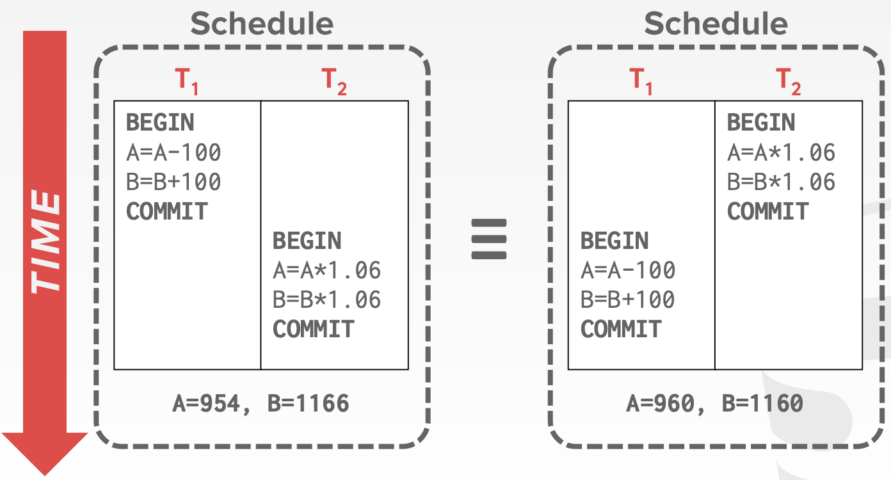
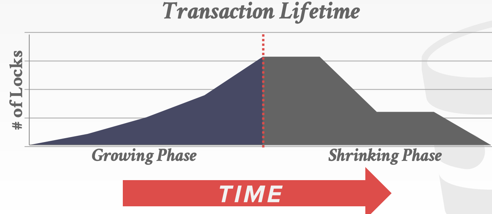

# CMU15-445-05：事务与并发控制

> 这是CMU数据库课程15-445的第五个大的部分，主要讲数据库中的事务和并发控制的内容，在2021秋的课程里应该对应Lecture15-Lecture18

## 事务

### 事务的概念

事务(Transaction)是数据库中最重要的一个抽象，一个事务指的是在一个共享的数据库上一系列操作的执行(可以是一个或者多个)，这些操作共同组成一个更高级的功能(比如复杂的SQL查询)，事务**不允许被部分执行**。

### 事务的处理

最简单的事务处理系统就是一次处理一个事务，为了执行一个事务，数据库会对整个数据库中的文件进行备份并且在副本上进行事务对应的一系列改变，如果事务执行成功了，那么新的文件会变成当前的数据库文件，如果执行失败，那么这个事务对数据库文件进行的任何改变都不会被保存下来，这种方法非常慢，而且不支持并发。

处理事务更好的方法是允许一个系统并发的执行多个事务，并且同时保证系统的正确性和公平性，但是并发执行存在一些挑战，如果不加任何限制就直接执行一系列并发的操作，存在的问题包括：

- 暂时的不一致性：不能避免，但并不是问题
- 永久的不一致性：对于数据库系统来说无法接受，必须想办法避免

而这几节课的内容也就重点讨论怎么处理并发的事务。

### 事务的性质

事务在执行过程中会有一个状态，事务开始时的状态是BEGIN，而结束时候的状态是COMMIT或者ABORT，如果事务最后出现了ABORT，那么这个事务对数据库中存储对象的一系列操作都不会被保留，这个事务也会被重新执行。

同时，事务也具有四个性质，分别是ACID

- Atomicity原子性，即事务只能被完整的执行或者完全不执行，一旦事务执行失败，那么这个事务之前作出的所有操作都不能影响数据库
- Consistency一致性，如果每个事务和数据库在开始的时候都是一致的，那么在所有的事务完成之后数据库也应该是一致的
- Isolation隔离性，事务和事务之间应该独立执行而不受其他事务的影响
- Durability持久性，如果一个事务commit了，那么它对数据库造成的影响应该是持久的，如果数据库发生了崩溃或者重启，依然要保持这个事务的效果

#### 原子性

原子性也就是事务需要执行其中的所有操作或者一点都不执行，为了实现这个要求，可行的方法有：

- Logging 用日志记录事务的一系列操作，并且在内存和磁盘中维护一系列undo记录，大部分数据库系统用的都是基于日志的系统
- Shadow Paging 即保存数据库数据文件的备份，然后现在这些备份上进行操作，如果事务abort了，那么这个备份就不会被更新到原数据中

#### 一致性

一致性意味着数据库返回的结果在逻辑上是正确的。一致性包含两个层面：

- 数据库的一致性：未来的事务应该能感知到之前的事务在数据库中进行的修改
- 事务的一致性：如果数据库在事务开始之前是一致的，那么在事务结束的时候也应该是一致的

#### 隔离性

各个事务应该在系统中独立运行，并且不能“观测到”其他的并发事务带来的效果，也就是说**并发执行的结果应该跟所有事务串行执行的效果是一样的**。为了达到这个目的，并发事务需要按照一定的顺序交错的进行。这就需要并发控制协议，并发控制协议主要可以分成两类：

- 悲观协议：为了让事务不发生冲突，那么**一开始就不能让这些问题发生**
- 乐观协议：数据库系统可以保证事务的冲突时非常罕见的，并且会在**冲突发生的时候进行处理**

### 事务的并发控制

而一系列操作的执行顺序被称为数据库系统的执行调度，并发控制协议的目标就是生成一个和串行执行等价的执行调度。

> 执行的调度有以下几个特别重要的概念：
>
> - 串行调度：按顺序来执行一个个事务，不进行事务操作的交错执行的执行调度
> - 等价调度：两个输出结果相同的执行调度被称为是等价调度
> - 可串行化(Serializable)调度：如果一个执行调度和某个串行调度等价，那么它就是一个可串行化调度

而冲突指的是一个数据对象被多个事务共同操作的时候带来的问题，包括以下三种：

- Read-Write冲突，也叫**不可重复读**，即一个事务不能在多次读取一个对象的过程中得到相同的值，因为这个对象被另一个事务修改了
- Write-Read冲突，也叫做**脏读**，即一个事务A在commit之前，观测到了其他事务B对A要访问的数据对象的改写
- Write-Write冲突，也叫做**更新丢失**，一个事务A在另一个事务B提交之前就覆盖了B修改的数据

数据库系统支持在不发生冲突的情况下，对事务尽可能的进行并发处理。

#### 冲突可串行性

很显然，并发的事务采用不同的顺序执行，带来的结果可能会不一样。比如下图的例子：

如果两个调度调用了相同事务的相同操作，并且对于所有可能的冲突都采取了一样的处理方式，那么这两个事务就被称为冲突等价的(Conflict Equivalent)

我们可以用**依赖图(也叫前趋图)**来描述一个调度中，不同事务之间的冲突关系，在前趋图中，每个事务对应了图中的一个节点，**当且仅当**一个事务A的操作a和事务B的操作b冲突，并且a比b要先完成，那么A和B之间才会有一条A到B的有向边。并且**当且仅当一个调度的前趋图是无环的时候，这个调度才是冲突可串行化的**。

上面这个调度对应的前趋图如下：

#### 视图可串行性

视图可串行性(View Serializability)是另一种限制比较弱的串行化策略，它允许所有冲突的调度串行化处理并且进行**盲写**(在写操作之前不读取数据)，但是它不能被有效的执行，因为数据库系统不知道应用程序怎么解释这些被修改的值。

## 事务与二阶段锁

锁是数据库中一个非常重要的概念，它可以用来动态的生成事务的执行计划的调度方法，并且**不需要预先知道事务的整个读写处理流程**，这样一来，数据库中存储的对象就可以被在并发访问的状态下保持数据的可靠性。数据库系统中会有一个中心化的`LockManager`来具体负责对锁进行管理和调度，同时它也提供了一个全局视角来展示数据库系统中发生了哪些操作。

一般来说锁可以分成两种：

- 共享锁(Shared Lock, S-LOCK)，允许多个事务同时读取同一个对象内容的锁，如果一个事物拥有一个共享锁，那么另一个事务依然可以持有一个相同的锁
- 互斥锁(Exclusive Lock, X-LOCK)，允许一个事务修改一个对象，并且阻止其他的事务再获得这个对象的锁，**一个对象的互斥锁在一个时间点智能呗一个事务所拥有**。

事务必须向`LockManager`申请需要的锁，而`LockManager`会根据数据库中每个对象的实际情况来统一或者阻塞来自事务的请求，事务必须在不需要锁的时候释放，并且`LockManager`内部维护了一个lock-table用来记录事务之间锁的分配情况，并以此来决定接下来的锁分配请求。

### 二阶段锁

二阶段锁(Two-Phase locking, 2PL)是数据库中的一种持久化并发控制协议，可以决定一个事务是否可以访问某个特定的对象。

- 阶段1：Growing 这个阶段中，每个事务可以根据需要像`LockManager`发送申请锁的请求，而`LockManager`也根据对象的实际情况同意或者拒绝这个请求。
- 阶段2：Shrinking 当一个事务第一次释放锁之后，他就会立刻进入到第二阶段，到了第二阶段之后，事务只允许释放锁儿不允许再申请任何的锁。也就是说第一阶段只能申请锁，而第二阶段只能释放锁，两个阶段在有锁的状态下都可以操作数据。

2PL可以做到对并发事务的有效处理，但是2PL会出现级联中止(Cascading aborts)的问题，当一个事务中止的时候另一个事务也需要进行回滚，因为另一个事务需要的锁没有被释放，这就导致了一些无效的workload

同时，2PL要求并发事务的**优先级图(也叫前趋图，Precedence Graph)是无环**的，即一**个事务不能是自己的前趋(即发生了死锁)**

> 严格2PL是在事务提交的时候才释放的2PL

### 死锁检测

2PL中很重要的一个步骤就是避免事务的执行过程中出现**死锁**，常见的处理方式有检测和阻止两种。

- 死锁检测：在事务处理的过程中检测是否存在死锁，通过创建一个wait-for图(类似于前趋图，两个事务之间如果存在等待关系就加一条有向边)，如果wait-for图中有环就要想办法打破这种情况，比如选择一个victim transaction并把它abort，通过这种方式打破死锁
- 死锁阻止：死锁阻止是在事务开始执行之前就开始就检测是不是有死锁存在，如果存在就先解决死锁问题再执行事务，如果一个事务想申请一个其他事务持有的锁，那么就会先kill其中一个，并把锁分配给需要的事务，主要分成两种方式来kill事务的方式：
  - Wait-Die 老的进程等新的事务，即一旦有新事务请求某个被老事务占有的锁，那么就直接让给新的事务，新事务有更高的优先级
  - Wound-Wait 新的事务等老的事务先完成再进行申请，老的事务有更高的优先级

### 意向锁

如果一个事务想要更新大量的元组，那么它可能需要向数据库系统申请大量的锁，这会让系统的效率变得很低，因为事务必须要经历大量的申请锁-等锁分配的过程。为了解决这个问题，数据库系统会使用一些**不同粒度的锁**，比如对一个表设置一个锁，如果事务申请了这个表的锁，就享有了对这个表中的元组进行操作的权力而不用再申请每个元组的锁。

这种锁被称为**意向锁(Intention Lock)**，意向锁是一种更高级别的锁，可以分成以下三种：

- Intention-Shared(IS)
- Intention-Exclusive(IX)
- Shared+Intention-Exclusive(SIX)

当申请了一个意向锁的时候，这个意向锁对应的范围内的数据对象的对应操作就不再需要反复申请新的锁。

