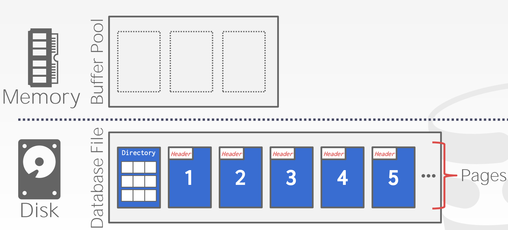

# CMU15-455-01：数据库的存储

> 15-445是CMU非常著名的数据库系统课程，本节内容是其中的数据存储部分的笔记。

## 计算机中的存储

CMU15-445的主题是数据库系统，实际上关键就是面向磁盘存储的数据库系统(特别是关系型数据库)，而数据库的存储的主要研究对象也是面向磁盘的数据库管理系统架构，所谓的面向磁盘存储就是说数据库中的数据存储在非易失性的磁盘中。

### 存储结构的划分

事实上计算机中的存储可以按照层级结构分成这样几个组成部分：

- CPU寄存器
- CPU中的Cache
- DRAM(动态随机存取存储器)，也就是通常说的内存
- SSD(固态硬盘)
- HDD(硬盘驱动器)
- 网络存储

这些存储器结构的访问速度从上到下依次降低，并且存在数量级上的差距，这也就很容易造成计算机中的IO失配。

同时存储结构又可以分成易失性存储和非易失性的存储。易失性的存储就是在关闭电源之后会数据会消失的存储，支持使用字节编址的快速随机访问，一般就称之为**内存**(不包括寄存器和CPU上的Cache，这两个属于CPU而不是存储器)。

而非易失性的存储可以在没有电源的情况下稳定存储数据，一般我们称之为磁盘(不区分SSD和HDD)，而磁盘上的数据是按照**块/页的结构**来编址和存储的(这里的块和页指的是同一个意思，后面就不再区分二者的关系)，访问的时候也需要将整个块(一般是4MB)读入内存中进行操作，因此磁盘更适合进行顺序访问。

> 另外还有一种非易失性的内存，既有DRAM的存取速度又可以像磁盘一样持久性地保存数据，不过这个不在这门课程的考虑范围之内，因为还没有被大规模商用。

因为内存和磁盘上的数据存取速度存在非常明显的数据集上的差距，因此数据库系统设计的一个很重要的点就是解决内存中的数据和磁盘中的数据的读写速度的失配，尽可能提高数据库系统的读写效率。

### 面向磁盘的DBMS

面向磁盘的数据库管理系统的总体运行规则是：数据按照块/页存储在磁盘中，当需要操作数据的时候，数据库管理系统会把对应的块/页读入内存中，同时在内存中维护一个**Buffer Pool(缓冲池)**来管理从磁盘读入内存的块。

同时数据库管理系统有一个执行引擎负责执行各种各样的查询，引擎会向Buffer Pool索要特定的块，然后Buffer Pool会从磁盘中将这个块读入内存，并将这个块在内存中的指针返回给数据库引擎，然后数据库

### DBMS和OS的比较

DBMS设计的初衷就是让用来管理数据容量超过内存的数据库(如果数据比较少，那好像直接全从磁盘上读入内存也不是不行)，它提供了一种类似于虚拟内存的机制来管理数据在内存和磁盘之间的读写。

虚拟内存的一种实现方式是`mmap`(内存映射)，这种方式可以将一个文件或者其它对象映射到进程的地址空间，实现文件磁盘地址和进程虚拟地址空间中一段虚拟地址的一一对应关系。但是这种方法一旦出现page fault就会让整个进程阻塞，因此我们在DBMS中不会使用mmap，DBMS总是希望能自己掌控所有的事务而不是依赖操作系统，因为它知道更多和数据/查询有关的信息可以充分利用。

但是DBMS可以通过如下几种方式来利用操作系统：

- `madvise` 通知OS你什么时候想要读取制定的块
- `mlock` 通知OS不要将某个内存区间和磁盘进行交换
- `msync` 通知OS将某个内存区间的东西写入磁盘

## 数据库文件存储

### 页Page

大部分DBMS都把数据作为磁盘上的文件进行存储，同时会用DBMS指定的方法进行加密，只有DBMS可以知道加密和解密的规则，而操作系统对此一无所知，这些功能都由DBMS的Storage Manager进行管理，Storage Manager将数据文件表示成若干个页的集合，并且会监测一个文件的页中还剩下多少空间可以使用。

同时每个页会有一个唯一的标识符(id)，如果一个数据库是单文件的(比如SQLite)，那么这个标识符就是文件的偏移量，如果是多文件的就更复杂一点。同时DBMS会将id映射到文件路径和偏移量，上层的执行引擎会索要指定id的页，这时候storage manager将会把这个id转换成文件和偏移量并找到这个页。

同时DBMS的页可以存储各种不同格式的数据，比如索引和元祖，但是不会将不同格式的数据进行混合存储，同时DBMS中的页是自包含的，一页所有的信息都在写在页内，只需要读取这个页就可以知道所有相关信息，而不需要依赖外部的数据结构。

DBMS中的页一般是定长的，往往选用和硬件页/操作系统页一样的大小，也就是4KB，这样方便进行读写(因为存储设备可以保证一个页的读写是原子操作，即要不4KB都写入，要不4KB都写入失败)

### Database Heap

堆文件(Heap File)是一种常见的页组织方式，可以让DBMS找到所需要的页在磁盘中对应的位置。堆文件中的页的信息是用元组格式进行无序存放的。

DBMS可以用以下几种方式找到page id在磁盘上对应的块：

- 链表：每个文件的header page中保留一个指向空闲页的指针和一个指向数据页的指针，页和页之间形成链表状的结构，这种方法的坏处是，如果DBMS想要找一个特定的页，那么它必须从header开始顺序扫描直到找到目标，比较费时间。

- 页目录Page Directory：DBMS维护一个专门的页用来记录每个页的数据页和空闲页的位置，跟map类似，用page id直接去查到对应的页位置。

### 页的存储格式(Layout)

每个页都包含了一个页头，头里包含了若干元数据，包括：

- 页的大小
- 校验和
- DBMS的版本
- 事务的可见性
- 自包含性Self-containment

头之后是页中的数据，一种naive approach是只是简单的记录一个页中存放了多少元组，每次有新的数据写入就在末尾添加，这样的做法会导致的问题是，如果数据被删除或者包含了不定长的字段，那么整个页的管理就会出现问题。常用的数据存储方式有两种，分别是slotted-pages和log-structured

> 我们需要搞清楚，在关系型数据库中，数据的基本形式是一个元组(tuple)，因此存储的时候也需要将元组作为一个完整的对象进行考虑。

#### Slotted-Page

这种方法将页中的剩余空间划分成若干个槽(slot)，用槽来存储不同长度的元组数据，同时页头中维护slot的数量，最后使用的slot的末端在页中的偏移量，和每个slot的在页中的偏移量，并且用一个**指针数组**存储指向各个slot的指针(称为slot array)

同时slot是从页尾开始往前存储的，而slot array从页头开始往后存储，每次加入一个元组的时候都在slot array末尾添加一个指针，可以用下面这张图来描述slot page的构建方式：

当一个元组被删除的时候，后面的元组会向前移动填补空缺(当然从整个页的角度来看应该是前面的元组后移，因为元组存放方向和页的方向是反的)，同时在slot和slot array碰头的时候，我们认为这个页已经被填满了，不能再往里面写任何新的元组。

#### Log-Structured

日志结构的存储方式是，不存储元组而是直接存储数据库的操作记录，将所有修改了数据库内容的操作用日志的形式进行记录(创建，删除，修改)，在查询一条记录的时候，DBMS会根据这些日志将元组中的数据进行“复原”，然后筛选出合适的结果，这样做的好处是写很快，但是坏处是读很慢，在append-only的场景下非常合适，因为这时候很少需要回过去修改数据。

为了避免在读的时候进行过长的操作，DBMS会维护一些索引方便直接跳转到某条日志记录进行执行，同时也会定期对已有的日志记录进行合并，减少重复工作量。

### 元组的格式

元组实际上就是用一串字节序列来存储关系型数据库中的一条记录，DBMS需要将记录转换成元组，也需要对元组进行解析得到正确的记录，元组的格式可以分成Header和Data两个部分，头部的内容主要是元数据，这些元数据对于DBMS的并发控制协议是可见的，可以使用bitmap来标注NULL值，并且不需要存储数据库中的Schema(因为每个元组都存太浪费空间了，DBMS对此有统一的管理)

而Data部分则是具体的属性值，属性值的顺序应该和数据库的Schema保持一致，并且一般来说长度不能超过一页的大小。

数据库中的每个元组都有一个独立的标识id，一般使用`page id+slot offset`组成