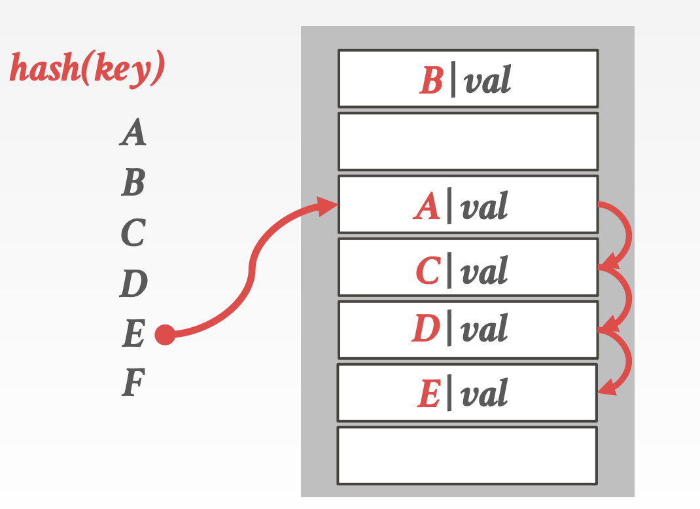

# CMU15-455-02：索引

> 这是CMU数据库课程15-445的第二个大的部分，主要讲数据库中的索引相关的内容，在2021秋的课程里应该对应Lecture06-Lecture08

## 索引

数据库中需要维护多种不同的数据结构用作系统内部的不同模块，包括：

- 内部的元数据信息，这一部分数据用来追踪数据库中存储信息本身的变化，比如页表
- 核心数据存储，用于存放元组的基本存储结构
- 临时数据结构，用在一些查询的处理和加速中，比如用于join操作的Hash table
- 表索引：用于加快元组查询的关键数据结构，通过查找索引快速得到元组本身包含的数据

而在设计数据库系统的数据结构的同时，我们需要重点关注：

- 数据的组织方式，如何对内存进行布局，数据结构中存储什么信息才能提高访问效率
- 并发性能，如何让数据结构支持多线程的访问并且不出现一致性问题

## Hash索引

### Hash表的结构

Hash表是一种将key映射到value的数组型数据结构，这种结构提供了常数级别的时间复杂度和线性级别的空间复杂度，一个hash表的有两个关键的组成要素：

- hash函数，即如何将key映射到value上的函数，但是需要把握好执行速度和冲突率的trade-off，二者往往不可兼得，如果冲突率低，那么hash函数的计算就复杂，执行速度就慢，而如果hash函数太简单会造成很高的冲突率
- hash机制，即解决可能发生的key冲突的方式，这里我们需要考虑的是在构建一个大hash表和执行额外操作二者之间找到一个平衡，因为hash表越大相对来说越难发生冲突，但是消耗的存储空间也越大

### 静态Hash

静态索引指的是哈希表的大小固定的索引方式，如果表中的位置被用完了就要从头开始重新构建一张表，这个时候往往会使用原本两倍大小的空间作为hash表，静态hash常见的解决冲突的方式有这样几种：

#### 线性探测Hash

最基本也是最有效的方法，当冲突发生的时候会用线性的方式搜索相邻的可以使用的槽来存放当前的key，在查找想要的key的时候，我们可以一直搜索直到找到想要的key为止，但是这也意味着我们要在槽中存储对应的key，而不是只存value就可以

这种策略下，删除就需要注意，比如以上面的图为例子，如果我们要删除D，那么在查询E的时候因为冲突需要进行平方探测，这个时候因为D被删除了所以在D的位置探测就结束了，但是并没有找到对应的E，因为E应该还在下一个位置，但是因为D缺失导致线性探测停止了，常用的解决办法有：

- 墓碑(TombStone)法：虽然删了，但是留一个记录表示这里以前有某个key-value放着，需要继续往下探测
- 另一种办法是在有删除操作之后改变其他数据的位置，保证删除之后能正常线性探测

如果使用的key并不是unique的，那么也有两种解决办法：

- 分离链表：使用一个链表来存储所有的值，并且key对应的value变成链表的指针
- 冗余key存储：直接在hash表中存储多个相同的key进行摆烂

#### 罗宾汉Hash

#### Cuckoo Hash

### 动态Hash