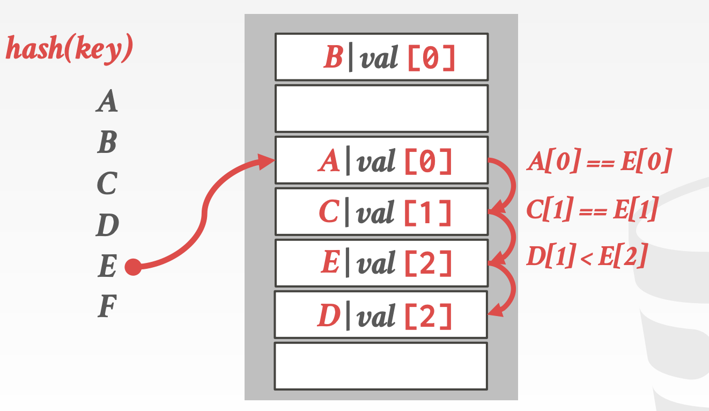
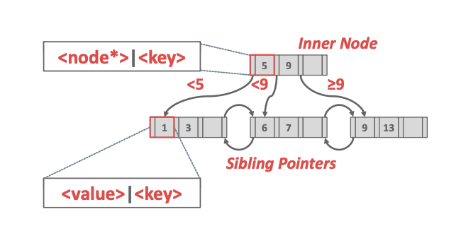
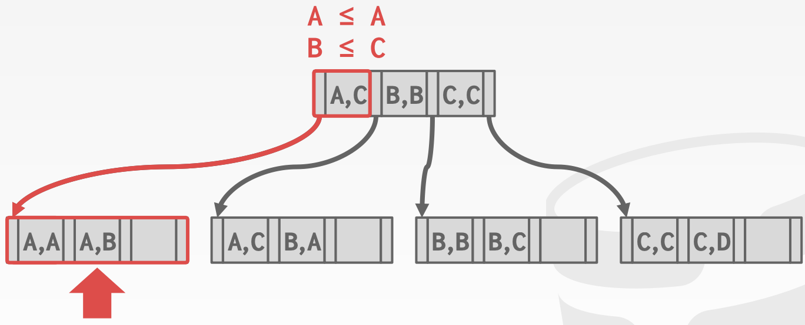
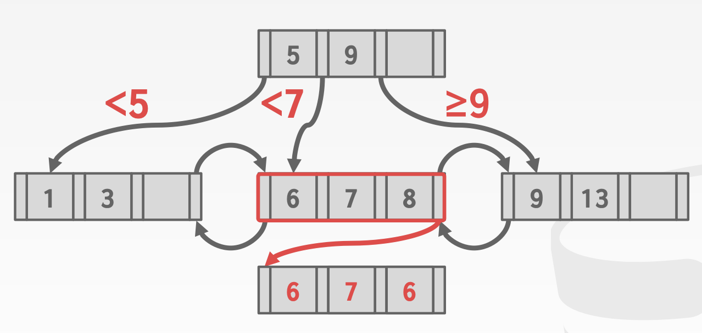

# CMU15-455-02：索引

> 这是CMU数据库课程15-445的第二个大的部分，主要讲数据库中的索引相关的内容，在2021秋的课程里应该对应Lecture06-Lecture08

## 索引

数据库中需要维护多种不同的数据结构用作系统内部的不同模块，包括：

- 内部的元数据信息，这一部分数据用来追踪数据库中存储信息本身的变化，比如页表
- 核心数据存储，用于存放元组的基本存储结构
- 临时数据结构，用在一些查询的处理和加速中，比如用于join操作的Hash table
- 表索引：用于加快元组查询的关键数据结构，通过查找索引快速得到元组本身包含的数据

而在设计数据库系统的数据结构的同时，我们需要重点关注：

- 数据的组织方式，如何对内存进行布局，数据结构中存储什么信息才能提高访问效率
- 并发性能，如何让数据结构支持多线程的访问并且不出现一致性问题

## Hash索引

### Hash表的结构

Hash表是一种将key映射到value的数组型数据结构，这种结构提供了常数级别的时间复杂度和线性级别的空间复杂度，一个hash表的有两个关键的组成要素：

- hash函数，即如何将key映射到value上的函数，但是需要把握好执行速度和冲突率的trade-off，二者往往不可兼得，如果冲突率低，那么hash函数的计算就复杂，执行速度就慢，而如果hash函数太简单会造成很高的冲突率
- hash机制，即解决可能发生的key冲突的方式，这里我们需要考虑的是在构建一个大hash表和执行额外操作二者之间找到一个平衡，因为hash表越大相对来说越难发生冲突，但是消耗的存储空间也越大

### 静态Hash

静态索引指的是哈希表的大小固定的索引方式，如果表中的位置被用完了就要从头开始重新构建一张表，这个时候往往会使用原本两倍大小的空间作为hash表，静态hash常见的解决冲突的方式有这样几种：

#### 线性探测Hash

最基本也是最有效的方法，当冲突发生的时候会用线性的方式搜索相邻的可以使用的槽来存放当前的key，在查找想要的key的时候，我们可以一直搜索直到找到想要的key为止，但是这也意味着我们要在槽中存储对应的key，而不是只存value就可以

这种策略下，删除就需要注意，比如以上面的图为例子，如果我们要删除D，那么在查询E的时候因为冲突需要进行平方探测，这个时候因为D被删除了所以在D的位置探测就结束了，但是并没有找到对应的E，因为E应该还在下一个位置，但是因为D缺失导致线性探测停止了，常用的解决办法有：

- 墓碑(TombStone)法：虽然删了，但是留一个记录表示这里以前有某个key-value放着，需要继续往下探测
- 另一种办法是在有删除操作之后改变其他数据的位置，保证删除之后能正常线性探测

如果使用的key并不是unique的，那么也有两种解决办法：

- 分离链表：使用一个链表来存储所有的值，并且key对应的value变成链表的指针
- 冗余key存储：直接在hash表中存储多个相同的key进行摆烂

#### 罗宾汉Hash

罗宾汉Hash(Robin Hood Hash)是对线性探测的一种优化，会对槽的分配采取劫富济贫的策略，在这种策略下，每一个条目还同时**记录了自己距离最优位置(即Hash直接运算的结果)的距离**，在每一次插入新的key的时候，如果一通线性探测之后，给待插入的key准备的槽到最佳位置的距离大于现在在这个槽上的key到最佳位置的距离，那么就会把这个位置让给新key，然后重新给老key找一个位置。

- 这张图就是PPT中一个例子，首先按顺序插入AB，插入C的时候发生了一次线性探测所以C在3号位，而D因为和C冲突所以在4号位，距离最佳位置的偏移量都是1，而插入E的和A，C都发生了冲突，探测到D这里的时候偏移量已经是2了，比D要大，所以根据罗宾汉的规则D让位给E，接下来再给D找一个新位置。

#### Cuckoo Hash

Cuckoo Hash采取的策略是使用多个Hash表和多个Hash函数，并且这些Hash函数使用相同的算法，但是使用不同的seed，使得同一个key可以产生不同的结果。

当需要插入新元素的时候，会检查每个表并且选择有空槽的一个，如果没有空的表，那么就随机选择一个并且踢掉那个位置上旧的条目，并将旧的条目重新hash到一个新的表里，如果发生了循环，那么就需要使用心得hash函数重新构建所有的hash表，虽然看起来变麻烦了，但是我们使用的仍然是常数个hash表，因此时间复杂度仍然控制在常数级别。

- 比如上面这个例子，首先插入A，发现hash函数的运算结果是1和3，假设放在表1的1号位，然后插入B，B的两个hash函数运算结果分别是1和0，为了不和A冲突所以插入表2的0号位，然后插入C发现C的hash函数运算结果是1和0，因此先替换B，B被替换之后只能去1号表抢了A的1号位，然后A就被调整到了2号表的3号位，这样一来就完成了三个元素的hash

### 动态Hash

动态hash机制可以在不重建hash表的基础上对hash表进行扩容(resize)，但是需要数据库系统能够过知道需要插入的元素的个数，否则就需要重建hash表，这种方式可以最大化利用hash表进行读和写。

#### 链式Hash

最常见的动态Hash机制，数据库系统会维护一系列桶(buckets)，hash表中的每个位置现在就对应到了一个桶中，具有相同hash结果的key就会被放入那个槽对应的桶中，同时一个槽可以有多个桶，桶和桶之间用链表的形式组织起来，一个桶的内部可以有多个key-value对。

这样一来查询的时候就变成了先hash再从桶中找对应的key，在极端情况下时间复杂度变成线性的，但是大部分情况下还是常数级别的复杂度。

#### 可伸长Hash

链式Hash可能会导致桶的不断扩增，而可伸长的hash方法允许**表中的多个槽指向同一个桶链中**

- 数据库系统维护一个全局和局部的位置编码来表示在槽数组中找到对应的桶所需要的位数(称为深度Depth)
- 当一个桶满了的时候，数据库系统会将这个桶重新划分并且如果局部的深度小于全局，那么就找空槽将分割了的槽重新安置，否则就对表进行扩容来收纳新的槽，同时增加全局的编码深度(多用一位进行表示)

#### 线性Hash

线性Hash不会在一个桶溢出的时候立马进行分割，而是维护一个**分割指针用来追踪下一个需要分割的桶**，无论这个指针是否指向溢出的桶，数据库系统都会对其进行分割：

- 如果任何桶溢出了，那么久将指针指向的桶进行分割并且加入新的槽，然后指针指向下一个位置
- 如果hash函数将key映射到了已经被指针指向的槽，那就使用心得hash函数
- 如果指针到达了最后一个槽，那么就删除最早的hash函数并用新的替换

其实就是不急着立马对满了的桶进行分割，而是按顺序一个个来，当有桶溢出的时候就对当前指向的槽对应的桶进行分割并扩展。

## B+树索引

### 表索引

**表索引(Table Index)**是用来快速访问数据表中的一些特定列索引结构，只对数据表中特定列构成的元组建立索引，在查询数据的时候就不再需要按照顺序扫描，而是通过表索引更快的查询元组数据，同时数据库要保证表索引和表中的数据始终保持一致性。

同时，每个数据库需要建立的索引数量需要合理规划，虽然更多的索引会让查询更加快速，但是索引也会消耗大量的存储空间，数据库系统需要找到最合适的索引数量。

### B+树

B+树是一种自平衡的树形数据结构，可以保证数据处于排好序的状态并且允许进行数据的搜索，顺序访问的插入删除，这些操作的时间复杂度都是$$\log(n)$$级别的。几乎所有支持顺序保留的索引的数据库系统都使用了B+树的数据结构。

而还有一种数据结构叫做B-树，这两者的主要区别是B树在所有的结点上都会存储key-value，而B+树将这些key和value**都存放在了叶结点**上，现代的B+树还会结合一些B-树中的特征，比如说同辈指针(Sibling Pointer)

B+树是一种M阶的搜索树(也可以叫M路)，并且具有如下特征：

- B+树是完美平衡的，所有叶结点的深度都相同
- B+树中，根以外的每个内部结点至少是半满的，即key的数量在$$[\frac M2-1, M-1]$$
- 每一个有k个key的内部结点有k+1个非空的子结点

同时B+树中的每一个结点都有一个key-value对组成的数组，这里的key的选择是根据索引对应的属性来决定的，而value会根据是内部结点还是叶结点有所区别，对于内部结点来说，这里的value是指向下一层结点的指针，而对于叶结点来说，value是对应记录的ID和元组的数据，记录的ID对应的是一个指向元组位置的指针，也有的叶结点会直接把元组的数据信息直接存储在叶结点中。同时，这些key-value数组都是按照key的大小进行排序的。

#### 选择条件

对于一个复杂的查询，B+树索引支持只使用其中一部分属性值进行查询，比如建立了一个关于(a, b, c)三个属性的索引，如果是B+树的索引，那么这个索引可以处理关于(a, b, c)的查询，也可以处理只查a或者查(a, b)的，但是对于hash索引来说，只能处理关于(a, b, c)的查询，这是B+树索引的一个巨大优势。

#### 插入操作

对于插入操作，B+树的处理流程包括下面几个步骤：

1. 找到正确的叶结点L
2. 在L中将新的条目按照排好序的顺序插入
   1. 如果L中位置足够，那么插入操作就结束了
   2. 否则L将被从中间分成两个结点L和L2，并且在L的父节点上把L2加进去，即父节点上多一个key-value对，其中value指向L2
3. 如果内部结点也需要分裂，也需要重新将条目进行分配，往上push up中间的key

#### 删除操作

在插入的时候我们要考虑结点中空间满了将其分裂，而如果一次删除造成了叶结点少于半满，那么我们必须将这个叶结点进行归并来达到树的重新平衡，具体的步骤包括：

1. 找到正确的叶结点L
2. 删除对应的条目，然后：
   1. 如果L依然满足半满，那么操作就结束了
   2. 否则需要尝试对条目进行重新分配，从旁边的叶结点中借若干个条目过来填充
   3. 如果不能满足重新分配，比如两个叶结点加起来还不够，那么就需要将两个叶结点进行merge
3. merge完成之后需要调节父节点中的指针

#### 非唯一索引

有的时候索引的key不是unique的，这个时候的解决办法有两种，一个是存储重复的key，另一个是存储一个相同key的value构成的链表

#### 重复的key

B+树中处理重复的key有两种办法，一种是将数据的record ID也作为key的一部分，构造出unique的key，另一种方法是允许结点可以存储过量的数据而不进行分割，存储重复的key，但是这种方法很麻烦。

### 数据库系统中的B+树的设计

#### 结点的大小

B+树索引中的结点大小的选取会受到存储介质的影响，**但一般选择和页的大小相同，方便存取**，比如存储在硬盘驱动器上面的结点的大小通常是几MB，为了减少磁盘访问和读取的次数，而内存数据库可能会使用512bytes的结点大小，为了将整个页都可以放入CPU的cache中，同时也减少内存中的碎片。

总的来说结点的大小选择取决于工作模式，对于点查询来说可能更偏向于小的页，因为小的页可以减少无效信息的读取，而一个大的顺序扫描可能会更喜欢大的页来减少存取的次数。

#### 归并阈值Merge Threshold

虽然B+树有一个合并删除之后“Underflow”的结点的规则，但是有的时候暂时违反这个规则可能会减少删除的次数，比如一连串交替的删除和插入操作可能会引起“Thrash”(抖动)的问题，即反复出现叶结点的分割和合并，这会造成很多不必要的性能开销。同时也可以允许批量合并，即多个合并操作同时进行，来减少对写锁的占有导致的不必要的性能消耗。

#### 变长的Key

## 索引的并发控制

