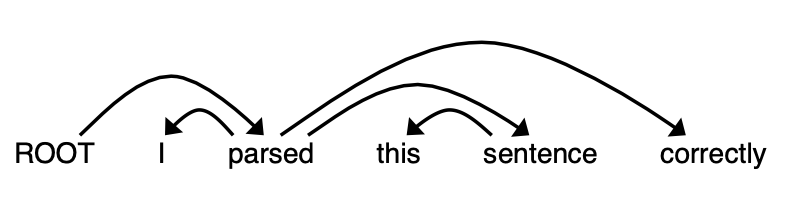
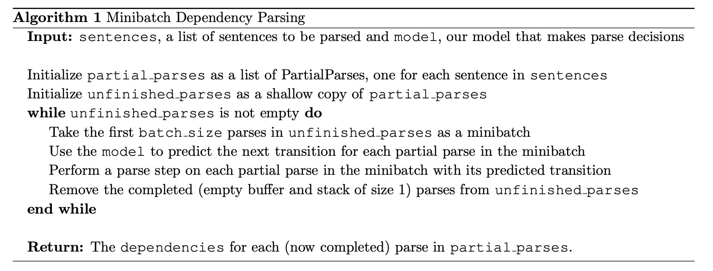
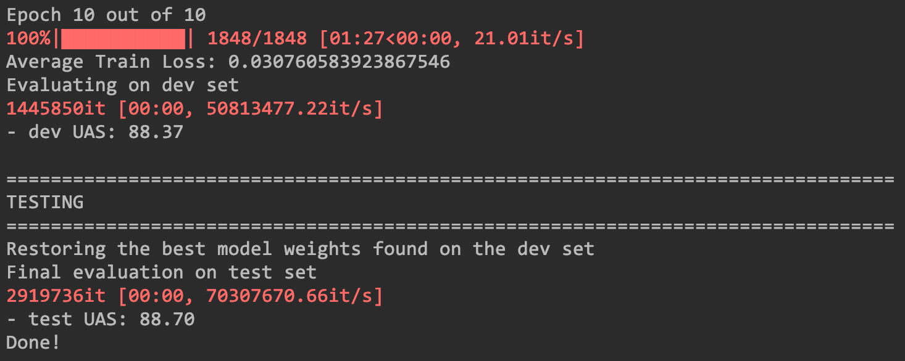

# Stanford-CS224N-Assignment3札记：依赖性解析

> 做Stanford CS224N Deep Learning for NLP课程的作业的一些笔记，第二部分是Assignment3，这个作业实现了一个基于神经网络和Transition的依赖性解析模型，下面是实现的具体步骤。

## 预备知识：Adam优化器和Dropout

在正式部分开始前作业简单介绍了一些基本知识，包括机器学习梯度优化和Dropout

### Adam优化器

传统的随机梯度优化的参数更新规则是：
$$
\boldsymbol{\theta} \leftarrow \boldsymbol{\theta}-\alpha \nabla_{\boldsymbol{\theta}} J_{\operatorname{minibatch}}(\boldsymbol{\theta})
$$
而Adam算法在其中引入了一个动量的概念，可以让梯度的变化变得稳定，因此可以采用更大的学习率，动量每一次按照一定的比例保留上一次更新时候的栋梁，并且和这一次更新产生的梯度加权，然后再更新参数：
$$
\begin{aligned}
\mathbf{m} & \leftarrow \beta_{1} \mathbf{m}+\left(1-\beta_{1}\right) \nabla_{\boldsymbol{\theta}} J_{\operatorname{minibatch}}(\boldsymbol{\theta}) \\
\boldsymbol{\theta} & \leftarrow \boldsymbol{\theta}-\alpha \mathbf{m}
\end{aligned}
$$

### Dropout

Dropout是一种模型训练时候的trick，其本质是一种正则化的技术，它的基本思路是在训练的过程中，在每一层只使用一部分参数进行前向传播，而将其他的暂时设置成0，而在测试的时候则使用所有的参数来完成预测，实际上这种trick实现的方式就是使用了一个**掩码向量**，里面的元素就是0或者1，并且0和1是按照一个特定的概率分布的，这个概率被记为$$p_{drop}$$，dropout机制下的训练过程可以表示为：
$$
\mathbf{h}_{\text {drop }}=\gamma \mathbf{d} \odot \mathbf{h}
$$
这里的$$\gamma, d$$分别代表一个常数和掩码向量，并且我们必须要保证：
$$
\mathbb{E}_{p_{\text {drop }}}\left[\mathbf{h}_{\text {drop }}\right]_{i}=h_{i}
$$
这样一来通过推到就可以知道：
$$
\mathbb{E}_{p_{\text {drop }}}\left[\mathbf{h}_{\text {drop }}\right]_{i}=\gamma E(d_ih_i)=\gamma p_{drop}h_i=h_i
$$
可以推算出常数$$\gamma=\frac {1}{ p_{drop}}$$

## 基于Transition的依赖性解析

### 基本原理

一个依赖性解析器可以解析一个句子的语法结构，并且维护一系列单词之间存在的关系，依赖性解析器有好几种不同的类型，分别是基于转变(Transition)的，基于图的和基于特征的，本次作业中我们要实现的就是一个基于转变的依赖性解析器，这种形式的解析器会对句子一步步进行解析，每一次都维护一个临时的解析结果，包括以下组成部分：

- 一个包含了正在处理单词构成的栈stack
- 一个又还未处理的单词构成的缓冲区buffer
- 一系列已经得到的依赖解析结果构成的表

一开始栈中只有一个标志ROOT，而缓冲区包含句子的所有单词，表则是空的，然后每一个解析步骤中都会做**一次转变**直到stack的大小变成1而buffer的大小变成0，而一次转变有以下几种不同的操作方式：

- SHIFT：将buffer中的第一个单词拿出来放到栈的顶部
- LEFT-ARC：取出栈顶上两个元素，并构造关系first--second，然后将second从栈中移除
- RIGHT-ARC：取出栈顶两个元素并构造关系second--first，然后将first元素从栈中移除

同时每一次的解析中，解析器都会决定进行哪一种操作，而决策的过程由一个神经网络来完成

### 一个简单的例子

下面这个例子是作业中提供的一个解析案例，我们可以通过下面的这个例子来体验一下句子解析的过程，我们使用的句子是：**"I parsed this sentence correctly"**，现在已知其句子的解析树如下图所示：



那么这个句子的解析过程可以用下面这张表格来表示：

| Stack                          | Buffer                                | New Dependency     | Transition            |
| ------------------------------ | ------------------------------------- | ------------------ | --------------------- |
| [ROOT]                         | I, parsed, this, sentence, correctly] |                    | Initial Configuration |
| [ROOT, I]                      | [parsed, this, sentence, correctly]   |                    | SHIFT                 |
| [ROOT, I, parsed]              | [this, sentence, correctly]           |                    | SHIFT                 |
| [ROOT, parsed]                 | [this, sentence, correctly]           | parse-->I          | LEFT-ARC              |
| [ROOT, parsed, this]           | [sentence, correctly]                 |                    | SHIFT                 |
| [ROOT, parsed, this, sentence] | [correctly]                           |                    | SHIFT                 |
| [ROOT, parsed, sentence]       | [correctly]                           | sentence-->this    | LEFT-ARC              |
| [ROOT, parsed]                 | [correctly]                           | parsed-->sentence  | RIGHT-ARC             |
| [ROOT, parsed, correctly]      | [ ]                                   |                    | SHIFT                 |
| [ROOT, parsed]                 | [ ]                                   | parsed-->correctly | RIGHT-ARC             |
| [ROOT]                         | [ ]                                   | ROOT-->parsed      | RIGHT-ARC             |

其实从这里我们可以得出结论就是，一个长度为n个单词的句子完成依赖性解析需要2n次transition操作，这是因为一个句子中的依赖个数是确定的，就是n个(**算上ROOT一共n+1个单词，n条边刚好构成一棵树**)，ROOT以外的单词都需要经过从Buffer转移到Stack和从Stack中移除的操作，因此一共肯定是需要2n次操作

### 实现Transition Parser

作业到了这一步需要我们实现一个Transition Parser，下面我们从Partial Parser开始一步步实现

#### Partial Parser

第一步是实现Partial Parser的三种transition操作，按照上面说的transition规则，我们先在`__init__`中定义Stack，Buffer和Dependencies List三个数据结构，并在具体的transition方法中实现几种transition的操作

```python
class PartialParse(object):
    def __init__(self, sentence):
        """Initializes this partial parse.

        @param sentence (list of str): The sentence to be parsed as a list of words.
                                        Your code should not modify the sentence.
        """
        self.sentence = sentence
        self.stack = ["ROOT"]
        self.buffer = sentence.copy()
        self.dependencies = []

    def parse_step(self, transition):
        """Performs a single parse step by applying the given transition to this partial parse

        @param transition (str): A string that equals "S", "LA", or "RA"
        """
        if transition == "S" and len(self.buffer) != 0:
            self.stack.append(self.buffer[0])
            self.buffer.pop(0)
        elif transition == "LA":
            first = self.stack.pop()
            second = self.stack.pop()
            self.dependencies.append((first, second))
            self.stack.append(first)
        elif transition == "RA":
            first = self.stack.pop()
            second = self.stack.pop()
            self.dependencies.append((second, first))
            self.stack.append(second)
```

- 其实这里主要就是一些python中的list数据结构的操作

#### 实现小批量Transition

整个模型由神经网络模型+Partial Parser组成，神经网络负责预测下一个parse步骤要执行什么操作，我们可以将一个句子输入神经网络中，得到一系列transition然后对句子进行parse，但是神经网络中往往使用一个小批量的数据效果会更好，因此我们需要先实现一个小批量的Transition操作，整个过程的算法如下图所示：



具体的代码实现如下：

```python
def minibatch_parse(sentences, model, batch_size):
    """Parses a list of sentences in minibatches using a model.

    @param sentences (list of list of str)
    @param model (ParserModel): The model that makes parsing decisions. It is assumed to have a function model.predict(partial_parses) that takes in a list of PartialParses as input and returns a list of transitions predicted for each parse. That is, after calling
transitions = model.predict(partial_parses) transitions[i] will be the next transition to apply to partial_parses[i].
    @param batch_size (int): 
    """
    dependencies = []
    parses = []
    for s in sentences:
        partial_parse = PartialParse(sentence=s)
        parses.append(partial_parse)
    # make a shallow copy of parses
    unfinished_parses = parses[:]
    while len(unfinished_parses) > 0:
        mini_batch = unfinished_parses[0: batch_size]
        trans = model.predict(mini_batch)
        for parse, tran in zip(mini_batch, trans):
            parse.parse_step(tran)
            if len(parse.buffer) == 0 and len(parse.stack) == 1:
                unfinished_parses.remove(parse)
    dependencies = [p.dependencies for p in parses]
    # END YOUR CODE

    return dependencies
```

- 其实这里的每一步都适合伪代码一一对应的，首先给batch中的每个句子构造一个partial parser，然后对batch中未完成的partial parse，每次选择一个mini——batch进行逐步parse，最后返回得到的结果

#### 神经网络决策器

最后还需要实现一个基于全连接神经网络的决策器用来决定一个句子需要执行什么类型的transition，这个神经网络的模型架构如下，共有两层：
$$
\begin{aligned}
\mathbf{h} &=\operatorname{ReLU}\left(\mathbf{x} \mathbf{W}+\mathbf{b}_{1}\right) \\
\mathbf{l} &=\mathbf{h U}+\mathbf{b}_{2} \\
\hat{\mathbf{y}} &=\operatorname{softmax}(l)
\end{aligned}
$$
这里的x是由输入的句子中单词转化而成的词向量构成的矩阵，这里我们使用的是已经预训练好的词向量，这个输入通过一个两层神经网络的传播之后得到一个结果，这个结果是一个概率分布，我们可以用交叉熵来计算它的损失函数：
$$
J(\theta)=C E(\mathbf{y}, \hat{\mathbf{y}})=-\sum_{i=1}^{3} y_{i} \log \hat{y}_{i}
$$

- 这一部分的代码实现比较简单，就是非常基本的用PyTorch实现几个层的初始化和前向传播算法就可以：

```python
class ParserModel(nn.Module):
    def __init__(self, embeddings, n_features=36,
                 hidden_size=200, n_classes=3, dropout_prob=0.5):
        super(ParserModel, self).__init__()
        self.n_features = n_features
        self.n_classes = n_classes
        self.dropout_prob = dropout_prob
        self.embed_size = embeddings.shape[1]
        self.hidden_size = hidden_size
        self.embeddings = nn.Parameter(torch.tensor(embeddings))
        # 下面开始是自己需要写的代码
        weight_size = torch.empty(self.embed_size * self.n_features, self.hidden_size)
        self.embed_to_hidden_weight = nn.Parameter(nn.init.xavier_normal_(weight_size))
        self.embed_to_hidden_bias = nn.Parameter(nn.init.uniform_(torch.empty(1, self.hidden_size)))
        self.drop_out = nn.Dropout(p=dropout_prob)
        self.hidden_to_logits_weight = nn.Parameter(nn.init.xavier_normal_(torch.empty(hidden_size, n_classes)))
        self.hidden_to_logits_bias = nn.Parameter(nn.init.uniform_(torch.empty(1, n_classes)))

    def embedding_lookup(self, w):
        x = self.embeddings[w].view(w.shape[0], w.shape[1] * self.embed_size)
        return x

    def forward(self, w):
        x = self.embedding_lookup(w)
        h = F.relu(torch.matmul(x, self.embed_to_hidden_weight) + self.embed_to_hidden_bias)
        logits = torch.matmul(h, self.hidden_to_logits_weight) + self.hidden_to_logits_bias
        return logits
```

- 到这里为止模型部分的代码就实现完毕了，接下来需要在数据集上进行训练和测试


## 实验结果

上面几步都完成之后，在`run.py`这个文件中还需要写一些PyTorch训练部分的代码，包括优化器和损失函数的设置，以及训练时候的一些utils代码。在写好之后就可以开始训练和测试。

- 在训练了10个epochs之后得到的训练结果和测试结果如下图所示，训练集上的UAS指标约为88.37，而测试集上的UAS指标约为88.70



- 到这里为止，整个作业基本就结束了，后面还有一部分从语法学的角度讲了依赖性解析的一般规则和容易出现的错误，