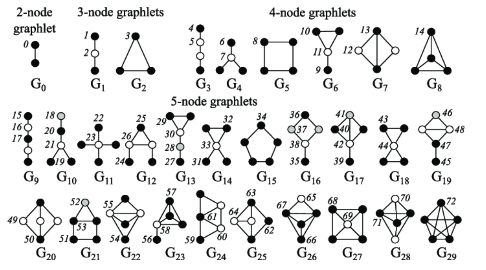
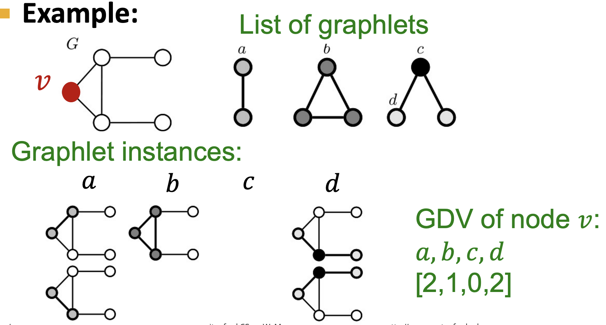
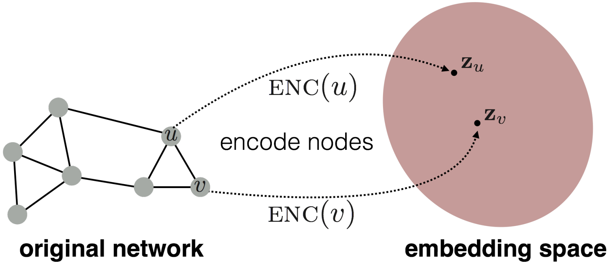
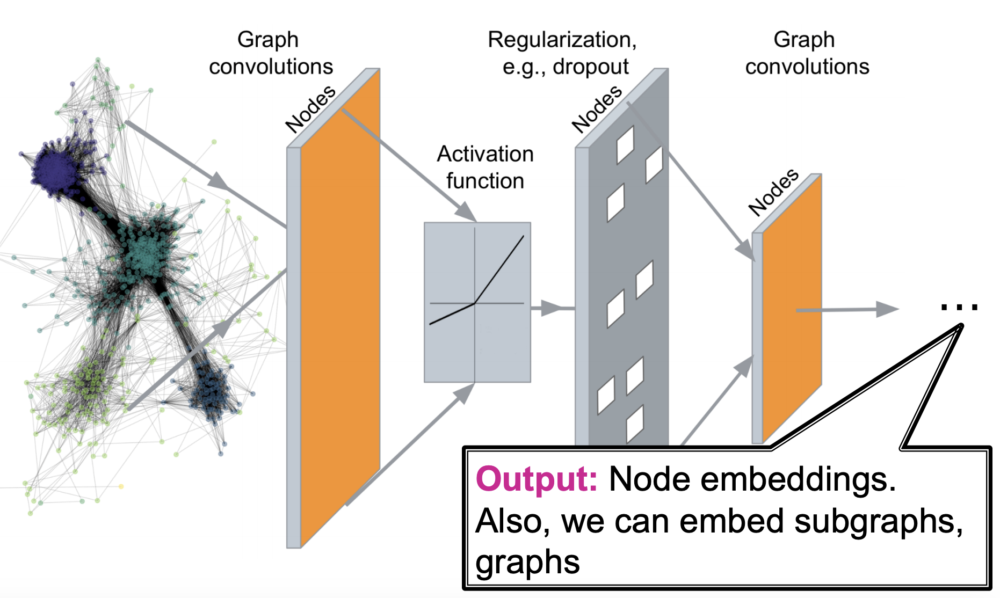
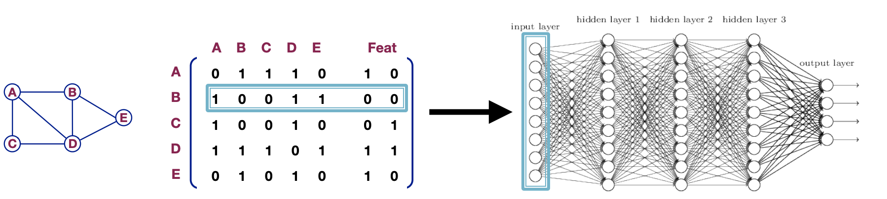
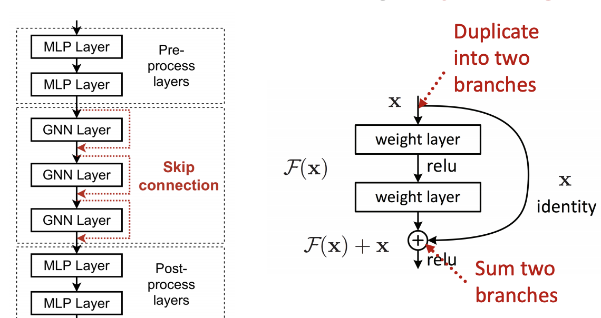
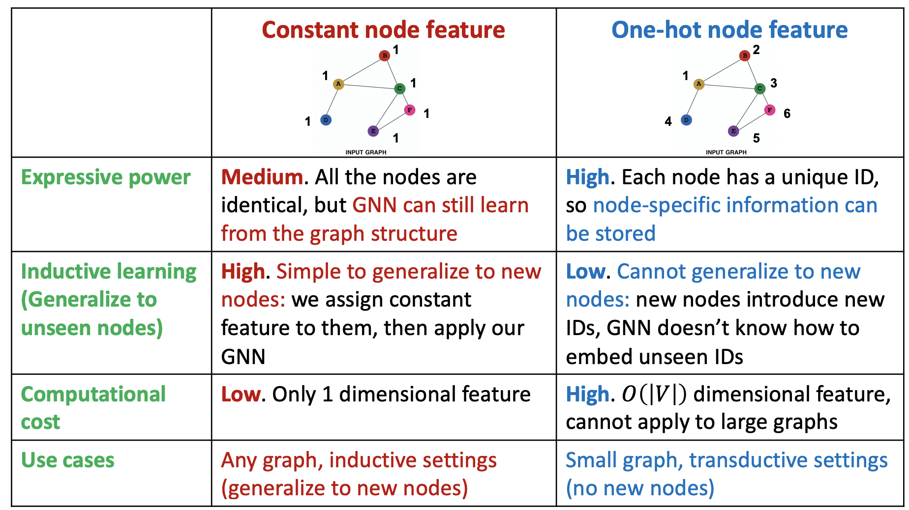
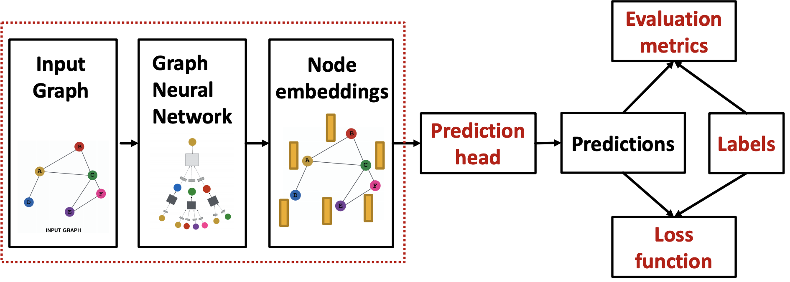
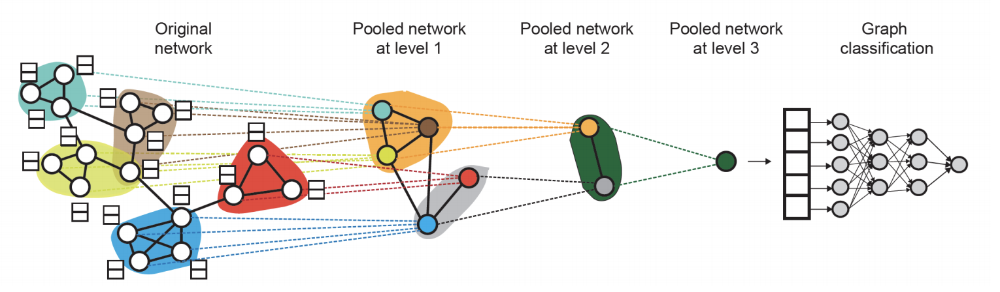

# CS224W：图机器学习1

- 斯坦福大学公开课CS224W的学习笔记

[TOC]

## 图机器学习导论

### 图机器学习研究的问题

- 图结构和网络结构是非常常见的数据结构，常见的事件图、计算机网络、事务网、社交网络和人际关系网等等都是图状结构
  - 网络也叫做自然图Natural Graphs
  - 图是对于一些关系的表示，可以表示信息和知识的联系，**软件也可以表示为一张图**
  - 很多时候网络和图的区别是非常模糊的，通常可以将它们混为一谈，而该课程要研究的也就是如何利用图中的关系来进行更好的预测
- 相比于图像和文本，图结构的大小比较随意，没有固定的节点顺序，并且通常是动态的
- 图学习的任务可以有node level，edge level，community level和graph-level多个层次，常见的有
  - 节点分类：比如预测线上用户的类型
  - 链接预测：预测两个节点之间是否缺少了链接，比如知识图谱补全
  - 图分类：比如化学中的分子性质预测
  - 聚类：检测节点是否构成一个类别，比如社交圈检测
  - 其他的还有图生成，图进化等等

### 图的表示方式

- 常见的表示方式使用节点集合N和边集合E构成一个图结构$G(N, E)$ 
  - 图可以分为有向图和无向图，区别就在于边是否具有方向性，节点的degree表示包含这个节点的边的数量，而在有向图中又可以具体分为出度和入度
  - 二分图是一种特殊的图结构，可以将图中的**节点**分成两个不相交的集合U和V，使得图中的任意一条边的两个顶点分别属于U和V
- 图也可以用**接邻矩阵**来表示，其中无向图的邻接矩阵是一个对称矩阵，通常邻接矩阵都比较稀疏，网络结构通常都是比较稀疏的图
- 图可以用接邻表来表示，这种表示方式只保留了有边的节点的情况，而舍去了稀疏的大部分内容，节约了存储空间
- 一些图中的基本概念：
  - 强连通有向图：任意两个节点U和V之间存在U到V以及V到U的路径
  - 弱连通有向图：任意两个节点U和V之间存在U到V或者V到U的路径
  - 强连通分量：有向图中的强连通子图

## 传统的图机器学习方法

- 传统的机器学习通过手工提取特征来完成图机器学习中的node-level，link-level和graph-level的一些预测，目标是对于给定的图$G=(V, E)$学习出一个从V映射到R上面的函数

### 节点层面的机器学习任务

- 图机器学习在节点层面的主要任务是对节点进行分类和学习图的结构特征，主要有：
  - 节点的度数
  - 节点的中心(node centrality)
  - 聚类系数
  - graphlets

#### node centrality

​		节点中心node centrality是在在一个图中表示出不同节点的**重要性**，而不是简单的出入度数。一个节点v如果与一些很重要的节点相邻那么这个节点也很重要，一个节点的centrality可以这样计算：
$$
c_v=\frac{1}{\lambda}\sum_{u\in N(v)}c_u
$$

- 问题在于上面的这个表达式其实是一种循环定义，需要用另一种方法来表示

- 特征向量中心：我们可以用向量的相识来表示上面的centrality定义式：
  $$
  \lambda c=Ac
  $$

  - 其中A是图G的邻接矩阵，如果两个点uv相邻，那么$A_{uv}=1$否则就是0
  - 我们发现这时候由每个点的centrality组成的向量C实际上就是矩阵A的特征向量，其中最大的特征向量总是为正并且唯一的，因此可以用A矩阵的最大特征值作为图G的centrality

- 中间性中心Betweenness Centrality

  - 该标准认为一个节点如果处于很多通往其他节点的最短路径上，那么这个节点就比较重要，因此定义：

  $$
  c_v=\sum_{s\not=t\not=v}\frac{N_{svt}}{N_{sv}}
  $$

  - 该标准下重要程度的计算方式就是对于图中的任意两个和v不同的节点s，t，计算其最短路径中包含v的比例并进行求和

- 邻近中心Closeness Centrality

  - 该标准认为一个节点如果拥有比较小的到其他所有节点的最短路径长度，那么它就比较重要，用l表示图中两个节点的最短路径长，那么：

  $$
  c_v=\frac 1 {\sum_{u\not=v}l_{uv}}
  $$

#### 聚类系数

​		聚类系数可以衡量一个节点的邻居节点的连接情况，假设一个节点v有k个邻居，这些**k个邻居之间有n条边**，那么聚类系数可以写作：
$$
e_v=\frac{n}{C_k^2}=\frac{2n}{k(k-1)}
$$

- 聚类系数某种意义上也可以理解为记录了每个节点与其邻近节点构成的三角形的个数，即对于一个节点v，如果它的两个邻居u和w之间有一条边，那么uvw就构成了一个三角形，而这个三角形被统计到了聚类系数中去

#### Graphlets

​		Graphlets是一种根连通的非同构子图，有如下几个衍生出的概念：

- Graphlet Degree Vector(GDV)：基于Graphlets的节点特征，记录了每个节点所能接触到的graphlets的个数，和度数以及聚类系数不同，度数衡量了一个节点能接触到的边的数量，而聚类系数衡量了一个节点能接触到的“三角形”的个数，而GDV记录了以一个节点v为root的所有的graphlet

- GDV提供了一个节点的局部网络拓扑结构的衡量方式

### 边层面

​		图机器学习在边层面的主要任务是基于已经存在的连接来**预测新的连接**，因此关键的问题在于如何设计和表示**一对节点**的特征，一般有两种边预测的场景：

- 随机缺失了若干条边，要求将图补全
- 随时间会变化的边关系：在时许数据的场景下节点和节点之间的边关系可能会随时间发生变化，这种情况叫做evaluation，一般来说可以用如下步骤来解决时序预测问题：
  - 对每一个节点对计算一个score C，即一个既定的标准
  - 根据这个标准来对节点对进行排序
  - 预测排序中的top-n作为新的边，并进行验证

#### 基于距离的特征

- 用两个节点之间的最短路径距离来表示节点对的特征，但是这种方式没有考虑到邻近点的重合度

#### Local Neighborhood Overlap

​		用共同的邻近节点的个数作为一个节点对的特征，对于一个节点v，用$N(v)$表示所有邻近节点构成的集合，那么有这样几种标准：

- 共同邻居：

$$
｜N(u)\cap N(v)|
$$

- Jaccard系数

$$
\frac{｜N(u)\cap N(v)|}{｜N(u)\cup N(v)|}
$$

#### Global Neighborhood Overlap

​		局部的neighborhood overlap在两个节点没有共同邻居的时候始终为0，但这两个节点仍然有可能存在一定的关系，而Local Neighborhood Overlap这些关系的特征，因此就需要Global Neighborhood Overlap

- Katz index：记录两个节点之间所有的路径数，可以使用邻接矩阵来计算，假设临界矩阵为A，其中如果u和v相邻那么$A_{uv}=1$，这样一来$A_{uv}^{k}$就可以表示是否有连接uv的长度为K的路径，因此可以用下面的共识来计算这一特征量：

$$
S_{uv}=\sum_{l=1}^{\infin}\beta ^lA_{uv}^l
$$

- 而Katz index矩阵可以用如下方式来计算：

$$
S=\sum_{i=1}^{\infin}\beta^iA^i=(I-\beta A)^{-1}-I
$$

### 图层面的特征和图kernel

​		目标是提取整张图整体的特征，而传统机器学习中经常使用kernel来进行特征的提取，图也可以使用kernel来进行特征的提取，其核心是一个图特征向量$\phi(G)$ 

#### BoW

​		图kerbel的关键想法是**基于Bag-of-Word(BoW)**BoW原本是指使用单词出现的次数来作为文档的特征，而将其扩展到图上就可以将节点作为“单词”，即可以计算图中各种不同度数的节点的数量，并将结果作为一个多维的向量输出，向量的每一个维度d的值代表了图中度数为d的节点总数

#### Graphlet特征

- 可以计算图中不同的graphlet的个数来表示图的特征，但是这里的graphlet和节点层面的不太一样，不需要完全连接，也没有根的概念

- 对于一个给定的图G，用一个graphlet表来定义graphlet计数向量$f_G\in\mathbb R^{n_k}$ ，则：

$$
(f_G)_i=\#(g_i\subset G)
$$

- graphlet kernel可以定义为：

$$
K(G,G')=f_G^Tf_{G'}
$$

- 如果两张图的size不同会引起结果的失真，那么就可以进行正则化操作，令：

$$
h_G=\frac{f_g}{\sum f_G}\rightarrow K(G,G')=h_G^Th_{G'}
$$

- 这种kernel的问题在于计算graphlet的个数的时间复杂度是非常高的，并且是NP-hard的

## 节点嵌入 Node Embedding

- **图表示学习**的目标是提供一个统一的图特征提取方式，对于不同的图机器学习任务都可以使用，而节点嵌入就是指将图中的节点映射到嵌入空间中，用一个稠密的向量来表示不同的节点，而向量的相似度又决定了节点在图中的相似度，也就是说将整个网络进行了编码。

### 编码器和解码器

- 节点嵌入的目标就是对节点进行编码并映射到嵌入空间中，使得两个节点在嵌入空间中的相似度近似于节点在图中的相似度，而**相似度和嵌入向量的形式都是需要定义**的

  - 因此节点嵌入的两个关键的组件就是编码器和相似度函数

  $$
  \mathrm{similarity}(u,v)=z_u^Tz_v
  $$

  

#### 浅编码Shallow Encoder

​		最简单的编码器的形式就是一个简单的嵌入映射，即将节点通过矩阵运算直接转化成对应的嵌入向量，可以表示为：
$$
\mathrm{ENC}(v)=\bold Zv
$$

- 其中Z就是一个$d\times |V|$维度的矩阵，存储了每个节点的d维嵌入向量，而v就是一个0-1向量，除了对应的节点那一列是1以外都是0
- 我们需要学习的就是Z矩阵，这种编码器下面每个节点都映射到一个单独的嵌入向量中

### 随机游走Random Walk

#### 什么是随机游走

​		随机游走是一种用来定义图节点相似度的方法， $z_u$表示图节点u的嵌入向量，而概率$P(v|z_u)$表示在节点u的随机游走中遇到节点v的概率。

​		随机游走的过程即每次**随机选择**当前节点的一个邻居并“走”到这个邻居的位置上不断重复的过程，这个过程中将产生一个随机的节点序列，称为图的随机游走。而用随机游走定义的相似度就是**u和v出现在同一个随机游走中的概率**。这种方式计算相似度需要以下几个步骤：

- 使用一定的决策策略R来计算从u出发的随机游走经过v的概率
- 根据随机游走的结果优化嵌入函数并进行编码

#### 为什么需要随机游走

- 可表达性：随机游走是一种灵活并且随机的相似度定义，并且包含了局部信息和更高阶的图中节点关系
- 高效性：不需要在训练的过程中考虑所有的节点对，只需要考虑在随机游走中出现的节点对
- 随机游走是一种无监督的特征学习

#### 随机游走的优化

​		随机游走的目标是让学习到的嵌入向量中，相近的向量在图中更接近，对于一个节点u可以定义它在某种选择策略R下的随机游走中发现的邻居节点构成的集合是$N_R(u)$，对于一个给定的图$G=(V,E)$，我们的目标是学习出一个映射函数$f(u)=z_u$，根据极大似然估计，我们的目标函数可以确定为：
$$
\max_f\sum_{u\in V}\log P(N_R(u)|z_u)
$$
​		即对于给定的节点u，我们希望通过随机游走中的表现来学习其特征的表示，而虽有游走可以进行一系列的优化，包括：

- 进行一个较短的固定长度的随机游走
- 对于每个节点u的邻居节点，允许邻居节点集合中出现重复的节点，出现的越多表明相似度越高,因此最大化上述目标函数可以等价于最小化下面的表达式：

$$
\mathcal L=\sum_{u\in V}\sum_{v\in N_R(u)}-\log (P(v|z_u))
$$

​		而概率$P(v|z_u)$可以用**sotfmax函数**来进行参数化，选用softmax函数的原因是因为指数运算避免了负概率的出现，并且使得不同节点的相似度区分变得更加明显
$$
P(v|z_u)=\frac{\exp(z_u^Tz_v)}{\sum_{n\in V}\exp(z_u^Tz_n)}
$$
​		但是用上述办法来计算目标函数的话复杂度是非常高的，，可以采用负采样的方式来近似计算损失函数，这里用到了sigmoid函数来近似计算：
$$
\log (\frac{\exp(z_u^Tz_v)}{\sum_{n\in V}\exp(z_u^Tz_n)})\approx\log (\sigma(z_u^Tz_v))-\sum_{i=1}^k\log(\sigma(z_u^Tz_{n_i}))
$$

- 这种近似方法不计算全部节点而是只采样了K个随机的负样本，并且用sigmoid函数来近似指数运算，这里的k个negative nodes按照其度数成正比的概率进行选取

- 在得到了目标函数的近似形式之后，我们可以采用**随机梯度下降法**来对目标函数进行优化，定义
  $$
  \mathcal L^{(u)}=\sum_{v\in N_R(u)}-\log (P(v|z_u))
  $$

  - 对于一个节点i，和所有的节点j，计算其导数$\frac{\partial\mathcal L^{(i)}}{\partial z_j}$

  - 更新每一个向量j直到收敛
    $$
    z_j=z_j-\eta\frac{\partial\mathcal L^{(i)}}{\partial z_j}
    $$

### node2vec

​		现在的问题就变成了如何确定随机游走的策略，上面已经提到的策略有固定长度，没有偏见的选择策略，而node2vec是一种有偏见的随机游走策略，这种策略更加灵活并且达到了局部和全局的平衡

- 常见的采样邻近节点的方式有BFS和DFS，而BFS更注重局部的邻居结构，DFS则更偏向于全局

#### 有偏见的随机游走

​		有偏见的定长随机游走策略R有两个参数，一个是返回参数p，代表了返回到前一个节点，另一个参数是出入(in-out)参数q，代表了随机游走过程中的BFS和DFS的比例

- 有偏见的随机游走需要记录当前的游走路径是从那里来的，在参数p中表示
- 每次走到新的节点的时候计算邻近节点的权重，选择权重最高(这里的权重其实也就是代表了走到这个节点的概率，当然是没有标准化的概率)的节点作为游走的下一个目的地

#### node2vec算法框架

- 计算随机游走的概率分布
- 对每个节点u，找到r条从u出发的不同的长度为l的随机游走
- 使用随机梯度下降法来优化node2vec

#### 总结

- 这里其实还没太搞懂node2vec的真正含义，应该有时间去阅读一下提出node2vec的论文，虽然我觉得大概率没什么时间
- node2vec拥有线性的时间复杂度，并且上述算法框架中的三个步骤是可以**并行**的

### 图嵌入

- 图嵌入是将整张图或者子图映射到嵌入空间中，用一个向量来表示

#### 两种简单的approach

- 方法1:将图嵌入等价于图中所有节点的嵌入向量之和

$$
Z_G=\sum_{v\in G}z_v
$$

- 方法2:在途中引入一个虚拟节点代表整个图(子图)并进行嵌入
- 方法3:匿名游走嵌入
  - 想法1:对匿名游走进行采样并且用每种匿名游走的发生次数来表示一个图，也就是说用这些随机游走发生的概率来表示整张图，选定一个长度L之后，建立一个向量代表所有长度为L的随机游走发生的概率来代表这张图
  - 想法2:将匿名游走的嵌入结果进行合并

## 链接分析：PageRank算法

​		这一节的内容主要从矩阵的角度来进行图的分析和学习，我们可以将互联网看成一张巨大的图，里面的网页就是图中的一个个节点，而网页可以通过超链接可以跳转到别的网页，称为链接link，可以把这种关系作为图中的有向边，因此互联网中的网页构成一张**大而稀疏的有向图**，可以用一个邻接矩阵来表示。类似的结构有论文引用图等等。

​		但是图中每个节点并不都是同等重要的，可以通过一系列链接分析的方法来分析出不同节点的重要性，一般认为一个网站如果有很多链接，那么它往往就比较重要。而出链接和入链接又是两种不同的链接，又应该有不同的考虑。PageRank算法认为**被重要的网页指向的网页**也往往更重要。

### PageRank算法模型

#### 节点的权重

​		我们可以在网络图中定义$d_i$是一个节点的出度，而节点的权重就可以表示为：
$$
r_j=\sum_{i\rightarrow j}\frac{r_i}{d_i}
$$
我们可以将这种表示形式矩阵化，用一个矩阵M来表示各个节点之间的权重关系，那么根据上面的定义可以得知：
$$
M_{ij}=\frac{1}{d_j}
$$
这个矩阵M每一列的和都是1，我们可以用一个向量r来表示每个网页的重要程度，那么就有：
$$
r=Mr
$$

#### 图中的随机游走

​		在任何一个时间t时假设访问到了网页i中，下一个时刻t+1则访问i指向的其中一个网页j，这样就构成了一次随机游走，用$p(t)$向量来表示t时刻每个网页被访问到的概率，那么这样一来就有：
$$
p(t+1)=Mp(t)
$$
我们发现矩阵的权重向量r也可以表示随机游走的分布情况，进一步我们发现r其实就是矩阵M的**特征向量**，因此PageRank实际上就是矩阵M最大的的特征向量，我们一般用幂法可以得到矩阵M的最大特征向量。

### 如何求解PageRank

- 可以给pagerank赋予一定的初始值，然后通过公式$r=Mr$不断迭代直到r的变化小于一定的阈值之后才结束，得到最终的pagerank的结果，这种方法也就是幂法，求出的结果实际上是M的特征之中范数最大的那一个
- 问题在于：
  - 有一些页面时dead end，没有跳转到其他网页的链接，这可能会导致“泄漏”
  - Spider-Trap问题：所有的外部链接都在一个组内，即随机游走会陷入一个循环中
  - 这些情况都会导致上述计算方法最后不收敛，因此要想办法解决这个问题

- 解决方法：

  - 对于dead end问题，可以重新调整矩阵M中的内容：

    

  - 对于Spider-Trap问题，可以在每次做选择的过程中以一定的概率跳转到随机的网页中去，这样就可以从循环中跳出来

$$
r_j=\beta\sum_{i\rightarrow j}\frac{r_i}{d_i}+(1-\beta)\frac 1N
$$

- Google矩阵上面的spider-trap问题的迭代形式

$$
G=\beta M+(1-\beta)[\frac{1}n]_{n\times n}
$$

### 个性化的PageRank

- 通过**几个特定的节点来衡量所有节点的rank**，可以用带restart的随机游走高效计算，这是考虑到了不同用户之间的浏览偏好往往不同，不能用全局的所有节点作为衡量标准，这样一来可以实现个性化的推荐

## 消息传递和节点分类

- 这一节内容主要关注对于一个给定的网络结构，一些节点已经做好了标注，那么我们如何对图中的剩余节点进行标准，就比如一张图中已知部分节点是可疑的，另一部分节点是可信的，那么我们应该如何判定剩下那些没有标注的节点是否可信呢？
  - 这类任务被称为半监督的节点分类问题
  - 之前已经介绍了节点嵌入的方法可以识别相似的节点，而这一节主要介绍的方法是**消息传递**
- 一般我们认为网络中的关系是具有相关性的，也就是说相似的节点会互相连接，并且相近的节点可能属于相同的类型
  - 同质性Homophily：指的就是相同或者类似的节点个体会和其他的节点相互连接
  - 影响：网络中的连接关系可能会影响到单个节点，即节点可能会被与之相互连接的节点给带偏
- 这样的半监督学习经常被用在：
  - 文本分类
  - 语音标记
  - 连接预测
  - 光学字符识别
  - 图像和3D分割
  - 节点异常检测
- 这一节内容将主要介绍三种实现上述半监督图学习的技术：
  - 关系分类Relational classification
  - 可迭代分类Iterative classification
  - 信任传播Belief propagation

### 关系分类

​		关系分类的基本想法：节点v的类概率$Y_v$是一个节点附近节点的类别的**加权平均**(这里我们只考虑二分类问题，正反类别的标签分别用1和0来表示)，而对于已经有标记的节点v，其$Y_v$可以**直接设置成其真实类别**，而对于没有标记的节点可以将其初始化为$Y_v=0.5$，然后对所有的节点进行类似于加权平均的更新知道收敛或者达到最大迭代次数上限。
$$
P(Y_v=c)=\frac{1}{\sum_{(v,u)\in E}A_{v,u}}\sum_{(v,u)\in E}A_{v,u}P(Y_v=c)
$$

- 其中A表示每条边的权重
- 问题在于：收敛是没有保证的，并且模型没有用到节点的特征信息

### 迭代分类

​		相比于关系分类，迭代分类会使用节点v的一系列特征构成的特征向量$f_v$和邻近节点的标签$z_v$，而这种分类方式需要训练两个分类器：

- $\phi_1(f_v)$通过节点的特征来预测节点的标签

- $\phi_2(f_v,z_v)$通过特征向量和邻近节点的标记来共同预测节点的标签

  ​	训练两个分类器只是第一阶段，第二阶段需要进行迭代训练直到结果收敛或者训练结束，但是结果是否收敛依然没有保证。

#### 举例：网页分类

- 首先训练一个基于二维特征向量的分类器，用邻近节点(区分出和入节点)的特征向量作为$z_v$
- 然后按照步骤训练出两个分类器，然后用测试集来测试分类器的效果，并对关系特征$z_v$和标签进行更新
- 进行迭代更新，直到收敛或者达到次数上限

### 协作分类：信任传播机制

​		信任传播机制是一种动态规划算法，通过一个节点和节点之间互相“通信”和传递消息的迭代过程，当节点直接达到共识的时候就可以计算出最后的结果

#### 一个简单的消息传播的例子

​		举一个简单的例子来说明消息传递的作用，比如我们需要在一个图中计算节点总数，并且每个节点只能和与之相邻的节点之间进行通信，简单的消息传递算法的实现如下：

- 定义节点的顺序形成一条完整的路径
- 每次向下一个节点来传播当前统计到的节点个数，最后一个节点要发送出去的数据就是结果
- 这样的算法也可以在树状的结构中进行，区别就是要从**叶节点将信息汇总到根节点** 

#### 循环消息传递算法

​		加入一个节点i指向j，那么i将会给j传递消息，而传递什么消息需要根据i从指向i的节点中获得的信息来决定，循环消息传递算法中定义了这样几个关键的变量：

- 标签**势能**矩阵，$\Phi(Y_i,Y_j)$表示对于一个节点j，如果给定它的邻居节点i属于类别$Y_i$时，节点j属于类别$Y_j$的概率

- 先验信任 $\phi(Y_i)$表示节点i属于$Y_i$类别的概率
- i向j传递的消息可以记成$m_{i\rightarrow j}(Y_j)$，这表示i估计j的最终类型是$Y_j$在循环消息传递算法中，传递的消息可以表示为：

$$
m_{i\rightarrow j}(Y_j)=\sum_{Y_i\in \mathcal L}\Phi(Y_i,Y_j)\phi(Y_i)\prod _{k\in N_i\\
k\not=j}m_{k\rightarrow i}(Y_i)
$$

- 这种计算方式的意思是，如果i预测j的最终标签是$Y_j$，那么就需要考虑节点i所有可能的标签，并且对于每一个标签计算节点i收到的信息是节点i属于类别$Y_i$进行求和，我们可以记
  $$
  b_i(Y_i)=\phi(Y_i)\prod _{k\in N_i\\
  k\not=j}m_{k\rightarrow i}(Y_i)
  $$

  - 是先验概率和所有从邻居节点收到消息的和的乘积

- 如果我们遇到的图是有环的，那么这样一来节点就不存在一个确定的顺序，但我们依然可以用上述算法来计算信任的传播。当有顺序的时候可以从任意一个节点开始，然后依次更新其邻居节点的信息，但是当图有环的时候，从不同的子图中获得的信息就不是独立的了，这个时候信任传递依然可以使用，但是会出现循环传递的情况，可能会导致不收敛的情况，但是在实际操作中，这个算法依然比较好用

## GNN图神经网络

​		前面几节内容主要介绍了节点嵌入的概念，也就是说我们可以将一个图中的节点映射到一个的d维向量上，而这种映射方式使得相似的节点对应的向量更接近，但主要的问题还是，我们如何学习出一个映射函数f，而图嵌入的两个核心组件是编码器和相似度函数，之前也介绍了比较naive的shallow编码器，而图神经网络GNN提供了一种基于深度学习的节点嵌入方法。

- 相比于图片和文本，网络结构要更复杂并且缺少规律性，而且往往是动态的

### 深度学习基础

- 介绍了监督学习、损失函数、机器学习中的优化、梯度向量等基本概念，不过这些内容已经反复接触过了，因此也就不再专门整理记录
- 随机梯度下降：
  - 一般的梯度下降需要求出整个损失函数的梯度，并结合设置好的学习率进行参数的更新，但是这样做的计算复杂度太高了
  - 随机梯度下降就是每一次选择一个**小批量(minibatch)的数据集B**对其求梯度并进行参数的更新
- 深度学习中的函数往往更为复杂，并且在反向传播进行参数更新的过程中需要用链式法则来求梯度，但总的来讲，不管是传统的监督机器学习还是深度学习，我们的优化目标都是：

$$
\min \mathcal L(y,f(x))
$$

### 图深度学习

#### 问题的定义

- 我们把要研究的图记为G，图中所有节点构成集合V，A是图的接邻矩阵
- 用X表示图节点的特征矩阵，每个节点具有m维的特征，节点的特征可以根据图的实际情况来选取
- 一种很naive的方法是**将图G的接邻矩阵和特征矩阵进行合并**，然后放到一个深度神经网络中进行学习，但是这样一来就会有$O(|V|)$数量级的参数，并且对于不同大小的图需要重新设计网络结构，这样的处理方式也使得结果对节点的顺序非常敏感

#### 图卷积神经网络的结构

​		联想到CNN通过**卷积**的方式**来提取和融合邻近像素点的特征**，图结构中也可以聚合节点的邻近节点的特征，但是相比于图像，图结构往往不具有一个固定的子结构或者滑动窗口可以用来定义图中的卷积，并且是permutation invariant的，我们可以**使用局部的邻近节点的特征来生成图节点的嵌入向量**。

- 每个节点生成了一张**计算图**，来表示其特征融合的过程

- 这种神经网络可以是任意深度，每一层有节点的嵌入：

  - 第0层**只用输入的特征表示节点的嵌入向量**
  - 第k层使用从k个away之前**得到的信息来进行节点嵌入** 

  

- 上述结构只是一种最基本的框架，最主要的区别在于图中的box对应的内容，也就是信息聚合的方式和之后的一系列处理

  - 常见的方法：对得到的信息**求平均**并放到神经网络中

  $$
  h_v^{(l+1)}=\sigma (W_l\sum_{u\in N(v)}\frac{h_u^{(l)}}{|N(v)|}+B_lh_v^{(l)}),\quad h_v^0=X_v
  $$

  - 这里的$\sigma$是一个非线性的激活函数
  - 在得到了嵌入向量之后可以**使用损失函数和随机梯度下降的方式来训练权重参数W和B**
- 我们可以将上面的表达式进行**向量化**来提高计算的效率，用对角矩阵D来表示$D_{v,v}=|N(v)|$，这样一来就有$D^{-1}_{v,v}=\frac 1 {N(v)}$ 并且令$H^{(l)}=[h_1^{(l)},\dots,h_{|V|}^{(l)}]^T$,这样一来上面的式子就可以表示为：
  
  $$
  H^{(l+1)}=\sigma(D^{-1}A H^{(l)}W_l^T+H^{(l)}B_l^T)
  $$
  
  - self translation + neighborhood aggregation两个部分组成

#### 如何训练GNN

- 监督学习的训练方式：定义一个loss函数并进行优化，**相似的节点会有相近的嵌入向量**，因此我们可以定义：
  $$
  \mathcal L=\sum_{z_u,z_v}\mathrm{CE}(y_{u,v},\mathrm {DEC}(z_u,z_v))
  $$

  - CE表示交叉熵，y是表示两个节点相似的标签，DEC是解码器，比如可以使用内积来定义
  - 相似度的定义可以用前面提到的任何方法，包括随机游走，矩阵分解等等

- 无监督学习的训练方式：没有节点的标签，可以使用图的结构作为监督

- 对于一个节点分类的问题，可以用监督学习的方式直接训练模型，使用交叉熵loss表示如下：
  $$
  \mathcal L=\sum_{v\in V}y_v\log (\sigma(z_v^T\theta))+(1-y_v)\log (1-\sigma(z_v^T\theta))
  $$

  - 这里的y表示节点的标签，而z表示嵌入向量，$\theta$表示分类的权重

- 但是最终，我们学习到的一系列参数和模型是需要在新的图和新的节点上测试效果的，因此需要使模型**拥有更好的泛化能力** 

### 图神经网络模型的Pipeline

- 定义一个邻居节点聚合的方式
- 定义一个基于嵌入向量的损失函数
- 使用一系列节点进行训练
- 生成节点的嵌入，用于实际的任务中

### GNN概览

​		GNN由一系列GNN层线性组合构成，而GNN层包含了message和aggregation等多层次的信息，当我们训练一个GNN的时候可以从监督学习的视角出发进行训练，也可以从非监督学习的视角出发进行训练

#### GNN的层结构

​		GNN单独的层结构将多个向量组合成一个单独的向量，需要经过两个步骤的处理，分别是message和aggregation，将输入的节点嵌入向量转化成输出的节点嵌入向量

- message步骤：每个节点都会创建一个消息发送给附近的一系列节点，这样一来就有
  $$
  m_u^{(l)}=\mathrm{MSG}^{(l)}(h_u^{(l-1)})
  $$

- aggregation步骤：每个节点会收集从其他节点发来的消息并进行一定的处理，比如求和，求均值或者最大值等等
  $$
  h_v^{(l)}=\mathrm{ACG}^{(l)}(m_u^{(l)},u\in N(v))
  $$

- 但是只有aggregation的话每一层的节点输出的嵌入向量都不包含其自身从上一层携带回来的特征，因此可以将message步骤和aggregation步骤得到的结果进行合并作为最终的输出结果

  - 并且可以在两个过程中使用一些非线性的激活函数

$$
h_v^{(l)}=\mathrm{CONCAT}(\mathrm {ACG}^{(l)}(m_u^{(l)},u\in N(v)), m_v^{(l)})
$$

##### GCN

​		对于**图卷积网络**GCN的层结构，上面已经介绍过了它每一层的嵌入向量更新方式
$$
h_v^{(l+1)}=\sigma (\sum_{u\in N(v)}W_l\frac{h_u^{(l)}}{|N(v)|})
$$

- 这个公式里面其实分成message和aggregation两个部分，其中求和就是aggregation，而$W_l\frac{h_u^{(l)}}{|N(v)|}$就是每个节点产生并广播到所有邻居节点的message

##### GraphSAGE

​		GraphSAGE是另一种架构的图神经网络，其核心思想是使用一个可微分的函数将邻居节点传递过来的信息应设成一个单独的vector每一层的更新方式是：
$$
h_v^{(l)}=\sigma (W_l\times\mathrm{CONCAT}(B_lh_V^{(l-1)}, \mathrm{ACG}(h_u^{(l-1)},u \in N(v))))
$$

- 这种架构的Message是每个邻居节点发过来的嵌入向量，通过ACG函数进行aggregation，之后再和当前节点本身的
- 其中聚合函数ACG有多种不同的选择方式，比如使用均值函数，或者进行池化(最大池化，最小池化等等)，也可以使用LSTM来进行邻近节点的reshuffled
- 可以在每一层都可以进行一个l2标准化，即$h_v^{(l)}=\frac {h_v^{(l)}}{||h_v^{(l)}||_2}$ ，使用了标准化操作之后就会使得所有嵌入向量的L2范数统一，可以给性能带来比较大的提升。

##### GAT与注意力机制

​		GAT是Graph Attention Network，即在图神经网络中加入了**注意力机制**，我们可以使用$\alpha_{vu}$来表示节点v的邻居节点u的重要程度，这样的网络可以使网络在计算时将注意力集中到一些比较重要的节点上面去。
$$
h_v^{(l)}=\sigma(\sum_{u\in N(v)}\alpha_{vu}W^{(l)}h_u^{(l-1)})
$$

- 一种$\alpha_{vu}$的计算方式：

  - 首先定义一个计算重要性系数的函数a并计算两个**相邻节点的重要程度**
    $$
    e_{vu}=a(W^{(l)}h_u^{(l-1)},W^{(l)}h_v^{(l-1)})
    $$
  
    
  - 然后使用softmax来计算出权重$\alpha_{vu}$
    $$
    \alpha_{vu}=\mathrm {softmax}(e_{vu})=\frac {\exp (e_{vu})}{\sum_{u\in N(v)} \exp({e_
    {vu}})}
    $$
  
    
  - 这里的a函数往往是先进行嵌入向量的连接再通过一个线性函数进行运算然后输出结果

- 多端注意力机制：创建多个注意力分数并进行连接

$$
h_v^{(l)}[i]=\sigma(\sum_{u\in N(v)}\alpha_{vu}^iW^{(l)}h_u^{(l-1)})
$$

- 注意力机制的优点：
  - 最主要的优点是允许对不同的邻居节点采取不同的权重来突出一些重要的邻居
  - 并且注意力权重的计算可以**并行**，提高了计算的效率
  - 提高了存储的效率

#### 通用的GNN层设计

- 批标准化：可以是的神经网络的训练更加稳定，做法就是求出每一层输出结果的平均值和方差，然后进行标准化处理，可以防止过大或者过小的数据出现而导致梯度消失或者梯度爆炸等问题
- Dropout：用来避免神经网络过你和，在训练的时候，以一定概率将一些神经元设置成0(即中途退出了计算)，在测试的时候使用所有的神经元参与到计算中
  - 在GNN中一般在**线性层**使用dropout
- 激活：使用一些非线性的激活函数，将特征非线性化，常见的非线性激活函数有sigmoid，ReLU等等

#### GNN的层级架构

​		上面主要介绍的是GNN单层的设计方式和基本的idea以及一些常用的神经网络tricks，但是在设计好了若干层神经网络之后，还需要用一定的规则将其组合起来，在GNN中往往就是将多个层级进行线性的组合，有的时候也会用的skip connection机制。

- **过平滑问题**：是指所有的节点嵌入向量最终收敛到了同一个值上，这是一个非常糟糕的现象，因为我们希望不同的节点的嵌入向量是不同的，否则无法区别出不同的节点

- 接受域Receptive Field：是决定一个节点的嵌入向量的节点集合，在一个K层的GNN中，每个节点的接受域包含了相距K-hop的邻居

  - 可以用**接受域来解释过平滑问题**出现的原因

  

  - 随着GNN的层数增加，每个节点的接受域也在不断扩大，这就会导致两个节点的接受域的重合度越来越高，而接受域可以决定一个节点的嵌入向量，因此随着层数增加嵌入向量也会越来越相似，最终就会导致过平滑问题的出现
  - 如何解决过平滑的问题？
    - 在添加GNN层的时候慎重考虑，不像CNN之类的网络结构，GNN有的时候添加太多层可能不会起作用
    - 因此需要先分析解决问题必要的接受域的大小，然后再将GNN层数设定为一个稍大于所需接受域的值，不能设置的太大，否则就会出现上述过平滑的问题
    - 可以减少GNN的层数(即使用shallow GNN)，但是在每一层的box中增加多个线性层，也可以增加一些不传递消息的层，比如预处理层和后处理层

- 改变GNN层的连接方式：增加skip connection

  - 有的时候位于更底层的GNN层产生的嵌入向量更能区分不同的节点，我们可以方法底层在最后的嵌入向量中的作用效果，方法就是在GNN中添加一些shortcuts，也叫做skip connection

  

  - 为什么skip connection 可以work？因为skip机制创建了一个混合模型，通过skip，比较底层的一些计算结果直接跳过了中间一些层的计算直接作用到了更高的层次中，这样一来就使得深的GNN和浅的GNN的计算结果进行了混合
  - 有skip connection机制的GCN的更新方式是：

  $$
  h_v^{(l+1)}=\sigma (W_l\sum_{u\in N(v)}\frac{h_u^{(l)}}{|N(v)|})\rightarrow h_v^{(l+1)}=\sigma (W_l\sum_{u\in N(v)}\frac{h_u^{(l)}}{|N(v)|}+h_v^{(l)})
  $$

#### GNN的图处理

- 输入的图不一定就是最优的计算图，因为输入的图可能缺少特征，太稀疏或者太稠密，也有可能因为规模太大而无法在GPU上进行计算，因此可以对输入的图进行一定的处理，比如
  - 图中的特征太少的时候可以**增加特征**，比如：
    - 给图中的节点增加唯一ID标识，使用one-hot向量来表示特征
  - 图太稀疏可以增加虚拟的节点或者边
  - 图太稠密的时候可以在消息传递的过程中进行邻居采样
  - 图的规模太大的时候可以分割成若干个子图分别进行嵌入

## GNN的训练和应用

\section{}

### GNN面对的任务

- prediction head有多种类型，包括节点级别的，边级别的和图级别的任务

#### 节点级别的任务

​	 节点级别的任务可以直接使用节点嵌入来完成，假设我们通过GNN得到了d维的节点嵌入向量$h_v^{(l)}$，并且需要做k路的prediction(在分类问题中是k类的多分类任务，在回归问题中是k个目标的回归)，这个过程可以表示为：
$$
\widehat{\boldsymbol{y}}_{\boldsymbol{v}}=\operatorname{Head}_{\text {node }}\left(\mathbf{h}_{v}^{(L)}\right)=\mathbf{W}^{(H)} \mathbf{h}_{v}^{(L)}
$$

- 这里的W是一个$k\times d$的矩阵而$h_v$是一个d维的向量

#### 边级别的任务

​		边级别的任务可以使用2个节点的嵌入来进行k-way prediction，这个过程可以表示为$\widehat{\boldsymbol{y}}_{\boldsymbol{u} v}=\operatorname{Head}_{\text {edge }}\left(\mathbf{h}_{u}^{(L)}, \mathbf{h}_{v}^{(L)}\right)$,而head的选取有如下多种方式：

- Concatenation + Linear，将两个节点嵌入进行拼接再进行线性变换

$$
\widehat{\boldsymbol{y}}_{\boldsymbol{u} v}=\operatorname{Linear}\left(\operatorname{Concat}\left(\mathbf{h}_{u}^{(L)}, \mathbf{h}_{v}^{(L)}\right)\right)
$$

- 点积运算，即$\widehat{\boldsymbol{y}}_{\boldsymbol{u} v}=\left(\mathbf{h}_{u}^{(L)}\right)^{T} \mathbf{h}_{v}^{(L)}$ 不过只能用于1-way的prediction，可以使用multi-head的注意力机制来实现k-way prediction

#### 图级别的任务

​	  图级别的任务可以使用所有节点的嵌入向量来完成，$\widehat{\boldsymbol{y}}_{G}=\operatorname{Head}_{\text {graph }}\left(\left\{\mathbf{h}_{v}^{L)} \in \mathbb{R}^{d}, \forall v \in G\right\}\right)$ 这里的head和GNN中的聚合函数一样，可以使用max，mean和sum等函数将节点嵌入转化成图嵌入。这种操作也叫做图池化(Graph Pooling)，但是这种方法很容易丢失图中的信息。

​	  解决这个问题的方法是使用层级化的池化(Hierarchically pool)，也就是使用激活函数+聚合函数作为head，将节点划分成若干组进行池化之后再将所得结果进行池化，这一过程可以表示为：

### 监督学习和无监督学习

​	  图学习任务中，有监督的任务是有label的，这些label来自于外部，而无监督的学习任务只能使用节点自身的一些信号，很多时候二者的差别是很模糊的，比如我们如果使用GNN来预测节点的聚类系数，看起来是一个无监督的任务，实际上监督信息已经蕴含了图结构中(因为对于一个确定的图而言，其聚类系数已经可以确定，虽然没有直接计算这些聚类系数作为监督标签，但是聚类系数所带来的局部特性仍然表现在图结构中，很难说GNN有没有学到这些隐含的监督信息)，因此很多时候将无监督学习用“自监督学习”(self-supervised)来代替。

​	  监督学习中的label可以分为节点的label，边的label和图的label，因此最好将要解决的问题规约到这三类label的监督学习中，因为这三类任务最容易把握。

​	  无监督学习中没有标签，但是我们可以使用图中隐含的各类信息来帮助我们完成任务。

### 损失函数和评价标准的选取

#### 损失函数

​	  对于分类和回归任务，需要视情况选择不同的损失函数和评价标准，分类任务的label是离散的数值，而回归得到的是连续的数值，因此分类任务中常常使用交叉熵作为loss，即：
$$
\text { Loss }=\sum_{i=1}^{N} \operatorname{CE}\left(\boldsymbol{y}^{(i)}, \widehat{\boldsymbol{y}}^{(i)}\right)=\sum_{i=1}^{N}\sum_{j=1}^k y_j^{(i)}\log \hat y_j^{(i)}
$$
这里的$y_i,\hat y_i$分别代表真实的标签和预测得到的结果，真实的标签是一个one-hot的向量，而预测结果是一个softmax后的概率分布。

​	  而对于回归问题一般采用最小平方损失(MSE)作为损失函数，即：
$$
\text { Loss }=\sum_{i=1}^{N} \operatorname{MSE}\left(\boldsymbol{y}^{(i)}, \widehat{\boldsymbol{y}}^{(i)}\right)=\sum_{i=1}^{N}\sum_{j=1}^k (y_j^{(i)}-\hat y_j^{(i)})^2
$$

#### 评估标准

​	  GNN对于回归任务的评估标准往往采用RMSE和MAE，而对于分类任务，如果是分类任务可以使用准确率，对于二分类问题还可以使用查准率和召回率以及F1-Score

### 数据集的划分

​	  训练GNN的过程中，需要对数据集进行一定的划分，将数据集分成训练集，测试集和验证集在图像的任务中，而图数据集的划分是比较特殊的。在CNN处理图像的任务中，一张图像就是一个数据点，并且图像和图像之间是互相独立的，而在图任务中，以节点分类任务为例，每个节点是一个数据点，但是数据点之间不是完全独立的，因此图数据集在划分的过程中有一定的讲究。

## 图神经网络的表示能力

​	  我们已经了解了一系列经典的图神经网络的架构，比如GCN，GraphSAGE，GAT等等，这些图神经网络可以生成一系列的节点嵌入，但是我们应该怎么评估节点嵌入的表示效果(换句话说就是图神经网络的表示效果)呢？

### 局部结构和计算图

​	  图中存在一定的局部结构，比如下面的这张图中，节点1和2在局部结构中是对称的，而1和5就不是，因为1和2相互交换之后图的结构不会改变。

​	  而局部结构可以很好的反映出GNN的表达能力，**一个好的GNN应该要能表示出节点的局部结构**，可以区分对称的节点和不对称的节点，进一步，我们需要**理解GNN是如何捕捉局部的结构信息的**。

​	  计算图可以表示出GNN中的每个节点如何一步步聚合其他节点的信息形成自己的嵌入向量的过程，比如上图中1和2的计算图如下：

我们发现1和2的计算图的结构非常相似，因此最终得到的1和2的嵌入向量也是相同的，换句话说GNN无法区别节点1和2，而局部结构类似的节点往往会有相似的计算图。

​	  因此GNN的表示能力其实来自于对计算图中的一个子树结构的信息提取，一个好的GNN应该把不同的子树映射成不同的向量。如果一个GNN在每一步中都可以完全获取邻居节点的信息，那么生成的节点嵌入就可以区分不同的子树，也就是说一个表达能力强的GNN的聚合函数应该是一个injective function(单射函数)

### GNN的设计

#### 经典架构

​	  本节内容的目标是归纳总结出设计高效GNN的一些方法论。经典的GNN架构中，GCN采用了逐点的均值池化作为聚合函数，而GraphSAGE采用了逐点的最大池化，但是GCN无法区分一些数量不同但节点组成类型相同的局部结构，因为这样的不同结构在均值池化下得到的结果是相同的，与之类似的，GraphSAGE在碰到label集相同的子结构的时候也无法区分，因为这个时候最大池化的结果是相同的。

#### MLP和GIN

​	  一个GNN的聚合函数最好是一个单射函数，这种函数可以形式化的表示成非线性激活函数和线性函数的组合$\Phi(\sum_{x\in S}f(x))$，我们知道一个具有足够大维数的隐层和激活函数的多层感知机就可以逼近任何连续空间中的函数，因此GIN架构提出了使用MLP作为聚合函数，也就是：
$$
\mathrm{MLP}_\Phi(\sum_{x\in S}\mathrm{MLP}_f(x))
$$
这种GNN被认为是表达能力最强的消息传递类GNN，因为采用的MLP理论上可以拟合任何函数，这种GIN实际上是WL核函数的神经网络形式，WL核函数的形式如下：
$$
c^{(k+1)}(v)=\operatorname{HASH}\left(c^{(k)}(v),\left\{c^{(k)}(u)\right\}_{u \in N(v)}\right)
$$
而GIN就是使用神经网络作为其中的Hash函数，因此GIN模型可以表示为：
$$
\operatorname{MLP}_{\Phi}\left((1+\epsilon) \cdot \operatorname{MLP}_{f}\left(c^{(k)}(v)\right)\right)+\sum_{u \in N(v)} \operatorname{MLP}_{f}\left(c^{(k)}(u)\right)
$$

