# CS224W：图机器学习2

[TOC]

## 知识图谱Knowledge Graph Embeddings

- 到目前为止图机器学习研究的对象的都还是只有一种类型边的图，而对于边的类型有很多种的图(也叫做异构图，Heterogeneous Graph，边代表了关系，多种边就代表了多种更复杂的关系)，常见的异构图有：
  - 关系型GCNs(RGCN)
  - 知识图谱，用于知识图谱补全的嵌入
- 一个异构图可以定义为$G=(V,E,R,T)$，其中V和E分别代表节点和边的集合，T和R分别代表节点和关系的类型

### 关系型图卷积网络RGCN

​		图卷积网络GCN可以在进行一定的扩展之后可以用来处理异构图，这样的网络叫做关系型图卷积网络RGCN，可以先回忆一下对于一个单层的GNN，有message和aggregation两个步骤来进行节点的表示，而当图中存在多种关系，变成异构图之后，RGCN仍然可以进行图节点嵌入的学习，处理的方式是：

- 对不同的关系类型使用不同的权重矩阵$W_{r_k}$，分成多种关系来收集message
  - GCN中的更新公式是：

$$
h_{v}^{(l+1)}=\sigma(\sum_{r\in R}\sum_{u\in N(v)}\frac 1{C_{v,r}}W_r^{(l)}h_u^{(l)}+W_0^{(l)}h_v^{(l)})
$$

- 上面的这个表达式也可以拆分成message和aggregation两个部分，还是比较容易看出来的，**每个关系都有L个对应的权重矩阵W**，因此参数数量随着关系的变多增长的很快，经常会出现过拟合的现象，可以采取对权重矩阵W进行正则化的方式来避免过拟合
  - 方法1:使用块对角矩阵block diagonal matrices来降低参数的维数
  - 方法2:基学习，在不同的关系之间共享权重，将W矩阵表示称一系列基础的transformations的组合，这样一来所有的关系
- 可以完成一系列实体识别，连接预测等任务

### 知识图谱

- 知识图谱是用图的形式来保存一些知识，用节点来表示实体，并且用实体的种类作为标签，用边来表示实体之间的关系。现实生活中有不少知识图谱的具体案例，知识图谱也是异构图的一种。
- 知识图谱中比较重要的一个任务是做图谱的补全，也就是找到知识图谱中缺失的连接关系。
  - 我们要注意到知识图谱中的关系也是有很多种类的，主要有对称的关系和可你关系
- 知识图谱的关键idea在于知识图谱的表示，知识图谱中的一条边可以表示为一个**三元组**$(h,r,t)$，分别表示头节点，关系和尾节点
  - 实体和关系可以建模成一个d维空间中的嵌入向量
  - 对于一个给定的三元组，我们的目标是$(h,r)$的嵌入向量必须要和$t$的嵌入向量尽可能接近，因此问题也就变成了如何对$(h,r)$进行嵌入与如何定义“接近”

#### TransE

- 一种最简单的评估接近程度的方式，评估函数是

$$
f_r(h,t)=-||\bold h+\bold r-\bold t||
$$

- TransE的学习方式为：

#### 关系模式

​	知识图谱中有一系列各式各样的关系，比如：

- 对称关系：$r(h,t)\rightarrow r(t,h)$，同样的还有**反对称关系**
- 可逆关系：$r_1(h,t)\rightarrow r_2(t,h)$
- 组合关系(可传递关系)：$r_1(x,y)\cap r_2(y,z)\rightarrow r_3(x,z)$
- 一对多关系，一个实体对应多个实体

#### TransR

- TransE模型可以将任意的关系转换到相同的嵌入空间，而TransR可以将节点转换成d维的嵌入向量，必将每个关系转换成k维的关系空间向量，并给出一个从实体空间到关系空间的投影空间M
  - 同样地也可以对对称关系，反对称关系，1对多关系，可逆关系进行建模
  - 但是TransR不能对组合关系(可传递关系)进行建模

#### Bilinear Modeling

- TransE和TransR的知识图谱建模方式都是用距离作为scoring function的，而Bilinear建模中，将实体和关系都表示称k维的向量，称为DistMult，并采用向量乘积来作为scoring function
  - 事实上这个score function类似于hr和t的cosine相似度

$$
h_r(h,t)=<h,r,t>=\sum_{i=1}^k h_ir_it_i
$$

- 这种建模方式支持：
  - 一对多模型的建模：向量的投影相等即可
  - 对称关系：向量的内积可以换
  - 问题是不能表示反对称关系、逆关系和组合关系

#### DisMult

- 一种使用语义匹配度作为打分函数的KGE方法，其打分函数为：

$$
f_{r}(h, t)=<\mathbf{h}, \mathbf{r}, \mathbf{t}>=\sum_{i} \mathbf{h}_{i} \cdot \mathbf{r}_{i} \cdot \mathbf{t}_{i}
$$

- 这种打分函数可以理解为cosine相似度，并且可以很好地刻画一对多的关系，但是不能刻画可逆的关系

#### ComplEx

- 基于DisMult方法，将嵌入向量表示在复数空间中，其打分函数为：

$$
f_{r}(h, t)=\operatorname{Re}\left(\sum_{i} \mathbf{h}_{i} \cdot \mathbf{r}_{i} \cdot \overline{\mathbf{t}}_{i}\right)
$$

- 这种方法可以很好地描述对称关系，反对称关系，可逆关系和一对多关系

#### KGE的总结

## 知识图谱推理

​	  知识图谱中一个很常见的任务是知识图谱补全，也就是给定一个head和realtion，我们预测出对应的tail，这是知识图谱推理中的推理任务(Reasoning)

### Reasoning和query	  

​	  知识图谱推理的任务就是在知识图谱上进行multi-hop的推理，也就是在图上的多条路径中进行连续的推理，比如下面的生物医学知识图谱中通过症状进行疾病的推理：

而知识图谱具体的推理任务需要根据一系列的query来表述，也就是说在给定的不完整并且大规模的知识图谱中对输入的自然语言形式的query进行推理并返回结果，而query可以分为One-hop Queries，Path Queries和Conjunctive Queries三种，分别是单次跳转的推理，多次跳转的推理和联合推理，可以用下面的图来表示三种query之间的关系：

### query的形式化表述

#### one-hop query

​	  one-hop query实际上就是一个head和一个relation组成的，可以写成$(h,(r))$，然后判断一个tail是否为答案，转化成知识图谱补全的问题就是判断一个三元组$(h,r,t)$是否存在于知识图谱中。

#### path query

​	  path query实际上就是一系列的one-hop query，可以写成$q=(v_a,(r_1,r_2,\dots,r_n))$，然后需要在知识图谱中进行遍历来得到最终的结果，比如输入的path query是What proteins are associated with adverse events caused by Fulvestrant，那么经过分析就可以得到$v_a$就是Fulvestrant，而caused，associated就是一系列关系，然后就可以开始在知识图谱中进行一步步的查询。

​	  虽然看起来很容易，然而知识图谱往往是不完整的，可能有很多实体和关系是缺失的，因此在推理的过程中我们很可能不能获得所有可能的结果实体。但是我们又不能把知识图谱补全之后再进行推理，因为完整的知识图谱是一个非常稠密的图，大部分三元组都会有一定概率存在，而知识图谱推理的复杂度是指数级别的，因此完整的知识图谱上的query的时间复杂度非常高。

​	  因此我们希望能在不完整的知识图谱上完成基于路径的查询，同时我们希望可以隐式地对知识图谱做出一定的解释，这实际上是一种泛化后的链接预测任务。

### 知识图谱推理和问答

​	  接下来就需要研究如何在知识图谱中进行query的问答，上一章的内容中已经提到知识图谱中的实体和关系都可以表示在向量空间中，也就是知识图谱嵌入，因此我们可以考虑将知识图谱上的问答转化到向量空间中进行，而具体的方法就是将query也转换成一个向量，并使用嵌入模型的打分函数来评估结果。一个查询 $q=(v_a,(r_1,r_2,\dots,r_n))$ 在向量空间中可以表示为：

​	  这样一来上一章提到的各种知识图谱嵌入方法，比如TransE，TransR，DisMult和ComplEx等等就可以使用到知识图谱的问答中，而上述方法中，只有TransE可以刻画传递关系(composition relations)其他几个方法都不行，因此最终用于知识图谱推理问答的只有TransE，而如果是更复杂的conjunctive query，比如“What are drugs that cause Short of Breath and treat diseases associated with protein ESR2?”，它可以表示为`((e:ESR2, (r:Assoc, r:TreatedBy)), (e:Short of Breath, (r:CausedBy))` 而查询的过程可以表示为：

### Query2Box

​	  这一节的内容将着重介绍一种新提出的知识图谱推理方式：使用Box Embedding进行推理。这种方法中，一系列的query被表示成了一系列超矩形(hyper-rectangles)，也叫做box，采用center和offset两个量来描述一个query，依然用上面那张生理医学知识图谱为例，我们可以将Fulvestrant(一种药)的所有不良反应都**嵌入到一片矩形的区域**内：

Box embedding使我们在遍历KG进行查询的时候，每一步都可以得到一系列reachable的实体组成的集合，并且box的交集(Intersection)是良好定义的。Box是一种很强的抽象，可以通过将中心节点进行投影并控制offset，将相关的实体包含在内，将无关的实体排除在外。在Query2Box中，

- 每个实体用d维的向量来表示，并且被视为一种没有容积(zero-volume)的box
- 每个关系用一个box来描述，包含center和offset两个量来描述
- 交集运算符f，可以计算一系列box的**交集**

#### 投影操作

​		利用已有的关系嵌入，将输入的一个box投影成另一个box，即$Box \times Relation\rightarrow Box$ 这个过程可以用下面的图来描述：

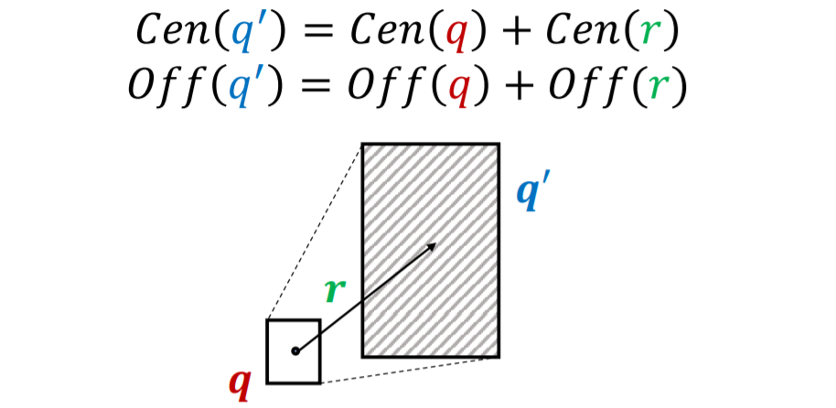

#### 取交集(Intersection)操作

​		求交集是Query2Box的另一种基本操作，这种操作可以求出输入的一系列box的交集，也是一个box，根据基本常识，这个新的box的中心应该接近于输入的box的中心，并且offset不能超过输入box中的最小值。新的交集box计算方式如下：
$$
\operatorname{Cen}\left(q_{\text {inter }}\right)=\sum \boldsymbol{w}_{i} \odot {\operatorname{Cen}\left(q_{i}\right)}
$$
这里的$w_i$是权重参数，可以通过如下方式计算得到，**本质上是一种注意力机制**：
$$
\boldsymbol{w}_{i}=\frac{\exp \left(f_{\text {cen }}\left(\operatorname{Cen}\left(q_{i}\right)\right)\right)}{\sum_{j} \exp \left(f_{\text {cen }}\left(\operatorname{Cen}\left(q_{j}\right)\right)\right)}
$$
而offset可以用如下方式计算：
$$
\text { Off } (q_\text{inter})=\min(\text{Off}(q_1),\dots,\text{Off}(q_n))\odot \sigma(f_{off}(\text{Off}(q_1),\dots,\text{Off}(q_n)))
$$
这里的函数f是一个神经网络，可以提取输入box的特征，增强表达能力，并用sigmoid函数归约到(0,1)区间内

#### Query2Box详解

​		依然用What are drugs that cause Short of Breath and treat diseases associated with protein ESR2?这样的一个query作为例子，我们可以先将这个query处理为：`((e:ESR2, (r:Assoc, r:TreatedBy)), (e:Short of Breath, (r:CausedBy))`，然后我们就可以使用投影，从head实体开始一步步投影进行投影，得到如下结果：

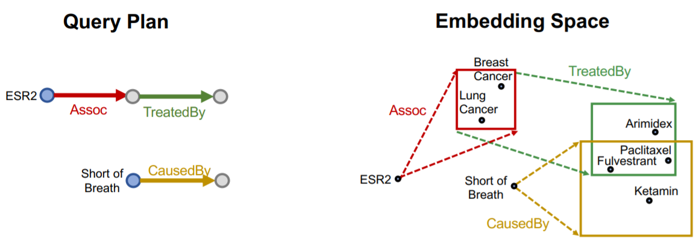

然后在进行求交集的操作，得到最终的结果(阴影部分)

#### 打分函数

​	  Query2Box的知识图谱推理框架中，使用实体到box的负距离来定义打分函数，对于一个查询q和一个嵌入空间中的实体v，我们定义其距离函数为：
$$
d_{\text {box }}(\mathbf{q}, \mathbf{v})=d_{\text {out }}(\mathbf{q}, \mathbf{v})+\alpha \cdot d_{\text {in }}(\mathbf{q}, \mathbf{v})
$$
这里的距离被分成了外部距离和内部距离两个部分，外部距离就是到box的边界的距离，而内部距离是box的边界到中心点的距离，而当一个实体在box内部的时候，其而内部距离应该定义成负权重的，因此打分函数可以定义为：
$$
f_q(v)=-d_{\mathrm{box}}(q,v)
$$
和知识图谱嵌入一样，我们希望这个打分函数对于正确的$(q,v)$而言分数更高，而对错误的分数更低，因此训练的时候需要用到负样本。

#### Union操作的扩展

​	  在Query2Box的框架下，交集的操作已经有了良好的定义，而并集操作是否也可以使用低维的向量来表示呢？一系列析取(disjunction)的连续查询又被叫做Existential Positive First-order (EPFO) queries，这类查询可以分解为一系列AND-OR操作。

​	  然而AND-OR查询不能用低维的向量来表示，比如有3个不同的query和对应的结果，可以使用2维空间表示，而如果有4个不同的query，当下面这种情况出现的时候就需要3维的空间：

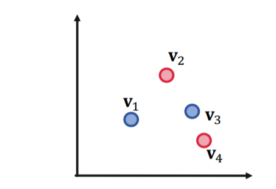

这是为了保证任意两个query的并集中不能包含其他的query，而对于M个组合的query，表示出所有的OR操作至少需要$O(M)$规模的嵌入空间，因此数据规模一大就不能用低维向量来表示所有的并集操作。

​	  但这个问题也不是完全没有解决的办法，论文中提出的一个key idea就是**改变处理一个联合查询时候的顺序**，到最后一步再做union

​	  具体的做法是，任何一个AND-OR查询可以转变成一个等价的**析取范式(DNF)**，即$q=q_1\or q_2\or\dots q_m$，这样一来我们来处理一个查询的时候就可以先求出所有$q_i$的嵌入，到最后一步再进行union操作。在最后计算距离作为score的时候，容易得到有：
$$
d_{\text {box }}(\mathbf{q}, \mathbf{v})=\min \left(d_{\text {box }}\left(\mathbf{q}_{1}, \mathbf{v}\right), \ldots, d_{\text {box }}\left(\mathbf{q}_{m}, \mathbf{v}\right)\right)
$$

#### Query2Box的训练

​	  在Query2Box模型中，需要训练的参数主要有所有的实体的嵌入向量，所有的关系的嵌入向量和Intersection运算中的各种参数。

​	  一个很直观的想法是，在训练Qeury2Box模型的过程中，对于一个查询q的嵌入向量，我们要让属于q中的实体v对应的打分函数最大化，而要让不在其中的打分函数最小化，为此需要用到负采样，也就是在训练的过程中，对于每个正样本v随机选取一个负样本与之对应，具体的训练过程可以分为以下几个步骤：

- 对输入的样本进行负采样
- 计算查询q的box embedding
- 计算正负样本的打分函数$f_q(v),f_q(v')$
- 计算损失函数并进行优化，每个样本训练过程中的loss是

$$
\ell=-\log \sigma\left(f_{q}(v)\right)-\log \left(1-\sigma\left(f_{q}\left(v^{\prime}\right)\right)\right)
$$

#### query的生成

​	  在训练之前我们需要提取出一系列查询，而这个过程称为Query Generation，可以通过一系列模板生成：

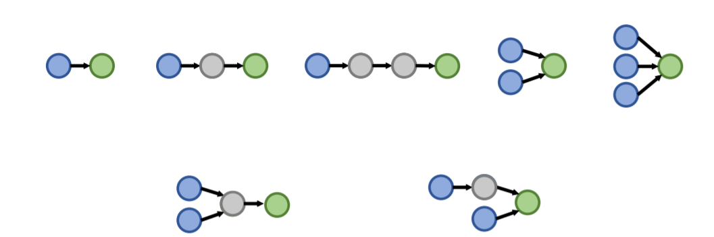

## 频繁子图挖掘Frequent Subgraph Mining

​	  这一节内容主要介绍使用传统方法和GNN来进行频繁子图挖掘的内容。这就涉及到子图的概念，子图是一个图结构中的一些节点和这些节点之间的一些边构成的结构，是图的基本组成单元，并且可以表示一定的图特征，用于区分和判别不同的图结构。

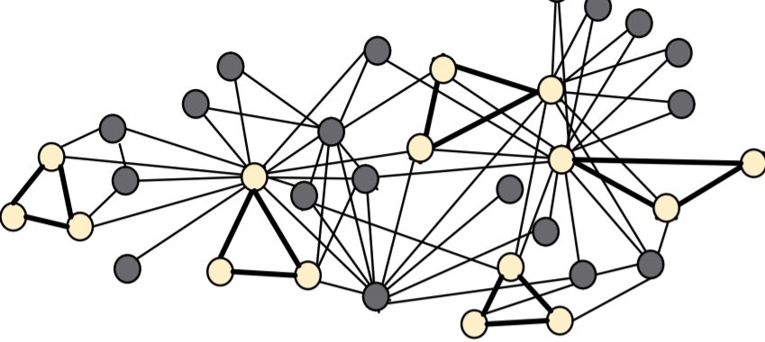

### 子图

​	  这里介绍了两种不同的子图，一种是 Node-induced subgraph另一种是Edge-induced subgraph，区别在于 Node-induced subgraph构建的时候先取顶点的子集，然后从保留的顶点中选出一些边保留，而Edge-induced subgraph构建的时候先取边的子集然后保留其中的一些节点作为图的顶点集合。

​	  构建子图究竟选用哪种方式还要取决于对应的领域，在化学领域的分子结构图中往往用node-induced，因为化学中存在各种各样的官能团，而在知识图谱中用的比较多的是edge-induced

#### 图的同构

​	  对于给定的两个图$G_1=(V_1,E_1),G_2=(V_2,E_2)$，如果存在一个定义在$V_1\rightarrow V_2$双射函数f满足对于$(u,v)\in E_1\rightarrow (f(u),f(v))\in E_2$，那么就称这两个图是同构的(Isomorphism)

​	  子图同构：如果图G1和图G2的子图是同构的，就称G2关于G1是子图同构的，这种情况下我们也可以说G1是G2的子图。

#### 网络主题Network Motifs

​	  网络主题Network Motifs是在一个图结构中的频繁出现且比较重要的模式，用子图的形式表现出来，Network Motifs可以帮助我们理解图中存在的隐含信息并据此做出相应的决策，比如。常见的Motifs有：

- Feed-forward loops前馈关系，常见于神经网络
- Parallel loops代表了一种平行的关系，常见于食物网
- Single-input modules代表了一种从属关系，常见于基因关系控制网络

#### 子图的频率

​	  对于一个图结构$G_Q$和目标图数据集$G_T$，节点v是$G_Q$中的一个点，则节点v的子图频率并定义为：

- u是$G_T$中的一个节点，$G_T$中和$G_Q$同构并且将u映射到v的的所有子图中，所有节点u的个数
- $(G_Q,v)$被定义成 **node-anchored subgraph**(节点固定子图)
- 如果图数据集中有多张图，就分别进行计算

### Motif的重要性

​	  一般来说相比于一个随机图，在真实的图结构中出现频率越高的子图的重要性越高，我们需要用一定的规则来定义子图的重要性。

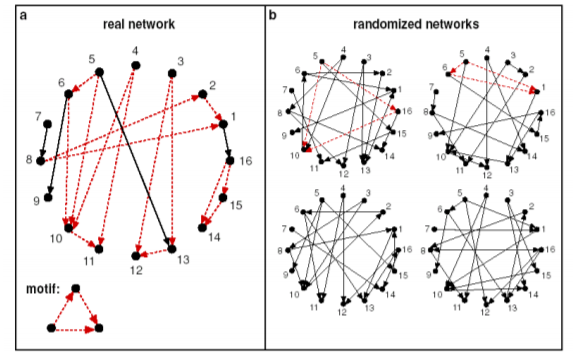

#### 随机图

​	  Erdős–Rényi (ER) random graphs是由n个节点并且两两之间用概率p连接一条边的**无向图**，记为$G_{n,p}$

​	  Configuration Model可以生成一个每个节点的度数为指定值的图，这种模型经常被用作图的null-model，我们可以通过比较真实的图G和一个随机生成并且每个节点的度数和G相同的随机图来分析比较得出一个图的重要性。这个模型生成随机图的过程如下：

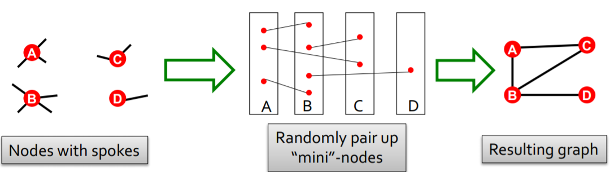

​	  另一种方法被称为交换(Switching)，这种方法从一个给定的图开始，重复若干次交换的操作，每次选择两条边互相交换，最后生成了一个随机的关联图，这种图没有改变原本节点的度数，只随即改变了边。

#### 重要性计算的过程

​	  一般来说motif在真实的图中出现的频率会比随机图中高很多(overrepresented)，因此计算motif的重要性一般有如下几个步骤

- 计算给定的图中的motif的个数
- 生成统计信息相近的随机图并且计算随机图中的motif数量
- 使用统计学评估方法来衡量每个motif对于这张图的重要程度

#### Z-Score

​	  对于图中的一系列motif，可以用Z-Score统计量来衡量其重要程度，对于第i个motif，用$N_i^{real},N_i^{rand}$分别表示在原图和随机图中发现的motif个数(随机图可以有多个)，那么其Z-Score可以用如下方式计算：
$$
Z_i=\frac{N_i^{real}-\bar N_i^{rand}}{\mathrm{std}(N_i^{rand})}
$$

并且可以对一系列的Z-Score进行标准化，得到网络重要性指标significance profile(SP)
$$
SP_i=\frac{Z_i}{\sqrt{\sum_{j=1}^nZ_j^2}}
$$

- SP可以用来衡量不同的motif之间的相对重要程度

### GNN与子图匹配

- 子图匹配是一个很经典的图问题，需要判断一个给定的图是不是另一个图的子图，这一节的内容就是要用GNN来解决子图判别问题。一个很直观的想法是，我们可以通过比较嵌入空间的几何形状来提取子图同构的性质。
- 然而一个令我不解的问题是，子图判断应该是一个确定性问题，为什么可以使用GNN来解决

#### 节点锚定

​	  我们考虑将问题转化成一个二分类问题，即用True和False来判断一个图是否同构于另一个图的子图，我们可以考虑使用一种节点锚定(node-anchored)的方法：

- 我们可以用GNN去计算两个图中对应节点u和v的嵌入向量

- 然后来判断u的邻居节点和v的邻居节点是不是同构的

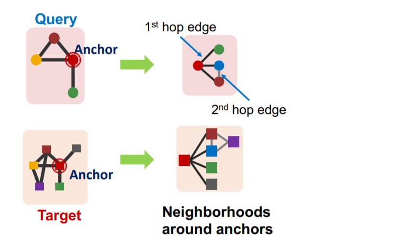

这种方法不仅可以判断是不是子图，还可以同时标定一组对应的点。为了实现这种方法，我们需要通过如下步骤：

- 假设我们需要在图$G_T$中匹配一个子图$G_Q$
- 对于图中的每一个节点，计算出它的K-Hop邻居(使用BFS等手段)，这里的深度K是一个超参数，可以自己设定
- 然后使用GNN得到邻居的嵌入向量

#### 有序嵌入空间Order Embedding Space

​	我们可以将图A映射到高维空间中的一个点，使得这个点的所有维度都是非负的，这样一来这些嵌入向量就可以比较大小，使用$\preceq$符号来表示不同嵌入之间的大小，一个直觉是子图往往在超图的lower-left(可以理解为广义上的“左下角”)，对于一个子图和其超图，应该有：
$$
\forall_{i=1}^{D} z_{q}[i] \leq z_{u}[i] \text { iff } G_{Q} \subseteq G_{T}
$$

为什么可以使用有序嵌入？因为子图同构关系可以在有序嵌入空间中很好地编码，并且具有：

- 传递性，A是B的子图，B是C的子图，那么A是C的子图
- 反对称性，如果AB互为子图那么他们同构
- 闭包性，单个节点的图是所有非空图的子图，空节点是所有图的子图

这些性质都支持将一个图结构嵌入到一个有序嵌入空间中

#### 模型的构建和训练

​		我们已经说到用锚点和有序嵌入的方式来解决子图同构问题，为了构建并训练一个完整的模型，我们需要设定一个损失函数，来学习反映出子图关系的嵌入向量。

​		而损失函数的设定需要满足Order constraint，这种约束可以保证子图关系的信息在嵌入空间中被保留了，因此可以设置损失函数为：
$$
E\left(G_{q}, G_{t}\right)=\sum_{i=1}^{D}\left(\max \left(0, z_{q}[i]-z_{t}[i]\right)\right)^{2}
$$
这个函数对于有子图关系的两个图来说就是0，否则就是一个正数。我们可以采用负采样的方式来训练模型，对于样本$(G_q,G_t)$选取一半为有子图关系的正样本，而另一半为没有子图关系的负样本，并且使用一个max-margin损失函数，即：

- 对于正样本，最小化$E\left(G_{q}, G_{t}\right)$
- 对于负样本，最小化$\max(0, \alpha-E\left(G_{q}, G_{t}\right))$，这里的$\alpha$是一个自己设定的margin，我们希望负样本$(G_q,G_t)$**计算出来的惩罚函数要尽可能小**，使用这种形式的损失函数可以防止模型在训练的过程中，负样本$(G_q,G_t)$的嵌入越来越远离正确的位置
- 在训练的过程中每一步要采样一对正负样本进行训练，同时BFS的深度K可以作为超参数自己设置

### 频繁子图挖掘

- 频繁子图挖掘需要找到一个图中出现次数最多的大小为k的motif，这需要解决两个问题，一个是枚举出所有大小为k的子图，另一个是统计不同类型的motif的个数。

​		然而频繁子图挖掘也是一个很困难的问题，困难的点在于频繁子图的寻找是一个NP-hard的问题(同构子图的判定是一个NPC问题)，计算复杂度非常高，因此这一节课的内容提出了使用GNN来解决频繁子图挖掘的问题。

#### 使用GNN进行频繁子图挖掘

​		GNN或者说表示学习的方法可以帮助我们找到频繁子图，具体的解决方案是用控制搜索空间来解决组合爆炸的问题，然后用GNN来解决同构子图匹配的问题。我们可以将问题定义为如下形式：

- 假设需要操作的图是$G_T$，需要挖掘的子图的大小是k，并且得到的结果为r
- 算法的目标是找到$G_T$中所有节点个数为k的子图并得到出现最高的频率，同时使用node-level来定义子图的概念

下面主要介绍一种频繁子图挖掘的GNN模型，其名为SPMiner

#### SPMiner算法

- SPMiner将输入的图$G_T$分解成neighbor，并计算其order embedding，使用order embedding我们可以快速找到子图出现的频率
- 可以通过计算一个order embedding“右上方”的embedding数来计算子图出现的频率，下图中红点右上方的所有点表示是$G_Q$的neighbor中出现过红点对应的子图

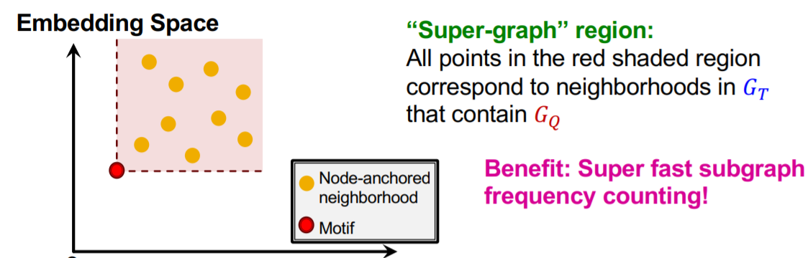

SPMiner算法的搜索过程包含如下几个步骤：

- 启动：从图中随机选择一个节点u开始搜索，定义集合$S=\lbrace u\rbrace$，并按照上面提出的频率估计方法来统计

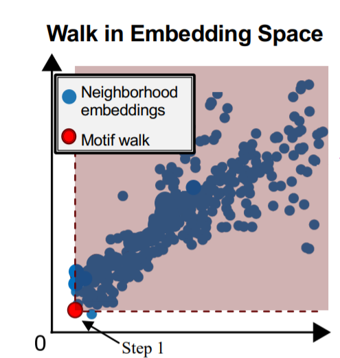

- 迭代步骤：从S的邻居中选择一个节点并将其加入S，同时重复上述搜索过程

- 当集合S达到了预设的size时，记录一个子图搜索结果

这里的邻居节点选择有一定的策略，Total violation of a subgraph G指的是不包含子图G的邻居，将其最小化等价于将频率最大化，因此每一步搜索的过程中都采用贪心策略，将能带来最小化的total violation的节点加入集合S

## 社区检测community detection

​	  我们通常会有这样一种概念，认为一个网络结构应该长成这样：

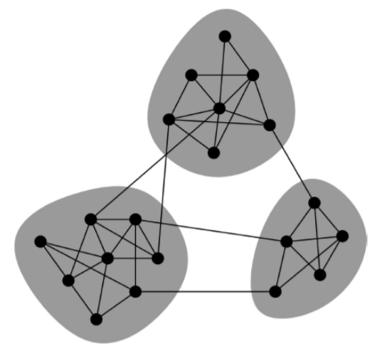

我们发现这样的网络结构呈现出一种“**大杂居小聚居**”的形态，会有一些点组成小集群，同时边也可以分成long和short两种形式，比如我们用下面这样一个社交网络作为例子：

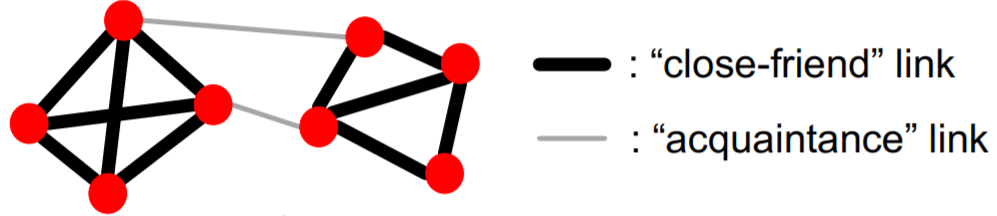

- 在这个图结构里面，人依照关系亲密进行了划分，形成了一些团簇。粗线表示的是亲密朋友关系，而细线表示的是熟人关系。
- 一项研究发现在社交网络中，人们往往更喜欢去寻求熟人而不是朋友的帮助来找工作，这就说明在这个问题中细线边比粗线边更重要，在社交网络的信息传递中起到更重要的作用。
- 因此科学家对社交网络中的各种边进行了结构和社会学双重意义上的分析，将边分成了强弱两种

### Edge Overlap

​	edge overlap可以用来判断一条边是不是一个local bridge(即连通了两个不相交的节点集群的边)，被定义为：
$$
O_{ij}=\frac{|(N(i) \cap N(j))-\{i, j\} \mid}{|(N(i) \cup N(j))-\{i, j\} \mid}
$$

- 如果一个edge overlap的计算结果是0，就说明这条边是local bridge

### 网络社区检测

​		网络社区(Network Community)被定义为是图结构中有较多内部连接和较少外部连接的点的集合，我们可以根据网络社群对节点进行聚类。

#### Modularity模块度

​	  可以用模块性Modularity这个量来表示一个图是否被很好地被分成几个社群，可以用来检测图分割的质量，如果将图G分割成了若干个部分构成集合S，那么Modularity的计算方法可以表示为：
$$
\sum_{s\in S}[\# e\in s-\mathrm{expected}\#e\in s]
$$
也就是说对于一个分割中的每一个group，计算其边的数量和应有的边的数量之差并求和。而这里需要一个null model来作为对照，我们可以对一个有n个节点m条边的图G随机生成一个度数分布与之相同的图，并且假设每个节点的度数为$k_i$，则有：
$$
\sum_{i=1}^nk_i=2m
$$
两个节点i和j之间期望的边的条数是$\frac{k_i k_j}{2m}$

​	  这种计算方式在加权图和不加权的图中都可以使用，这样一来就有了计算按照期望应有的边的数量的方式，modularity的计算方式可以表示为：
$$
Q(G, S)=\frac{1}{2 m} \sum_{s \in S} \sum_{i \in s} \sum_{j \in s}\left(A_{i j}-\frac{k_{i} k_{j}}{2 m}\right)\in [-1,1]
$$

- 这个计算方式可以等价地表示成：

$$
Q=\frac{1}{2m}\sum_{ij}\left(A_{i j}-\frac{k_{i} k_{j}}{2 m}\right)\delta (c_i.c_j)
$$

- 一般来说大于0.3-0.7就可以认为这是一个重要的社群结构，同时我们通过让Q最大化来寻找图中存在的社群。

### 社区检测算法

- 这一部分主要讲了两种社区检测算法，一种是Louvain算法，基于贪心策略，时间复杂度达到了$O(N\log N)$，另一种是可以发现网络结构中的overlapping community的BigCLAM算法，具体的就不深入了解了。

## 传统的图生成模型

​		我们希望通过图生成模型来生成现实世界中的图，通过这种方式可以深入了解图的内在形式，并且可以预测一张图未来的变化趋势，进行图的异常检测。

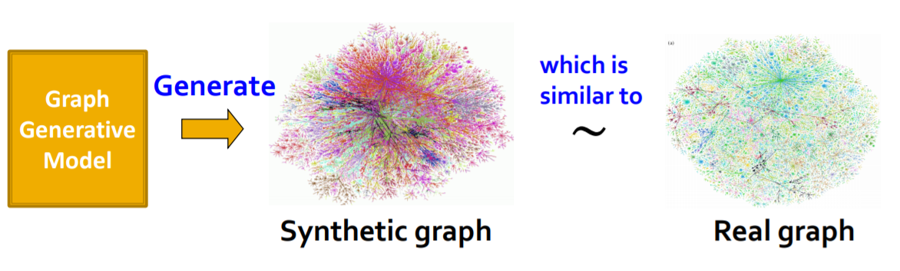

### 真实世界中图的性质

​		我们通常使用一些关键的特征来描述一张图，比如度数的分布，聚类系数，连通分量，路径长度等。这些前面都已经讲过了，这里就不再一一介绍。同时前面还讲了随机图的生成方法，其中比较有用的是Erdős–Rényi 算法。

#### 鲁棒性的衡量标准：Expansion

​		扩展性的定义是，对于图$G=(V,E)$，对于任意的V的子集S，离开S的边的数量都大于$\alpha \min(|S|,|V-S|)$，那么$\alpha$就被称为是图G的扩展性，即：
$$
\alpha=\min \frac{\mathrm{\# (edge \quad leaving \quad S)}}{\min(|S|,|V-S|)}
$$

- 一个n个节点的图中至少存在$O(\log n/\alpha )$长度的路径
- 随机图因为有比较好的扩展性因此BFS所需的时间是$\log N$级别的

#### 随机图模型中存在的问题

​		随机图模型通过随机的方式生成一张图，并且依然可以保持比较好的路径平均长度，聚类系数，度数分布等特征，但是也存在如下问题：

- 缺少局部特征，聚类系数太低
- 度数的分布缺乏真实性
- 难以生成实际图中可能存在的大分量

### Small-World图模型

​		Small-World图模型提供了一种使用常规的点阵图和随机图进行插值(Interpolate)的办法来生成高聚类系数并且低路径长度(引申出一个概念叫做图的直径)

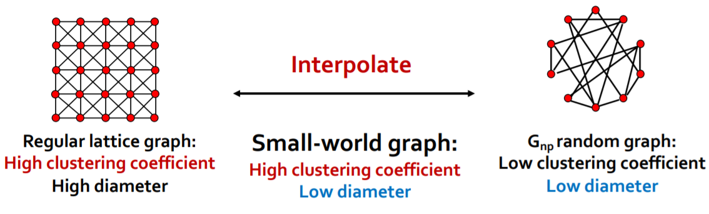

- 首先从一个普通的点阵图开始，然后在这个图中引入一定的随机性，随机添加/删除一些边

### Knonecker模型

​		我们可以尝试使用递归的方法来生成图结构，而图结构的递归生成可以考虑自相似的方法，自相似指的就是整体和部分具有一定的相似性。而Knonecker模型就提供了一种生成自相似模型的方法

- 可以用两张图的邻接矩阵，定义其Knonecker作为生成图的邻接矩阵，Knonecker积的计算方式如下：

- 使用这种方法可以生成m阶的Knonecker图，即$K_m=K_{m-1}\otimes K_1$，在此基础上

## 深度图生成模型

### 机器学习方法

​		基于机器学习方法的图生成模型主要需要从给定的$p_{data}(G)$中获得的数据分布，学习出数据的一个分布$p_{model}(G)$，并且使用这个分布来生成所需要的图，我们用$p_{data}(G,\theta)$来表示模型，我们希望得到一个尽可能接近$p_{data}(G)$的结果，并且可以从这个模型中进行采样并生成结果。为此，我们可以使用极大似然法：
$$
\boldsymbol{\theta}^{*}=\underset{\boldsymbol{\theta}}{\arg \max } \mathbb{E}_{x \sim p_{\text {data }}} \log p_{\text {model }}(\boldsymbol{x} \mid \boldsymbol{\theta})
$$
而图生成的过程中，我们可以先使用一个噪声分布$z\sim N(0,1)$来获取$x_i= f(z_i;\theta)$这里的f就可以使用一个神经网络，而$x_i$被理解为是一系列动作，比如增加节点和增加边，因此一张图的生成可以用链式法则来表示：
$$
p_{\text {model }}(\boldsymbol{x} ; \theta)=\prod_{t=1}^{n} p_{\text {model }}\left(x_{t} \mid x_{1}, \ldots, x_{t-1} ; \theta\right)
$$

### GraphRNN

#### 模型简介

​		GraphRNN就是将图的构建看成了一种序列化的操作，即每次在图中添加节点或者在已有的节点中添加边(分别对应node-level和edge-level的任务)，这样一来图的生成就变成了一个序列生成的问题，可以使用RNN来处理序列化的问题。

我们需要解决两个问题：

- 生成新节点的状态，表示在序列中增加一个节点
- 根据节点的状态来生成对应的边

因此GraphRNN包含了两个RNN，一个是节点级别的RNN，另一个是边级别的RNN，由Node-RNN来生成Edge-RNN的状态，并且由Edge-RNN来判断每一个新的节点是否会和前面的节点相连。

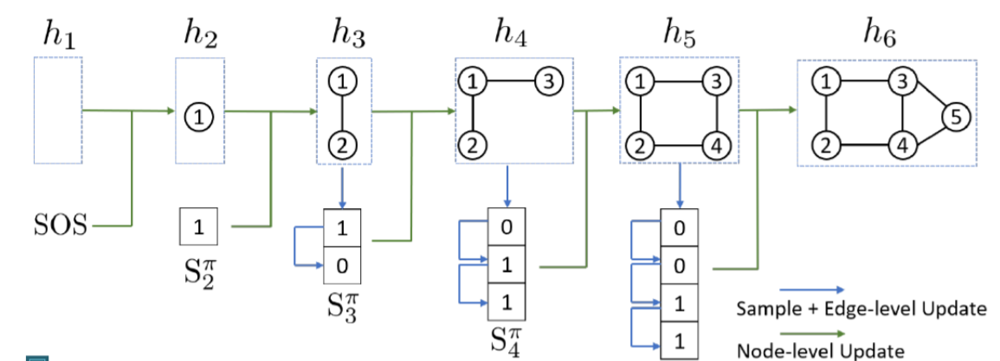

- 模型中使用SOS和EOS分别表示分别表示序列生成的开始和结束，同时我们可以将前一个的输出用作下一个的输入，来达到连续生成的目的
- 每一个步骤中RNN都会生成一个单条边的概率分布，然后从这个分布中进行采样，作为下一个步骤的输入

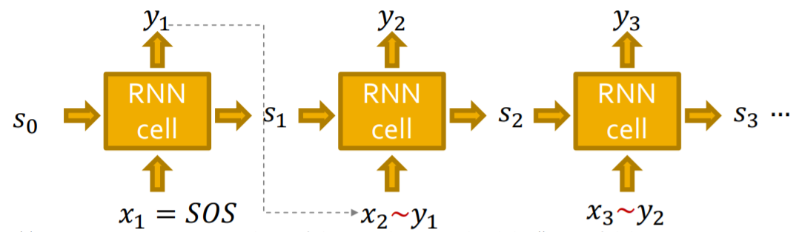

#### 模型的训练和测试

​		在测试阶段，模型的运行方式如下，使用上一步的输出结果y生成下一个x的伯努利分布，然后进行采样得到x进行下一步。

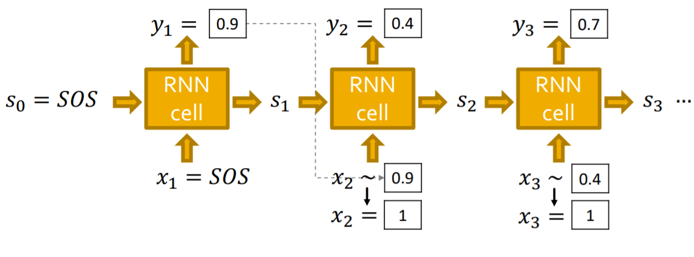

而在训练的过程中还需要进行Teacher Forcing，计算其损失函数并进行参数优化，这里损失函数一般使用交叉熵，即
$$
L=-\left[y_{1}^{*} \log \left(y_{1}\right)+\left(1-y_{1}^{*}\right) \log \left(1-y_{1}\right)\right]
$$
使用损失函数反向传播进行梯度优化可以使得预测结果$y_i$适应于输入数据的真实分布$y_i^{*}$，同时运行的过程中，一个图的生成可以分成以下几个步骤：

- 增加新结点：运行一个步骤的Node-RNN并且将其输出输入Edge-RNN进行初始化
- 给新节点添加新边：运行一次Edge-RNN并预测新的节点是不是会和前面的若干个节点相连
- 添加新节点：用最新的Edge-RNN的隐层作为输入运行一个步骤的Node-RNN
- 停止生成：当Edge-RNN输出EOS的时候就停止生成

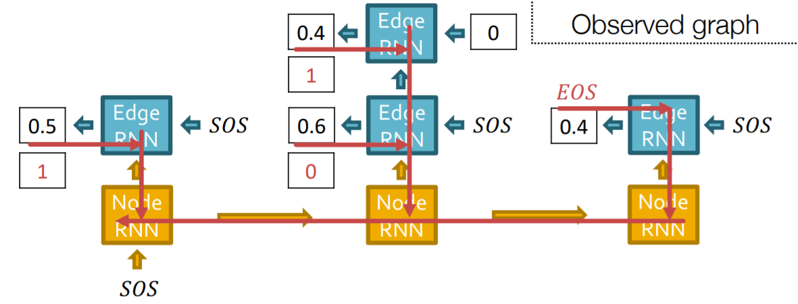

- 测试的时候和训练阶段最大的不同是，训练的时候要保留Edge-RNN获得的概率并将其用在loss的计算上，但是测试的时候直接按照概率分布来预测这条边存不存在并生成最后的结果。

#### 存在的问题

​		图RNN生成一张图的过程比较复杂，对于要**生成长路径**的任务场景下表现不太好(这就好像NLP中的RNN会对长距离的依赖关系学习效果不佳一样)，使用BFS的方法可以降低生成过程的复杂度。

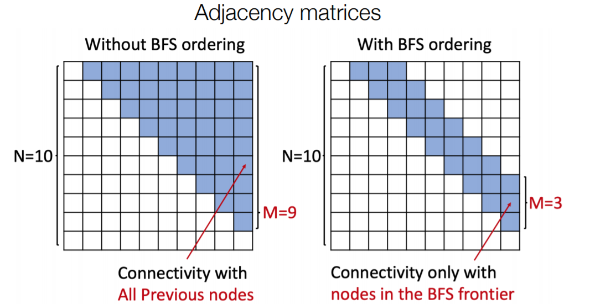

### 评估生成的图

​		另一个很重要的问题是生成的图要怎么评估图生成模型生成的图的质量，我们可以用相似度的方式来定义生成图和真实图的相似性。而相似度的定义主要有两种方式，一种是Visual Similarity，也就是使用眼睛来看，另一种方式是基于图统计信息的相似度，比如度数分布、聚类系数分布和轨道数等等。

​		Earth Mover Distance (EMD)可以用来评估两个分布之间的相似性，计算方式是计算将一个分布“移动成”另一个分布所需要付出的代价，而Maximum Mean Discrepancy (MMD)通过将图划分成两个集合进行相似度的比较，可以用来评估n个图之间的相似性。

## GNN前沿话题

​		本章内容继续回到图神经网络，来讨论一些GNN的高级话题，同时也是整个课程的结束部分。

### GNN的局限性

​		一个完美的GNN应该建立一个邻居结构到节点嵌入的单射，也就是一个邻居结构对应一个特定的单射，因此一个图中结构相同的节点的嵌入是一样的，结构不同的点的嵌入是不一样的

​		而问题就在于，就算是两个邻居结构相同的点，我们有的时候可能也希望它们的嵌入表示不同，这类任务被称为是Position-aware tasks，因此就算是一个完美的GNN也会在网格图等场景下失效。此外，基于消息传递机制的GNN不能学习出回路的长度，这就导致两个结构不同的节点学到的嵌入表示也可能是相同的(前面已经说过)

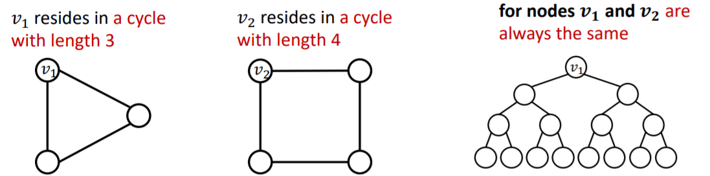

解决这两个问题的办法分别是：

- 问题1的解决方法是基于节点的position来生成节点的嵌入，经典案例是:Position-aware GNNs
- 问题2的解决方法是使用更好的消息传递方式，比如 Identity-aware GNNs

对于这些问题，一个很naive的解决方式是使用one-hot编码，但是这种方式的可扩展性很差，因为嵌入的维度是$O(N)$级别的

### Position-aware GNN

​		图中往往有两类任务，一类是基于结构的，一类是基于位置的，基于结构的任务需要考虑的关键是节点的结构，而基于位置的任务需要考虑的关键是节点在图中的“位置”，其区别就在于邻居结构是一种相对位置。GNN往往在基于结构的任务中表现比较好而在基于位置的任务中表现不好。

​		一个常见的解决方法是选用锚点，然后用相对于锚点的距离来对点进行分类，在这个过程中锚点充当了一个坐标轴，当然锚点可以有多个，更多的锚点就好像使用了更多的坐标轴去刻画点的位置。同时可以用这种方法对图中的节点进行位置编码。

​		要解决Position-aware的任务我们就必须使用跟position有关的信息，而是使用这些位置信息的方法有：

- Naive的方法：使用位置编码作为额外的节点特征，值得注意的是位置编码向量的每一个维度是可以任意排序的，因为每个锚点的选取顺序不影响节点的位置特征
- Rigorous的方法：使用一个神经网络来维护位置编码的任意排序中存在的不变信息

### Identity-aware GNN

​		我们已经知道GNN在Position-aware的任务中表现不好，那么GNN在Structure-aware的任务中表现如何呢？事实上表现依然不好，在多个层级(节点，边和图)的Structure-aware中依然表现不好，不同的输入仍然可能导致相同的计算图，这就无法区分不同的Structure

​		一种解决办法是，我们可以给每一个需要embedding的节点标上一个颜色，这样一来生成的计算图中也会有带颜色的节点，就可以区分出不同的节点，并且这种颜色不会随着节点顺序的变化而变化。

有了颜色之后，我们可以用颜色来区分计算图，这样一来之前会failure的例子也可以work了，这种方法在图分类任务中也可以使用。

​		而Identity-aware GNN正是使用了这种染色机制，并且使用了**异构的消息传递**，不同的节点之间的消息传递方式不同。一个ID-GNN中不同颜色之间消息传递的方式不同。因此ID-GNN可以挖掘出图中的环的信息，可以通过计算图来计算各种长度的环的个数。

ID-GNN的一个简化版本是ID-GNN-Fast，这种模型会统计计算图中各种长度的环的个数，并将其作为一个额外的节点特征，而ID-GNN实际上是一个“插件”，可以被添加到任意一种基于消息传递机制的GNN中，并被实验证明是非常有效的。

### GNN的鲁棒性

​		神经网络已经在很多领域取得了一定的应用，但一个很现实的问题是，这些模型真的能被用到现实生活中吗？事实上神经网络容易遭到对抗攻击，比如CNN

​		深度模型往往缺少鲁棒性，很容易被一些伪造的样本攻击导致性能极度下降，那么图神经网络的鲁棒性究竟如何呢？为了研究这个问题，我们假定问题是半监督的节点分类(只有少量的)，而模型是GCN

#### 问题的描述

​		我们可以将节点分为目标节点t和可攻击节点集合S，攻击的方式可以分为直接攻击和间接攻击。

- 直接攻击是指，可以攻击的节点就是目标节点的情况。间接攻击是可以攻击的节点不是目标节点的情况
- 攻击的方式主要有两种，可以直接给目标节点改变特征，也可以增减攻击节点的边

#### 问题的形式化

​		我们可以用形式化的数学语言来描述GNN对抗攻击这个问题，我们的目标是在尽可能少地改变图结构的情况下，尽可能改变目标节点预测的结果，这是因为如果把图改动的太离谱了，很容易就会被发现这是伪造的数据，因此要尽可能减少对图的修改。

​		我们假设图的邻接矩阵是$A$，图节点的特征矩阵是$X$，改变后的邻接矩阵和特征矩阵分别是$A',X'$，且要求$(A',X')\approx (A,X)$，并且假设需要预测的节点是v，从原始的图中GCN已经学习到了模型参数为：
$$
\boldsymbol{\theta}^{*}=\operatorname{argmin}_{\boldsymbol{\theta}} \mathcal{L}_{\text {train }}(\boldsymbol{\theta} ; \boldsymbol{A}, \boldsymbol{X})
$$
原始的label预测结果为：
$$
c_{v}^{*}=\operatorname{argmax}_{c} f_{\theta^{*}}(A, X)_{v, c}
$$
而GCN在新的伪造图上学习到的模型为：
$$
\boldsymbol{\theta}^{* \prime}=\operatorname{argmin}_{\boldsymbol{\theta}} \mathcal{L}_{\text {train }}\left(\boldsymbol{\theta} ; \boldsymbol{A}^{\prime}, \boldsymbol{X}^{\prime}\right)
$$
而新图上节点v的预测结果是
$$
C_{v}^{* \prime}=\operatorname{argmax}_{c} f_{\theta^{* \prime}}\left(A^{\prime}, X^{\prime}\right)_{v, c}
$$
我们的目标是$C_{v}\not= C_{v}^{*}$，为了让两个结果相差的尽可能大，我们可以把目标函数定义为：
$$
\Delta(v,A',X')=\log f_{\boldsymbol{\theta}^{* \prime}}\left(\boldsymbol{A}^{\prime}, \boldsymbol{X}^{\prime}\right)_{v, c_{v}^{* \prime}}-\log f_{\boldsymbol{\theta}^{* \prime}}\left(\boldsymbol{A}^{\prime}, \boldsymbol{X}^{\prime}\right)_{v, c_{v}^{*}}
$$
接下来就需要针对这个目标进行优化，然而邻接矩阵$A'$是一个离散的对象，不能使用基于梯度的优化方法，因此我们需要采用一定的优化策略选择好参数$A',X'$之后重新训练一个GCN来验证结果的好坏，现有的方法都是对这个优化目标的近似解，具体的这门课上也没有深入讲下去，需要阅读相关论文来深入学习。

#### 实验结果和结论

​		Slides里面举了一篇KDD18的论文作为例子，这篇论文中采用了直接攻击，间接攻击和不攻击三种策略，并在直接攻击中使用了随机攻击作为对照，得到的实验结果是：

​		我们发现GCN对抗直接攻击的能力比较差(对直接对抗攻击不鲁棒)，但是可以应付间接攻击和随机攻击。