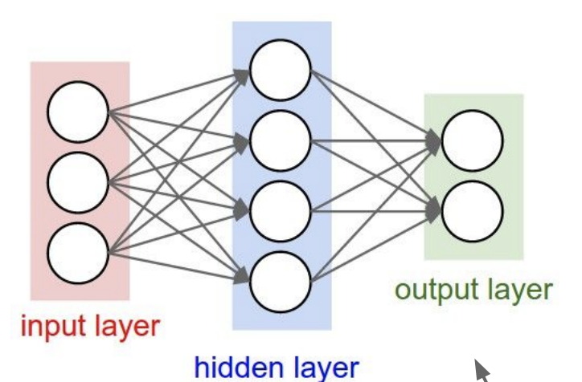
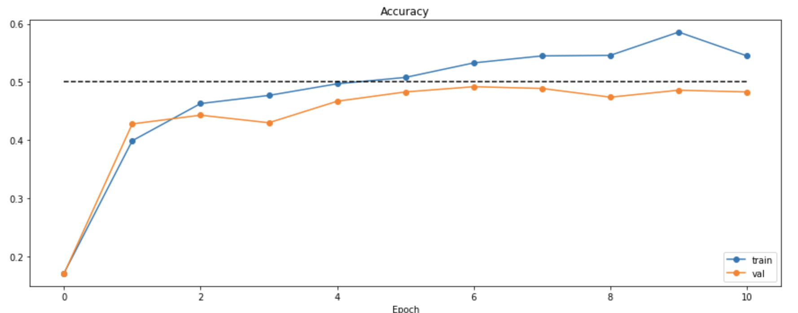
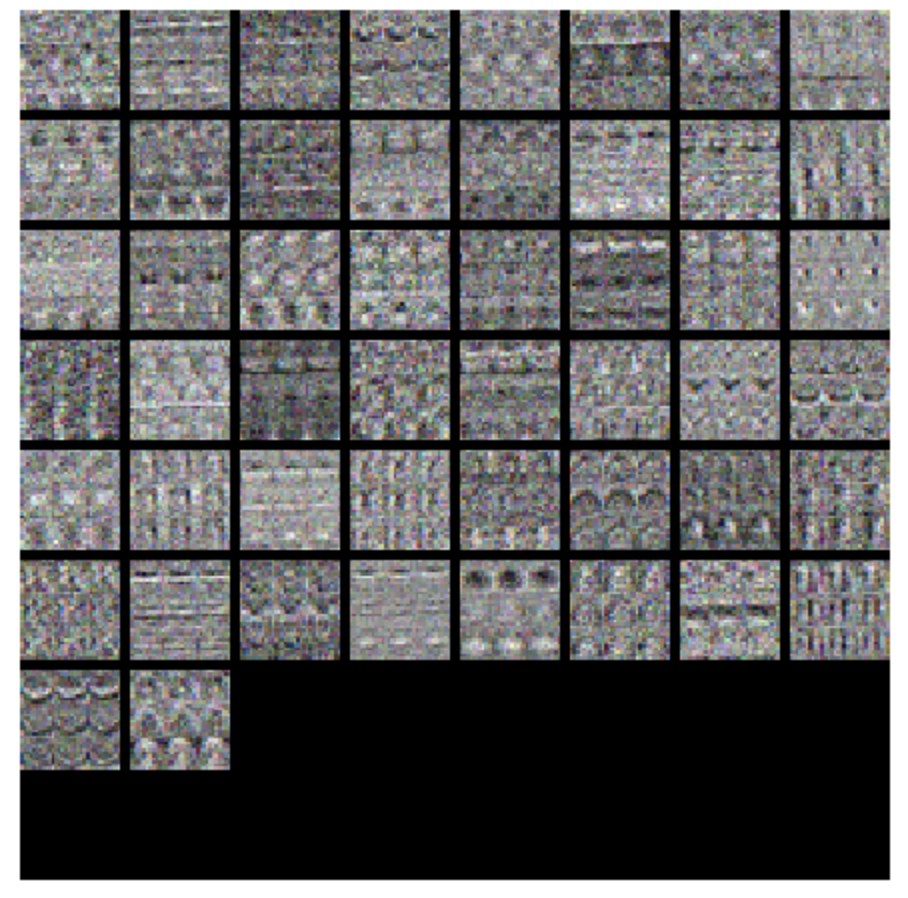
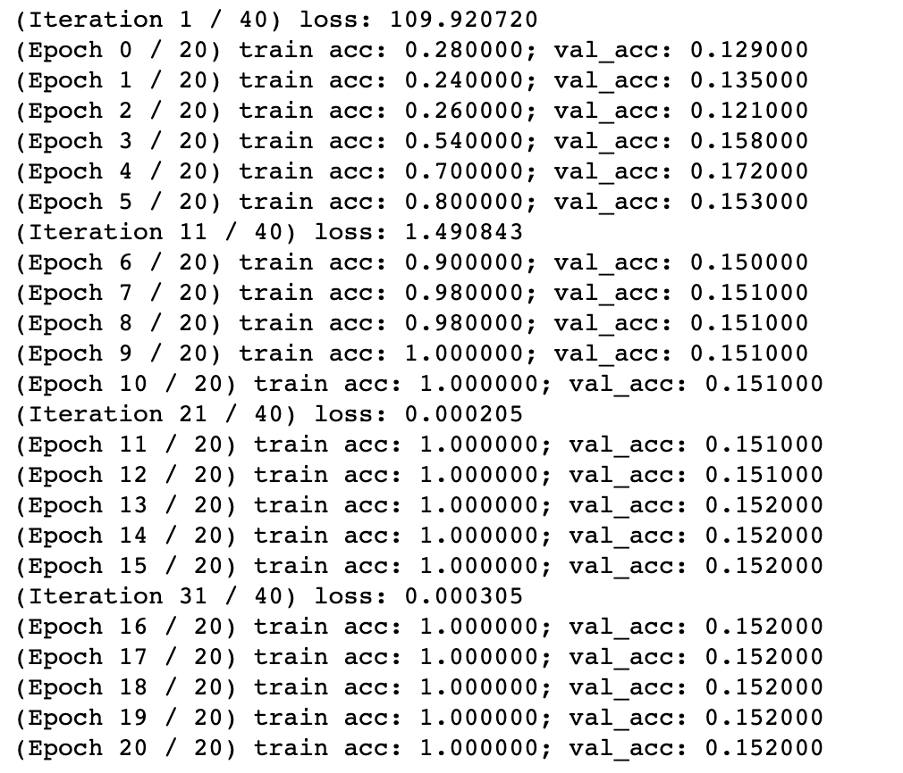
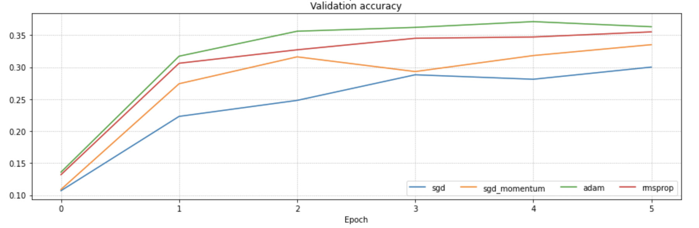

# Stanford-CS231N-Assignment札记2：多层全连接神经网络与优化器


> Stanford2021年春季课程CS231N:Convolutional Neural Networks for Visual Recognition的一些作业笔记，这门课的作业围绕视觉相关的任务，需要从底层手动实现一大批经典机器学习算法和神经网络模型，本文是作业的第二部分，包含了全连接神经网络以及若干种梯度优化器(如Adam)的实现。

## 基本组件：全连接层和ReLU层

第二部分作业需要我们实现多层的全连接神经网络(横跨作业1和作业2)，我们需要从最基本的组件(全连接层和ReLU激活函数层)开始一点点搭建起自己的全连接神经网络。

> 这一部分的代码实现遵循这样的范式，包括：
>
> - 每一种不同的神经网络层都有两个函数forward和backward需要实现
> - forward函数中会使用cache来保存一些关键的参数和变量值，在backward的过程中用于计算需要更新的梯度
> - 神经网络模型的参数全部在`__init__`方法中初始化并定义在一个名为params的字典中，可以方便的取用
> - 模型的前向传播和反向传播都在`loss`方法中实现

### 全连接层的实现

神经网络又输入层输出层和中间的若干个隐层组成，这些隐层就是构成神经网络的基本组件。全连接层Fully Connected Layer是最简单的一种神经网络组件，也叫做仿射层。

#### 正向传播

全连接层也就是**将所有的输入神经元和所有输出神经元进行连接**，彼此之间有一个权重，我们假设输入神经元的是$d$维向量$x$，输出的是$n$维的向量，那么全连接层的权重矩阵$W$就是一个$n\times d$维的矩阵，而bias就是一个$n$维的向量$b$，因此全连接层的正向传播的过程可以表示为：
$$
f(x)=Wx+b
$$
这一过程时间上就是对输入的向量x进行了一个线性的变换。这一部分比较简单，也没什么好多说的。具体的代码实现如下，用一个函数`affine_forward`来表示一个全连接层前向传播时的操作：

```python
def affine_forward(x, w, b):
    out = None
    D = np.prod(x.shape[1: ])
    new_x = x.reshape((x.shape[0], D))
    out = np.matmul(new_x, w) + b
    cache = (x, w, b)
    return out, cache
```

#### 反向传播

反向传播也就是根据损失函数来优化各个参数W，x和b，我们可以假设从输出层传递到当前全连接层的结果是dout，那么根据反向传播算法和梯度的链式法则，我们需要求出的就是函数f对于W，x和b三者的导数。
$$
\frac {\partial f}{\partial x}=W^T
$$

$$
\frac {\partial f}{\partial b}=\bold 1^{d\times 1}
$$

$$
\frac {\partial f}{\partial W}=x^T
$$

**结合W，x，b各自的维度特征**，反向传播的这个过程可以用下面的函数`affine_backward`来表示：

```python
def affine_backward(dout, cache):
    x, w, b = cache
    dx, dw, db = None, None, None
    N, D = x.shape[0], w.shape[0]
    dx = np.matmul(dout, w.T).reshape(x.shape)
    dw = np.matmul(x.reshape(N, D).T, dout)
    db = np.sum(dout, axis=0)
    return dx, dw, db

```

### ReLU层的实现

ReLU层是CNN中非常常用的激活层，ReLU函数的定义为：
$$
\mathrm{ReLU}(x)=\max (0, x)
$$
我们知道全连接层进行的运算都是线性的变化，激活层的目的是就**赋予这些计算的结果非线性的特征**，使得神经网络可以拟合某个特定的目标函数，有理论研究表明，只要神经网络中采用了具有“挤压”性质的激活函数，神经网络在层数足够的情况下可以拟合任何函数到任意精度。其他常见的激活函数还有Sigmoid函数和tanh函数

#### 前向传播

ReLU层的前向传播比较简单，主要就是对上一层输入的x进行ReLU函数的运算，具体的代码可以用一个函数`relu_forward`来表示

```python
def relu_forward(x):
    out = np.maximum(x, 0)
    cache = x
    return out, cache
```

#### 反向传播

反向传播的时候我们还是假设从最顶层流到当前ReLU层的关于ReLU函数的梯度是dout，我们只需要在这里层求出ReLU函数关于x的导数就可以，而ReLU函数是一个分段函数，一段是常数0因此梯度就为0，一段是线性的x因此梯度就是1，因此ReLU函数关于x的梯度就是大于0的时候为1，否则为0，因此反向传播的时候用`relu_backward`函数来计算dx：

```python
def relu_backward(dout, cache):
    dx, x = None, cache
    x[x >= 0] = 1
    x[x < 0] = 0
    dx = x * dout
    return dx
```

### Sandwich层

作业提供的初始代码中对一个全连接层+一个ReLU层进行了封装，得到了`affine_relu_forward, affine_relu_backward`等函数，将两个关键组件封装在一起使用.

## 简单的二层神经网络

### 模型的实现

现在基本的神经网络组件已经有了，我们下一步需要做的就是将它们组建成一个简单的神经网络，下面我们先使用上一节中实现的SoftMax损失函数和SGD梯度优化器来实现一个最简单的二层神经网络，这个神经网络的架构如下图所示：



即输入的向量经过两次全连接+ReLU的运算最后生成output并使用SoftMax计算损失函数，首先我们需要定义一个类`TwoLayerNet`并将神经网络的参数进行初始化：

```python
class TwoLayerNet(object):
    def __init__(
        self,
        input_dim=3 * 32 * 32,
        hidden_dim=100,
        num_classes=10,
        weight_scale=1e-3,
        reg=0.0,
    ):
        self.params = {}
        self.reg = reg
self.params['W1'] = np.random.normal(loc=0, scale=weight_scale, size=(input_dim, hidden_dim))
        self.params['b1'] = np.zeros(hidden_dim, )
        self.params['W2'] = np.random.normal(loc=0, scale=weight_scale, size=(hidden_dim, num_classes))
        self.params['b2'] = np.zeros(num_classes, )

```

然后还需要实现模型的前向传播和反向传播，这些都在loss方法中实现，由于这个东西第一次出现所以我们看一下代码，后面一些模型比如三层全连接网络和CNN，RNN都是一样的构建套路，到时候就不粘贴代码了：

```python
class TwoLayerNet(object):
    def loss(self, X, y=None):
        out1, cache1 = affine_relu_forward(X, self.params['W1'], self.params['b1'])
        out2, cache2 = affine_forward(out1, self.params['W2'], self.params['b2'])
        scores = out2
        # If y is None then we are in test mode so just return scores
        if y is None:
            return scores
        loss, grads = 0, {}
			  # backward
        loss, dout = softmax_loss(out2, y)
        loss += 0.5 * self.reg * (np.sum(self.params['W1'] ** 2) + np.sum(self.params['W2'] ** 2))
        dout, dw, db = affine_backward(dout, cache2)
        grads['W2'], grads['b2'] = dw + self.reg * self.params['W2'], db
        dx, dw, db = affine_relu_backward(dout, cache1)
        grads['W1'], grads['b1'] = dw + self.reg * self.params['W1'], db

        return loss, grads
```

- 对于这一部分，notebook中有专门的测试代码可以进行测试

### Solver类

作业的初始代码中给我们准备好了一个Solver类用来完成模型的训练和测试，这个类会自动对模型进行训练和梯度的更新，我们在后面的代码中可以使用Solver类帮助我们训练模型，这个类的使用方式如下：

```python
input_size = 32 * 32 * 3
hidden_size = 50
num_classes = 10
model = TwoLayerNet(input_size, hidden_size, num_classes)
solver = Solver(model, data,
                    update_rule='sgd',
                    optim_config={
                      'learning_rate': 1e-3,
                    },
                    lr_decay=0.95,
                    num_epochs=10, batch_size=100,
                    print_every=100)
solver.train()
```

在训练的过程中，我们可以观察到loss和准确率的变化情况如下图所示(两幅图的对应的都是上面这个模型)：




我们可以对权重矩阵W在训练过程中的变化进行可视化的呈现：



同时也可以调节超参数来获得更好的模型。

作业1的内容到这里差不多就结束了，接下来开始的是作业2的内容，我们将面临更复杂的网络结构和模型。

## 新的优化器

### 神经网络的训练

- 神经网络的参数学习的总原则是用反向传播求出梯度，然后用梯度下降的方法对参数进行更新，而对于神经网络的训练的主要改进，就是对梯度下降的方法进行改进，最直接的批梯度下降会带来巨大的运算量，而**随机梯度下降**的出现解决了直接对整个数据集进行梯度下降求解时计算量过大的问题。
- 前面我们已经实现了一个SGD优化器对神经网络中的参数进行随机梯度下降的优化，
  - 而SGD虽然相比于梯度下降**对训练速度有了比较大的提升**，但是计算出的梯度受数据的影响比较大(因为只有一个小批量的数据)，可能会因为数据分布的不均匀导致梯度变化过大，不利于逼近最优点
  - 对于收敛速度来说，由于随机梯度下降法一次迭代一个样本，导致迭代方向变化很大，不能很快的收敛到局部最优解
  - 随机梯度下降的计算密度也比较高，仍然可以继续改进
- 因此在SGD的基础上，衍生出了若干种改进的训练方法
  - 动量随机梯度下降
  - RMSProp算法
  - Adam算法

### 动量梯度下降法

- 动量梯度下降法的提出是为了加快学习的速度，特别是处理高曲率，小但是一致的梯度，动量方法会对之前已经求导的梯度进行指数级别的加权平均，并继续沿着该方向移动，其具体的公式为：

$$
V\leftarrow\alpha V-\epsilon V_{batch}
$$

$$
\theta \leftarrow\theta+V
$$

- 其代码实现也比较容易，按照公式一步步计算就可以

```python
def sgd_momentum(w, dw, config=None):
    if config is None:
        config = {}
    config.setdefault("learning_rate", 1e-2)
    config.setdefault("momentum", 0.9)
    v = config.get("velocity", np.zeros_like(w))
    # 公式原文
    next_w = None
    v = v * config["momentum"] - config["learning_rate"] * dw
    next_w = w + v;
    config["velocity"] = v
    return next_w, config
```

### RMSProp算法

- RMSProp是一种自适应学习率的算法，在AdaGrad算法的基础上进行改进，改变梯度累积为指数加权平均，在凸问题的求解中可以快速收敛，其具体的学习方式是：
- 先计算梯度并求出累计的平方梯度

$$
g=\frac 1m\nabla_{\theta}\sum_{i}L(f(x_i),y_i)
$$

$$
r\leftarrow \rho r+(1-\rho)g\odot g
$$

- 更新参数：

$$
\theta \leftarrow\theta-\frac{\epsilon}{\sqrt{\delta +r}}\odot g
$$

- 其代码实现如下，每一步可以和公式一一对应：

```python
def rmsprop(w, dw, config=None):
    if config is None:
        config = {}
    config.setdefault("learning_rate", 1e-2)
    config.setdefault("decay_rate", 0.99)
    config.setdefault("epsilon", 1e-8)
    config.setdefault("cache", np.zeros_like(w))
    next_w = None
    dr = config["decay_rate"]
    cache = dr * config["cache"] + (1 - dr) * (dw ** 2)
    config["cache"] = cache
    next_w = w - config["learning_rate"] * dw / (np.sqrt(cache) + config["epsilon"])
    return next_w, config
```

### Adam算法

- Adam算法是另一种具有自适应学习率的算法，在自适应学习率中引入了动量，对梯度进行一阶和二阶的有偏矩估计

$$
s=\frac{\rho_1s+(1-\rho_1)g}{1-\rho_1^2}
$$

$$
r=\frac{\rho_2r+(1-\rho_2)r}{1-\rho_2^2}
$$

$$
\theta\leftarrow\theta-\epsilon \frac{s}{\sqrt{r+\delta}}
$$

- 这几个优化器的代码实现其实大同小异，基本都是一个套路，关键在于看懂公式究竟在算什么东西

```python
def adam(w, dw, config=None):
    config["t"] += 1
    config["m"] = config["beta1"] * config["m"] + (1 - config["beta1"]) * dw
    mt = config["m"] / (1 - config["beta1"] ** config["t"])
    config["v"] = config["beta2"] * config["v"] + (1 - config["beta2"]) * (dw ** 2)
    vt = config["v"] / (1 - config["beta2"] ** config["t"])
    next_w = w - config["learning_rate"] * mt / (np.sqrt(vt) + config["epsilon"])
    return next_w, config
```

## 多层全连接网络：过拟合带来的问题

按照上面两层神经网络的定义方式，我们可以比较容易地组装出新的多层全连接神经网络，作业2的notebook中对3层和5层的全连接神经网络在比较小的数据集上进行了实验，得到的结果却是：



训练了几个epoch之后模型居然在训练集上准确率达到了100%而在验证集上却表现非常差，甚至不如上一篇中的kNN，问题就在于这个时候的神经网络模型因为**参数太多数据量太小而导致出现了过拟合的问题**，要解决这个问题，方法有很多种，比如增大数据量，进行数据增强，或者使用Normalization等trick，这些东西我们等下一篇作业笔记再介绍。

下面我们尝试用不同的梯度更新方法来训练多层的全连接神经网络，我们采用普通的SGD，SGD+Momentum，Adam和RMSProp等多种优化器来训练一个六层的神经网络，并观察它们各自的训练效果和收敛速度，得到如下几个图表：




可以发现这些新的优化器相比于SGD都有更好的训练效果和收敛速度，其中Adam的综合效果最好。