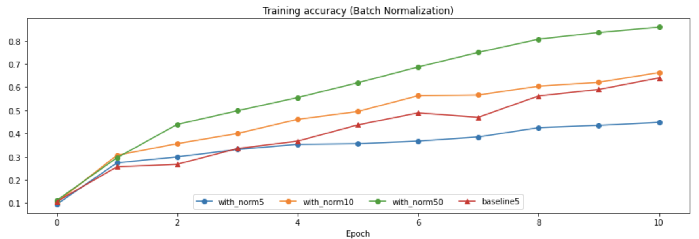
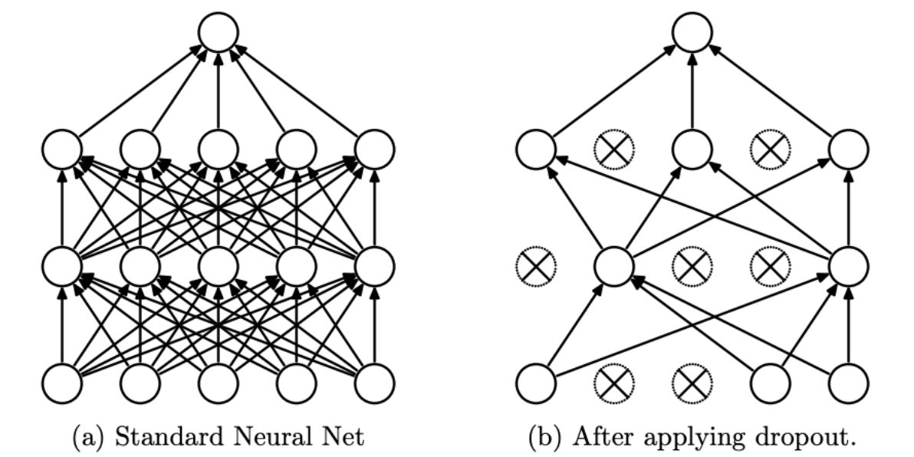
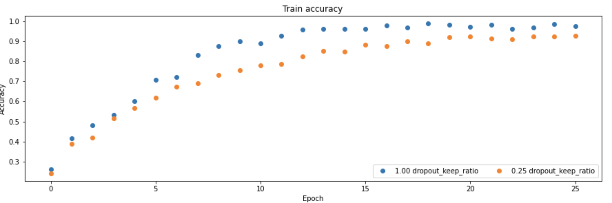
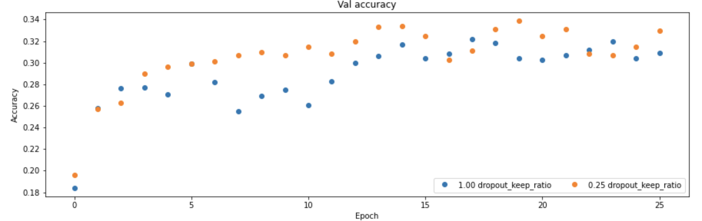

# Stanford-CS231N-Assignment札记3：Normalization和DropOut


> Stanford2021年春季课程CS231N:Convolutional Neural Networks for Visual Recognition的一些作业笔记，这门课的作业围绕视觉相关的任务，需要从底层手动实现一大批经典机器学习算法和神经网络模型，本文是作业的第三部分，包含了Normalization和Dropout两种训练trick的实现。

## 标准化Normalization

Normalization是神经网络训练中的另一种trick，中文译名是标准化或者归一化，我比较喜欢前一种翻译。最早应该是在[这篇论文](https://arxiv.org/pdf/1502.03167.pdf)中提出的，是一种提高神经网络训练效率和预测准确度的trick，有好几种不同的形式，比如批标准化(batch normalization)，层标准化(layer normalization)等等


## 批标准化Batch Normalization

### 概念

- 批标准化在神经网络中通过一个批标准化层来实现，这个层一般都放在激活函数层之前，每次训练的时候选择一个小批量的数据集进行训练，然后将这样一个小批量的数据进行标准化处理，具体的处理包括：

- 先求出这个小批量数据集$\mathcal B$训练后的均值和方差：

$$
\mu_{\mathcal B}=\frac 1m\sum_{i=1}^m x_i
$$

$$
\sigma^2_{\mathcal B}=\frac 1m\sum_{i=1}^m(x_i-\mu_{\mathcal B})^2
$$

- 然后对每个x进行标准化：

$$
\hat x_i =\frac{x_i-\mu_{\mathcal B}}{\sqrt{\sigma^2+\epsilon}}
$$

- 然后再进行scale和shift，具体来说就是再对标准化后的$x$进行一个线性变换，得到结果$y$并输入到激活函数层

$$
y_i=\gamma \hat x+\beta=\gamma\frac{x_i-\mu_{\mathcal B}}{\sqrt{\sigma^2+\epsilon}} +\beta
$$

### 实际训练中的动量优化

- 批标准化的训练规模相对于数据样本总体而言是比较小的，因此在训练过程中会有很多批次，而这个时候直接使用一个批的统计信息(均值和方差)来标准化一批数据相对于总体而言可能会引入较大的bias，因此真正的批标准化会使用`running_mean`和`running_var`来记录训练过程中所有出现过的批数据的统计信息，同时使用一个动量`momentum`来规定均值和方差更新时候的更新率，具体的更新公式如下：

$$
\mu_{running}=m\times \mu_{running}+(1-m)\times \mu_{batch}
$$

$$
\sigma^2_{running}=m\times \sigma^2_{running}+(1-m)\times \sigma^2_{batch}
$$

- 但是在测试模式的时候不用测试数据来更新`running_mean`和`running_var`，而是直接使用`running_mean`和`running_var`作为标准化时候所用的参数

### 前向传播的代码实现

```python
def batchnorm_forward(x, gamma, beta, bn_param):
    mode = bn_param["mode"]
    eps = bn_param.get("eps", 1e-5)
    momentum = bn_param.get("momentum", 0.9)
    N, D = x.shape
    running_mean = bn_param.get("running_mean", np.zeros(D, dtype=x.dtype))
    running_var = bn_param.get("running_var", np.zeros(D, dtype=x.dtype))
    out, cache = None, None
    if mode == "train":
        sample_mean = np.mean(x, axis=0)
        sample_var = np.var(x, axis=0)
        x_hat = (x - sample_mean) / np.sqrt(sample_var + eps)
        out = gamma * x_hat + beta
        cache = (x, gamma, beta, x_hat, sample_mean, sample_var, eps)
        # 更新running mean和variance
        running_mean = momentum * running_mean + (1 - momentum) * sample_mean
        running_var = momentum * running_var + (1 - momentum) * sample_var
    elif mode == "test":
        hat_x = (x - running_mean) / np.sqrt(running_var + eps)
        out = gamma * hat_x + beta
    else:
        raise ValueError('Invalid forward batch norm mode "%s"' % mode)

    # Store the updated running means back into bn_param
    bn_param["running_mean"] = running_mean
    bn_param["running_var"] = running_var

    return out, cache

```

### 反向传播的推导

- 这一部分实际上是批标准化过程中最麻烦的一部分，~~因为我求导经常出问题~~，首先我们知道最终输出结果是关于样本、均值，方差三者的函数，即：

$$
y_i=\gamma f(x_i,\mu,\sigma^2)+\beta
$$

- 我们如果假设反向传递到这一层的梯度是`dout`，那么我们就需要求出$y_i$相对于$\gamma,\beta, x_i$三者的导数并用于梯度的更新，而相对于$\gamma,\beta$的导数是比较容易求的，主要的问题在于求出关于$x_i$的导数，我们不妨假设输出层处的损失函数是L，那么我们有：

$$
\frac{\partial L}{\partial \gamma}=\sum_{i=1}^m \left(\frac{\partial L}{\partial y_i}\times \hat x_i\right )=\sum_{i=1}^m \text{dout}_i \times x_i
$$

$$
\frac{\partial L}{\partial \beta}=\sum_{i=1}^m \left(\frac{\partial L}{\partial y_i}\right )=\sum_{i=1}^m \text{dout}_i
$$

- 下面我们重点来推导$y_i$关于$x_i$的导数，首先根据微积分中的基本知识，我们知道：

$$
\frac{\partial L}{\partial x_i}=\frac{\partial L}{\partial y_i}\times \frac{\partial y_i}{\partial x_i}=\text{dout}_i\times\gamma\times \frac{\partial \hat x_i}{\partial x_i}
$$

$$
\frac{\partial \hat x_i}{\partial x_i}=\frac{\partial \hat x_i}{\partial \mu_i}\times \frac{\partial \mu_i}{\partial x_i}+\frac{\partial \hat x_i}{\partial \sigma^2_i}\times \frac{\partial \sigma^2_i}{\partial x_i}+\frac{\partial \hat x_i}{\partial x_i}
$$

- 下面我们按部就班一个个来求导即可：

$$
\frac{\partial\mu }{\partial x_i}=\frac 1m
$$

$$
\frac{\partial \sigma^2}{\partial x_i}=\frac 2m(x_i-\mu)
$$

$$
\frac{\partial \hat x_i}{\partial x_i}=\frac {1}{\sqrt{\sigma^2+\epsilon}}
$$

$$
\frac{\partial \hat x_i}{\partial \sigma^2}=-\frac 12(x_i-\mu)(\sigma^2+\epsilon)^{-\frac 32}
$$

$$
\frac{\partial \hat x_i}{\partial \mu}=-\frac {1}{\sqrt{\sigma^2+\epsilon}}+\frac{\partial \hat x_i}{\partial \sigma^2}\times -\frac 2m(x_i-\mu)
$$

- 最终的梯度结果将上面的偏导数分别求出然后按照规则组合起来就可以

### 反向传播的代码实现

- 这里我们使用函数`batchnorm_backward_alt`实现了批标准化的反向传播

```python
def batchnorm_backward_alt(dout, cache):
    dx, dgamma, dbeta = None, None, None
    x, gamma, beta, x_hat, mu, var, eps = cache
    M = x.shape[0]
    # 先求出比较简单的gamma和dbeta的梯度
    dgamma = np.sum(x_hat * dout, axis=0)
    dbeta = np.sum(dout, axis=0)
    # 求出dx，首先计算一个系数
    dx_hat = dout * gamma
    # 求出关于方差的导数
    d_var = np.sum(dx_hat * (x - mu) * -0.5 * ((var + eps) ** -1.5), axis=0)
    # 求出关于均值的导数
    d_mean = np.sum(dx_hat * -1 / np.sqrt(var + eps), axis=0) + d_var * np.mean(-2 * (x - mu), axis=0)
    # 最终的计算结果
    dx = 1 / np.sqrt(var + eps) * dx_hat + 2 * d_var / M * (x - mu) + 1 / M * d_mean
    return dx, dgamma, dbeta
```

- 要注意代码和公式的一一对应


### 批标准化的训练效果

我们尝试在全连接神经网络中加入BN层，并在相同的模型架构下比较和不包含BN层的全连接网络进行性能的比对，一个简单的实验得到的结果如下：


- 可以发现使用了批标准化(BN)之后，训练时候的loss下降更快了，训练集上的准确度也有比较大的提升，但是好像在验证集上的表现效果平平，没有带来太多的改变

### Batch Size的选取

批标准化中一个很重要的超参数就是Batch Size，即一小批数据的规模，如果规模太小可能会导致梯度的变化太大(因为数据之间的波动可能比较明显)，而如果太大，虽然样本数据分布的波动减小了，但是会增加计算量，作业给的notebook中使用了四组对比实验，分别采用了不同的Batch Size并和没有进行BN的模型进行了对比，结果如下：




- 可以发现选用大的Batch Size训练的效果确实会更好，而如果Batch Size太小，反而会导致BN效果不如不用BN的模型。


## 层标准化Layer Normalization

层标准化是另一种标准化的方式，其core idea是将每个样本的d维特征的值进行标准化，实际上就是换了一个维度的批标准化，代码实现也比较容易，基本和上面的代码完全一致，只不过把axis改成1表示换了一个维度，其他的内容基本一致，这里代码就不放出来了。

## DropOut机制

### DropOut层的概念

DropOut的原意为“退学”，是一种在神经网络的**训练中用的比较多的trick**，DropOut最早是在[这篇论文](http://www.cs.toronto.edu/~hinton/absps/JMLRdropout.pdf)中提出的一个概念，用来解决神经网络训练过程中的过拟合问题

DropOut的基本想法就是设定一个DropOut的概率$p$，当某一层的神经元被设定了这个概率$p$之后，就会出现以下两种情况：
- 训练的时候，对每个神经元而言，它有$p$的概率保持正常的工作状态，而有$1-p$的概率“休息”，也就是不参与到神经网络的前向传播和反向传播过程中
- 测试的时候所有的神经元都参与到结果的预测中去



### DropOut为什么有效

- 论文中解释到，这是因为神经网络的训练本质上是将神经元训练出一种“协同作战”的能力，即神经元共同参与到最终的决策中，因此神经元之间的相互依赖性是比较强的，如果这个时候出现了一些表现不好的神经元，就会把所有的神经元**带偏**，并且随着放大效应逐渐累积。
- 而DropOut使得每次训练的过程中只有一部分神经元参与到训练中，并且每次参与的神经元的组合还很有可能不一样(因为设定了概率p)，这使得神经网络中的神经元形成了“小团队协作”的能力，**增强了神经网络中单个神经元的预测能力**(因为训练的时候神经元个数减少意味着一个神经元需要负责学习更多的知识)，这样一来预测的准确度也就随之提高了
- 当然这样的说法并没有严格的数学证明，可是原论文在经过多种实验之后发现效果确实有所提升。

### DropOut的代码实现

- 前向传播用一个函数`dropout_forward`来表示

```python
def dropout_forward(x, dropout_param):
    p, mode = dropout_param["p"], dropout_param["mode"]
    if "seed" in dropout_param:
        np.random.seed(dropout_param["seed"])
    mask = None
    out = None
    # 按概率p生成一个0-1分布，并和原本的输入数据相乘
    # mask中某一位为0表示对应神经元不参与到下一层的传播中
    if mode == "train":
        mask = np.random.rand(*x.shape) < p
        out = x * mask.astype(x.dtype)
    # 测试模式下不用管DropOut
    elif mode == "test":
        out = x
    cache = (dropout_param, mask)
    out = out.astype(x.dtype, copy=False)
    return out, cache
```

- 反向传播的过程的代码如下：

```python
def dropout_backward(dout, cache):
    dropout_param, mask = cache
    mode = dropout_param["mode"]
    dx = None
    # 反向传播的时候更简单，只要把mask和dout相乘即可，也就是没有参与的神经元不更新其参数
    if mode == "train":
        dx = dout * mask
    elif mode == "test":
        dx = dout
    return dx
```

我们可以将DropOut层和全连接层组合到一起使用，下面我们给出一个两层神经网络在有Dropout机制和没有两种状况下训练的模型的效果对比，如下图所示(Dropout=1表示所有神经元都参与到训练中)：





可以很明显的看到Dropout带来了训练时候的准确度下降，但是也带来了验证阶段的准确度的提升，说明Dropout机制确实可以起到正则化，防止过拟合的作用。