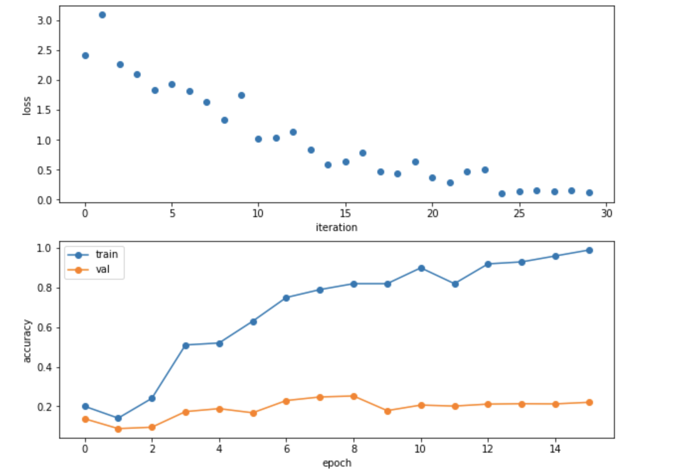

# Stanford-CS231N-Assignment札记4：卷积神经网络CNN


> Stanford2021年春季课程CS231N:Convolutional Neural Networks for Visual Recognition的一些作业笔记，这门课的作业围绕视觉相关的任务，需要从底层手动实现一大批经典机器学习算法和神经网络模型，本文是作业的第四部分，包含了卷积神经网络以及其关键组件的实现(卷积层，池化层)

## 卷基层Convolution Layer

### 什么是卷积层？

#### 卷积的计算公式

- 卷积层是CNN中最核心的一个idea，通过卷积核(实质上就是一种滤波器)对输入的特征进行卷积运算，如果输入的数据是语音，那么数据是一维的，就可以进行一维卷积，如果输入的是矩阵，那么就可以进行二维的卷积，而CNN一般是用来处理图像的，图像是一种三维的数据(因为图像有颜色通道，每个通道上是一个二维矩阵，常见的RGB图像就是3颜色通道)，就需要用三维的卷积核对输入进行卷积操作。
- 假设一个卷积核的大小是$2M\times 2N$，那么 卷积的计算公式如下：

$$
s\left[i,j\right]=(x*w)[i,j]=\sum_{m=-M}^M\sum_{n=-N}^Nx[i+m,j+n]w[m,n]
$$


- 比如上面这张图中，一个大小为32x32x3的图像使用一个5x5x3的卷积核进行卷积之后得到的就是28x28x3的新图像，我们称卷积之后得到的新的图像称为feature map

#### 步长Stride

- 卷积核的移动存在一个步长(stride)，卷积核移动的步长小于卷积核的边长时，变会出现卷积核与原始输入矩阵作用范围在区域上的**重叠**，卷积核移动的步长与卷积核的边长相一致时，不会出现重叠现象
- 因此卷积操作需要设定一个步长，步长也会决定得到的新的feature map的大小

#### 接受域Receptive Field

- 卷积核可以覆盖到的局部特征区域，比如一个3x3的卷积核可以包含一个3x3区域内的信息，那么其接收域就是3x3，随着层数的加深，接受域也在变大。大的步长也使得接受域的增大速度变快

#### Padding操作

- 我们发现按照卷积的运算方式，处于图像的边缘处的像素点可能没有对应位置的像素点来计算其卷积(也就是说用上面的公式进行计算的时候，下标溢出了)，padding操作可以解决这一问题

#### 卷积层带来的突破

《深度学习（花书）》中提出卷积这一操作的引入带来的突破有：
- 稀疏交互Sparse interactions
  - 传统的神经网络使用矩阵乘法来建立输入输出的连接关系，参数矩阵中的每一个参数都代表了输入和输出的交互关系，而卷积层的运算因为卷积核的大小一般是远小于图像的大小的，因此只需要较少的计算量就可以提取关键的图像信息(比如图像的边缘)
  - 传统情况下，如果有m维度的输入和n维度的输出，那么参数矩阵就需要$m\times n$的规模，这种时候其实就是一种输入到输出的全连接，**通过卷积运算，减少了从输入到输出的连接数量**
- 参数共享Parameter Sharing
  - 参数共享是说可以在一个模型的多个函数中使用一样的参数，传统的神经网络中，当计算了一层的输入的时候，权重矩阵的每一个元素只能使用一次，也就是说网络中有绑定的权重
  - 在CNN中，核的每个元素都作用在输入的每一个位置上，卷积运算的参数共享保证了只需要学习一个参数集合而不是对于每一个位置都需要学习一个单独的参数集合。
- 等变表示Equivariant Representation
  - 如果一个函数满足输入改变，输出也以同样的方式改变，那么就可以称这个函数是等变的，如果对于函数f和g有$f(g(x))=g(f(x))$那么就称f和g具有等变性。
  - 对于卷积而言，参数共享的特殊形式是的神经网络层具有对平移操作等变的性质，这里可以令g为平移函数，那么g就可以表示图像函数的变换函数。
  - 简而言之这一性质表明，对于图像中一些需要提取的特征，**即使图像发生了平移，这个特征依然存在只是发生了对应的平移而已，仍然可以用一样的方式提取出来**。在处理时间序列数据的时候，这个性质意味着卷积可以得到一个由输入中出现不同特征的时刻所组成的时间轴。

### 卷积层的代码实现

下面使用一个函数`conv_forward_naive`来实现一种非常naive的卷积层计算方法，事实上就是用多重循环将卷积的结果一个个算出来。注意这里的卷积运算有个bias，上面的公式没有提到

```python
def conv_forward_naive(x, w, b, conv_param):
    out = None
    stride = conv_param["stride"]
    pad = conv_param["pad"]
    N, C, H, W = x.shape
    F, C, HH, WW = w.shape
    new_H, new_W = int(1 + (H + 2 * pad - HH) / stride), int(1 + (W + 2 * pad - WW) / stride)
    out = np.zeros((N, F, new_H, new_W))
    # 对x进行zero-pad操作，得到一个扩充后的矩阵，这里只对x的第三四个维度(也就是像素值所在的维度)进行扩充
    x_pad = np.pad(x, ((0, 0), (0, 0), (pad, pad), (pad, pad)), 'constant', constant_values=(0, 0))
    for n in range(N):
        new_x = x_pad[n]
        for f in range(F):
            # 得到卷积核
            kernel = w[f]
            for i in range(new_H):
                for j in range(new_W):
                    # 取出对应的卷积区域，并进行计算
                    conv_zone = new_x[:, i * stride: i * stride + HH, j * stride: j * stride + WW]
                    conv_res = np.sum(conv_zone * kernel) + b[f]
                    out[n, f, i, j] = conv_res
    cache = (x, w, b, conv_param)
    return out, cache

```

当然这种实现方式是非常naive的，只能用来测试自己是否理解了卷积操作，真的用来构建神经网络的话计算效率会非常低，CS231N的assignment2中给出了cpython加速的卷积操作的向量化实现，可以较大地提高计算的效率。

### 卷积层的反向传播

卷积的反向传播比较简单，我们假设卷积核的大小是$2M\times 2N$，那么对于卷积后得到的feature map的一个像素点$s_{ij}$，我们根据上面的卷积公式可以得到：
$$
\frac{\partial s_{ij}}{\partial x_{i+m,j+n}}=w_{mn}，m\in [-M,M],n\in [-N,N]
$$

$$
\frac{\partial s_{ij}}{\partial w_{mn}}=x_{i+m,j+n},，m\in [-M,M],n\in [-N,N]
$$

$$
\frac{\partial s_{ij}}{\partial b}=1^{2M\times 2N}
$$

因此反向传播求dx的时候只要把feature map的每个像素点进行遍历，把权重加到原位置的点上就可以，并且还要乘上传递到这一层的梯度dout，具体的代码实现如下：

```python
def conv_backward_naive(dout, cache):
    dx, dw, db = None, None, Nonex, w, b, conv_param = cache
    stride = conv_param.get('stride', 1)
    pad = conv_param.get('pad', 0)
    # 定义好梯度的大小
    dx = np.zeros(x.shape, dtype=np.float64)
    dw = np.zeros(w.shape, dtype=np.float64)
    db = np.zeros(b.shape, dtype=np.float64)
    N, C, H, W = x.shape
    F, C_prime, HH, WW = w.shape
    H_prime = int(1 + (H + 2 * pad - HH) / stride)
    W_prime = int(1 + (W + 2 * pad - WW) / stride)
    # 进行padding操作
    dx_pad = np.pad(dx, ((0, 0), (0, 0), (pad, pad), (pad, pad)), 'constant', constant_values=(0, 0))
    x_pad = np.pad(x, ((0, 0), (0, 0), (pad, pad), (pad, pad)), 'constant', constant_values=(0, 0))

    for i in range(N):
        x_i = x_pad[i]
        for j in range(F):
            w_j = w[j]
            for h_now in range(H_prime):
                for w_now in range(W_prime):
                    # 在原来的对应像素位置上，按照权重加上梯度
                    db[j] += dout[i, j, h_now, w_now]
                    dx_pad[i, :, h_now * stride:h_now * stride + HH, w_now * stride:w_now * stride + WW] += dout[
                                                                                                                i, j, h_now, w_now] * w_j
                    dw[j] += dout[i, j, h_now, w_now] * x_i[:, h_now * stride:h_now * stride + HH,
                                                        w_now * stride:w_now * stride + WW]

    dx = dx_pad[:, :, pad:-pad, pad:-pad]
    return dx, dw, db
```

### 卷积的实际效果

作业中为了展示卷积的效果，使用了两张猫狗图片进行卷积操作，我们得到的结果如下：


- 从这个结果中可以看出，卷积操作对图片中一些边缘和轮廓的特征进行了增强，而淡化了其他的一些特征，这些边缘和轮廓的特征，正是我们需要提取的图片特征


## 池化层Pooling Layer

### 什么是池化层

- 当我们发现了一个特征之后，这个特征相对于其他特征的位置相比于这个特征的值而言更为重要，很明显的一个例子就是计算机视觉中的目标检测任务，我们要检测的目标所处周围环境的特点更能帮助我们检测出真的目标，这就是池化层的idea的来源，池化层是CNN架构中提出的另一种特殊层，起到了**降采样**的作用。
- 池化就是通过一种非线性的变换，对特征进行进一步的**抽象和降维**，常见的有最大池化，平均池化等等，就是按照池化窗口的大小将矩阵分成若干个区域，在每个区域中进行池化操作(求最大，均值等等)，生成一个维度更小的feature map，同时池化层也可以起到防止过拟合的作用。
- 池化层同样也有长宽和步长等参数

### 池化层的前向传播

- 池化层的前向传播也是通过一系列for循环进行对应的池化操作，这里我们以最大池化为例，实现了函数`max_pool_forward_naive` 

```python
def max_pool_forward_naive(x, pool_param):
    out = None
    N, C, H, W = x.shape
    h, w, stride = pool_param["pool_height"], pool_param["pool_width"], pool_param['stride']
    new_H, new_W = int(1 + (H - h) / stride), int(1 + (W - w) / stride)
    out = np.zeros((N, C, new_H, new_W))
    for n in range(N):
        for c in range(C):
            for i in range(new_H):
                for j in range(new_W):
                    # 按块取出最大值即可
                    max_pix = np.max(x[n, c, i * stride: i * stride + h, j * stride: j * stride + w])
                    out[n, c, i, j] = max_pix
    cache = (x, pool_param)
    return out, cache
```

### 池化层的反向传播

- 反向传播涉及到池化层的求导问题，这里我们使用的是最大池化，因此也就是需要对max函数进行求导，而在ReLU层我们已经知道max函数的导数是分段的，小于0的部分是0，大于0的部分是1，而在池化层中也是一样的道理，对于进行池化操作的每个区域，最大的那个位置的梯度就是池化层向后传递的梯度，而其他地方都是0，我们可以在cache中记录原本矩阵的信息，并在池化层的反向传播过程中使用。
- 当然如果一个区域内有多个点的都是最大值的时候，可以把梯度进行平均分，这一过程在`max_pool_backward_naive`中通过一个`mask`矩阵来实现：

```python
def max_pool_backward_naive(dout, cache):
    dx = None
    x, pool_param = cache
    h, w, stride = pool_param["pool_height"], pool_param["pool_width"], pool_param['stride']
    N, C, H, W = x.shape
    new_H, new_W = int(1 + (H - h) / stride), int(1 + (W - w) / stride)
    dx = np.zeros(x.shape)
    for n in range(N):
        for c in range(C):
            for i in range(new_H):
                for j in range(new_W):
                    pool = x[n, c, i * stride: i * stride + h, j * stride: j * stride + w]
                    mask = np.zeros(pool.shape)
                    mask[pool == np.max(pool)] = 1
                    mask /= np.sum(mask)
                    dx[n, c, i * stride: i * stride + h, j * stride: j * stride + w] = mask * dout[n, c, i, j]
		return dx
```

## 三层CNN

### 三层CNN的架构

写了这么久我们终于来到了手写CNN的环节，当然我们前面写的一些东西比较naive，不堪大用，只能用于理解和学习CNN中各个层的作用，因此CS231N的assignment2为我们提供了一些写好的层，将原来的一些层进行了组合，比如`affine_relu_forward`，`conv_relu_forward`和`conv_bn_relu_forward`，其实也只是在我们写好的layers上面封装了一层函数，将全连接层+ReLU，卷积层+ReLU组合成了完整的一个层

CNN通常来说是这样的架构：


而我们需要实现的三层CNN的架构就是：`conv - relu - 2x2 max pool - affine - relu - affine - softmax` 和上面的图基本一致。

### 代码实现

#### 初始化

- 我们定义了一个类`ThreeLayerConvNet`，并需要实现类的初始化和前向反向传播

- 初始化和前面的全连接神经网络基本一致，这里需要注意的就是，我们需要实现的三层神经网络架构中的参数主要有：
  - 卷积层的卷积核W1和偏差b1
  - 第一个全连接层的参数W2和b2
  - 第二个全连接层的参数W3和b3
- 以上这些参数都要按照正态分布的规则进行随机初始化，这一部分代码比较简单，就不放出来了。

#### 前向传播和反向传播

- 我们需要在loss函数中实现前向传播和反向传播，并求出所有参数的梯度和总的损失函数
- 前向传播的过程比较简单，就是用现成的api一层层计算下去：

```python
def loss(self, X, y=None):
        """
        Evaluate loss and gradient for the three-layer convolutional network.
        Input / output: Same API as TwoLayerNet in fc_net.py.
        """
        W1, b1 = self.params["W1"], self.params["b1"]
        W2, b2 = self.params["W2"], self.params["b2"]
        W3, b3 = self.params["W3"], self.params["b3"]

        # pass conv_param to the forward pass for the convolutional layer
        # Padding and stride chosen to preserve the input spatial size
        filter_size = W1.shape[2]
        conv_param = {"stride": 1, "pad": (filter_size - 1) // 2}

        # pass pool_param to the forward pass for the max-pooling layer
        pool_param = {"pool_height": 2, "pool_width": 2, "stride": 2}
        scores = None
        # 逐层实现反向传播
        out1, cache1 = conv_relu_pool_forward(X, W1, b1, conv_param, pool_param)
        out2, cache2 = affine_relu_forward(out1, W2, b2)
        scores, cache3 = affine_forward(out2, W3, b3)
        if y is None:
            return scores
```

- 然后反向传播就是用已经写好的单层反向传播组合起来，同时也可以算出loss函数，注意最后要加上正则项

```python
				 loss, grads = 0, {}
       
        loss, dout = softmax_loss(scores, y)
        dout3, grads['W3'], grads['b3'] = affine_backward(dout, cache3)
        dout2, grads['W2'], grads['b2'] = affine_relu_backward(dout3, cache2)
        dout1, grads['W1'], grads['b1'] = conv_relu_pool_backward(dout2, cache1)
        # 加上正则项
        loss += 0.5 * self.reg * (np.sum(W1 * W1) + np.sum(W2 * W2) + np.sum(W3 * W3))
        grads['W3'] += self.reg * W3
        grads['W2'] += self.reg * W2
        grads['W1'] += self.reg * W1
```

- 最后这个自己搭建的简单三层神经网络**在部分CIFAR数据集上**的表现如下图所示，可以看到在训练集上的表现非常不错，但是在测试集上的表现比较糟糕，原因也很简单，就是因为神经网络训练过程中过拟合了，如果考虑使用标准化层和DropOut可能表现效果会更好一点



而当我们在整个CIFAR数据集上进行训练的时候，最后得到的三层CNN在训练集和验证集上的精度分别是0.476和0.499

### 三层CNN的Pytorch实现

- 这部分作业的最后也要求我们用Pytorch实现一个架构和上面相同的CNN，而Pytorch框架有自动求梯度的功能，相比之下搭建神经网络就简单了很多。

```python
class ThreeLayerConvNet(nn.Module):
    def __init__(self, in_channel, channel_1, channel_2, num_classes):
        super().__init__()
        self.conv1 = nn.Conv2d(in_channel, channel_1, 5, padding=2, bias=True)
        nn.init.kaiming_normal_(self.conv1.weight)
        self.conv2 = nn.Conv2d(channel_1, channel_2, 3, padding=1, bias=True)
        nn.init.kaiming_normal_(self.conv2.weight)
        self.fc = nn.Linear(channel_2 * 32 * 32, num_classes)
        nn.init.kaiming_normal_(self.fc.weight)

    def forward(self, x):
        scores = Nonex = self.conv1(x)
        x = F.relu(x)
        x = self.conv2(x)
        x = F.relu(x)
        x = flatten(x) # 这是一个另外定义的将张量压缩成一维的函数
        scores = self.fc(x)
        return scores
```

- 我们用这样几行代码就做好了一个简单的三层神经网络，使用Pytorch的`nn.Module API`搭建神经网络的时候只需要继承`nn.Module`类，并在init函数中定义好所需要的层，在forward函数中定义神经网络的计算过程就可以了
- 模型的训练也很简单，只需要定义优化器和编写简单的每个epoch代码，Pytorch就会自动完成求梯度和反向传播的过程。