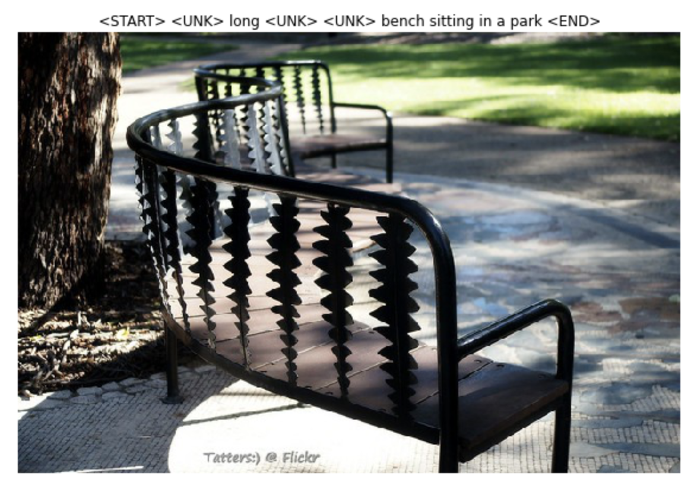
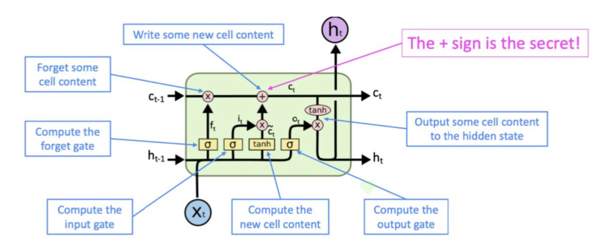

# Stanford-CS231N-Assignment5：RNN/LSTM与图片描述

> Stanford2021年春季课程CS231N:Convolutional Neural Networks for Visual Recognition的一些作业笔记，这门课的作业围绕视觉相关的任务，需要从底层手动实现一大批经典机器学习算法和神经网络模型，本文是作业的第五部分，包含了RNN/LSTM的实现和在Image Captioning任务上的应用

## Image Captioning

Image Captioning是一个经典的多模态任务，需要结合CV和NLP的知识共同完成，这类任务也可以叫图片描述，看图写话，即给定一张图像，我们要生成符合这张图像的描述性话语，这就涉及到一个问题，那就是如何在训练过程中，同时利用图像和文本的信息得到合适的模型，因此Image Captioning任务需要将CV和NLP的知识相结合。



本实验中使用的数据集是著名的COCO数据集，同时使用了预训练好的VGG模型进行降维之后的图像表示向量作为图像的特征，文本处理部分则需要我们自己实现RNN/LSTM

## RNN

### RNN的结构

- RNN指的是循环神经网络，是一种设计出来用于**处理序列化数据(比如自然语言，时序数据)的神经网络**，RNN可以保留一定的上下文信息并将序列前面的信息不断向后面传递。
- RNN的架构如下图所示，主要包含一个输入层，一个隐层和一个输出层，隐层单元的隐状态$h_t$也会不断向下一个隐层单元传递。


- RNN的隐状态更新公式可以表示为：

$$
h_t=\sigma(W_xx_{t}+W_hh_{t-1}+b)
$$

- 这里的**可学习参数**包括$W_x,W_h,b$，分别是两个权重矩阵和一个bias向量，而激活函数通常使用双曲正切tanh函数，而最终的输出结果的计算方式是：

$$
y_t=\mathrm{softmax}(W_sh_t)
$$

### RNN的前向传播及实现

- 从RNN的架构可以看出，我们输入RNN的数据是一个序列$X=(x_1,x_2,\dots,x_T)$，这个序列需要在RNN中按照顺序逐渐前向传播，最终得到一个隐状态的序列$H=(h_1,h_2,\dots,h_T)$，而每一个单元内的前向传播过程可以用函数`rnn_step_forward`来描述

```python
def rnn_step_forward(x, prev_h, Wx, Wh, b):
    next_h = np.tanh(np.matmul(prev_h, Wh) + np.matmul(x, Wx) + b)
    cache = (x, prev_h, Wx, Wh, b, next_h)
    return next_h, cache
```

- 而整个序列的前向传播需要使用一个循环来完成，因此**RNN的训练不能并行化**，这也是RNN的一个重大缺点。我们使用一个函数来描述整个序列在RNN中的前向传播过程：

```python
def rnn_forward(x, h0, Wx, Wh, b):
    h, cache = None, []
    N, T, D = x.shape
    N, H = h0.shape
    # 最终生成的一个隐状态
    h = np.zeros((N, T, H))
    next_h = h0
    for i in range(T):
        x_step = x[:, i, :].reshape(N, D)
        next_h, cache_step = rnn_step_forward(x_step, next_h, Wx, Wh, b)
        h[:, i, :] = next_h
        # cache用来保存每个单元中的有效信息，用于反向传播过程中的导数计算
        cache.append(cache_step)
    return h, cache
```

- RNN的前向传播总体来说比较简单。

### RNN的反向传播及实现

- RNN的反向传播和CNN等传统神经网络不同，是一种**“时间”上的反向传播**，也就是说在计算梯度并更新参数的时候，不仅要考虑从最上层的loss函数中传递下来的梯度，**也要考虑从后面一个隐层单元(从前向传播的时间来看要更迟，所以被称为时间反向传播)传递下来的梯度**
- 而对于各个参数，其梯度的计算方式如下(注意tanh函数导数的特殊性)：

$$
s_t=W_xx_{t}+W_hh_{t-1}+b,\quad h_t=\tanh(s_t)
$$

$$
\frac{\partial h_t}{\partial s_t}=1-\tanh^2(s_t)
$$

$$
\frac{\partial s_t}{\partial W_x}=x_t^T
$$

$$
\frac{\partial s_t}{\partial W_h}=h_{t-1}^T
$$

$$
\frac{\partial s_t}{\partial x_t}=W_x^T
$$

$$
\frac{\partial s_t}{\partial h_{t-1}}=W_h^T
$$

- 根据这些公式和梯度的链式法则，我们可以写出一个隐层单元中的反向传播过程，用一个函数`rnn_step_backward`来表示

```python
def rnn_step_backward(dnext_h, cache):
    dx, dprev_h, dWx, dWh, db = None, None, None, None, None
    x, prev_h, Wx, Wh, b, next_h = cache
    ds = (1 - next_h ** 2) * dnext_h  # ds的大小是N*H
    db = np.sum(ds, axis=0)
    dWh = np.matmul(prev_h.T, ds)
    dWx = np.matmul(x.T, ds)
    dprev_h = np.matmul(ds, Wh.T)
    dx = np.matmul(ds, Wx.T)
    return dx, dprev_h, dWx, dWh, db
```

- 而RNN整体的反向传播也需要一个序列来完成，同时考虑从输出层的loss函数传递下来的梯度和从后一个隐藏单元传递下来的梯度，并使用函数`rnn_step_backward`来完成单个隐状态的更新。

```python
def rnn_backward(dh, cache):
   	N, T, H = dh.shape
    D = cache[0][0].shape[1]
    dx = np.zeros((N, T, D))
    dh0 = np.zeros((N, H))
    dWx = np.zeros((D, H))
    dWh = np.zeros((H, H))
    db = np.zeros((H, ))
    dh_prev = np.zeros((N, H))
    for i in range(T - 1, -1, -1):
        # 这一步特别重要，将两个方向传递过来的梯度融合
        dh_step = dh[:, i, :] + dh_prev
        dx_step, dh_prev, dwx, dwh, db_step = rnn_step_backward(dh_step, cache[i])
        dx[:, i, :] = dx_step
        dh0 = dh_prev
        dWx += dwx
        dWh += dwh
        db += db_step
    return dx, dh0, dWx, dWh, db
```

### RNN的缺点

- 从上面的代码实现中可以看出，RNN一个很大的缺点就是对于一个序列必须串行化训练，不能并行训练，造成训练的速度非常缓慢，同时RNN也存在梯度爆炸和梯度消失的问题，对于**长距离的依赖关系也缺乏学习的能力**，这些问题的具体分析可以在CS224N的相关笔记中看到
- 拥有门控单元的RNN可以在一定程度上解决这个问题，比如LSTM


## LSTM

### LSTM的基本架构

- LSTM是`Long Short Term Memory`(长短期记忆模型)，是一种加入了门控单元的RNN，具有更长的“记忆能力”，可以捕捉到序列化输入中的**长距离依赖关系**(比如一个文本中距离很远的两个单词的某种特定关系)
- LSTM的组成单元是在RNN的组成单元的基础上加上了若干个控制单元(也叫做门)对整个单元进行控制，有输入门，输出门，遗忘门等等，同时又有一系列`memory cell`作为“**长期记忆单元**”，这些cell也要传递到下一个隐层中，用于保存当前输入的长期记忆，其基本组成单元的架构如下图所示：



### LSTM的计算过程

- 三个门控单元的结果计算

$$
i,f,o=\mathrm{sigmoid}(W_hh_{t-1}+W_xx_t)\quad \text{Three gates}
$$

- 生成新的记忆单元

$$
g=\tanh(W_hh_{t-1}+W_xx_t))
$$

- 按照门控单元的内容来控制输出结果，生成新的

$$
c_{t} =f \odot c_{t-1}+i \odot g
$$

- 生成最终的隐状态：

$$
h_{t} =o \odot \tanh \left(c_{t}\right)
$$

- 这里的三个**门控单元和记忆单元**分别起到如下作用：
  - 记忆单元：暂时生成一个当前输入内容的记忆
  - 输入门：评估**当前的序列输入$x_t$的重要程度**，将其加权反映到最终记忆单元中
  - 遗忘门：评估**上一个单元输入的记忆单元的重要程度**，将其加权反映到最终记忆单元中
  - 输出门：将最终的记忆单元和隐状态区分开，因为最终记忆单元中的很多序列信息是**没有必要暴露到隐藏状态**中的，输出门就是来评估**有多少信息可以从最终记忆单元传递到隐状态中**
- 整个计算过程可以用一张图来表示：


### LSTM的前向传播实现

我们发现跟RNN相比，LSTM还多了三个门控单元和一个记忆单元需要处理，并且这些组件的值都需要用输入的$x_t$和$h_{t-1}$用类似的方法计算，非常麻烦，因此CS231N的assignment3里面采取了这样的trick来解决计算太麻烦的问题：
- 将用来处理$x_t,h_{t-1}$的权重矩阵的列数扩大四倍，再将结果$A$按照列进行四等分，分别用sigmoid和tanh函数处理之后生成三个门$i，f，o$以及新的记忆单元$g$，然后按公式分别计算并合并
- 求梯度的时候分别求出$i，f，o$和$g$的梯度然后合并成$A$的梯度

因此LSTM单元的前向传播可以用下面这个函数`lstm_step_forward`来实现：

```python
def lstm_step_forward(x, prev_h, prev_c, Wx, Wh, b):
    next_h, next_c, cache = None, None, None
    N, H = prev_h.shape
    A = np.matmul(x, Wx) + np.matmul(prev_h, Wh) + b.reshape(1, b.shape[0])
    # 分割成四等份，每一份的size都是N * H
    ai, af, ao, ag = A[:, 0: H], A[:, H: 2 * H], A[:, 2 * H: 3 * H], A[:, 3 * H: 4 * H]
    i, f, o, g = sigmoid(ai), sigmoid(af), sigmoid(ao), np.tanh(ag)
    # 按公式一步步进行计算
    next_c = f * prev_c + i * g
    next_h = o * np.tanh(next_c)
    cache = (next_c, g, o, f, i, A, prev_c, prev_h, Wh, Wx, x)
    return next_h, next_c, cache

```

- 而LSTM整体的前向传播和普通的RNN没有什么区别，这里就不重复了。

### LSTM的反向传播的实现

LSTM的反向传播过程中，依然遵循RNN的反向传播的基本形式，即时间反向传播，在计算梯度的时候需要考虑后一个隐状态传递回来的梯度，并且需要对$i,o,f,g$分别求梯度然后拼成一个完整的A的梯度，再对A下属的几个参数矩阵进行求导进行反向传播，最终实现LSTM反向传播的代码如下(这里的公式推导和RNN没有本质区别，难点在于把四个梯度矩阵拼接成一个，其他地方的导数还是很好求的)：

```python
def lstm_step_backward(dnext_h, dnext_c, cache):
    next_c, g, o, f, i, A, prev_c, prev_h, Wh, Wx, x = cache
    dnext_c += dnext_h * (1 - np.tanh(next_c) ** 2) * o
    dprev_c = np.multiply(dnext_c, f)
    # 分别求出四部分的梯度然后进行合并
    df = dnext_c * prev_c * (1 - f) * f
    di = dnext_c * g * (1 - i) * i
    dg = dnext_c * i * (1 - g ** 2)
    do = dnext_h * np.tanh(next_c) * (1 - o) * o
    dA = np.hstack((di, df, do, dg))  # 得到一个 N * 4H的梯度矩阵
    dWx = np.matmul(x.T, dA)
    dx = np.matmul(dA, Wx.T)
    dWh = np.matmul(prev_h.T, dA)
    dprev_h = np.matmul(dA, Wh.T)
    db = np.sum(dA, axis=0)
    return dx, dprev_h, dprev_c, dWx, dWh, db
```

- LSTM的整个序列的反向传播和RNN也类似，这里就不放基本重复的代码了，至此我们完成了RNN和LSTM的基本单元的前向传播和反向传播的底层代码的实现。

## CaptioningRNN的实现

事实上我们遵循和前面MLP/CNN一样的范式，在`__init__`中定义所有的参数，并在`loss`中实现神经网络的前向传播和反向传播，具体的实现代码如下：

```python
class CaptioningRNN:
    """
    A CaptioningRNN produces captions from image features using a recurrent
    neural network.

    The RNN receives input vectors of size D, has a vocab size of V, works on
    sequences of length T, has an RNN hidden dimension of H, uses word vectors
    of dimension W, and operates on minibatches of size N.

    Note that we don't use any regularization for the CaptioningRNN.
    """

    def __init__(
        self,
        word_to_idx,
        input_dim=512,
        wordvec_dim=128,
        hidden_dim=128,
        cell_type="rnn",
        dtype=np.float32,
    ):
        if cell_type not in {"rnn", "lstm"}:
            raise ValueError('Invalid cell_type "%s"' % cell_type)

        self.cell_type = cell_type
        self.dtype = dtype
        self.word_to_idx = word_to_idx
        self.idx_to_word = {i: w for w, i in word_to_idx.items()}
        self.params = {}

        vocab_size = len(word_to_idx)

        self._null = word_to_idx["<NULL>"]
        self._start = word_to_idx.get("<START>", None)
        self._end = word_to_idx.get("<END>", None)

        # Initialize word vectors
        self.params["W_embed"] = np.random.randn(vocab_size, wordvec_dim)
        self.params["W_embed"] /= 100

        # Initialize CNN -> hidden state projection parameters
        self.params["W_proj"] = np.random.randn(input_dim, hidden_dim)
        self.params["W_proj"] /= np.sqrt(input_dim)
        self.params["b_proj"] = np.zeros(hidden_dim)

        # Initialize parameters for the RNN
        dim_mul = {"lstm": 4, "rnn": 1}[cell_type]
        self.params["Wx"] = np.random.randn(wordvec_dim, dim_mul * hidden_dim)
        self.params["Wx"] /= np.sqrt(wordvec_dim)
        self.params["Wh"] = np.random.randn(hidden_dim, dim_mul * hidden_dim)
        self.params["Wh"] /= np.sqrt(hidden_dim)
        self.params["b"] = np.zeros(dim_mul * hidden_dim)

        # Initialize output to vocab weights
        self.params["W_vocab"] = np.random.randn(hidden_dim, vocab_size)
        self.params["W_vocab"] /= np.sqrt(hidden_dim)
        self.params["b_vocab"] = np.zeros(vocab_size)

        # Cast parameters to correct dtype
        for k, v in self.params.items():
            self.params[k] = v.astype(self.dtype)

    def loss(self, features, captions):
        # Cut captions into two pieces: captions_in has everything but the last word
        # and will be input to the RNN; captions_out has everything but the first
        # word and this is what we will expect the RNN to generate. These are offset
        # by one relative to each other because the RNN should produce word (t+1)
        # after receiving word t. The first element of captions_in will be the START
        # token, and the first element of captions_out will be the first word.
        captions_in = captions[:, :-1]
        captions_out = captions[:, 1:]

        # You'll need this
        mask = captions_out != self._null

        # Weight and bias for the affine transform from image features to initial
        # hidden state
        W_proj, b_proj = self.params["W_proj"], self.params["b_proj"]

        # Word embedding matrix
        W_embed = self.params["W_embed"]

        # Input-to-hidden, hidden-to-hidden, and biases for the RNN
        Wx, Wh, b = self.params["Wx"], self.params["Wh"], self.params["b"]

        # Weight and bias for the hidden-to-vocab transformation.
        W_vocab, b_vocab = self.params["W_vocab"], self.params["b_vocab"]

        # 前向传播部分
        # 第一步，得到初始化的参数h
        initial_h = np.matmul(features, W_proj) + b_proj
        # 第二步，得到初始化的词嵌入向量
        embeddings, cache_embed = word_embedding_forward(captions_in, W_embed)
        # 第三步，使用RNN/LSTM
        cache_rnn, cache_lstm = None, None
        if self.cell_type == "rnn":
            h, cache_rnn = rnn_forward(embeddings, initial_h, Wx, Wh, b)
        else:
            h, cache_lstm = lstm_forward(embeddings, initial_h, Wx, Wh, b)
        # 第四步，计算scores
        scores, cache_scores = temporal_affine_forward(h, W_vocab, b_vocab)
        # 第五步，计算loss
        loss, dscores = temporal_softmax_loss(scores, captions_out, mask, verbose=False)
        # 反向传播部分
        dh, dW_v, db_v = temporal_affine_backward(dscores, cache_scores)
        if self.cell_type == "rnn":
            dx, dh0, dWx, dWh, db = rnn_backward(dh, cache_rnn)
        else:
            dx, dh0, dWx, dWh, db = lstm_backward(dh, cache_lstm)
        grads['W_embed'] = word_embedding_backward(dx, cache_embed)
        grads['W_proj'] = np.matmul(features.T, dh0)
        grads['b_proj'] = np.sum(dh0, axis=0)
        grads['Wx'] = dWx
        grads['Wh'] = dWh
        grads['b'] = db
        grads['W_vocab'] = dW_v
        grads['b_vocab'] = db_v
        return loss, grads
```

训练的结果如下图所示，模型可以进行一些简单的看图说话功能：


