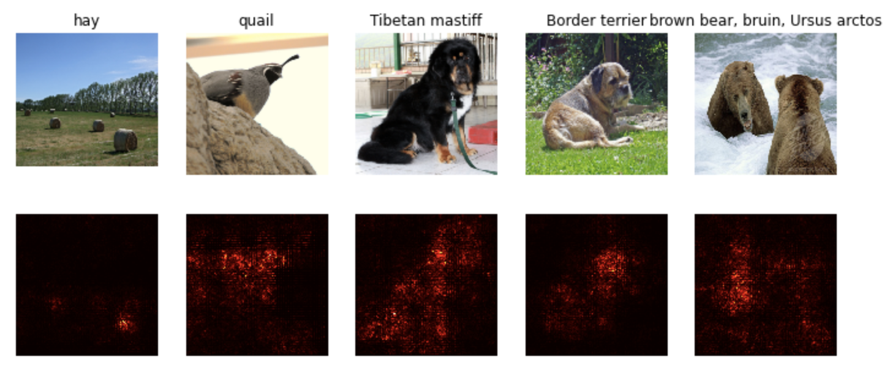

# Stanford-CS231N-Assignment札记7：模型可视化和GAN


> Stanford2021年春季课程CS231N:Convolutional Neural Networks for Visual Recognition的一些作业笔记，这门课的作业围绕视觉相关的任务，需要从底层手动实现一大批经典机器学习算法和神经网络模型，本文是作业的第七部分，包含了GAN的实现和手写数字生成等具体的任务。

## 神经网络模型的可视化

其实在做GAN之前还有一个任务是做神经网络的可视化，这里的可视化不是说把模型的架构可视化成图表，而是对模型中的图像梯度进行可视化的呈现。

对于一个神经网络模型，我们往往要定义一个loss函数来衡量我们对模型现在训练得到的结果和真实情况之间的不匹配程度(也可以叫我们对模型的unhappiness)，然后我们通过反向传播的方法对各个参数的梯度进行更新，用这样的方法使得模型的经验损失达到最小。而在这个作业中，我们将使用一个已经在imagenet上预训练好的CNN模型，然后计算其反向传播时候的梯度，并对dX进行可视化，得到的结果如下：



- 可以发现求出的梯度比较大的地方基本都是图像中的关键物体对应的区域

其实我也不知道这部分作业究竟要干嘛，就简单跳过了，我们重点来关注下一节GAN


## 生成对抗网络GAN

### GAN的基本知识

生成对抗网络GAN(Genrative Adversarial Network，GAN)是2014年提出的一个在深度学习史上具有划时代意义的方法，使用生成对抗网络成为了训练生成模型的一种主流方法。

我们之前训练的模型大多数是用来进行分类任务的，也就是要判断一个图像是不是属于某个类别，这种模型被称为是判别器(**discriminator**)，而GAN提出，我们需要用真的数据和假的数据作为输入，来训练一个判别器，其中真数据是出现在训练集中的数据，而假数据是没有出现在训练集中，通过人工手段生成的，生成假数据的网络模型就被称为生成器(**generator**)，生成器接受一个随机噪声作为输入，然后通过神经网络将其转化成一个假数据，然后用这些假数据作为输入来训练判别器。

当生成器生成的图片足以以假乱真的时候，我们就可以同时获得一个高质量的数据判别器和数据生成器。在CV任务中，我们就用生成器来生成图片，而用判别器作为图像分类器。

我们将生成器记为G，判别器记为D，那么整个GAN模型的目标函数就可以定义成：
$$
\underset{G}{\operatorname{minimize}} \underset{D}{\operatorname{maximize}} \mathbb{E}_{x \sim p_{\text {data }}}[\log D(x)]+\mathbb{E}_{z \sim p(z)}[\log (1-D(G(z)))]
$$

- 这个损失函数的意思就是，判别器D喜欢自己对数据的分类能力能够尽可能强，而生成器希望自己从随机噪声$z\sim p(z)$中生成的数据$G(z)$可以尽可能愚弄判别器D，让判别器无法判别。
- 因为$G(z)$是一个假的图片，所以被模型D判断成真图片才是分类错误，所以**希望被D判断成0(假图片，即判断正确)的概率应该尽可能小**

而在这个实验中，我们将优化目标分成了两个部分：

- 首先是对生成器G进行更新，让图片被**被误判的概率最大化**(前面说的是被正确判断的概率最小化)
- 然后对判别器D进行更新，让其正确判断数据的能力最大化

分成两个部分也就是说G和D分别有一个损失函数

### GAN的实现

下面我们具体来实现一个GAN模型，并使用这个模型来实现手写数字的生成，使用的数据集是经典的MNIST

#### 随机噪声的生成

首先我们需要实现一个生成随机噪声的方法，这个其实很简单，只需要通过`torch.rand`就可以了，但是这个api生成的是$(0, 1)$之间的分布，我们可以用一个线性变换将其转化到区间$(-1,1)$上

```python
def sample_noise(batch_size, dim, seed=None):
    if seed is not None:
        torch.manual_seed(seed)
    # rand生成的是0-1的随机数
    result = 2 * torch.rand((batch_size, dim)) - 1
    return result
```


#### 生成器和判别器的实现

生成器G和判别器D实际上就是两个神经网络，为了简化，我们这里使用的就是两个全连接神经网络，其定义分别如下：

```python
def generator(noise_dim=NOISE_DIM, seed=None):
    """
    Build and return a PyTorch model implementing the architecture above.
    """

    if seed is not None:
        torch.manual_seed(seed)
    model = nn.Sequential(
        nn.Linear(noise_dim, 1024),
        nn.ReLU(),
        nn.Linear(1024, 1024),
        nn.ReLU(),
        nn.Linear(1024, 784),
        nn.Tanh()
    )
    return model
def discriminator(seed=None):
    """
    Build and return a PyTorch model implementing the architecture above.
    """
    if seed is not None:
        torch.manual_seed(seed)
    model = nn.Sequential(
        Flatten(),
        nn.Linear(784, 256),
        nn.LeakyReLU(negative_slope=0.01),
        nn.Linear(256, 256),
        nn.LeakyReLU(negative_slope=0.01),
        nn.Linear(256, 1)
    )
    return model
```

#### GAN的损失函数

到这里为止GAN其实也没什么特别的，我觉得GAN的特色在于它的两个损失函数，两个神经网络G和D损失函数的定义分别是
$$
\ell_G  =  -\mathbb{E}_{z \sim p(z)}\left[\log D(G(z))\right]
$$

$$
\ell_D = -\mathbb{E}_{x \sim p_\text{data}}\left[\log D(x)\right] - \mathbb{E}_{z \sim p(z)}\left[\log \left(1-D(G(z))\right)\right]
$$

这几个表达式里的E表示的就是一个小批次数据上的平均值，而每条数据的对数概率，实际上就等价于其交叉熵，我们假设判别器预测的结果是s，而这条数据正确的标签是y，那么其交叉熵就可以定义成：
$$
bce(s, y) = -y * \log(s) - (1 - y) * \log(1 - s)
$$
我们需要手动来实现这些loss函数：

```python
def bce_loss(input, target):
    neg_abs = - input.abs()
    loss = input.clamp(min=0) - input * target + (1 + neg_abs.exp()).log()
    return loss.mean()


def discriminator_loss(logits_real, logits_fake):
    """
    Computes the discriminator loss described above.
    Inputs:
    - logits_real: PyTorch Tensor of shape (N,) giving scores for the real data.
    - logits_fake: PyTorch Tensor of shape (N,) giving scores for the fake data.
    Returns:
    - loss: PyTorch Tensor containing (scalar) the loss for the discriminator.
    """
    N = logits_real.shape[0]
    real_labels = torch.ones(N).type(dtype)
    fake_labels = 1 - real_labels
    loss = bce_loss(logits_real, real_labels) + bce_loss(logits_fake, fake_labels)
    return loss


def generator_loss(logits_fake):
    N = logits_fake.shape[0]
    fake_labels = torch.ones(N).type(dtype)
    loss = bce_loss(logits_fake, fake_labels)
    return loss
```

这里其实计算loss的时候就已经把输入分成正确和对的了，因此我们可以直接生成对应的真实标签`real_labels, fake_labels`然后用给定的`bce_loss()`方法来计算loss

#### 实验结果

写完这些东西之后就可以用作业提供的代码跑起一个GAN模型，最后的生成器生成的手写数字效果如下图：


### 更强的损失函数和模型架构

上面展示了一个简单的GAN(G和D都是层数比较浅的全连接神经网络，损失函数也是最简单的形态)的生成效果，可以看到生成的结果虽然初具人形，但是没有特别好，而在GAN一经提出之后，无数相关的论文就如同雨后春笋般涌现出来，他们提出了很多更强的损失函数和更复杂的模型架构(用深层的CNN)，比如：

#### 最小平方GAN

最小平方GAN提出一种基于最小平方损失的GAN模型，据说比普通的GAN更加稳定，效果更好，它的损失函数定义是：
$$
\ell_G  =  \frac{1}{2}\mathbb{E}_{z \sim p(z)}\left[\left(D(G(z))-1\right)^2\right]
$$

$$
\ell_D = \frac{1}{2}\mathbb{E}_{x \sim p_\text{data}}\left[\left(D(x)-1\right)^2\right] + \frac{1}{2}\mathbb{E}_{z \sim p(z)}\left[ \left(D(G(z))\right)^2\right]
$$

在进行相同的训练之后，这种GAN生成的手写数字如下图所示：


可以依稀感觉到比原生的GAN更加清晰一点。

#### DCGAN和InfoGAN

DCGAN和InfoGAN是使用了CNN作为G和D的GAN模型，它们的模型架构比较复杂，比如DCGAN的判别器是一个深度CNN，具体的架构是：

* Conv2D: 32 Filters, 5x5, Stride 1
* Leaky ReLU(alpha=0.01)
* Max Pool 2x2, Stride 2
* Conv2D: 64 Filters, 5x5, Stride 1
* Leaky ReLU(alpha=0.01)
* Max Pool 2x2, Stride 2
* Flatten
* Fully Connected with output size 4 x 4 x 64
* Leaky ReLU(alpha=0.01)
* Fully Connected with output size 1

而InfoGAN的生成器是一个深度CNN，具体的架构是：

- Fully connected with output size 1024
- `ReLU`
- BatchNorm
- Fully connected with output size 7 x 7 x 128
- ReLU
- BatchNorm
- Reshape into Image Tensor of shape 7, 7, 128
- Conv2D^T (Transpose): 64 filters of 4x4, stride 2, 'same' padding (use `padding=1`)
- `ReLU`
- BatchNorm
- Conv2D^T (Transpose): 1 filter of 4x4, stride 2, 'same' padding (use `padding=1`)
- `TanH`
- Should have a 28x28x1 image, reshape back into 784 vector

作业中将DCGAN的判别器和InfoGAN的生成器组合成了一个新的GAN，训练之后最后得到的效果是：


可以发现随着模型复杂度变大，生成的手写数字效果也在变好，不过代价也很明显，就是训练的时间大幅度提高了。


