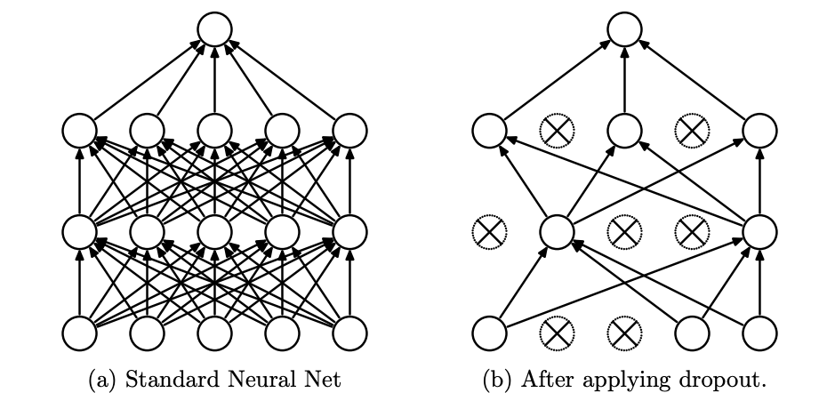

# 手写神经网络5：DropOut层

> 这个系列是我在完成斯坦福公开课CS231N的作业时候所做的一些记录，这门课程是公认的深度学习入门的神课，其作业也非常硬核，需要从底层实现各种神经网络模型，包括前馈神经网络、卷积神经网络和循环神经网络，LSTM等等。
>
> 作业不仅要求掌握numpy等python库的api用法，更要对神经网络的数学理论和公式推导有非常深的理解，实现起来难度比较大，因此我也将在这个系列的博客中记录自己推导和coding的过程
>
> 限于个人水平实在有限，我尽量减少参考网上代码的次数

## 1.DropOut层的概念

- DropOut的原意为“退学”，是一种在神经网络的**训练中用的比较多的trick**，DropOut最早是在[这篇论文](http://www.cs.toronto.edu/~hinton/absps/JMLRdropout.pdf)中提出的一个概念，用来解决神经网络训练过程中的过拟合问题
- DropOut的基本想法就是设定一个DropOut的概率$p$，当某一层的神经元被设定了这个概率$p$之后，就会出现以下两种情况：
  - 训练的时候，对每个神经元而言，它有$p$的概率保持正常的工作状态，而有$1-p$的概率“休息”，也就是不参与到神经网络的前向传播和反向传播过程中
  - 测试的时候所有的神经元都参与到结果的预测中去



## 2.DropOut为什么有效

- 论文中解释到，这是因为神经网络的训练本质上是将神经元训练出一种“协同作战”的能力，即神经元共同参与到最终的决策中，因此神经元之间的相互依赖性是比较强的，如果这个时候出现了一些表现不好的神经元，就会把所有的神经元**带偏**，并且随着放大效应逐渐累积。
- 而DropOut使得每次训练的过程中只有一部分神经元参与到训练中，并且每次参与的神经元的组合还很有可能不一样(因为设定了概率p)，这使得神经网络中的神经元形成了“小团队协作”的能力，**增强了神经网络中单个神经元的预测能力**(因为训练的时候神经元个数减少意味着一个神经元需要负责学习更多的知识)，这样一来预测的准确度也就随之提高了
- 当然这样的说法并没有严格的数学证明，可是原论文在经过多种实验之后发现效果确实有所提升。

## 3.DropOut的代码实现

- 前向传播用一个函数`dropout_forward`来表示

```python
def dropout_forward(x, dropout_param):
    """Forward pass for inverted dropout:
    - x: Input data, of any shape
    - dropout_param: A dictionary with the following keys:
      - p: Dropout parameter. We keep each neuron output with probability p.
      - mode: 'test' or 'train'. If the mode is train, then perform dropout;
        if the mode is test, then just return the input.
      - seed: Seed for the random number generator. Passing seed makes this
        function deterministic, which is needed for gradient checking but not
        in real networks.
    Outputs:
    - out: Array of the same shape as x.
    - cache: tuple (dropout_param, mask). In training mode, mask is the dropout
      mask that was used to multiply the input; in test mode, mask is None.
    """
    p, mode = dropout_param["p"], dropout_param["mode"]
    if "seed" in dropout_param:
        np.random.seed(dropout_param["seed"])
    mask = None
    out = None
    # 按概率p生成一个0-1分布，并和原本的输入数据相乘
    # mask中某一位为0表示对应神经元不参与到下一层的传播中
    if mode == "train":
        mask = np.random.rand(*x.shape) < p
        out = x * mask.astype(x.dtype)
    # 测试模式下不用管DropOut
    elif mode == "test":
        out = x
    cache = (dropout_param, mask)
    out = out.astype(x.dtype, copy=False)
    return out, cache
```

- 反向传播的过程的代码如下：

```python
def dropout_backward(dout, cache):
    """Backward pass for inverted dropout.
    Inputs:
    - dout: Upstream derivatives, of any shape
    - cache: (dropout_param, mask) from dropout_forward.
    """
    dropout_param, mask = cache
    mode = dropout_param["mode"]
    dx = None
    # 反向传播的时候更简单，只要把mask和dout相乘即可，也就是没有参与的神经元不更新其参数
    if mode == "train":
        dx = dout * mask
    elif mode == "test":
        dx = dout
    return dx
```

