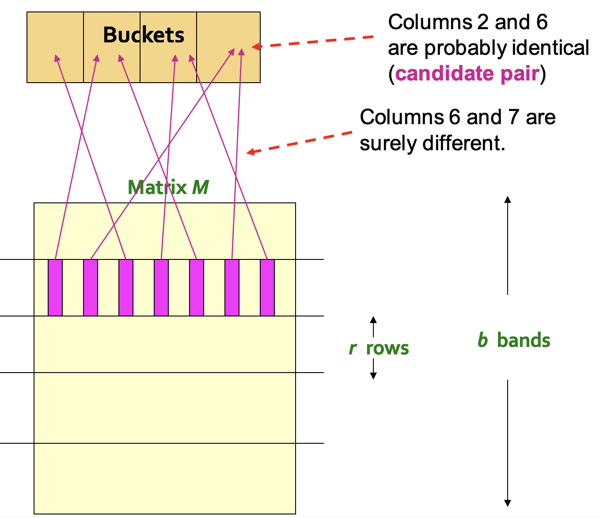

# 局部敏感哈希

## 局部敏感性哈希算法(LSH)

### 问题背景

​	  我们时常会碰到一些比较大量样本相似性，并选择出和输入的内容最相似的样本，淘宝提供的拍照识别商品功能，可以找到和拍摄照片最相似的商品推荐给用户，事实上这一类问题都可以归结为找到最相似的集合这一目标上，也就是在高维空间中找到相近的邻居，常见的例子有：

- 文本查重，找文档之间的相似度
- 图像的识别
- 推荐系统和搜索引擎

一般来说，在给定一些高维数据点$x_i$和距离度量函数$d(x_i,x_j)$的情况下找到和输入q比较接近的数据点满足$d(q,x_i)\le S$(即邻居)的时间复杂度是线性的，而找到这些样本中所有满足$d(x_i,x_j)\le S$的点对的时间复杂度是平方级别的，一旦数据量大起来，算法就会消耗大量时间，而这门课的重点内容就是“挖掘海量数据集”(课程名)，因此我们需要想办法将“找相似样本”的时间复杂度降低。

### 算法的描述

​	  局部敏感性哈希就是用来解决上面这个问题的，事实上这是一大类算法，这类算法的基本思想是将一系列item映射到一个个bucket中去，然后将需要判别的数据也进行映射，同一个bucket里的样本存在比较高的相似性，但是这样的方法也会产生false negative的情况，也就是说本来相似的item可能不会被分到一个bucket中。

我们也很容易发现局部敏感性哈希的关键就在于怎么定义一个有良好区分度的hash函数。

### 实例：相似文档检索

​	  面对海量的文档数据的时候，找到相似的文档是一件时间复杂度非常高的事情，这时候就可以用局部敏感性哈希，具体可以分成如下三个步骤：

- Shingling：将文档转化成一个向量表示，比如用某个单词是否出现为标准形成一个K维的布尔向量
- Min-Hashing：将文档的表示转化成一些简短的signatures，并且保留相似度相关的信息(实际上是一种降维)
- 局部敏感性哈希：使用得到的简短signatures进行局部敏感性哈希操作

#### Shingling

​	  这个步骤就是将文档转化成一个特征表示，一个`K-shingle`(也叫做K-gram)就是用k个文档中连续出现的token来表示一个文档，这里的token可以是字符也可以是单词，对于比较长的shingles可以将其进行压缩，一个文档可以用多个`K-shingle`来表示，一般来说内容相近的文档也会有多个相同的shingles

​	  我们假设每个文档$D_i$是用一系列`K-shingle`表示的，即$C_i=S(D_i)$，我们可以定义两个文档之间的相似度，常见的有Jaccard相似度：
$$
sim(D_1.D_2)=\frac{|C_1\cap C_2|}{|C_1\cup C_2|}
$$
而Jaccard距离可以定义成
$$
d(C_1,C_2)=1-sim(D_1,D_2)
$$
然后对于n篇文档，可以统计所有出现过的K-shingles并用0-1矩阵来表示一系列文档的特征：

#### 最小哈希

​	  下一步我们需要使用最小哈希Min-Hashing将比较大的特征集合转化成小的signature并保留相似度的信息，我们可以使用哈希函数来实现这个目标，我们可以将不同的文档映射到一系列桶中，并且让相似的文档映射到同一个桶里。

​	  我们的目标实际上就变成了，对于相似度高的文档让它们的哈希值相等，而对于不相似的文档，让它们的哈希值不相等，很显然哈希函数的选取需要考虑相似度度量的方式，最小哈希很适合当前的场景。

​	  最小哈希实际上就是将文档矩阵的每一列**进行重新排序**，并且使用第一个出现的非0行的行号作为这次哈希的值，即：
$$
h_{\pi}(C)=\min \pi(C)
$$
我们可以用多次不同的最小哈希得到文档的signature矩阵，每个文档为一列，每一列上有若干个最小哈希的结果值，同时最小哈希有一些很好的心智，我们可以证明：
$$
P(h_{\pi}(C_1)=h_{\pi}(C_2))=sim(C_1, C_2)
$$

#### 局部敏感性哈希

​	  最后一步是通过局部敏感性哈希来找到Jaccard相似度**不低于某个阈值s的所有文档**，基本的想法依然是使用哈希函数来区别两个文档x和y是否可以作为一个候选对(Candidate Pair)，对于最小哈希产生的矩阵M，可以将其每一列用哈希函数映射到很多的桶中，被映射到同一个桶中的文档可以作为候选对。

​	  我们可以将矩阵M分成若干个bands，比如说将M矩阵的行均分成b个bands，每个bands的长度是r行，用一个band作为一个特征单元，然后分别进行映射，将每个band映射带k个桶中(让k尽可能大)，这样一来有band被映射到同一个bucket中时可以认为两个文档相似，同时我们可以调整b和r的值，让算法的效果尽可能好。

​	  我们假设两个文档$C_1,C_2$的相似度是t，那么对于一个有r行的band，两个文档对应的位置的概率是$1-t^r$，而一共有b个band，因此至少有一个band被映射到同一个bucket的概率是$1-(1-t^r)^b$

## LSH的理论分析

​	  LSH算法的关键就在于，对于一个给定的距离度量法则，设计一个可以保留局部相似性的哈希函数，而距离度量需要满足非负性，对称性和三角不等式等条件，常见的有Jaccard距离，Cosine距离和Euclidean距离等等。

### 局部敏感的哈希函数族

​	  现在假设我们有一个空间S和距离的度量方式$d(x,y)$，我们可以定义满足$(d_1,d_2,p_1,p_2)$-sensitive一系列哈希函数，称为局部敏感的哈希函数族H，对于S中的任意x和y需要满足以下条件：

- 如果x和y的距离$d(x,y)\le d_1$，那么所有的哈希函数中，$h(x)=h(y)$的概率不会低于$p_1$
- 如果x和y的距离$d(x,y)\ge d_2$，那么所有的哈希函数中，$h(x)=h(y)$的概率不会超过$p_2$ 

### 增强哈希函数：AND和OR

​	  一个band的哈希结果可能不能很好代表两个文档的相似性，可以采用一定的组合策略，常见的有AND和OR，AND策略需要从哈希函数族中挑选r个，并且在两个文档对应的哈希函数值全部相等的时候才认为两个文档属于同一类别(出于简单考虑，我们认为所有的哈希函数都是互相独立的)，而OR则是选择的哈希函数中至少有一个相等就可以算。

​	  实际的局部敏感性哈希过程中，我们可以使用AND和OR的组合策略，通过选取合适的组合策略取得最好的分类效果。

