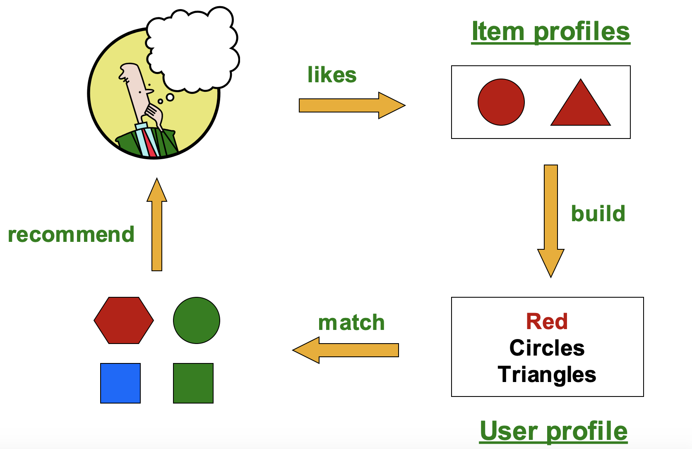
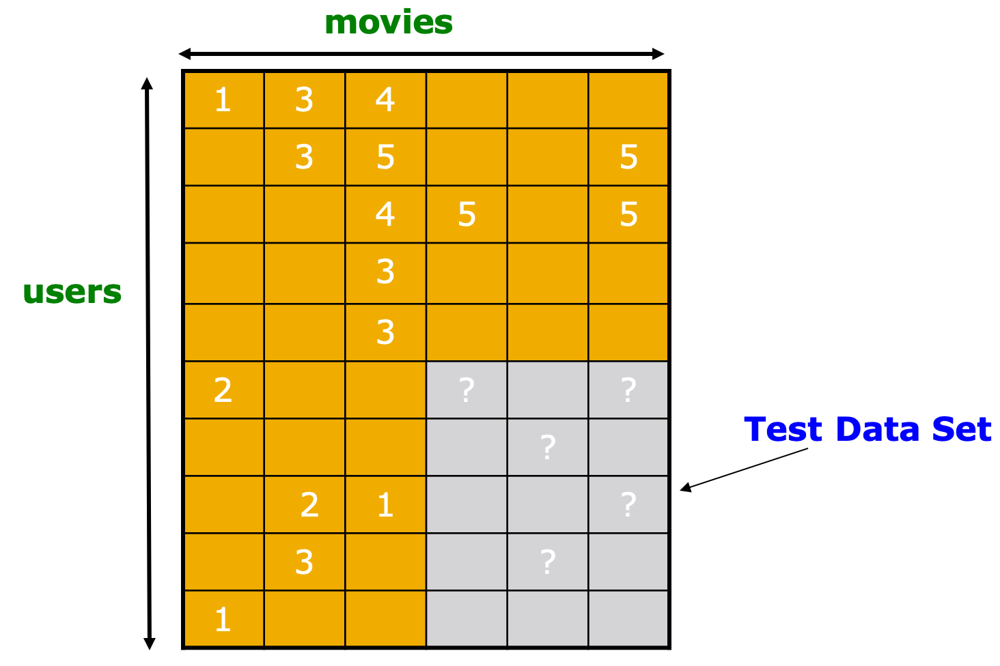

# Lecture4：推荐系统RecSys

- 这一部分内容主要讲推荐系统的相关知识

## 推荐系统的一般形式

- 推荐的方式可以分成：编辑和手工策划、简单的聚合统计和为用户量身定制三种不同的类型

​	  一般来说推荐系统是给一些特定的用户来推荐特定的商品，如果我们用X来表示客户的集合，S表示商品组成的集合，那么推荐系统实际上就是寻找一个函数u满足$X\times S\rightarrow R$，这里的R是一个由各个用户对每个商品可能购买概率(rating)的评级(比如使用0-1的实数或者0-5🌟来表示)，这个函数也被称为Utility Function，推荐系统的关键问题在于：

- 如何获得已知的rating
- 如何根据已知的rating推断未知的rating
- 如何评估一个推断方法的好坏

一般来说Utility矩阵比较稀疏，很多商品对于用户而言根本不会接触到，因此也就没有对应的rating，一种方法是冷启动cold start，也就是新的商品和用户没有相关的数据，从0开始一步步增加，而另外的方式还有：

- 基于内容的推荐Content-based
- 协同推荐

## 基于内容的推荐系统

​	  基于内容的推荐系统的核心idea是给用户推荐他喜欢的类似产品(similar to previous items rated highly)，比如电影推荐中给观众推荐同个导演的作品，网页推荐中推荐给用户内容相似的网页。

### Item Profile&TF-IDF

​	  对于每个商品，基于内容的推荐需要给它建立一个描述(profile，我认为翻译成画像更好)，包含了这个商品的一系列特征，而这些特征可以通过启发性的方法从文本中提取，这里可以用到一种方法叫做TF-IDF算法。

​	  **TF-IDF（term frequency–inverse document frequency，词频-逆向文件频率）**是一种用于信息检索（information retrieval）与文本挖掘（text mining）的常用**加权方法**。我们用$f_{ij}$来表示单词i(代表了一定的特征)在文档j中出现的频率，那么就有：
$$
TF_{ij}=\frac{f_{ij}}{\max_kf_{kj}}
$$
用$n_i$来表示出现了单词i的文档数量，并用N代表所有的文档数，则有：
$$
IDF_i=\log\frac{N}{n_i}
$$
而TF-IDF score就可以定义为：
$$
w_{ij}=TF_{ij}\times IDF_i
$$
一个文档的profile可以用一些TF-IDF score最高的单词组成的集合来表示。 

### User Profile & Prediction

​	  用户的profile可能包含了该用户所购买的加权的商品profile，也可能包含了其方差等信息，用户的profile作用是刻画一个用户到底喜欢什么样的商品，并针对性地进行推荐。

​	  而给用户推荐的时候需要根据用户和商品各自的profile来推荐合适的商品，一种启发式的方法就是用cos函数来衡量用户喜好和该商品的相似度。
$$
u(x,i)=\cos (x,i)=\frac{x\times i}{||x||||i||}
$$

### 基于内容的方法的优缺点

- 优点：
  - 不需要其他用户的数据
  - 可以根据用户的喜好进行个性化的推荐
  - 可以推荐新的或者不知名的商品
  - 可解释性很好
- 缺点：
  - 找特征很麻烦
  - 对于新用户而言缺少有效的数据，无法构建推荐系统
  - 过度专门化Overspecialization，无法给用户推荐profile以外的商品

## 协同过滤Collaborative Filtering

​	  协同过滤方法的最核心的idea是找到与用户X的喜好相似的用户集合N，并用N中的评分(rating)信息来给X推荐他可能会喜欢的商品。

### 用户-用户协同过滤：寻找相似的用户

​	  因此协同过滤一个很重要的问题就是，如何找到和X喜好相似的用户，我们有以下几种方法可以找到相似的用户($r_x$表示一个用户对各个商品的喜好程度组成的向量，即评分向量)：

#### Jaccard相似度

​	  将用户喜欢(购买过)的商品用集合来表示，将向量的相似度转化成集合的相似度比较，但是问题也很明显，这种方法忽略了rating的具体数值，对于所有商品一视同仁而没有偏好

#### Cosine相似度

​	  对两个用户$x,y$的向量计算cos相似度，也就是向量之间的夹角，一般来说相似的向量夹角会更小，计算得到的相似度也就越高。
$$
\operatorname{sim}(x, y)=\cos \left(r_{x}, r_{y}\right)=\frac{r_{x} \cdot r_{y}}{\left\|r_{x}\right\| \cdot \| r_y||}
$$

####  Pearson相关系数

​	  用集合$S_{xy}$来表示被用户x和y共同评分过的商品，皮尔森系数的计算方式是：
$$
\operatorname{sim}(x, y)=\frac{\sum_{s \in S_{x y}}\left(\boldsymbol{r}_{x s}-\overline{\boldsymbol{r}_{x}}\right)\left(\boldsymbol{r}_{y s}-\overline{\boldsymbol{r}_{y}}\right)}{\sqrt{\sum_{s \in \boldsymbol{S}_{x y}}\left(\boldsymbol{r}_{x s}-\overline{\boldsymbol{r}_{x}}\right)^{2}} \sqrt{\sum_{s \in S_{x y}}\left(\boldsymbol{r}_{y s}-\overline{\boldsymbol{r}_{y}}\right)^{2}}}
$$

#### 预测用户评分

​	  使用$r_x$表示拥护x的评分向量，并用集合N表示和x最相似的k个用户，那么我们刻画用户x的评分向量就可以用k个相似用户的评分向量来刻画，也就是：
$$
r_{xi}=\frac{1}{k}\sum_{y\in N}r_{yi}
$$
也可以通过加权平均计算：
$$
r_{xi}=\frac{\sum_{y\in N}\mathrm{sim}(x,y)r_{yi}}{\sum_{y\in N}\mathrm{sim}(x,y)}
$$

- 这是用户-用户的协同过滤

### 商品-商品协同过滤

​	  和用户一样，商品也可以进行协同过滤，用$s_{ij}$表示商品i和j之间的相似度，用$r_{xj}$表示用户x对商品j的评分，用$N(i,x)$表示用户x有评分并且和i相似的商品集合。协同过滤的方式也和用户-用户的类似，即：
$$
r_{x i}=\frac{\sum_{j \in N(i ; x)} \mathrm{sim}_{i j} \cdot r_{x j}}{\sum_{j \in N(i ; x)} \mathrm{sim}_{i j}}
$$
​	  协同过滤还有一种非常常见的trick，就是给每个评分$r_{xi}$定义一个baseline估计用作“保底”，这样一来协同过滤的算法就变成了：
$$
r_{x i}=b_{xi}+\frac{\sum_{j \in N(i ; x)} \mathrm{sim}_{i j} \cdot (r_{x j}-b_{xj})}{\sum_{j \in N(i ; x)} \mathrm{sim}_{i j}}
$$

- 这里的$b_{xi}$要使用三个统计量相加得到，分别是所有评分的均值$\mu$，用户x的评分偏差$b_x$和商品i的评分偏差$b_i$

$$
b_{xi}=b_x+b_i+\mu
$$

### 协同过滤总结

​	  一般来说使用商品-商品的协同过滤取得的效果要比用户-用户的协同过滤要好，这是因为刻画一个商品的特性比刻画一个用户的特性要简单很多，虽然协同过滤在绝大多数场景下都可以使用，但是协同过滤也存在着很多的问题：

- 冷启动问题：面对新用户的时候需要足够多的用户来启动
- 稀疏性：评分矩阵非常稀疏，难以找到相似的用户和商品
- 无法推荐一个没有被推荐过的商品
- 协同过滤是一种“随大流”的推荐方式，不能对用户进行个性化的推荐

一种解决方案是使用混合过滤，实现多种不同的推荐方式并进行共同的推荐决策，综合用户-用户协同过滤，商品-商品协同过滤来推荐，并将基于内容的推荐方法引入协同过滤中。

### 推荐系统的评估

- 一般来说推荐系统的评估方法如下图所示：

​	  一般来说在实际训练的过程中拿出一部分用户对一部分商品的评分来进行测试，而对推荐系统的评估可以使用已知的评分和预测结果进行对比，常见的方法有：

- Root-mean-square error (RMSE)
- Top-10评估法，比较预测结果中top10的商品和真实结果的匹配度
- Rank Correlation

然而在训练推荐系统的过程中只着眼于提高准确率那就格局小了，还需要关注的内容有：

- 预测结果的多样性
- 预测结果的上下文相关性
- 预测的顺序

## 隐语义模型LFM

### Netflix推荐系统比赛

​	  开篇先介绍了一个很有名的Netfix推荐系统比赛，其实是上节课中留下的内容，最终胜出的方案是Multi-scale建模的方式，其处理过程包括Global effects——Factorization——Collaborative filtering三个步骤逐渐提取局部的偏好信息和模式。举一个简单的例子如下：

- Global：如果电影的平均得分是3.7，而电影《第六感》的得分高于平均分0.5，而Joe往往打分低于平均分0.2，因此最后估计的结果是3.7+0.5-0.2=4
- Local neighborbood：Joe不喜欢主题相关的电影Signs，因此将最终得分调整为3.8分

冠军算法采用了经典的协同过滤方式，从相似的电影中推出未知的评级，因此就是一种item-item的协同过滤，这些上面都已经提过了，其核心的算法是：
$$
r_{x i}=b_{xi}+\frac{\sum_{j \in N(i ; x)} \mathrm{sim}_{i j} \cdot (r_{x j}-b_{xj})}{\sum_{j \in N(i ; x)} \mathrm{sim}_{i j}}
$$
但是这个算法存在一定的问题，包括：

- 相似度的评估是武断的，比较intuitive
- 成对的相似性忽略了用户之间的相互依赖性
- 使用一个平均权重存在诸多限制，可以使用从数据中直接获得的权重代替，即插值权重

### 插值权重Interpolation Weight

​	  插值权重下的协同过滤计算方式如下：
$$
\widehat{r_{x i}}=b_{x i}+\sum_{j \in N(i ; x)} w_{i j}\left(r_{x j}-b_{x j}\right)
$$

- 这里的$N(i;x)$是用户x打分过的和i相似的商品(Netflix案例里就是电影)
- $w_{ij}$就是插值权重，并且允许其和不为1，用于表示不同两个电影之间的互相作用

​	  评估推荐系统效果(也就是损失函数)的一种方式是**和方差**SSE，而合适的权重$w_{ij}$的选取方式需要让这个损失函数最小，而权重参数也可以根据输入的样本学习到，而SSE损失函数可以写成：
$$
J(w)=\sum_{x,i\in R}(\bar r_{xi}-r_{xi})^2=\sum_{x,i\in R}\left(\left[b_{x i}+\sum_{j \in N(i ; x)} w_{i j}\left(r_{x j}-b_{x j}\right)\right]-r_{xi}\right)^2
$$

- 我们可以通过梯度下降法的方式来学习：

$$
\frac{\partial J(w)}{\partial w_{ij}}=2 \sum_{x, i \in R}\left(\left[b_{x i}+\sum_{k \in N(i ; x)} w_{i k}\left(r_{x k}-b_{x k}\right)\right]-r_{x i}\right)\left(r_{x j}-b_{x j}\right)
$$

插值权重没有使用任何的相似度度量函数，而是通过函数插值的方式来显式地拟合不同的item之间的交互关系

### 隐语义模型

#### Baseline

​	  隐语义模型认为用户之所以会喜欢/讨厌一个商品是因为商品中潜在的一些特性吸引了用户，因此提出了一种名为隐式因子(Latent Factor)，因此提出将用户-商品的评分矩阵R分解成两个矩阵，即：
$$
R=QP^T
$$

- 我们假设有m个商品和n个用户，那么R矩阵就是$m\times n$的矩阵，我们假设有l个潜在因子，那么Q和P分别是规模为$m\times l, l\times n$的矩阵，如下图所示：

- 而最终的打分结果也需要通过矩阵P和Q中的元素计算得到，用户x对第i个商品的评分用矩阵P的第x列和Q的第i行对应位置相乘得到，即：

$$
\bar r_{xi}=q_i\times p_x=\sum_f q_{if}\cdot p_{xf}
$$

#### Baseline的学习和训练

​	  回忆起之前学过的SVD分解，我们发现隐语义模型正好可以使用SVD分解，因为$R=U\Sigma V^T$，因此我们可以令$Q=U, P = \Sigma V^T$，这样就得到了P和Q的一个初步解，我们知道SVD分解可以带来最小的重建损失，即：
$$
\min _{U, V, \Sigma} \sum_{i j \in A}\left(A_{i j}-\left[U \Sigma V^{\mathrm{T}}\right]_{i j}\right)^{2}
$$

- 注意到这个形式和SSE和RMSE的形式都是比较像的($RMSE=\frac 1c \sqrt{SSE}$)，因此我们可以推出，基于SVD分解的潜在语义模型有最小化的RMSE
- 但是这里的RMSE是计算了所有可能的用户-商品组合的，R中没有出现的都被认为是0，但实际上这些缺失的内容不一定是0，有可能只是没有被观测到，因此隐语义模型的优化目标应该修改成：

$$
\min _{P, Q} \sum_{(i, x) \in \mathrm{R}}\left(r_{x i}-q_{i} \cdot p_{x}\right)^{2}
$$

可以采用梯度下降法等方式来训练合适的参数，最终得到P和Q矩阵的结果。

#### 正则化

​	  到上面为止，提出的模型还非常容易过拟合，因为我们的目标是在训练数据上最小化SSE，而这会导致模型在训练集上表现太好而在测试集上表现很差，即过拟合。为了避免过拟合，可以在目标函数中加入正则项，即：
$$
\min _{P, Q} \sum_{\text {training }}\left(r_{x i}-q_{i} p_{x}\right)^{2}+\left[\lambda_{1} \sum_{x}\left\|p_{x}\right\|^{2}+\lambda_{2} \sum_{i}\left\|q_{i}\right\|^{2}\right]
$$

- 可以使用梯度下降法进行训练，但是这种方法计算效率过低
- 随机梯度下降(SGD)相比之下计算效率更高，首先用SVD初始化P和Q两个矩阵，然后使用SGD一步步更新参数，更新的公式为：

$$
\begin{array}{l}
\varepsilon_{x i}=2\left(r_{x i}-q_{i} \cdot p_{x}\right) \\
q_{i} \leftarrow q_{i}+\mu_{1}\left(\varepsilon_{x i} p_{x}-2 \lambda_{2} q_{i}\right) \\
p_{x} \leftarrow p_{x}+\mu_{2}\left(\varepsilon_{x i} q_{i}-2 \lambda_{1} p_{x}\right)
\end{array}
$$

#### 对用户的个性化推荐(引入bias)

​	  协同过滤中已经有了针对特定用户对结果进行个性化调整的方法，即使用一个Baseline+一个用户-商品交互信息来共同打分，Baseline中考虑用户和商品各自的bias，而用户和商品的交互信息就是用上面一样的方法来计算，即：
$$
r_{xi}=\mu+b_x+b_i+q_i\cdot p_x
$$
这样一来，我们的目标函数就变成了如下形式(含正则项)：
$$
\min _{Q, P} \sum_{(x, i) \in R}\left(r_{x i}-\left(\mu+b_{x}+b_{i}+q_{i} p_{x}\right)\right)^{2}+\left(\lambda_{1} \sum_{i}\left\|q_{i}\right\|^{2}+\lambda_{2} \sum_{x}\left\|p_{x}\right\|^{2}+\lambda_{3} \sum_{x}\left\|b_{x}\right\|^{2}+\lambda_{4} \sum_{i}\left\|b_{i}\right\|^{2}\right)
$$

- 依然可以使用SDG来训练这个模型

