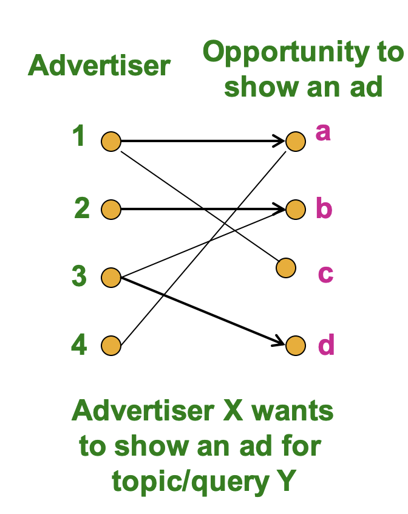

# 计算广告学

## 早期广告算法

互联网中的广告是非常常见的，而广告也可以使用推荐算法进行推荐，常见的广告算法往往都是“在线算法”，即算法不是直接获得所有的输入数据，而是逐渐接受输入数据并作出及时的决策，一次性得到所有数据并建立模型的是离线算法。

传统的广告算法可以看成是一个图匹配的问题，一个图中一部分节点是广告商而另一部节点是投放广告的时机，我们需要给每个广告商X找到合适的时机来投放广告，这是一个在线问题，我们需要对出现的查询结果进行针对性的广告投放，并且不知道下一个用户会查询什么东西。

## 在线二部图匹配

我们可以进一步将问题转化成一个二部图的匹配问题，举个例子就比如相亲网站上的男女嘉宾匹配(这也可以看成是一种广告)，我们假设男的只能和女的匹配，这样一来图就被分成了男节点和女节点两部分，俗称构成了一个二部图，我们需要找到尽可能合适的**匹配**，让更多的男女嘉宾牵手。关于二部图的匹配有如下几个定义：

- 完美匹配：图中的所有节点都被匹配了
- 最大匹配：包含了最多可能数量节点的匹配

广告推荐的目标可以认为是找到给定二部图的最大匹配，对于这个问题已经有多项式复杂度的算法被提出了，但如果我们如果不能在前期知道所有的节点，又该怎么办呢？(比如新的男嘉宾和女嘉宾注册了账号)

一种情况是，一开始给出了所有的男嘉宾，而每一轮都会有女嘉宾给出自己的选择(即给出和一个男嘉宾连接一条边的倾向)，下面我们就要靠谱是否给这个女嘉宾分配一个男嘉宾，对此我们可以使用贪心算法，一旦有满足条件的男嘉宾就立马进行匹配，如果没有就算了，不需要考虑节目效果，我们假设贪心算法给出的匹配是$M_g$而最优结果是$M_{opt}$，根据我仅存的ads知识(其实也没剩多少了)，有：
$$
\frac{|M_g|}{|M_{opt}|}\ge \frac 12
$$

## 基于点击率的广告

最早的互联网广告是banner ads，通常用CPM(cost per 1000 impression， 每一千次曝光需要的收益)来考虑广告的成本，但是这种广告效果往往不好，点击率非常低。

而另一种互联网广告投放的方式在2000年左右被提出，这种方式使用用户的搜索关键字来进行精准的广告推送，并且广告的计费方式变成了按照用户的点击率(CTR)来计费，Google将这种算法总结成了Adwords，这种广告方式被称为performance-based advertising，现在广告系统的目标就变成了最大化广告带来的收入，即最大化点击率，我们可以用单次点击的期望收入来简化这个问题。

但是又有这样几个问题：

- 广告的点击率可能是未知的，需要通过历史记录计算或者进行预测
- 广告的投放有预算限制，因此bid不能超过总体支出

## BALANCE算法

下面主要介绍一种能解决上述问题的BALANCE算法。

### 问题描述

我们将问题的条件概括为如下几条内容：

- 广告商给出了需要投放的广告内容，并且有每个广告的收益数据
- 每个广告-查询的二元组有一个点击率数据
- 广告的投放有一个总预算上限
- 对于每一条查询有一个广告投放数量的上限

我们可以将问题简化成：

- 对于每一个查询都要有一个对应的广告投放结果
- 广告商的总预算记为B
- 所有的广告被点击的可能性是相等的
- 所有广告产生的商业价值是相等的，都是1

### 贪心算法及其局限性

最简单的解决方案就是使用贪心算法，对于每一个查询都给出一个受益为1的广告作为结果，根据上面的结论贪心算法的投放效果不会低于最优解的1/2

但是在特定场景下贪心算法的表现会达到下限，因为贪心算法对于冲突的查询总是采取不变的投放策略(比如A和B广告都可以在查询x的情况下投放，使用贪心算法可能就会一直投放A)

而BALANCE算法解决了这个问题，对于每一个查询，该算法会给出能剩下最多预算的解决方案，可以随机地解决可能出现的tie，对于上面这种情况，贪心算法给出的结果是AAAAAAAA，而最优解是AAAABBBB，BALANCE算法给出的结果可能是ABABBBBB，相比于贪心算法，近似率更加提高了。

### 算法具体分析

- 仔细看了看感觉BALANCE算法也是一个传统算法，没什么令人惊奇之处，就不仔细分析了，给出一个结论那就是BALANCE算法的近似率是$1-\frac 1e$

