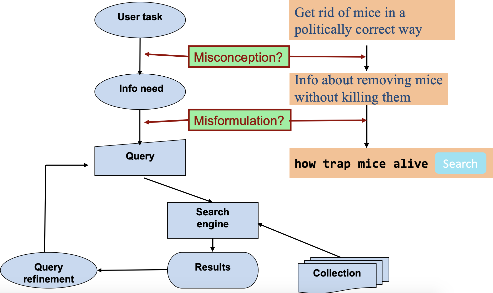
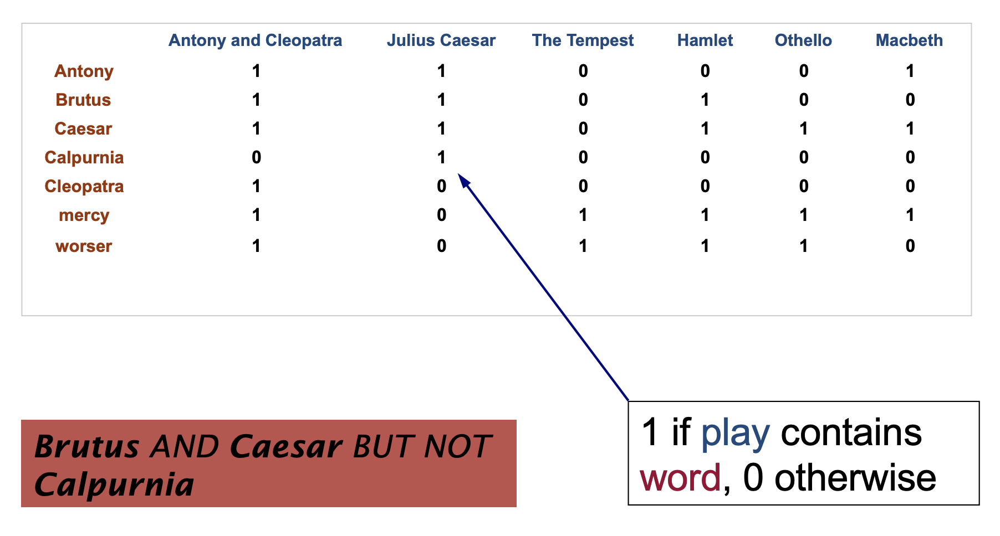
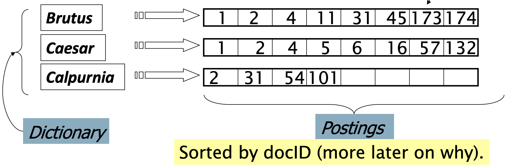
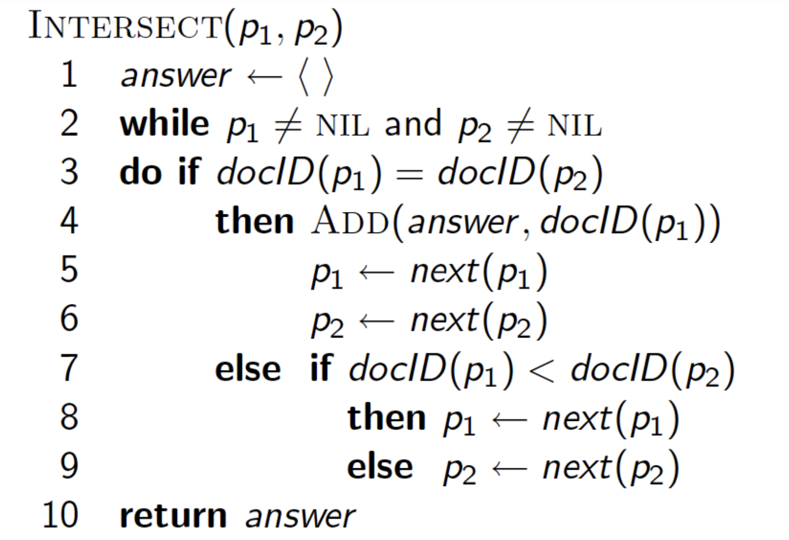
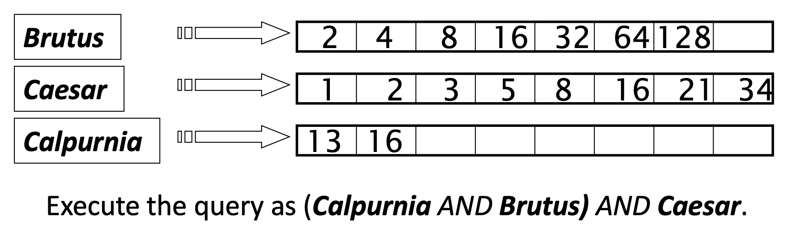

# CS276-01：InvertedIndex

> Stanford CS276《Information Retrieval and Web Search》课程的学习笔记，这门课主要讲和信息检索相关的内容。

## Introduction

信息检索Information Retrieval (IR) 就是从大量非结构化的数据(通常是文本)中找到需要的数据，网页搜索是一个很常见的例子，但事实上这样的例子还包括邮件检索，知识库检索等等。本课程中对信息检索这一概念作出如下假设：

- 待检索的对象是一系列文档，并且在检索的那个时刻文档内容和数量是不变的
- 检索的目标是找出满足用户搜索需要的文档

一个经典的搜索模型如下图所示：



对于检索出的结果，我们可以使用准确率precision和召回率recall来评价检索的效果，准确率是指**找到的文档中符合用户检索需求的比例**，而召回率指的是**检索出的文档占整个文档集合的比例**。

## 文档词条矩阵

对于文档对象，一种很经典的检索需求就是找出所有包含/不包含特定词汇的文档，比如`Which plays of Shakespeare contain the words Brutus AND Caesar but NOT Calpurnia?`，我们会觉得，那先找出所有包含Brutus和Caesar和文档，然后再筛选出不包含Calpurnia不就行了吗？但是这个过程存在很多问题：

- 对于大型的语料库来说太慢了
- Not操作是非平凡的，我们要判断一个文档是否不包含一个单词比较麻烦
- 这种方式不支持更复杂的操作
- 我们可能需要对搜索结果进行排序，而这种方法无法确定不同搜索结果的重要性

我们可以创建一个**文档词条矩阵**(Term-Document Matrix)来表示各个单词在不同文档中的出现情况，这样一来就可以把上述查询变成在一个矩阵中进行一系列的if-else操作，文档词条矩阵的一个例子如下图所示：



这样一来每一个文档都可以用一个0-1向量来表示单词的出现情况，而每一个词条也可以用一个0-1向量表示它在不同的文档中的出现情况，这样一来我们只需要把一个查询转化成一系列词条向量的AND和OR逻辑运算即可。但是这种方法依然非常消耗存储空间，如果将词库和文档的数量扩展到500K*1M，那就会有half-a-trillion个0和1，但事实上有效的1非常少，这就造成了很大的空间浪费。我们可以只存储这些结果为1的词条-文档关系，这就是倒排索引。

## 倒排索引Inverted Index

倒排索引对于每一个词条都维护一个列表，列表中记录了包含这个词条的所有文档的编号，而词条通过字典索引来构建，每个词条索引对应一个**变长的有序列表**(称为posting list)来记录相关的文档。



### 词条的构建

值得注意的是，构建倒排索引所需的词条需要从大量文本中预处理得到，处理文本主要包含这样几个步骤：

- Tokenization，将句子分割成一系列单词token
- Normalization，将文本和查询中的词条映射成同一个形式，比如U.S.A和USA
- Stemming，将一个单词的不同形式(名词，动词，时态变化)进行匹配，都归结到同一个单词上
- Stop words，去除一些出现频率很高但是用处不大的单词比如the，a等等

### 使用倒排索引处理查询

下面来介绍倒排索引如何处理查询。还是以上面的莎士比亚为例，要找Brutus和Caesar同时出现的文档，我们可以将这两个词对应的文档列表找出来，然后将两个列表进行**merge**(找出共同包含的文档，然后进行归并)，这样一来处理的时间复杂度是线性的。



#### 布尔查询模型

上面的做法仅仅是一个很简单的示例，我们可以使用布尔查询来处理格式是一个布尔表达式的查询内容，即查询由一系列的AND，OR和NOT构成，并且这种查询方式是精确查询，同时也是过去三十年中的主流信息检索方式。使用倒排索引处理布尔查询总体上来说就是对三种不同的逻辑运算执行不同的merge得到检索的结果。

#### 查询优化

我们可以对输入的布尔查询表达式进行优化，找到处理查询的最佳顺序来简化查询。比如现在查询中有n个词条AND，根据AND的运算法则，最后的结果数量肯定不会超过包含文档数最少的词条对应的文档数量，因此可以从最短的list(即出现频率最低的词条)开始进行查询的处理。



总的来说查询优化有这样几个规律：

- 对于AND，查询结果数量不会超过出现频率最低的词条对应的文档数，因此可以从最小的posting list开始merge
- 对于OR，查询结果数量不会超过两边文档数量之和，可以先计算不同情况下的文档总数选择最好的方式merge
- 对于NOT，先选出现最多的词条去掉

#### 短语查询和位置索引

有时候我们希望将几个词语看成一个短语来进行查询，比如要查"Zhejiang University"，那么"I went to university in Zhejiang"就不是一个匹配的结果，在这种查询需求下，只存储词条-文档的信息已经不足以完成查询，我们可以尝试用两个单词构建索引，而对于更长的短语，我们可以将其进行分割，然后将一个长短语的查询分解成若干个短语的查询的AND操作，但是这种处理方式可能会引入false positives的样本。

另一种方式是构建位置索引，即在索引中保存词条出现在文档中的位置，即如下形式：

```pseudocode
<term, number of docs containing term;
doc1: position1, position2 … ;
doc2: position1, position2 … ;
etc.>
```

这样一来在查询一个短语的时候就可以通过位置来判断短语中的每个单词是否连续出现，从而判断整个短语有没有出现在文档中，并且对于近似查询，比如"某单词出现不超过三次"这样的查询需求，位置索引也可以完成查询，而使用双单词索引就不行。