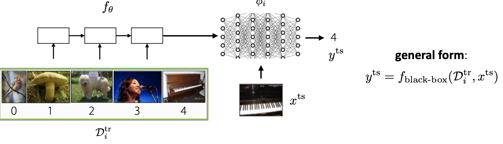
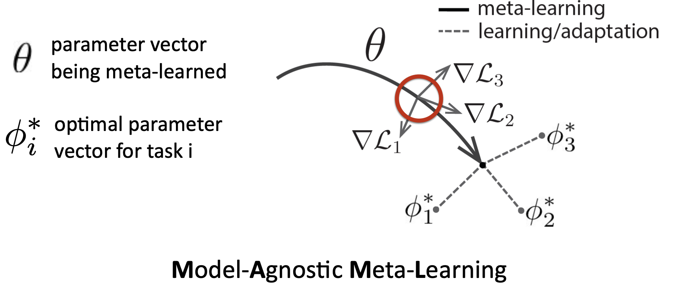

# CS330：Multi-task Learning&Meta Learning2

> 本章笔记的内容主要是原课程的Lecture3和4，主要讲元学习问题的定义和黑盒元学习，以及基于优化的元学习

## 元学习问题

​	  前面已经说到多任务学习和迁移学习的定义和区别，这里再复习一下，多任务学习是训练模型一次性解决多个任务，而迁移学习是将一个任务上的模型迁移到另一个任务上，主要是通过训练+微调的pipeline来完成迁移学习，这也是两种学习模式的主要区别。而元学习问题的目标是“学习如何学习”，可以从两种不同的视角来看待。

- 从机械的视角来看，深度网络可以将整个数据集读入并且可以预测新数据点的结果，那么就可以使用一个元数据集来训练网络，这个元数据集中包含很多的数据集，每一个数据集对应的任务各不相同
- 从概率的视角来看，元学习需要从一些任务中**抽取出有效的先验知识用于解决新的任务**，并且使用这些先验的知识来和新的训练数据集来学习一个新的任务的后验参数

也就是说元学习是**给定多个任务和对应的数据集进行训练，并在新的任务和新的测试集上验证效果**。

​	  元学习的一个关键假设是，所有的任务应该遵循独立同分布(IID)，也就是说我们需要完成的任务应该具有相似的结构，举几个简单的例子：

- 从不同语言的手写数字中进行手写数字识别
- 过滤不同用户的垃圾邮件
- 对世界上不同地区的物种进行一定的分类
- 让一个机器人完成各种不同的任务

### 元学习的算法概述

​	  普通的监督学习算法是从数据集$\{(x,y)_i\}$中学习出一个模型$y=f(x,\theta)$，而元监督学习算法可以表示为从由K个数据集构成的训练集$\{(x,y)_{1:K}\}$中学习出一个模型$y_{test}=h(D^{tr},x_{test},\theta)$，这就将元学习的问题归结为了函数h的设计和优化问题。

​	  **K-shot learning表示每个类只用K个例子进行学习**，而N-way classification表示N分类问题。

### 黑盒方法

​	  黑盒方法就是使用神经网络来训练元学习模型，我们希望能够用神经网络模型表示每个任务，即$\phi_i=f_{\theta}(D^{tr})$然后使用这些学习到的$\phi_i$(被称为learner)来预测测试任务上的效果，即$y^{ts}=g_{\phi_i}(x^{ts})$

- 和普通的监督学习模型一样，我们使用极大似然法作为训练的目标，因此目标函数可以定义为：

$$
\max _{\theta} \sum_{\mathcal{T}_{i}} \sum_{(x, y) \sim D_i^{\text {test }}} \log g_{\phi_{i}}(y \mid x)=\max _{\theta} \sum_{\mathcal{T}_{i}} \mathcal L(f_{\theta}(D_i^{tr}, D_i^{test}))
$$

- 整个训练的过程可以用下面四个步骤来表示：

- 这里训练过程中计算的loss函数是从train task的数据集中划分出来的，而**不是直接用test task中的数据集**，这点要特别注意
- 同时，我们训练完每个任务之后，是否需要将得到的模型的所有参数作为结果输出到test task的预测中呢？答案是否定的，我们需要将每个train task训练得到的模型有一个低维向量$h_i$来表示它的一些上下文信息并用到最终的模型中，而具体怎么使用这个学习到的$h_i$则要进一步看论文，有各种各样莫名其妙的方法。
- 总的来说这样的方法表现力比较好，可以将不同的任务中学到的信息进行组合，但是在复杂的模型中，进行优化可能会非常困难，计算量非常大。

## 基于优化的元学习

### 与黑盒方法的区别

​	  黑盒元学习方法可以用上面的图来表示，但是这种方法存在很多问题，比如说模型一复杂就会使得优化的过程计算量非常大，我们可以考虑在train task学习的过程中就对齐进行优化(原文是Embed optimization inside the inner learning process)，回忆一下微调的整个过程，我们实际上是用新任务的train data在预训练好的模型参数上进行调整，即：
$$
\phi \leftarrow \theta-\alpha \nabla_{\theta} \mathcal{L}\left(\theta, \mathcal{D}^{\operatorname{tr}}\right)
$$
而基于优化的元学习算法的核心想法就是通过微调的方式在训练过程中优化参数，我们可以将每个任务i的学习目标表示为：
$$
\min _{\theta} \sum_{\text {task } i} \mathcal{L}\left(\theta-\alpha \nabla_{\theta} \mathcal{L}\left(\theta, \mathcal{D}_{i}^{\mathrm{tr}}\right), \mathcal{D}_{i}^{\mathrm{ts}}\right)
$$

和黑盒方法相比，基于优化的方法的训练过程变成了如下所示的步骤：

这两种方法的区别在于(我认为的)，黑盒方法在训练每个任务的参数时，**直接使用该任务测试集上的数据来优化参数**，而基于优化的方法会**先使用训练集的数据优化**出一个比较好的$\phi_i$再进一步优化$\theta$，这其实就涉及到了二阶导数的计算。

​	  基于优化的元学习方法又被称为**Model-agnostic meta-learning**，即模型不可知的元学习(MAML)，从计算图的视角来看就是嵌入了梯度算子的一种计算图。对于一个有效的深度神经网络，假设学习率非0，并且损失函数没有丢失标签的信息，那么MAML可以逼近任何关于$D_i^{tr},x^{test}$的函数。

### 存在的问题和挑战

- 二阶的优化问题使得训练的过程非常不稳定，对此提出的解决方案有：
  - 使用自动学习出的学习率来学习inner vector，并调整外部的学习率
  - 在inner loop中只优化一部分参数
  - 引入上下文变量来增强表示能力
- inner训练过程中的反向传播过程是一个计算和存储密集型的过程，也需要进行优化
- 如何选择有效的模型结构加快inner gradient step

### 优缺点总结

- 优点：
  - 在训练初期提供正向的归纳偏置(Positve Inductive Bias)
  - 在深度神经网络中拥有更强大的表示能力
  - 模型不可知，容易和其他模型进行组合
- 缺点：
  - 需要二阶的优化
  - 通常是对存储和计算量的要求比较高

