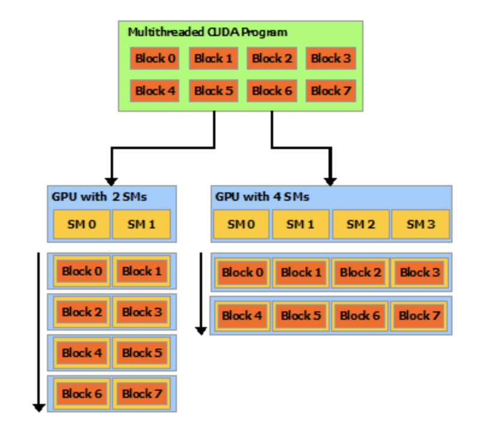

# 实习笔记02：CUDA编程模型

> 阅读CUDA Programming Guide官方文档的过程中做的一些笔记。

## CUDA编程模型

​	  在有了多核的CPU和GPU之后，编程的挑战就变成了构建一个可以根据处理器数量自由地扩展其并行性的应用程序。而CUDA为了解决这个问题，对并行编程做出了三个关键的抽象，包括线程组，共享内存和障碍同步，并将这些特性作为编程语言的借口暴露给开发者供其使用。

​	  这些抽象提供了细粒度的数据并行和线程并行，并且引导程序猿将问题分解成若干个粗粒度的，可以用若干个线程独立解决的子问题，并且将每个子问题分解成可以在一个线程块中并行完成的子任务。同时开发者不需要在意到底有多少个GPU，物理意义上的多处理器数量只需要让运行时系统掌握并进行调度集合，比如说同样是8个Block的线程，在面对不同SM个数的GPU时候的表现如下：



如果一个GPU的SM数量多，对于同一个任务的处理就会更快。

### Kernel

​	  CUDA C++可以让开饭着定义kernel函数，当调用kernel函数的时候会由N个CUDA线程并行执行N次，定义kernel函数需要有`__global__`关键字并且在调用这个kernel函数的时候要用`<<<...>>>`来指定调用这个函数的时候需要并发执行的线程数，每个执行这个函数的线程都会有一个专门的id存储在内置变量`threadIdx`中，比如下面这段代码可以进行向量的加法计算：

```c++
__global__ void VecAdd(Float *A, Float *B, Float *C) {
		int i = threadIdx.x;
  	C[i] = A[i] + B[i];
}

int main() {
  	VecAdd<<<1, N>>>(A, B, C);
}
```

- 这种调用方式使用了N个线程，每个线程给N维向量的一个维度进行相加

### Thread

​	  为了方便，threadIdx是一个有三个元素的结构体(文档中说是3-component vector)，这样一来线程就可以用一维，二维和三维的索引进行表示，这样就能更好的支持向量，矩阵和张量等运算，这些一维，二维和三维的线程索引可以对应到一维，二维和三位的线程块，比如下面这样一段矩阵相加的代码就用了二维的索引：

```c++
__global__ void MatAdd(float A[N][N], float B[N][N],
                       float C[N][N])
{
    int i = threadIdx.x;
    int j = threadIdx.y;
    C[i][j] = A[i][j] + B[i][j];
}

int main()
{
    ...
    // Kernel invocation with one block of N * N * 1 threads
    int numBlocks = 1;
    dim3 threadsPerBlock(N, N);
    MatAdd<<<numBlocks, threadsPerBlock>>>(A, B, C);
    ...
}
```

- 当然每个block里面线程的个数是有上限的，一般是1024个，这是因为一个block的线程必须被放在一个处理器核中执行，并且必须共享有限的内存和系统资源
- 一个kernel函数可以被多个线程块执行，因此可以通过增加block数的方式增加threads数
- 同时block还可以用一维，二维，三维的方式组织起来，形成网格(Grid)，同时一个Grid中每个block还有一个对应的`blockIdx`和`blockDim`分别表示block的索引和维度，同样也是3-component的


- 下面给出一个用多个block实现的矩阵加法的代码：

```c++
__global__ void MatAdd(float A[N][N], float B[N][N],
float C[N][N])
{
    int i = blockIdx.x * blockDim.x + threadIdx.x;
    int j = blockIdx.y * blockDim.y + threadIdx.y;
    if (i < N && j < N)
        C[i][j] = A[i][j] + B[i][j];
}

int main()
{
    ...
    // Kernel invocation
    dim3 threadsPerBlock(16, 16);
    dim3 numBlocks(N / threadsPerBlock.x, N / threadsPerBlock.y);
    MatAdd<<<numBlocks, threadsPerBlock>>>(A, B, C);
    ...
}
```

但是线程块必须要能够独立地执行，并且任意改变执行的顺序不能影响运算的结果。一个block内的线程需要通过共享内存来共享一些数据，并且需要对内存的访问进行同步，因此CUDA提供了共享内存和`__syncthreads` 

### Memory

​	  CUDA线程可以执行的过程中可以访问多个内存空间中的数据，每个线程有一个私有的局部内存空间，每个block内有可以共享的存储空间。


