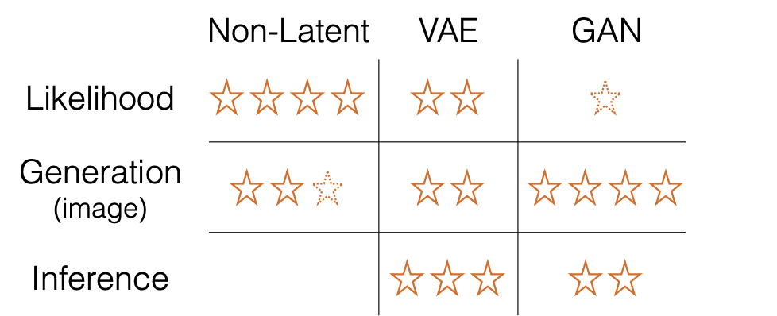
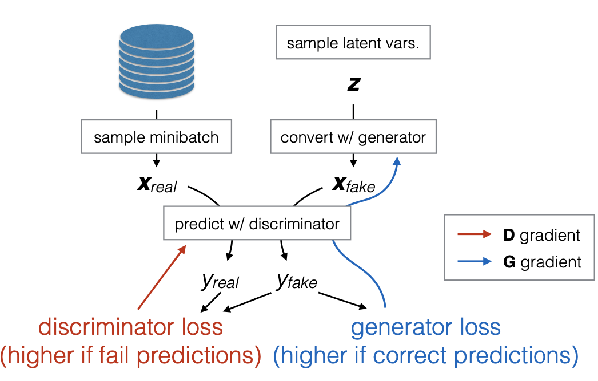
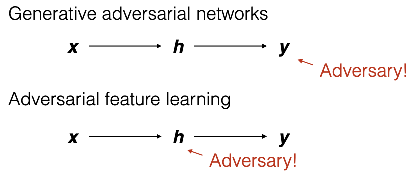
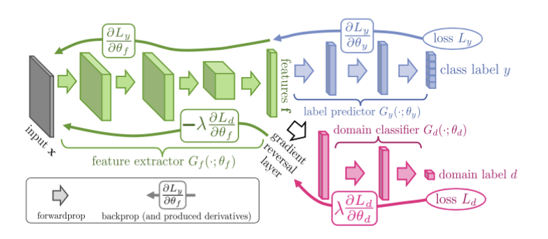
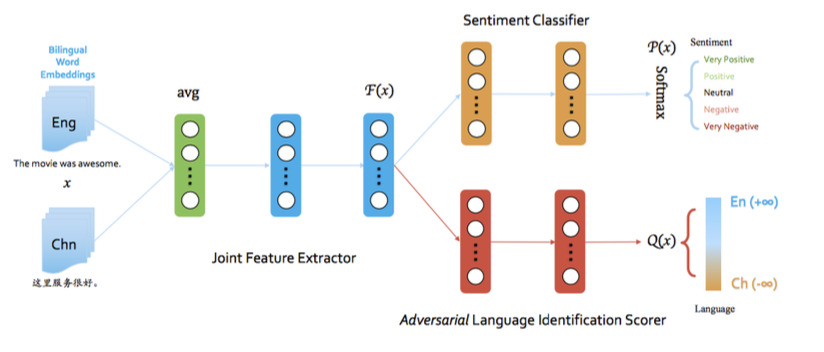
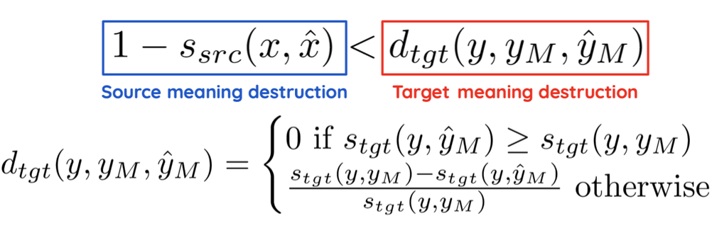

# NLP与对抗学习

> 这是CMU11-711 Advanced NLP课程中的一节，主要介绍了对抗学习在NLP中的应用。最近对这方面有点兴趣，希望通过学习这节课的PPT来了解一些基本的知识。课程链接https://phontron.com/class/anlp2022/schedule/adversarial.html

## 对抗学习Adversarial Learning

对抗学习是机器学习中的一大类方法，它的基本思路是，训练一个模型和一个对抗者(Adversary)来共同学习，达到更好的学习效果。这里面有这样几个常见的概念需要加以区分：

- 对抗生成网络**Generative adversarial networks**，即GAN，它的基本思路是让模型生成一些输出结果(比如图像和文本)并且让对抗方尝试去判断输出结果的真伪
- 对抗特征学习**Adversarial feature learning**，它的基本思路是让模型去生成一些特征，并且对抗方会尝试判断不同类型的特征
- 对抗鲁棒性**Adversarial robustness**，对抗方会尝试**干扰输入模型的内容**并让模型无法起到应有的作用，在这个过程中训练出更健壮的模型

这节课下面就从这三个方面分别来介绍了对抗学习的三大内容。

## 生成对抗网络GAN

GAN是一种生成模型，生成模型的**目标是建模数据的分布**$P(X)$或者数据的条件分布$P(X|Y)$，相比之下，判别模型的目标是建模$P(Y|X)$ 生成模型往往会通过引入隐变量来建模数据的分布，即：
$$
P(X)=\sum_{Z}P(X|Z)P(Z)
$$
一个完美的生成模型可以做到这样几件事：

- 评估似然，即$P(X)$ 语言模型实际上就是对似然的估计
- 生成数据样本，即$x\sim P(X)$，比如在没有条件约束或者给定某种条件的情况下生成一个句子
- 推断数据的隐属性(Latent Attributes)，即$P(Z|X)$ ，比如推断一篇文章的主题

然而，没有一个生成模型是完美的，目前的生成式模型主要可以分为非隐式、变分自编码器(VAE)和生成对抗网络(GAN)三大类，他们在三类任务上的表现可以用下面这张图来概括：

这三类方法中，非隐式方法和VAE都是依靠最大似然估计MLE来进行训练的，而GAN则是通过对抗的方式来拟合数据分布，比较擅长生成连续空间的数据样本。

GAN的基本范式是这样的：整个模型包括一个判别器D和一个生成器G，判别器D的目标是判断输入的数据是不是真实的(or人造的)，而生成器G的目标是生成可以骗过D的数据，这样一来，G就拥有了生成真实数据的能力，在训练过程中，D和G会不断进行博弈，迫使对方学得更好，最理想的情况下，我们希望G可以生成完美的数据，而D无法分辨出人造数据和真实数据的不同。一个经典的GAN如下图所示：

GAN的学习过程可以看作是数据分布匹配的过程，G会逐渐学会如何将任意的输入分布(即噪声Z)与数据集X原本的分布进行匹配，在生成阶段，我们只需要输入一个噪声Z，就可以得到一个满足数据集X概率分布的样本，而D实际上就是一个参数化的、可学习的度量函数。

但是GAN有的时候也没有我们想象的那么好，它有这样几个众所周知的问题：

- 模型的收敛性和稳定性
- 模型的崩溃和退化
- 判别器过度自信

其实说到底，所有的问题都是因为GAN的训练的不稳定性造成的，围绕GAN的训练稳定性，也有一大堆文章被提出，主要就是通过改D和G的loss函数以及训练方式，来提高GAN模型的稳定性。

虽然说了这么多，但其实GAN一开始主要用在图像的生成上面，GAN在NLP领域应用会遇到一个问题，NLP中的基本单位(如词或者说token)是离散的，直接采样会导致梯度无法回传，这就没办法训练神经网络模型。为了解决这个问题，之前的一些工作引入了各种隐变量，比如用强化学习的，还有像是Gumbel softmax这样的重参数化trick，可以说为了出成果无所不用其极，而为了保证NLP+GAN的训练稳定性，还有很多针对性的稳定性trick，比如Assigning Reward to Specific Actions，总的来说，要具体了解需要根据课程的paper list一篇篇去读。

## 对抗特征学习

对抗特征学习，乍一听好像也是让对抗方的模型来判别生成的东西是真是假，但实际上，它和GAN的区别在于，让模型判断的东西不同，GAN是把输出结果拿给对抗方进行判断的，而对抗特征学习则是把中间的特征取出来进行对抗，如下图所示：

这主要是为了处理这样几个问题：

- 让非生成式任务也可以引入对抗
- 使用连续的特征比离散的输出结果更容易

PPT中举了几个例子，比如学习Domain-invariant的表示：

还有像对抗多任务学习，它的核心思想就是希望学习到一些跨任务的共同特征，并将其另外任务相关的特征分开学习，因此引入一个对抗判别器，对共同特征进行对抗训练。

## 对抗鲁棒性

神经网络模型可能会对微小的扰动有剧烈的反应，对抗鲁棒性就是希望找到合适的对抗样本，并用对抗样本来增强模型的鲁棒性。

什么是对抗样本(Adversarial Example)？一个神经网络模型，可能因为微小的扰动而产生巨大的变化，比如一张猫的图片，加入一点噪声，就可能会被识别成狗，但加噪声之后的图片在人类看起来还是一只猫，所以对抗样本就是希望能够尽量保留输入端的数据含义(即和普通的数据差不多)，但同时破坏输出端的语义信息(就是让模型预测失败)，这个过程可以用下面的公式来表示：

通过构造对抗样本，并让模型学习，可以训练出更鲁棒的模型。