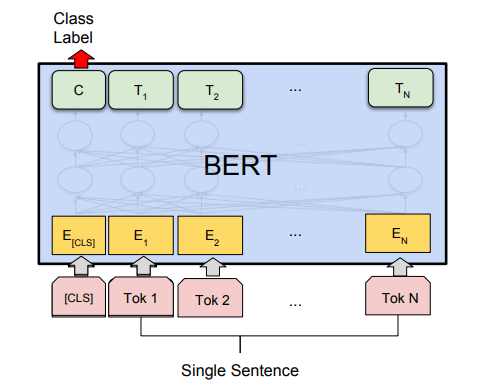
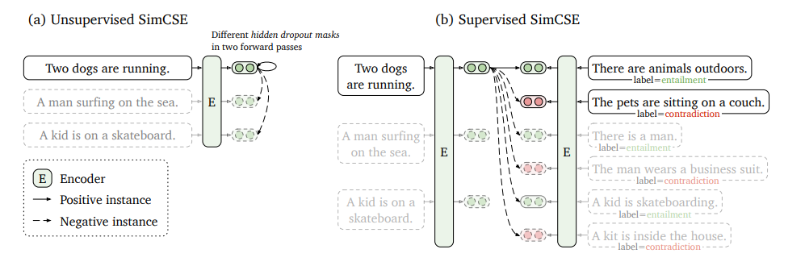

# Transformers库的简单尝试: 从BERT的微调到更优质的Sentence Embedding

> Hugging Face🤗公司的开源库Transformers是深度学习领域非常热门的工具，这个库里面集成了各种各样的Transformer架构的模型，包括BERT等等，它提供了非常方便的API来搭建Transformer架构的模型或者使用预训练好的模型进行各种任务，这一次我们主要来尝试一下用库中提供的BERT模型进行句子分类任务的微调，并尝试使用SimCSE这样更好的Sentence Embedding来完成句子分类任务。

## Transformers库的Pipeline

我们首先要了解一下Transformers这个库的使用方法，我们知道PyTorch使用的时候有这样几个东西需要定义：

- 数据集的`Dataset`类和数据加载器`DataLoader`
- 模型本身的代码，需要继承`nn.Module`类
- 模型的训练，测试等过程的代码

而Transformer库的使用过程中依然需要遵循这个基本的模式，但是在调用它提供的预训练模型的时候，需要另外考虑这样几个东西(我们以BERT模型为例)：

- 分词器Tokenizer，将Raw Data处理成一个token序列输入模型中
- 模型的配置信息BertConfig，这个类记录了一个BERT模型的配置信息
- 模型BertModel，这个就是一个完整的BERT模型架构，可以用BertConfig来进行初始化
- 同时Transformers库中可以用`from_pretrained()` 方法在加载预训练好的模型参数，也可以初始化像分词器之类的重要组件

使用Transformers库进行机器学习任务的整个Pipeline和PyTorch基本是一致的，只不过它额外提供了一些很方便的API来调用包括BERT在内的预训练模型。


## 简单的BERT文本分类

我们尝试用BERT进行简单的文本分类，这一次我们使用的数据集是斯坦福大学研究者提出的SST-1数据集，这是一个**句子级的情感分类**数据集，一共有5种情感类别，它的训练集一共有8544条数据，而测试集有2210条数据，这些数据都是比较短的句子，因此SST-1是一个比较小的数据集。(BERT原论文里的SST-2和SST-1类似，但是SST-2是一个二分类数据集，相比之下SST-1的粒度更细一点)



下面我们使用BERT来进行微调实验，使用的模型也非常简单，就是将输入的句子通过BERT编码之后，用一定的方式得到整个句子的表示，然后通过一个**线性层投影**到5种分类结果中，并通过SoftMax来计算该句子**属于每一类别的概率**，然后用交叉熵作为loss函数即可，这里得到句子的编码表示的方法有两种，分别是：

- 直接使用句子头部的**CLS标签**作为整个句子的编码表示
- 使用整个句子所有token的表示的**平均值**作为句子的编码表示

而我们使用的BERT模型也可以更换成其他的，比如后面会提到的使用BERT相同架构但是预训练目标不同的SimCSE模型。

剩下的事情就只剩下coding了，其中模型部分的代码如下：

```python
import torch
import torch.nn as nn
import torch.nn.functional as F
from transformers import BertModel, AutoModel

class BertForTextClassification(nn.Module):
    def __init__(self, bert_config, num_labels, mode='cls', model_type='bert') -> None:
        super(BertForTextClassification, self).__init__()
        self.type = model_type
        if model_type == 'bert':
            self.bert = BertModel.from_pretrained("bert-base-uncased")
        else:
            self.bert = AutoModel.from_pretrained('princeton-nlp/sup-simcse-bert-base-uncased')
        self.proj = nn.Linear(bert_config.hidden_size, num_labels)
        if mode not in ['cls', 'pooling']:
            raise NotImplementedError
        self.mode = mode
    
    def forward(self, input_ids, attention_mask, token_type_ids):
        if self.type == 'bert':
            bert_output = self.bert(input_ids, attention_mask, token_type_ids).last_hidden_state
            if self.mode == 'cls':
                bert_output = bert_output[:, 0, :]
            elif self.mode == 'pooling':
                bert_output = torch.mean(bert_output, dim=1)
        else:
            bert_output = self.bert(input_ids, attention_mask, token_type_ids, output_hidden_states=True, return_dict=True).pooler_output
        proj_output = self.proj(bert_output)
        return proj_output

```

之后就可以开始训练，对两种不同的句子表示方法，我们都使用相同的超参数，并使用Adam作为优化器，超参数设置如下：

| 参数          | 设定值 |
| ------------- | ------ |
| batch size    | 32     |
| learning rate | 2e-5   |

得到的结果如下：

| 模型              | 在测试集上的准确率(%) |
| ----------------- | --------------------- |
| BERT+CLS          | 52.03                 |
| BERT+Mean Pooling | 51.04                 |

我们发现在这个任务上，CLS标签作为句子表示的效果更好，同时对比一些现有的baseline，根据我查到的数据，传统的基于词向量以及TextCNN的各种方法在SST-1任务上的表现一般都在45%-50%之间，可以看出BERT相比于这些传统的文本分类方法要好很多。


## SimCSE: 更好的Sentence Embedding

SimCSE是在论文《[SimCSE: Simple Contrastive Learning of Sentence Embeddings](https://arxiv.org/pdf/2104.08821.pdf)》这篇论文种提出的，它还是采用了BERT的架构，但是改变了预训练任务，让模型能生成更合适的句子级别的表示(BERT的预训练任务是词级别的MLM，所以它的词表示似乎更好一点)



我们用预训练好的SimCSE模型来进行和上面一样的微调，得到在SST-1的测试集上的预测准确率约为53.53%，这说明SimCSE在情感分类这样句子级别的任务上，确实要比BERT-base表现得更好。