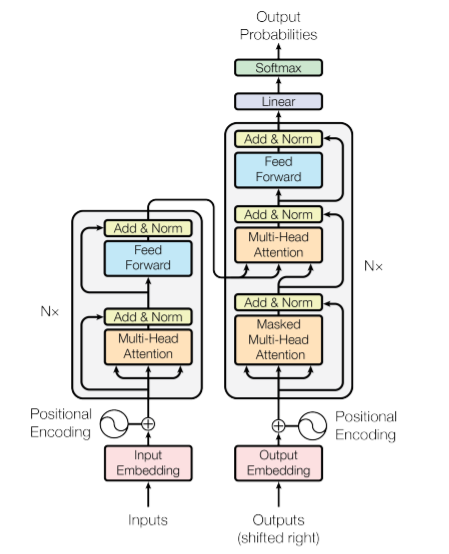
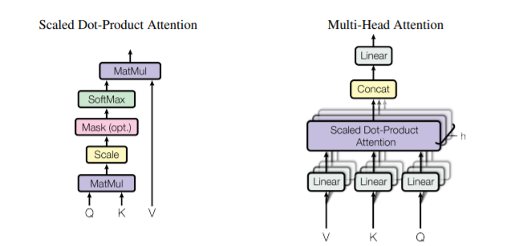

# 从Transformer到TinyBERT

> 深度学习和神经网络的入门课程实际上有不少，几乎每个外国学校CS专业都会有一些类似的课程，而UCB的这门对应课程叫做CS182《Deep Learning : Designing, Visualizing and Understanding Deep Neural Networks》
>
> 这门课一共有四个homework，前两个和CS231N的基本一样而后面两个分别是NLP和强化学习，在NLP的这个homework中，我们首先要自己实现Transformer原模型中的关键组成部分，然后用它来训练一个文档摘要模型，然后我们要使用预训练好的BERT模型进行知识蒸馏，并训练出一个小规格的BERT模型TinyBERT

## 自己实现一个Transformer

Transformer最早在2017年NIPS的这篇经典论文[《Attention Is All You Need》](https://proceedings.neurips.cc/paper/2017/file/3f5ee243547dee91fbd053c1c4a845aa-Paper.pdf)中被提出，这个时候的Transformer还是一个用于机器翻译的Encoder-Decoder架构的模型，它的特点在于抛弃了当时主流的CNN和RNN架构，不使用卷积和循环单元，直接使用自注意力机制+前馈网络进行特征的处理，而Transformer的Encoder部分后来也被发扬光大，形成了一大批以Transformer Encoder为backbone的预训练模型，最经典的比如BERT，而CS182的这个作业中，我们要实现的就是原本的Transformer架构，并用它来完成文档摘要的任务。

### Transformer的基本组件

首先我们需要仔细阅读原论文(这个作业中的模型架构完全是按照原论文一步步来的)，Transformer包含两部分，分别是Encoder和Decoder，论文中给出了一张典中典的模型架构图：



可以看到Encoder和Decoder都由重复的block组成，而且两种block中都有一些关键的组件，包括多头注意力，残差连接和标准化以及前馈网络，同时Encoder和Decoder的输入还需要添加位置编码。

#### 多头注意力



多头注意力是Transformer中一种很重要的机制，它依然是基于Key-Value-Query的注意力，但是对于输入的key/value/query，模型首先将它们线性投影到一个更大的空间中，然后将注意力分成h个头，每个头各自计算注意力，使得模型可以学习到多种侧重不同的注意力。我们用KVQ分别表示经过投影后的矩阵，那么一个注意力头中的计算可以表示成：
$$
\mathrm { Attention }(Q, K, V)=\mathrm{softmax}\left(\frac{Q K^{T}}{\sqrt{d_{k}}}\right) V
$$
不同的注意力头最后的注意力计算结果需要合并，并再通过一个投影矩阵
$$
\text { MultiHead }(Q, K, V) =\text { Concat }\left(\text { head }_{1}, \ldots, \text { head }_{\mathrm{h}}\right) W^{O} 
$$

$$
\text { where head }_{\mathrm{i}} =\text { Attention }\left(Q W_{i}^{Q}, K W_{i}^{K}, V W_{i}^{V}\right)
$$

同时Transformer中的多头注意力有好几种不同的用法：

- 在Encoder中，输入的KVQ都是序列本身，这个时候的注意力也叫做自注意力
- 在Deocder中，多头注意力分成了两种，一个是解码序列输入的时候做一次自注意力，另一个是用Decoder输入序列作为Q，用Encoder的结果作为KV，这种方式可以让解码序列关注整个编码序列，达到更好的模型效果

#### 残差连接和标准化

残差连接实际上就是**类似于ResNet的做法**，把输入多头注意力层之前的输入X和输出结果相加，并进行**层标准化**，它的目的是起到正则化的作用，防止模型过拟合。

#### 前馈网络

前馈层实际上就是就是老生常谈的几个线性层和激活函数的组合：
$$
\mathrm{FFN}(x)=\max \left(0, x W_{1}+b_{1}\right) W_{2}+b_{2}
$$

#### 位置编码

位置编码是在序列输入之前进行的一项操作，目的是将序列中tokens的位置信息编码到模型中(因为模型内部不管是注意力还是前馈网络，实际上都无法体现输入数据是一个序列，即不包含序列的信息)，论文中采用了sim和cos函数作为位置编码，它的设计如下：
$$
\begin{aligned}
P E_{(p o s, 2 i)} &=\sin \left(p o s / 10000^{2 i / d_{\text {model }}}\right) \\
P E_{(p o s, 2 i+1)} &=\cos \left(p o s / 10000^{2 i / d_{\text {model }}}\right)
\end{aligned}
$$
论文中的位置编码方式给输入序列中**每个位置上的token的embedding的每个维度**都加上了一个代表位置信息的编码。

### 代码实现

作业提供的Starter Code中，每个关键的部分各给了一个测试点用来检查正确性，所以总的来说并不算很难。

#### 多头注意力

要实现多头注意力，首先要实现一个最基本的KVQ注意力计算：

```python
class AttentionQKV(nn.Module):

    def __init__(self):
        super().__init__()
        self.apply_mask = ApplyAttentionMask()

    def forward(self, queries, keys, values, mask=None):
        key_dim = th.tensor(keys.shape[-1], dtype=th.float32)
        # Compute the similarity according to the QKV formula
        similarity = th.matmul(queries, keys.transpose(-1, -2)) / th.sqrt(key_dim)
        masked_similarity = self.apply_mask(similarity, mask=mask)
        weights = F.softmax(masked_similarity, dim=-1)
        # Obtain the output
        output = th.matmul(weights, values)
        return output, weights
```

这个还比较简单，然后我们要实现多头注意力，先实现一个`MultiHeadProjection`类用来将KVQ拆分成h个头分别进行注意力的计算，然后将在`MultiHeadAttention`中进行一层封装，得到一个能用的KVQ，其中`MultiHeadProjection`的实现如下：

```python
class MultiHeadProjection(nn.Module):

    def __init__(self, n_heads, feature_sizes):
        super().__init__()
        self.attention_map = AttentionQKV()
        self.n_heads = n_heads

        for size in feature_sizes:
            assert size % self.n_heads == 0, 'Shape of feature input must be divisible by n_heads'

    def forward(self, inputs, mask=None):
        queries, keys, values = inputs
        # Split each of the projection into its heads, by adding a new dimension
        # You must implement _split_heads, and _combine_heads
        queries_split = self._split_heads(queries)
        keys_split = self._split_heads(keys)
        values_split = self._split_heads(values)
        # Apply the attention map
        attention_output_split, _ = self.attention_map(queries_split, keys_split, values_split, mask=mask)
        # Re-combine the heads together, and return the output.
        output = self._combine_heads(attention_output_split)
        return output

    def _split_heads(self, tensor):
        assert len(tensor.shape) == 3
        batch_size, tensorlen = tensor.shape[0], tensor.shape[1]
        feature_size = tensor.shape[2]
        # Compute what the feature size per head is.
        new_feature_size = feature_size // self.n_heads
        # Reshape this projection tensor so that it has n_heads, each of new_feature_size
        tensor = tensor.reshape(batch_size, tensorlen, self.n_heads, new_feature_size)
        # Transpose the matrix so the outer-dimensions are the batch-size and the number of heads
        tensor = tensor.transpose(1, 2)
        return tensor

    def _combine_heads(self, tensor):
        assert len(tensor.shape) == 4
        tensor = tensor.transpose(1, 2)
        batch_size, tensorlen = tensor.shape[0], tensor.shape[1]
        feature_size = tensor.shape[-1]

        # What is the new feature size, if we combine all the heads
        new_feature_size = feature_size * self.n_heads
        # Reshape the Tensor to remove the heads dimension and come back to a Rank-3 tensor
        tensor = tensor.reshape(batch_size, tensorlen, new_feature_size)
        return tensor
```

我们实现的实际上是两个关键的方法`_split_head/_combine_head`，分别用于拆分多个head分别计算和将计算的结果汇总到一起，其实这一部分主要需要写的都是一些张量维度上的变换。

#### 位置编码

位置编码实际上很简单，就是根据论文里的描述写就可以了，不过这个作业中为了更高效的实现，定义了一个power和divisor变量，我们在实现的时候要注意使用，另外最后的位置编码实际上是sin和cos交错的，但是我们生成的是独立的一连串sin和cos，所以需要用stack方法将它们进行组合。

```python
class PositionEmbedding(nn.Module):

    def __init__(self, hidden_size):
        super(PositionEmbedding, self).__init__()

        assert hidden_size % 2 == 0 and 'Model vector size must be even for sinusoidal encoding'
        power = th.arange(0, hidden_size, step=2, dtype=th.float32)[:] / hidden_size
        divisor = 10000 ** power
        self.divisor = divisor
        self.hidden_size = hidden_size

    def forward(self, inputs, start=1):
       
        assert inputs.shape[-1] == self.hidden_size and 'Input final dim must match model hidden size'

        batch_size = inputs.shape[0]
        sequence_length = inputs.shape[1]
        seq_pos = th.arange(start, sequence_length + start, dtype=th.float32)
        seq_pos_expanded = seq_pos[None, :, None]
        index = seq_pos_expanded.repeat(*[1, 1, self.hidden_size // 2])

        # create the position embedding as described in the paper
        # use the `divisor` attribute instantiated in __init__
        sin_embedding = th.sin(index / self.divisor)
        cos_embedding = th.cos(index / self.divisor)
        position_shape = (1, sequence_length, self.hidden_size)  # fill in the other two dimensions
        position_embedding = th.stack((sin_embedding, cos_embedding), dim=3).view(position_shape)
        pos_embed_deviced = position_embedding.to(get_device())
        # add the embedding to the input
        return inputs + pos_embed_deviced
```


#### 前馈网络

这一步我们需要实现直接说的残差连接+标准化+前向传播的过程，实际上就是调用一下PyTorch中的API

```python
class TransformerFeedForward(nn.Module):
    def __init__(self, input_size,
                 filter_size,
                 hidden_size,
                 dropout):
        super(TransformerFeedForward, self).__init__()
        self.norm = nn.LayerNorm(input_size)
        self.feed_forward = nn.Sequential(
            nn.Linear(input_size, filter_size),
            nn.ReLU(),
            nn.Linear(filter_size, hidden_size)
        )

        def weights_init(m):
            if isinstance(m, nn.Linear):
                nn.init.xavier_uniform_(m.weight.data)

        self.feed_forward.apply(weights_init)
        self.dropout = nn.Dropout(0 if dropout is None else dropout)

    def forward(self, inputs):
        norm_input = self.norm(inputs)
        dense_out = self.feed_forward(norm_input)
        dense_drop = self.dropout(dense_out)  # Add the dropout here
        return dense_drop + inputs
```

#### Encoder/Decoder Block

接下来我们要实现Encoder和Decoder中的block结构，在实现之后，可以通过多个block组合的方式拼接成最终的Transformer模型。

一个Encoder Block包括三个部分：层标准化+注意力+前馈：

```python
class TransformerEncoderBlock(nn.Module):
    def __init__(self,
                 input_size,
                 n_heads,
                 filter_size,
                 hidden_size,
                 dropout=None) -> None:
        super().__init__()
        self.norm = nn.LayerNorm(input_size)
        self.self_attention = MultiHeadAttention(n_heads, [input_size, input_size])
        self.feed_forward = TransformerFeedForward(input_size, filter_size, hidden_size, dropout)

    def forward(self, inputs, self_attention_mask=None):
        norm_inputs = self.norm(inputs)
        attn = self.self_attention((norm_inputs, norm_inputs), mask=self_attention_mask)
        res_attn = attn + inputs
        output = self.feed_forward(res_attn)
        return output
```

Decoder Block稍微麻烦一点，需要计算两次注意力，两次注意力分别是一次自注意力和一次关于Encoder的注意力，并且每次注意力计算之前需要进行层标准化，每次注意力计算之后要做前馈。

```python
class TransformerDecoderBlock(nn.Module):
    """A decoding block from the paper Attention Is All You Need (https://arxiv.org/pdf/1706.03762.pdf).
    :param inputs: two Tensors encoder_outputs, decoder_inputs
                    encoder_outputs -> a Tensor with shape [batch_size, sequence_length, channels]
                    decoder_inputs -> a Tensor with shape [batch_size, decoding_sequence_length, channels]
    :return: output: Tensor with same shape as decoder_inputs
    """

    def __init__(self,
                 input_size,
                 n_heads,
                 filter_size,
                 hidden_size,
                 dropout=None) -> None:
        super().__init__()
        self.self_norm = nn.LayerNorm(input_size)
        self.self_attention = MultiHeadAttention(n_heads, [input_size, input_size])

        self.cross_attention = MultiHeadAttention(n_heads, [input_size, input_size])
        self.cross_norm_source = nn.LayerNorm(input_size)
        self.cross_norm_target = nn.LayerNorm(input_size)
        self.feed_forward = TransformerFeedForward(input_size, filter_size, hidden_size, dropout)

    def forward(self, decoder_inputs, encoder_outputs, self_attention_mask=None, cross_attention_mask=None):
        norm_decoder_inputs = self.self_norm(decoder_inputs)
        target_selfattn = self.self_attention((norm_decoder_inputs, norm_decoder_inputs), mask=self_attention_mask)
        res_target_self_attn = target_selfattn + decoder_inputs
        norm_target_selfattn = self.cross_norm_target(res_target_self_attn)
        norm_encoder_outputs = self.cross_norm_source(encoder_outputs)
        encdec_attention = self.cross_attention((norm_target_selfattn, norm_encoder_outputs), mask=cross_attention_mask)
        res_encdec_attention = encdec_attention + res_target_self_attn
        output = self.feed_forward(res_encdec_attention)
        return output
```

### 实验

最终我们就实现了一个简单的Transformer模型，可以通过作业提供的所有测试点，并且需要在一个文档摘要数据集上实验，在粗略设定一番参数之后，模型的准确率大概是28%


## TinyBERT: 基于BERT的知识蒸馏

作业的第二部分是基于BERT的知识蒸馏，实际上是对20年EMNLP的论文《[TinyBERT: Distilling BERT for Natural Language Understanding](https://arxiv.org/pdf/1909.10351.pdf)》的复现。BERT是近几年以来NLP领域最热门的预训练模型，它本身是基于Transformer，并且使用了掩码语言模型MLM和下句预测NSP两个任务作为目标在海量数据集上训练得到的预训练模型。它的参数非常庞大，普通版的有110M个参数，而Large版的有330M的参数。

而**知识蒸馏(Knowledge Distillation)**则是一种将大模型的知识迁移到小模型上的方法，可以将大模型中包含的丰富的知识压缩到一个更小的模型中，经典的知识蒸馏模型有教师-学生模型，即大模型作为教师模型而小模型作为学生模型，通过对比教师和学生模型的输出结果来教会学生。实际上就是在小模型训练的过程中计算loss的时候，用教师模型的输出结果作为loss的一部分，这个过程可以表示为：
$$
\mathcal{L}_{\mathrm{KD}}=\sum_{x \in \mathcal{X}} L\left(f^{S}(x), f^{T}(x)\right)
$$
TinyBERT这篇论文就是提出了一种从BERT模型到小模型的知识蒸馏方式。

### TinyBERT的具体方法

TinyBERT提出了一种将BERT模型蒸馏到小型Transformer架构模型的办法，这里的小型Transformer架构指的是和BERT一样基于Transformer但是模型深度和参数量都要更小的模型。它提出的蒸馏分为预训练阶段的蒸馏和下游任务过程中的蒸馏两个部分，并且在蒸馏的时候划分出四种要蒸馏的东西以及三个阶段。

论文提出的从大Transformer模型(即 BERT)到小Transformer模型蒸馏的总体方法是：
$$
\mathcal{L}_{\text {model }}=\sum_{x \in \mathcal{X}} \sum_{m=0}^{M+1} \lambda_{m} \mathcal{L}_{\text {layer }}\left(f_{m}^{S}(x), f_{g(m)}^{T}(x)\right)
$$
即小模型到大模型的各个Transformer层之间有一个映射关系，并且每个对应的Transformer层之间需要进行蒸馏。

而蒸馏可以分成三个阶段，分别是Transformer层的蒸馏，Embedding层的蒸馏和Prediction层的蒸馏。

- Transformer层的蒸馏的目标是未经Softmax处理的Attention计算结果以及当前层输出的hidden state，都采用MSE计算损失
- Embedding层蒸馏的目标是输出模型时的序列Embedding，也采用MSE计算损失
- Prediction层蒸馏的目标是模型的最终输出经过Softmax层之后得到的分对数logits，这里和最常见的蒸馏一样，需要设置一个温度并用交叉熵计算损失，即：

$$
\mathcal{L}_{\text {pred }}=\operatorname{CE}\left(\boldsymbol{z}^{T} / t, \boldsymbol{z}^{S} / t\right)
$$

因此整个模型的蒸馏过程可以概括为：
$$
\mathcal{L}_{\text {layer }}= \begin{cases}\mathcal{L}_{\text {embd }}, & m=0 \\ \mathcal{L}_{\text {hidn }}+\mathcal{L}_{\text {attn }}, & M \geq m>0 \\ \mathcal{L}_{\text {pred }}, & m=M+1\end{cases}
$$
即训练过程中，整个小模型的不同层都要进行蒸馏。


### 代码实现

这一部分代码倒是比较简单，因为我们要实现的就是几个loss函数，也就是上面提到的4种：

```python
class AttentionLayerLoss(nn.Module):
  def __init__(self):
    super().__init__()
  def forward(self,teacher_attn,student_attn):
    teacher_attn.detach_()
    loss = th.mean(F.mse_loss(input=student_attn, target=teacher_attn)).reshape(1, -1)
    return loss

class HiddenLayerLoss(nn.Module):
    def __init__(self,teacher_dim,student_dim):
        super().__init__()
        self.proj = nn.Linear(student_dim,teacher_dim)
        
    def forward(self,teacher_hddn,student_hddn):
        teacher_hddn.detach_()
        proj_student = self.proj(student_hddn)
        loss = th.mean(F.mse_loss(input=proj_student, target=teacher_hddn)).reshape(1, -1)
        return loss

class EmbeddingLayerLoss(nn.Module):
    def __init__(self,teacher_dim,student_dim):
        super().__init__()
        self.proj = nn.Linear(student_dim,teacher_dim)
    def forward(self,teacher_embd,student_embd):
        teacher_embd.detach_()
        proj_student = self.proj(student_embd)
        loss = th.mean(F.mse_loss(proj_student, teacher_embd)).reshape(1, -1)
        return loss
    
class PredictionLoss(nn.Module):
    def __init__(self):
        super().__init__()
    def forward(self,teacher_pred,student_pred,t=1):
        teacher_pred.detach_()
        target_terms = teacher_pred / t
        pred_terms = student_pred / t
        samplewise_sce = -th.sum(F.softmax(target_terms, dim=-1) * F.log_softmax(pred_terms, dim=-1), dim=-1)
        mean_sce = samplewise_sce.mean()
        return mean_sce
```

然后将这个loss组合成一个总的KD loss即可：

```python
class KnowledgeDistillationLoss(nn.Module):
    def __init__(self,teacher_embd_dim,student_embd_dim,teacher_hddn_dim,student_hddn_dim,layer_mapping):
        super().__init__()
        self.layer_mapping = layer_mapping
        self.embedding_loss = EmbeddingLayerLoss(teacher_embd_dim,student_embd_dim)
        for i in range(len(layer_mapping)):
            attention_loss = AttentionLayerLoss()
            self.__setattr__(f"attention_loss{i}",attention_loss)
            
            hidden_loss = HiddenLayerLoss(teacher_hddn_dim,student_hddn_dim)
            self.__setattr__(f"hidden_loss{i}",hidden_loss)
        self.prediction_loss = PredictionLoss()

    def forward(self,teacher_out,student_out,penalize_prediction=False):
        embedding_loss = self.embedding_loss(teacher_out['embeddings'],student_out['embeddings'])
        
        # apply the loss from each attention and hidden layer based on the layer mapping
        attention_loss = 0
        hidden_loss = 0
        for st_i,te_i in enumerate(self.layer_mapping):
            attn_fn = self.__getattr__(f"attention_loss{st_i}")
            attention_loss += attn_fn(
                teacher_out['attentions'][te_i],
                student_out['attentions'][st_i]
            )
            hddn_fn = self.__getattr__(f"hidden_loss{st_i}")
            hidden_loss += hddn_fn(
                teacher_out['hidden_states'][te_i],
                student_out['hidden_states'][st_i]
            )
            
        # sum up the loss for each layer
        loss = embedding_loss + attention_loss + hidden_loss
        
        # apply the prediction penalty during task distillation
        if penalize_prediction:
            prediction_loss = self.prediction_loss(
                teacher_out['logits'], 
                student_out['logits']
            )
            loss += prediction_loss
        return 
```

